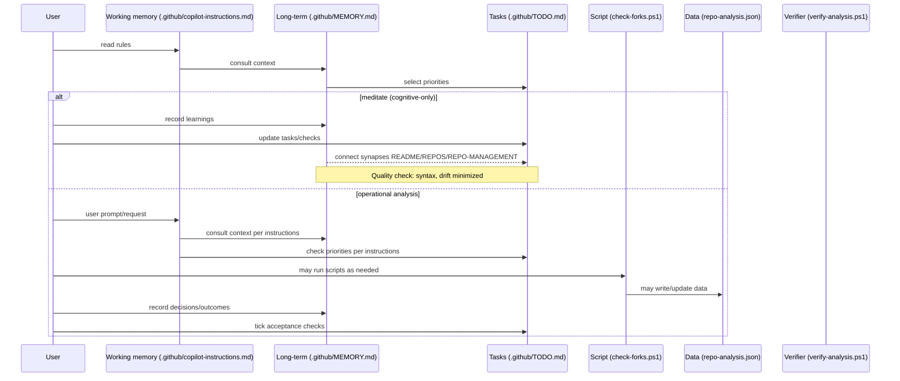

# Cognitive System for this Repository

**Last updated**: 2025-08-11

## Purpose

**Quick why**: what this document is and how it keeps the repo consistent.

This document explains the repo's lightweight "cognitive system" — how working memory, long‑term memory, automation, and AI enhancement connect to keep decisions, tasks, and outputs consistent.

## Architecture

**What the parts are and the role each one plays.**

- **Working memory**: `.github/copilot-instructions.md`
  - Operating rules, priorities, and where to look first
- **Long‑term memory**: `.github/MEMORY.md`
  - Canonical summary of purpose, decisions, notable changes, and constraints
- **Task memory**: `.github/TODO.md`
  - Prioritized tasks with acceptance checks and quick validation steps
- **Data source of truth**: `repo-analysis.json`
  - Machine‑readable portfolio data; JSON is emoji‑free by design
- **Scripts**: `check-forks.ps1`, `verify-analysis.ps1`
  - Generate and validate the JSON and parent/fork relationships
- **AI Enhancement**: GPT-4o integration for professional repository descriptions

**Control**:
- **Cognitive playbooks & meditation** (trigger: "meditate") live in `.github/copilot-instructions.md`.
  - Meditate runs the cadence end‑to‑end purely cognitively (no scripts), then does conceptual consistency checks and a brief quality check.

These are **"synapses"**: explicit references between the above files so the workflow is navigable and consistent.

## Improvement opportunities

**Small, low‑risk enhancements** to increase clarity and reduce drift.

- **Timestamp stamps**: "Last updated" at the top of `.github/MEMORY.md` and `.github/TODO.md` (keep current)
- **Sync indicators**: Add a tiny "Working memory synced" checkbox per milestone in `.github/TODO.md`

**Last updated**: 2025-08-11

## Purpose

**Quick why**: what this document is and how it keeps the repo consistent.

This document explains the repo's lightweight "cognitive system" — how working memory, long‑term memory, and automation connect to keep decisions, tasks, and outputs consistent.ve System for this Repository

Last updated: 2025-08-10

## Purpose

A quick why: what this document is and how it keeps the repo consistent.

This document explains the repo’s lightweight “cognitive system” — how working memory, long‑term memory, and automation connect to keep decisions, tasks, and outputs consistent.

## Architecture

**What the parts are and the role each one plays.**

- **Working memory**: `.github/copilot-instructions.md`
  - Operating rules, priorities, and where to look first
- **Long‑term memory**: `.github/MEMORY.md`
  - Canonical summary of purpose, decisions, notable changes, and constraints
- **Task memory**: `.github/TODO.md`
  - Prioritized tasks with acceptance checks and quick validation steps
- **Data source of truth**: `repo-analysis.json`
  - Machine‑readable portfolio data; JSON is emoji‑free by design
- **Scripts**: `check-forks.ps1`, `verify-analysis.ps1`
  - Generate and validate the JSON and parent/fork relationships

Control:
- Cognitive playbooks & meditation (trigger: "meditate") live in `.github/copilot-instructions.md`.
  - Meditate runs the cadence end‑to‑end purely cognitively (no scripts), then does conceptual consistency checks and a brief quality check.

These are “synapses”: explicit references between the above files so the workflow is navigable and consistent.

## Architecture Diagram

**System architecture** showing cognitive components, script automation, and information flow patterns.

```mermaid
flowchart TD
  subgraph MP ["Meditation Protocol"]
    U1[User: trigger meditate]
    WM1[Working memory: cognitive cadence]
    LT1[Long-term memory: context/decisions]
    TD1[Task memory: priorities/checks]
    U1 --> WM1 --> LT1 --> TD1
    LT1 -.synapses.-> TD1
    TD1 -.quality check.-> LT1
  end

  subgraph EF ["Executive Function (Alex Finch)"]
    U2[User: prompt/request]
    WM2[Working memory: consult instructions]
    LT2[Long-term memory: read context]
    TD2[Task memory: check priorities]
    SC[Scripts: check-forks.ps1]
    VF[Verifier: verify-analysis.ps1]
    JS[Data source: repo-analysis.json]

    U2 --> WM2 --> LT2 --> TD2
    TD2 --> SC
    SC --> JS
    VF --> JS
    JS --> LT2
    JS --> TD2
  end

  %% Cross-connections
  WM1 -.anchors.-> LT1
  WM1 -.anchors.-> TD1
  WM2 -.anchors.-> LT2
  WM2 -.anchors.-> TD2

  %% Styling
  classDef trigger fill:#fff3e0,stroke:#ff9800,stroke-width:2px,color:#ef6c00
  classDef memory fill:#e8f5e8,stroke:#4caf50,stroke-width:2px,color:#2e7d32
  classDef processing fill:#fce4ec,stroke:#e91e63,stroke-width:2px,color:#c2185b
  classDef scripts fill:#fff0e6,stroke:#cc6600,stroke-width:2px,color:#cc6600
  classDef data fill:#e8f7ff,stroke:#36c,stroke-width:2px,color:#36c
  classDef meditation fill:#e8f4f8,stroke:#2196f3,stroke-width:3px
  classDef executive fill:#f3e5f5,stroke:#9c27b0,stroke-width:3px

  class U1,U2 trigger
  class LT1,LT2,TD1,TD2 memory
  class WM1,WM2 processing
  class SC,VF scripts
  class JS data
  class MP meditation
  class EF executive
```

## How it works (flow)

**A step‑by‑step routine** to follow when updating analysis and decisions.

**Two modes** keep cognitive load low while staying accurate.

- **Meditation** (cognitive‑only; trigger: "meditate")
  1) Summarize chat history
  2) Read `.github/MEMORY.md` (context/decisions)
  3) Read `.github/TODO.md` (priorities/acceptance checks)
  4) Record notable learnings in `.github/MEMORY.md`
  5) Update the to-do list in `.github/TODO.md` if needed
  6) Consolidate and connect synapses: ensure counts/statements conceptually match across `README.md`, `REPOS.md`, and `REPO-MANAGEMENT.md`; confirm links/badges remain valid (README ↔ MEMORY ↔ REPOS); close with a brief quality check (no syntax issues; drift minimized)

- **Operational analysis** (scripts)
  1) User makes a request/prompt
  2) Working memory: consult `.github/copilot-instructions.md` for behaviors and guidance
  3) Read `.github/MEMORY.md` for context/decisions (per instructions)
  4) Read `.github/TODO.md` for priorities/acceptance checks (per instructions)
  5) Process request following the guidance (may include running scripts, editing files, etc.)
  6) Update `.github/MEMORY.md` and `.github/TODO.md` with outcomes
  7) Cross-check acceptance criteria and tick completed items

### Update cycle (sequence)

**Shows the interactions** between people, scripts, and files during an update.

## Guardrails

**Simple rules** that keep the system reliable and in sync.

- **Single source of truth** for counts/stats: `repo-analysis.json` (no manual duplication)
- **Canonical roles**:
  - `.github/MEMORY.md` = authoritative context/decisions
  - `.github/TODO.md` = prioritized actions + acceptance checks
  - `.github/copilot-instructions.md` = operating rules and pointers
- **JSON cleanliness**: no emojis in JSON; emojis OK in console/Markdown
- **Drift prevention**: written claims align with `repo-analysis.json`
- **Meditation is script‑free**: it updates MEMORY/TODO and performs conceptual checks only.

## Risks and failure modes

**Where things can go wrong** and what to watch for.

- **Drift**: statements in docs diverge from `repo-analysis.json`
- **Duplication**: repeating the same facts across files without a reference
- **Incomplete verification**: skipping parent arrows or private/public splits after changes

## Improvement opportunities

Small, low‑risk enhancements to increase clarity and reduce drift.

- Stamp “Last updated” at the top of `.github/MEMORY.md` and `.github/TODO.md` (keep current)
- Add a tiny “Working memory synced” checkbox per milestone in `.github/TODO.md`

## Operational cadence (fast path)

**A fast checklist** for day‑to‑day updates.

- **Pick a mode**:
  - **Meditation**: cognitive‑only consolidation (no scripts)
  - **Executive Function**: run scripts to refresh data and process requests
- **If Executive Function**: run analysis and regenerate JSON; verify parent arrows, counts (total/original/fork/private/public), and emoji‑free JSON
- **Record meaningful changes** in `.github/MEMORY.md`; tick acceptance checks in `.github/TODO.md`

## Acceptance checks (quick)

**Quick end‑of‑run validations** to make sure everything aligns.

- **Console shows correct fork arrows**: `repo ← owner/parent`
- **`repo-analysis.json` has zero emojis** and valid JSON
- **`.github/MEMORY.md` reflects notable changes** this iteration
- **`.github/TODO.md` acceptance checks updated**
- **If meditation**: synapses connected (README/REPOS/REPO-MANAGEMENT align), links/badges validated, and quality check performed
