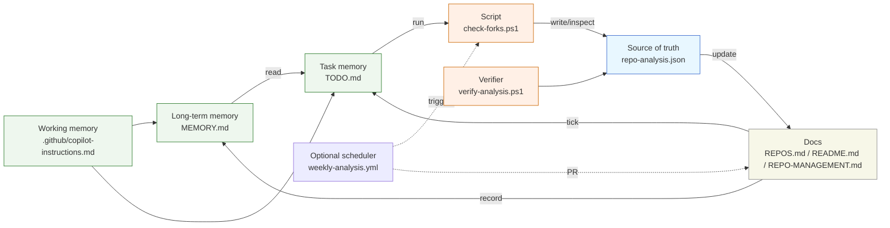
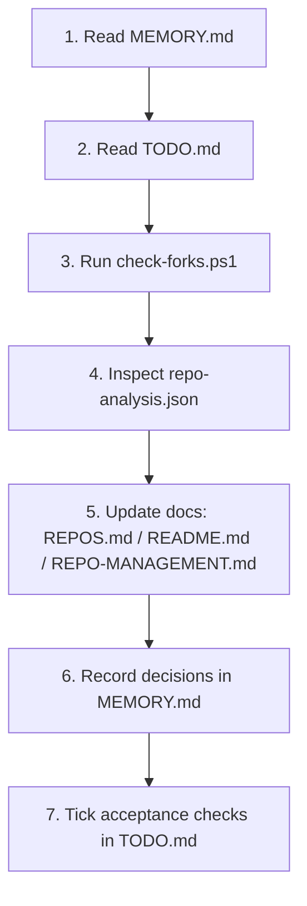

# Cognitive System for this Repository

Last updated: 2025-08-10

## Purpose

This document explains the repo’s lightweight “cognitive system” — how working memory, long‑term memory, and automation connect to keep decisions, tasks, and outputs consistent.

## Architecture

- Working memory: `.github/copilot-instructions.md`
  - Operating rules, priorities, and where to look first
- Long‑term memory: `MEMORY.md`
  - Canonical summary of purpose, decisions, notable changes, and constraints
- Task memory: `TODO.md`
  - Prioritized tasks with acceptance checks and quick validation steps
- Data source of truth: `repo-analysis.json`
  - Machine‑readable portfolio data; JSON is emoji‑free by design
- Scripts: `check-forks.ps1`, `verify-analysis.ps1`
  - Generate and validate the JSON and parent/fork relationships

These are “synapses”: explicit references between the above files so the workflow is navigable and consistent.

## Diagram

## How it works (flow)

1) Read `MEMORY.md` → 2) Read `TODO.md` → 3) Run `check-forks.ps1` → 4) Inspect `repo-analysis.json` → 5) Update docs (`REPOS.md`, `README.md`, `REPO-MANAGEMENT.md`) → 6) Record decisions in `MEMORY.md` → 7) Check off acceptance checks in `TODO.md`.

### Flow diagram

## Guardrails

- Single source of truth for counts/stats: `repo-analysis.json` (no manual duplication)
- Canonical roles:
  - `MEMORY.md` = authoritative context/decisions
  - `TODO.md` = prioritized actions + acceptance checks
  - `.github/copilot-instructions.md` = operating rules and pointers
- JSON cleanliness: no emojis in JSON; emojis OK in Markdown/console
- Drift prevention: docs show the same counts; verify after each script run

## Risks and failure modes

- Drift: numbers in README/REPOS/REPO-MANAGEMENT diverge from `repo-analysis.json`
- Duplication: repeating the same facts across docs without a reference
- Incomplete verification: skipping parent arrows or private/public splits after changes

## Improvement opportunities

- Add “Update cadence” to `.github/copilot-instructions.md` (explicit 1→7 flow above)
- Stamp “Last updated” at the top of `MEMORY.md` and `TODO.md` (already present; keep current)
- Add a tiny “Working memory synced” checkbox per milestone in `TODO.md`
- Add a brief “Verification” section in `REPO-MANAGEMENT.md` pointing to `verify-analysis.ps1`
- Optional: scheduled weekly check to run analysis and open a PR when `repo-analysis.json` changes

## Operational cadence (fast path)

- Run analysis script and regenerate JSON
- Verify: parent arrows, counts (total/original/fork/private/public), JSON is emoji‑free
- Sync docs: `REPOS.md`, `README.md`, `REPO-MANAGEMENT.md`
- Record meaningful changes in `MEMORY.md`; tick acceptance checks in `TODO.md`

## Acceptance checks (quick)

- Console shows correct fork arrows: `repo ← owner/parent`
- `repo-analysis.json` has zero emojis and valid JSON
- README/REPOS/REPO-MANAGEMENT show the same counts
- `MEMORY.md` reflects notable changes this iteration
