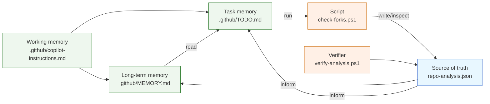
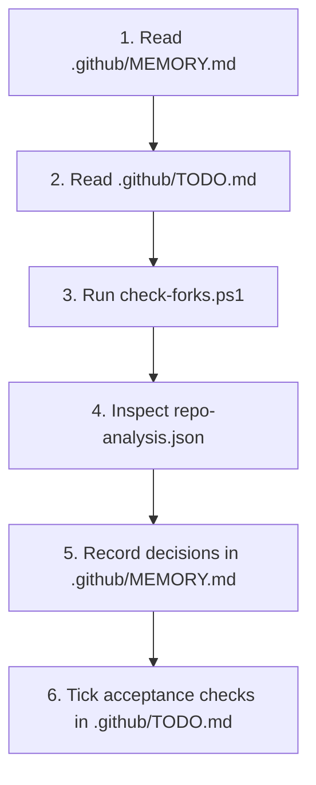
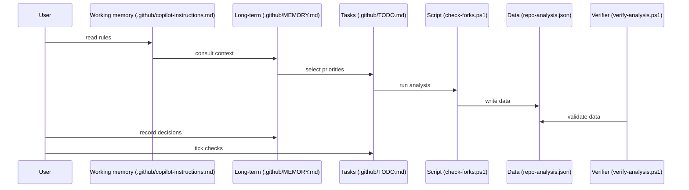

# Cognitive System for this Repository

Last updated: 2025-08-10

## Purpose

A quick why: what this document is and how it keeps the repo consistent.

This document explains the repo’s lightweight “cognitive system” — how working memory, long‑term memory, and automation connect to keep decisions, tasks, and outputs consistent.

## Architecture

What the parts are and the role each one plays.

- Working memory: `.github/copilot-instructions.md`
  - Operating rules, priorities, and where to look first
- Long‑term memory: `.github/MEMORY.md`
  - Canonical summary of purpose, decisions, notable changes, and constraints
- Task memory: `.github/TODO.md`
  - Prioritized tasks with acceptance checks and quick validation steps
- Data source of truth: `repo-analysis.json`
  - Machine‑readable portfolio data; JSON is emoji‑free by design
- Scripts: `check-forks.ps1`, `verify-analysis.ps1`
  - Generate and validate the JSON and parent/fork relationships

These are “synapses”: explicit references between the above files so the workflow is navigable and consistent.

## Diagram

A high‑level map of minimal components and how information flows between them.

## How it works (flow)

A step‑by‑step routine to follow when updating analysis and decisions.

1) Read `.github/MEMORY.md` → 2) Read `.github/TODO.md` → 3) Run `check-forks.ps1` → 4) Inspect `repo-analysis.json` → 5) Record decisions in `.github/MEMORY.md` → 6) Check off acceptance checks in `.github/TODO.md`.

### Flow diagram

### Update cycle (sequence)

Shows the interactions between people, scripts, and files during an update.

## Guardrails

Simple rules that keep the system reliable and in sync.

- Single source of truth for counts/stats: `repo-analysis.json` (no manual duplication)
- Canonical roles:
  - `.github/MEMORY.md` = authoritative context/decisions
  - `.github/TODO.md` = prioritized actions + acceptance checks
  - `.github/copilot-instructions.md` = operating rules and pointers
- JSON cleanliness: no emojis in JSON; emojis OK in console/Markdown
- Drift prevention: written claims align with `repo-analysis.json`

## Risks and failure modes

Where things can go wrong and what to watch for.

- Drift: statements in docs diverge from `repo-analysis.json`
- Duplication: repeating the same facts across files without a reference
- Incomplete verification: skipping parent arrows or private/public splits after changes

## Improvement opportunities

Small, low‑risk enhancements to increase clarity and reduce drift.

- Add “Update cadence” to `.github/copilot-instructions.md`
- Stamp “Last updated” at the top of `.github/MEMORY.md` and `.github/TODO.md` (keep current)
- Add a tiny “Working memory synced” checkbox per milestone in `.github/TODO.md`

## Operational cadence (fast path)

A fast checklist for day‑to‑day updates.

- Run analysis script and regenerate JSON
- Verify: parent arrows, counts (total/original/fork/private/public), JSON is emoji‑free
- Record meaningful changes in `.github/MEMORY.md`; tick acceptance checks in `.github/TODO.md`

## Acceptance checks (quick)

Quick end‑of‑run validations to make sure everything aligns.

- Console shows correct fork arrows: `repo ← owner/parent`
- `repo-analysis.json` has zero emojis and valid JSON
- `.github/MEMORY.md` reflects notable changes this iteration
- `.github/TODO.md` acceptance checks updated
