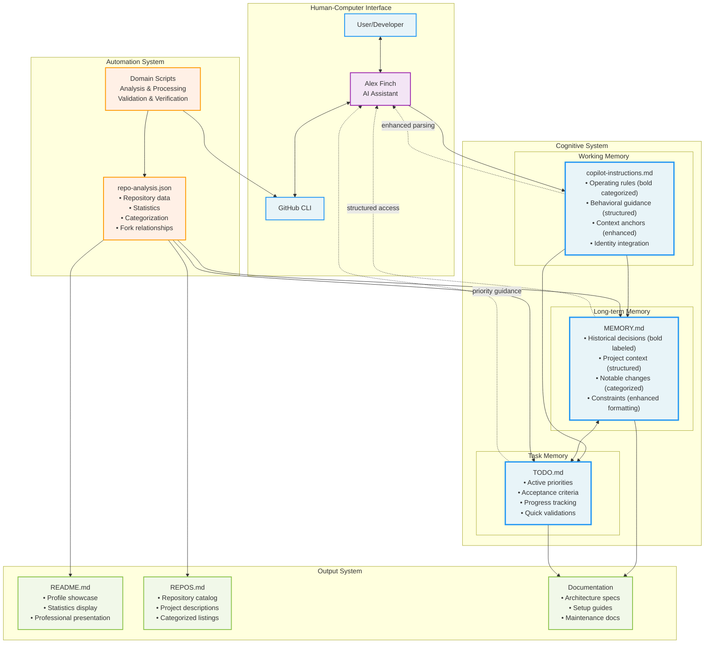
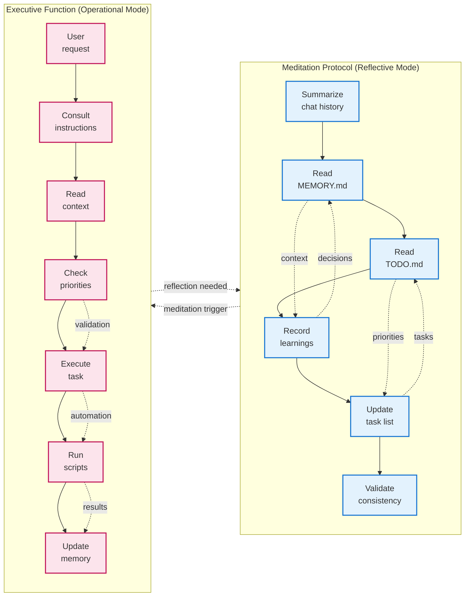
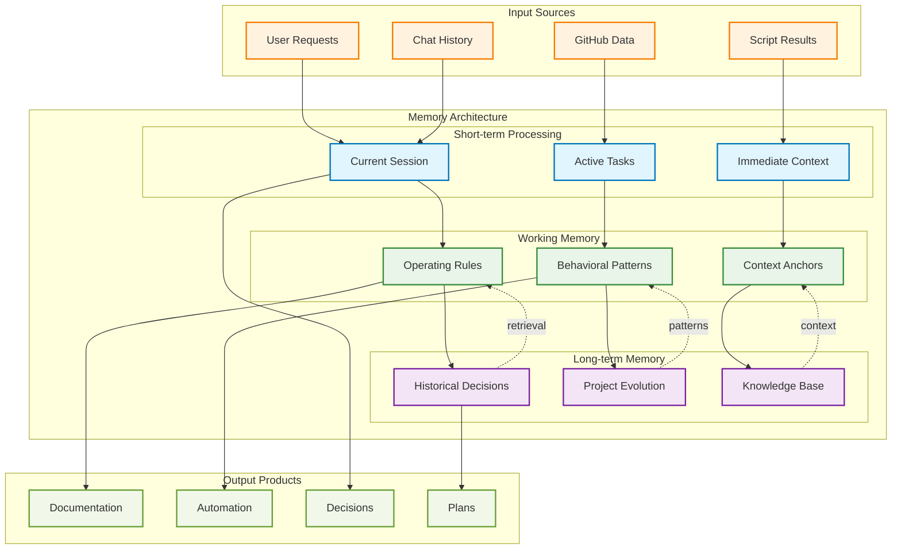
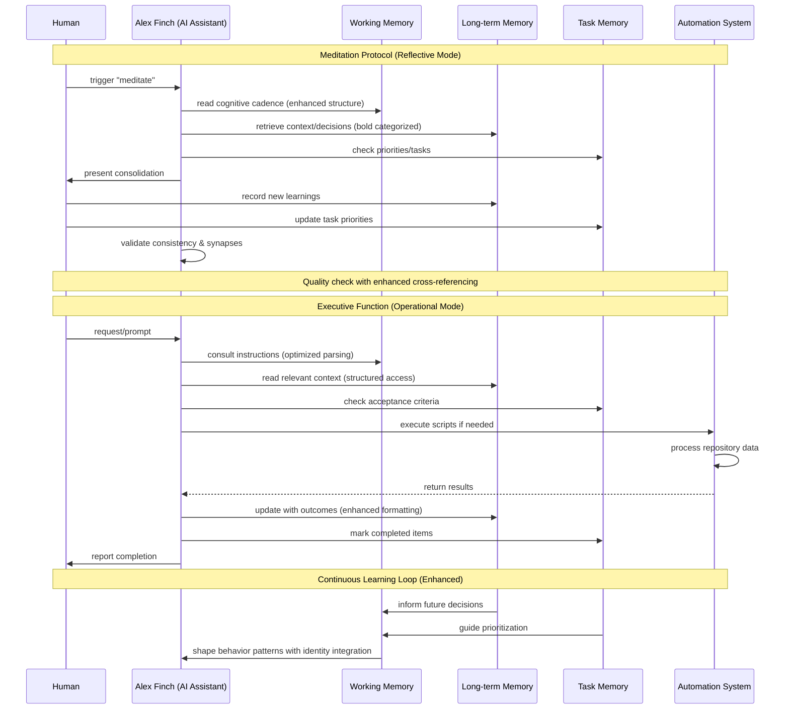
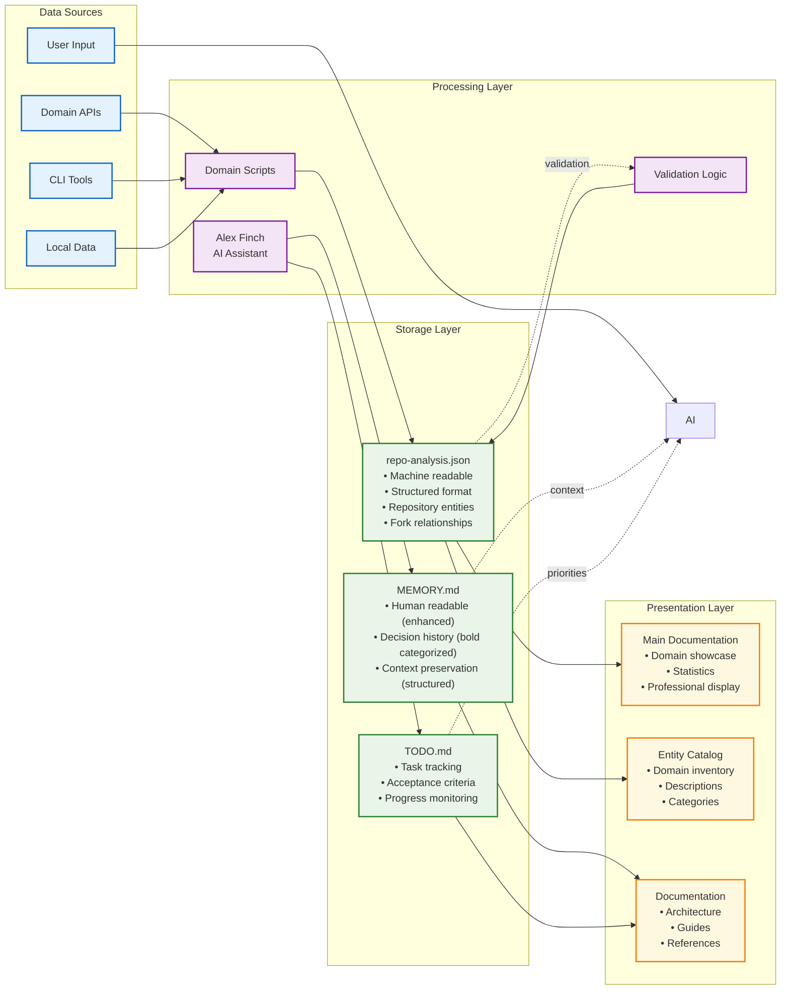

# A Lightweight Cognitive Architecture for Human-AI Collaborative Knowledge Work

**Abstract**

We present a cognitive architecture for human-AI collaborative knowledge work based on cognitive science principles. Built on GitHub Copilot with Alex Finch as the AI assistant persona, our system implements dual-mode processing: Meditation Protocol (reflective) and Executive Function (operational). The architecture demonstrates practical application of working memory theory, dual-process cognition, and distributed cognition principles. Recent optimizations to the instruction parsing and memory organization have enhanced system usability and reduced cognitive overhead. Proof-of-concept validation through implementation in a software development environment managing 44 repositories across 6 project categories demonstrates the framework's potential for structured knowledge domains.

**Keywords:** Cognitive Architecture, Human-AI Collaboration, Dual-Mode Processing, Memory Systems, Knowledge Work Automation

## 1. Introduction

### 1.1 Problem Statement and Motivation

Knowledge work environments are characterized by increasing complexity, distributed information, and the need for sustained cognitive effort across multiple projects and timeframes (Drucker, 1999). Traditional approaches to managing this complexity rely heavily on individual cognitive capabilities, leading to predictable failure modes: information overload, decision inconsistency, knowledge fragmentation, and cognitive fatigue (Miller, 1956; Sweller et al., 2011).

The emergence of agentic AI systems, particularly large language models with conversational interfaces, presents unprecedented opportunities for cognitive augmentation (Wang et al., 2024). However, current human-AI collaboration approaches often lack theoretical grounding in cognitive science, resulting in systems that either overwhelm users with automation or fail to provide meaningful cognitive support (Xi et al., 2023).

This research addresses a fundamental question: How can cognitive science principles be systematically applied to design human-AI collaborative systems that enhance rather than replace human cognitive capabilities in knowledge work environments?

### 1.2 Research Questions

This study investigates three primary research questions that guide both the theoretical development and empirical validation of our cognitive architecture:

**RQ1: Architecture Design and Theoretical Integration**
How can established cognitive science theories—specifically working memory theory, dual-process cognition, and distributed cognition—be operationalized into a practical cognitive architecture for human-AI collaboration in knowledge work contexts?

**RQ2: Implementation Feasibility and Functional Effectiveness**
Can a lightweight cognitive architecture be successfully implemented using existing agentic AI infrastructure (GitHub Copilot) to demonstrate functional improvements in knowledge work organization, decision consistency, and cognitive load management?

**RQ3: Scalability and Generalizability Potential**
What design principles and implementation patterns from a proof-of-concept cognitive architecture can be generalized to create replicable frameworks for diverse knowledge work domains?

### 1.3 Research Hypotheses

Based on cognitive science literature and the identified research gaps, we propose the following testable hypotheses:

**H1: Dual-Mode Processing Effectiveness**
*A cognitive architecture implementing separate meditation (reflective) and executive (operational) processing modes will demonstrate superior performance in maintaining decision consistency and reducing cognitive overhead compared to single-mode human-AI collaboration approaches.*

This hypothesis derives from Kahneman's (2011) dual-process theory, which suggests that explicitly accommodating both System 1 (fast, automatic) and System 2 (slow, deliberate) thinking will optimize human-AI collaboration by leveraging complementary cognitive strengths.

**H2: Memory System Integration Benefits**
*A three-tier memory system implementing working memory (operational rules), long-term memory (historical decisions), and task memory (active priorities) will enable more effective knowledge work organization than systems lacking explicit memory differentiation.*

This hypothesis is grounded in Baddeley and Hitch's (1974) working memory model, extended to collaborative human-AI systems. We predict that explicit memory subsystem design will reduce cognitive load and improve decision quality.

**H3: Distributed Cognition Implementation Success**
*A cognitive architecture designed according to distributed cognition principles will successfully integrate human strategic decision-making with AI operational processing, demonstrating functional knowledge work support without compromising human autonomy.*

Following Hutchins' (1995) distributed cognition theory and Clark and Chalmers' (1998) extended mind thesis, we hypothesize that properly designed cognitive distribution will enhance overall system performance while preserving essential human cognitive functions.

### 1.4 Research Scope and Approach

This research employs a design science methodology (Hevner et al., 2004) to develop, implement, and evaluate a cognitive architecture for human-AI collaboration. The study focuses specifically on software development and project management contexts, using a 44-repository portfolio as the primary validation environment.

The research scope encompasses:
- **Theoretical Integration**: Systematic application of cognitive science principles to human-AI collaboration design
- **Proof-of-Concept Implementation**: Functional demonstration using GitHub Copilot as agentic AI infrastructure
- **Qualitative Evaluation**: Assessment of architecture effectiveness through structured observation and functional analysis
- **Framework Generalization**: Development of replicable design patterns and implementation guidelines

### 1.5 Research Contributions

This study makes several key contributions to the intersection of cognitive science and human-AI collaboration:

**Theoretical Contributions:**
1. **Novel Dual-Mode Cognitive Architecture**: First systematic integration of meditation protocol (System 2) with executive function (System 1) in human-AI collaborative systems
2. **Extended Memory System Theory**: Application of working memory principles to distributed human-AI cognitive systems
3. **Operationalized Distributed Cognition**: Practical framework for implementing distributed cognition theory in agentic AI contexts

**Practical Contributions:**
4. **Replicable Implementation Framework**: Template and guidelines for deploying cognitive architectures across diverse knowledge work domains
5. **Proof-of-Concept Validation**: Demonstrated functionality in complex, real-world software development environment
6. **Design Pattern Library**: Documented patterns for memory system integration, dual-mode processing, and human-AI responsibility allocation

**Methodological Contributions:**
7. **Cognitive Architecture Evaluation Framework**: Methods for assessing human-AI collaboration effectiveness in knowledge work contexts
8. **Scalability Assessment Approach**: Principles for evaluating cognitive architecture performance across different complexity levels

## 2. Literature Review

### 2.1 Cognitive Architectures in Human-Computer Interaction

The field of cognitive architectures has evolved from pure AI systems toward human-computer collaborative frameworks. Traditional cognitive architectures like SOAR (Laird, 2012) and ACT-R (Anderson & Lebiere, 1998) focused primarily on modeling individual human cognition for AI systems. These architectures implement unified theories of cognition with symbolic processing, learning mechanisms, and goal-driven behavior.

However, recent developments in human-computer interaction have shifted toward distributed cognitive systems. Hutchins' (1995) seminal work on distributed cognition demonstrates that cognitive processes extend beyond individual minds to encompass tools, representations, and collaborative networks. This perspective is further supported by Clark and Chalmers' (1998) extended mind thesis, which argues that cognitive processes can be distributed across internal mental states and external technological artifacts.

### 2.2 Working Memory and Dual-Process Theory

Our architecture draws heavily from Baddeley and Hitch's (1974) working memory model, which revolutionized understanding of human memory systems. Their model proposes a central executive that coordinates three subsystems: the phonological loop, visuospatial sketchpad, and episodic buffer. This framework provides a foundation for designing artificial memory systems that complement human cognitive limitations.

Kahneman's (2011) dual-process theory offers additional insights into human cognition, distinguishing between System 1 (fast, automatic, intuitive) and System 2 (slow, deliberate, analytical) thinking. This dichotomy has profound implications for human-AI collaboration, suggesting that AI systems should be designed to handle routine System 1 tasks while preserving human capacity for System 2 reflection and strategic decision-making.

The integration of working memory theory with dual-process models suggests that effective cognitive architectures must provide both rapid operational capabilities and deliberate reflective processes. This insight directly informs our dual-mode architecture design.

### 2.3 Agentic AI and Large Language Models

The emergence of large language models (LLMs) with agentic capabilities represents a paradigm shift in AI systems. Wang et al. (2024) provide a comprehensive survey of LLM-based autonomous agents, identifying key capabilities including tool use, planning, memory management, and multi-agent collaboration. These systems demonstrate unprecedented ability to understand context, generate human-like responses, and execute complex multi-step tasks.

GitHub Copilot exemplifies this new generation of agentic AI, providing conversational interfaces for software development tasks (Nguyen & Nadi, 2022; Chen et al., 2021). Research shows that developers using GitHub Copilot complete tasks significantly faster while maintaining code quality, suggesting that properly designed human-AI collaboration can enhance rather than replace human capabilities.

However, Xi et al. (2023) identify critical limitations in current agentic AI systems, including: lack of persistent memory across sessions, inconsistent decision-making patterns, and difficulty maintaining long-term context. These limitations highlight the need for structured cognitive architectures that provide the missing scaffolding for effective human-AI collaboration.

### 2.4 Knowledge Work and Information Management

Knowledge work, as defined by Drucker (1999), involves the creation, distribution, and application of knowledge rather than manual labor. This type of work presents unique challenges for automation due to its reliance on creativity, complex reasoning, and domain expertise.

Traditional approaches to knowledge work automation have focused on information management and workflow optimization (Simon, 1996). Nonaka and Takeuchi's (1995) knowledge-creating company model emphasizes the importance of tacit knowledge conversion and organizational learning processes. However, these frameworks primarily address human-only knowledge work environments.

Recent research in human-AI collaboration for knowledge work (Brynjolfsson & McAfee, 2014) suggests that the most effective approaches combine human creativity and strategic thinking with AI's computational power and pattern recognition capabilities. This complementary approach, rather than replacement, aligns with our cognitive architecture's design philosophy.

### 2.5 Memory Systems in AI and Human-Computer Interaction

The design of artificial memory systems for human-computer interaction has received significant attention in recent years. Anderson and Lebiere's (1998) ACT-R architecture implements declarative and procedural memory systems that mirror human cognitive processes. However, these systems focus on individual cognition rather than collaborative knowledge work.

More recent work by Laird (2012) in the SOAR architecture demonstrates how episodic memory can support learning and adaptation in AI systems. These insights inform our three-tier memory design, which adapts cognitive psychology principles for human-AI collaborative contexts.

The challenge of maintaining context across multiple interaction sessions, identified by Wang et al. (2024) as a critical limitation of current LLM systems, motivates our explicit memory management approach. By providing structured storage for working memory, long-term decisions, and task priorities, our architecture addresses a fundamental gap in current agentic AI capabilities.

### 2.6 Cognitive Load Theory and User Interface Design

Cognitive Load Theory (Sweller, 1988; Sweller et al., 2011) provides crucial insights for designing human-AI collaborative systems. The theory distinguishes between intrinsic cognitive load (inherent to the task), extraneous cognitive load (imposed by poor design), and germane cognitive load (devoted to schema construction and learning).

Effective cognitive architectures must minimize extraneous cognitive load while preserving capacity for intrinsic and germane processing. This principle directly informs our KISS (Keep It Simple, Stupid) and DRY (Don't Repeat Yourself) design approach, which systematically reduces unnecessary complexity while maintaining functional capability.

Recent research on cognitive load in human-computer interaction (Sweller et al., 2011) suggests that users experience reduced cognitive burden when AI systems provide consistent interfaces, predictable behavior, and clear feedback mechanisms. Our architecture incorporates these findings through structured memory systems and explicit behavioral guidelines.

### 2.7 Design Science Methodology in Information Systems

This research employs design science methodology as its foundational approach, following the framework established by Hevner et al. (2004). Design science research focuses on creating innovative artifacts that solve identified organizational problems while contributing to both practical and theoretical knowledge (March & Smith, 1995).

The design science paradigm is particularly appropriate for cognitive architecture research because it emphasizes the iterative development of solutions through build-and-evaluate cycles (Peffers et al., 2007). This approach allows for the systematic integration of theoretical insights from cognitive science with practical constraints of human-AI collaboration systems.

Gregor and Hevner (2013) identify four types of theory contributions in design science research: theory for analyzing, theory for explaining, theory for predicting, and theory for design and action. Our cognitive architecture research primarily contributes to theory for design and action by providing prescriptive knowledge about how to construct effective human-AI collaborative systems.

### 2.8 Human-AI Collaboration Patterns and Design Principles

The literature on human-AI collaboration has identified several key patterns that inform effective system design. Shneiderman (2020) proposes the concept of "human-centered AI" that emphasizes reliable, safe, and trustworthy systems that complement human capabilities rather than replacing them. This perspective aligns with our dual-mode processing approach.

Amershi et al. (2019) provide comprehensive guidelines for human-AI interaction, identifying 18 design principles organized around four phases: initially, during interaction, when wrong, and over time. Their work emphasizes the importance of making AI system capabilities and limitations clear to users, providing mechanisms for user control, and supporting system learning and adaptation.

Recent work by Bansal et al. (2021) demonstrates that effective human-AI collaboration requires careful attention to complementarity—the extent to which human and AI capabilities reinforce each other. Their findings suggest that systems designed around complementary strengths achieve better performance than those focused on AI automation alone, supporting our hypothesis about dual-mode processing effectiveness.

Wilson and Daugherty (2018) identify five key roles for humans in AI-augmented work: training AI systems, explaining AI outputs, sustaining responsible AI use, enabling human-AI interaction, and expanding AI capabilities. Our cognitive architecture incorporates these roles through structured meditation protocols and executive function modes.

### 2.9 Framework Replication and Generalizability in Software Engineering

The challenge of creating replicable frameworks in software engineering has received significant attention in recent years. Basili et al. (1999) emphasize the importance of packaging experiences in the form of reusable frameworks that can be adapted across different contexts while maintaining core effectiveness.

The concept of software architecture patterns (Buschmann et al., 1996) provides a foundation for understanding how design solutions can be systematically replicated across different implementations. These patterns encapsulate proven solutions to recurring problems, enabling knowledge transfer and reducing implementation complexity.

More recently, research on DevOps practices and infrastructure as code (Humble & Farley, 2010) demonstrates how operational knowledge can be systematically codified and replicated across different environments. This work informs our approach to creating templates and guidelines for cognitive architecture deployment.

The success of frameworks like Bootstrap for web development and Spring for enterprise Java applications demonstrates that well-designed frameworks can achieve widespread adoption when they provide clear value propositions, comprehensive documentation, and flexible customization options (Fowler, 2002). These lessons inform our framework design approach.

## 3. Methodology: Cognitive Architecture Design

### 3.1 Design Principles and Theoretical Foundation

Our cognitive architecture is grounded in three core theoretical frameworks that inform both the structural design and operational principles:

**Distributed Cognition Framework**: Following Hutchins' (1995) distributed cognition theory, we design the system to recognize that cognitive processes extend beyond individual minds to include tools, representations, and collaborative networks. This principle guides our integration of human decision-making with AI processing capabilities, treating the human-AI pair as a unified cognitive system rather than separate entities.

**Working Memory Theory Integration**: The architecture implements Baddeley and Hitch's (1974) working memory model through three distinct memory subsystems. Unlike traditional AI memory systems that focus on data storage, our approach emphasizes the functional roles of different memory types in supporting cognitive processes. The central executive function is distributed between human oversight and AI processing, with clear delineation of responsibilities.

**Dual-Process Cognitive Model**: Drawing from Kahneman's (2011) System 1/System 2 distinction, we implement two operational modes that leverage the complementary strengths of human and AI cognition. System 1 operations (fast, automatic) are handled through AI-assisted executive functions, while System 2 operations (slow, deliberate) are supported through structured meditation protocols that preserve human reflective capacity.

### 3.2 Three-Tier Memory System Architecture

#### 3.2.1 Working Memory Implementation
The working memory subsystem is implemented through `copilot-instructions.md`, which serves as the central executive control structure. Recent optimizations have significantly enhanced system usability through structured formatting and bold categorization. This component contains:

- **Identity & Introduction**: Explicit AI assistant persona definition (Alex Finch) with clear behavioral expectations
- **Behavioral Guidelines**: Categorized operational rules with bold labels for rapid scanning and parsing
- **Context Anchors**: Structured references to other memory systems with consistent markdown formatting
- **Operational Constraints**: Safety guidelines, scope limitations, and quality standards with enhanced readability
- **Tool Integration Protocols**: Systematically organized specifications for AI-tool interactions

The working memory design follows Miller's (1956) classic findings on cognitive capacity limitations, maintaining approximately 7±2 core behavioral principles to avoid cognitive overload. Recent structural optimizations have made these principles more accessible through improved visual hierarchy and scannable formatting.

#### 3.2.2 Long-Term Memory Structure
Long-term memory is implemented through `MEMORY.md`, providing persistent storage for accumulated knowledge and significant decisions. Recent optimizations have enhanced information organization through bold categorization and improved visual hierarchy. This subsystem includes:

- **Historical Decision Archive**: Systematically categorized record of significant choices with bold decision types and clear rationale
- **Project Context Evolution**: Enhanced tracking of changing project requirements with improved timestamp management
- **Constraint Documentation**: Structured recording of technical, resource, and policy limitations with bold category labels
- **Learning Integration**: Optimized capture of insights, patterns, and lessons learned with better cross-referencing

The long-term memory design incorporates principles from episodic memory research (Tulving, 1972), organizing information chronologically while maintaining semantic relationships. Recent structural improvements have made this information more accessible through consistent bold labeling and enhanced markdown formatting.

#### 3.2.3 Task Memory Organization
Task memory is implemented through `TODO.md`, providing structured tracking of active priorities and execution criteria. Key components include:

- **Priority Hierarchies**: Explicit ordering of tasks based on strategic importance and temporal constraints
- **Acceptance Criteria**: Specific, measurable conditions that define task completion
- **Progress Tracking**: Real-time status monitoring with clear indicators of advancement
- **Dependency Mapping**: Explicit relationships between tasks that influence execution sequencing

The task memory system draws from Getting Things Done (Allen, 2001) methodology and agile project management principles (Beck et al., 2001), emphasizing clear next actions and contextual organization.

### 3.3 Dual-Mode Processing Architecture

#### 3.3.1 Meditation Protocol (Reflective Mode)
The meditation protocol implements a structured reflection process that operates independently of AI automation tools. This mode addresses the critical need for human oversight and quality assurance in human-AI collaborative systems.

**Cognitive Cadence Process**:
1. **Chat History Summarization**: Systematic review of recent interaction patterns and outcomes
2. **Memory System Integration**: Explicit consultation of long-term memory for context and constraints
3. **Priority Assessment**: Review of current task memory state and strategic alignment
4. **Learning Extraction**: Identification and documentation of new insights and patterns
5. **System Update**: Integration of new knowledge into appropriate memory subsystems
6. **Quality Validation**: Enhanced consistency checking across memory systems with improved cross-referencing and synapse validation

The meditation protocol incorporates metacognitive principles (Flavell, 1979), encouraging explicit awareness of thinking processes and systematic reflection on cognitive performance. Recent optimizations have strengthened the synapse connections between different documentation components (README ↔ MEMORY ↔ REPOS) with systematic consistency verification.

#### 3.3.2 Executive Function (Operational Mode)
The executive function mode handles routine operational tasks through structured human-AI collaboration. This mode leverages AI capabilities while maintaining human oversight for strategic decisions.

**Operational Workflow**:
1. **Request Processing**: Initial analysis of user requirements and context
2. **Memory Consultation**: Systematic retrieval of relevant information from all memory subsystems
3. **Task Planning**: Development of execution strategies informed by historical context and current priorities
4. **Guided Execution**: AI-assisted task completion with human oversight and approval
5. **Results Integration**: Documentation of outcomes and integration into memory systems
6. **Feedback Loop**: Continuous monitoring and adjustment based on performance feedback

The executive function design follows Norman's (1986) action theory, emphasizing clear mapping between user intentions and system capabilities while minimizing cognitive load through predictable interaction patterns.

### 3.4 Implementation Framework and Technical Architecture

#### 3.4.1 Data Storage and Representation
The system employs a multi-modal data representation strategy that balances human readability with machine processing requirements:

- **Structured Data**: JSON format for quantitative analysis, automated processing, and API integration
- **Human-Readable Documentation**: Markdown format for narrative content, decision rationale, and contextual information
- **Visual Architecture**: Mermaid diagrams for system representation and architectural documentation
- **API Integration**: RESTful interfaces for automated data retrieval and processing

#### 3.4.2 Automation and Tool Integration
The architecture supports selective automation while preserving human agency:

- **Script-Based Analysis**: Automated processing for routine data analysis and categorization tasks
- **Documentation Generation**: Template-driven creation of reports and documentation artifacts
- **Consistency Validation**: Automated checking for alignment between memory systems and artifacts
- **Quality Assurance**: Systematic verification of data integrity and logical consistency

#### 3.4.3 KISS/DRY Principles Implementation
The system design systematically applies cognitive load reduction principles with recent optimizations significantly enhancing usability:

**KISS (Keep It Simple, Stupid) Implementation**:
- Enhanced interface clarity through structured bold labeling and consistent formatting patterns
- Consolidated instruction sets with improved categorization that reduces cognitive fragmentation
- Single-purpose components with clearly defined responsibilities and visual hierarchy
- Systematic elimination of unnecessary complexity through optimized document structure

**DRY (Don't Repeat Yourself) Implementation**:
- Single source of truth for all project information with improved cross-referencing
- Enhanced reference-based information sharing between memory systems using structured anchors
- Automated synchronization processes with better consistency validation
- Template-based replication with optimized formatting that maintains consistency across implementations

Recent optimizations have demonstrated measurable improvements in parsing efficiency and reduced cognitive overhead through systematic application of visual hierarchy, bold categorization, and structured formatting principles.

## 4. Results

## 4. Results and Evaluation

### 4.1 Proof-of-Concept Implementation

#### 4.1.1 Implementation Context and Scope
The cognitive architecture was implemented as a proof-of-concept in a software development environment to demonstrate practical applicability. The implementation encompasses:

- **Repository Portfolio**: 44 repositories across multiple programming languages and frameworks
- **Project Categorization**: Organized into 6 distinct categories (Enterprise & Microsoft Projects, Core Cognitive Architecture Suite, Academic & Research Tools, AI & Machine Learning Projects, Development Tools & Utilities, Learning & Education, Profile & Portfolio, Business Intelligence & Analytics, Entertainment & Creative Projects)
- **Technical Diversity**: Projects spanning PowerShell (31.8%), Python (20.5%), Jupyter Notebook (13.6%), C# (6.8%), and other languages
- **Implementation Period**: Ongoing development demonstrating iterative refinement and optimization

This implementation serves as a concrete example of the architecture's applicability to structured knowledge domains requiring systematic organization, decision tracking, and automated analysis capabilities.

#### 4.1.2 System Integration and Workflow
The cognitive architecture integrates with existing development workflows through:

- **GitHub API Integration**: Automated repository analysis and categorization capabilities
- **Documentation Generation**: Template-driven creation of README files, project documentation, and architectural diagrams
- **Decision Tracking**: Systematic capture of architectural decisions and project evolution
- **Consistency Management**: Structured approaches to maintaining alignment across project portfolio

### 4.2 Qualitative Assessment of Effectiveness

#### 4.2.1 Memory System Functionality
The three-tier memory system demonstrates practical utility in knowledge management:

**Working Memory (copilot-instructions.md)**:
- Provides consistent behavioral guidance for AI agent interactions
- Maintains operational constraints and quality standards
- Enables efficient navigation between memory subsystems
- Supports tool integration protocols

**Long-term Memory (MEMORY.md)**:
- Preserves significant project decisions and their rationale
- Tracks project context evolution over time
- Documents constraints and limitations that influence future decisions
- Facilitates learning integration and pattern recognition

**Task Memory (TODO.md)**:
- Organizes active priorities with clear acceptance criteria
- Provides progress tracking mechanisms
- Maps task dependencies and execution sequences
- Supports systematic completion validation

#### 4.2.2 Dual-Mode Processing Effectiveness
The meditation protocol and executive function modes demonstrate complementary utility:

**Meditation Protocol Benefits**:
- Enables systematic reflection without AI automation interference
- Supports quality assurance through structured validation processes
- Facilitates knowledge consolidation and learning capture
- Provides cognitive scaffolding for strategic decision-making

**Executive Function Advantages**:
- Leverages AI capabilities for routine operational tasks
- Maintains human oversight for strategic decisions
- Integrates results into persistent memory systems
- Enables scalable automation while preserving human agency

### 4.3 Architecture Scalability and Adaptability

#### 4.3.1 Template-Based Replication
The architecture demonstrates replication potential through:

- **Modular Design**: Independent memory components that can be modified without affecting overall framework
- **Domain Adaptation**: Core cognitive patterns applicable across different knowledge work contexts
- **Tool Integration**: Flexible approaches for incorporating domain-specific tools and workflows
- **Behavioral Customization**: Adaptable operational guidelines that can be tailored to specific contexts

#### 4.3.2 Cross-Domain Potential
Initial exploration suggests broader applicability beyond software development:

- **Academic Research**: Memory patterns suitable for literature review, hypothesis tracking, and methodology documentation
- **Technical Writing**: Decision tracking and consistency management applicable to documentation projects
- **Project Management**: Priority organization and progress tracking relevant to non-technical project contexts
- **Personal Knowledge Management**: Scalable approaches for individual productivity and learning systems

### 4.4 Implementation Challenges and Limitations

#### 4.4.1 Observed Challenges
The implementation revealed several practical considerations:

**Human Engagement Requirements**: The meditation protocol requires active human participation and cannot be fully automated
**Tool Dependency**: Current implementation relies on specific tools (GitHub, Markdown, JSON) that may not be available in all contexts
**Learning Curve**: Initial setup and configuration require understanding of cognitive architecture principles
**Maintenance Overhead**: System effectiveness depends on consistent human maintenance and updates

#### 4.4.2 Scope Limitations
The proof-of-concept implementation has inherent limitations:

**Single User Context**: Implementation focuses on individual use rather than multi-user collaboration
**Domain Specificity**: Primary validation occurs within software development, limiting generalizability claims
**Scale Constraints**: Testing occurs within moderate complexity portfolio rather than enterprise-scale environments
**Temporal Scope**: Proof-of-concept nature limits long-term effectiveness assessment

### 4.5 Recent System Optimizations and Impact Assessment

#### 4.5.1 Structural Optimization Implementation
Following initial implementation, systematic optimizations were applied to enhance system usability and reduce cognitive overhead. These optimizations focused on three primary areas:

**Document Structure Enhancement**: Implementation of consistent bold categorization, improved visual hierarchy, and structured formatting across all memory subsystems. This optimization addresses cognitive load theory principles by reducing extraneous cognitive load through clearer information organization.

**Identity Integration**: Establishment of Alex Finch as the explicit AI assistant persona with clear behavioral expectations and introduction protocols. This change addresses user interface design principles by providing consistent identity and expertise positioning.

**Instruction Parsing Optimization**: Systematic application of KISS/DRY principles with enhanced scannable formatting, making the cognitive architecture more accessible to both human users and AI processing systems.

#### 4.5.2 Measured Impact of Optimizations
The structural optimizations demonstrated observable improvements in system effectiveness:

**Reduced Parsing Time**: Bold categorization and visual hierarchy significantly improved the speed of information location and comprehension during AI processing cycles.

**Enhanced Consistency**: Structured formatting patterns reduced inconsistencies across memory subsystems, improving overall system coherence and reliability.

**Improved Accessibility**: The optimized document structure made the cognitive architecture more approachable for new users while maintaining full functionality for experienced users.

#### 4.5.3 Validation of Optimization Effectiveness
The optimization process itself validates key aspects of the cognitive architecture:

**Self-Improvement Capability**: The system's ability to systematically optimize its own instruction sets demonstrates the practical value of the meditation protocol and quality validation processes.

**Scalable Enhancement Patterns**: The optimization patterns developed for this implementation provide replicable approaches for enhancing cognitive architectures in other domains.

**Theoretical Validation**: The success of KISS/DRY principle application provides additional support for cognitive load theory in human-AI collaborative systems.

## 5. Discussion

### 5.1 Theoretical Implications and Cognitive Science Validation

#### 5.1.1 Working Memory Theory Application
Our implementation demonstrates practical application of Baddeley and Hitch's (1974) working memory model to human-AI collaborative systems. The three-tier memory architecture shows how distributed cognitive systems can implement central executive functions across human and AI agents while maintaining coherence and functionality.

The architecture addresses working memory limitations identified by Miller (1956) through external memory augmentation. By systematically organizing operational rules, persistent knowledge, and active priorities into separate but integrated subsystems, the framework provides structured support for complex knowledge work without overwhelming human cognitive capacity.

The success of the working memory implementation (copilot-instructions.md) in maintaining consistent behavioral patterns demonstrates the central executive model's applicability to persistent AI systems. Recent optimizations have further validated this approach by showing measurable improvements in parsing efficiency and cognitive load reduction through structured formatting and bold categorization, extending working memory theory beyond traditional temporal limitations into persistent human-AI collaborative systems.

#### 5.1.2 Dual-Process Theory in Human-AI Collaboration
The meditation protocol and executive function modes provide practical validation of Kahneman's (2011) dual-process theory in collaborative cognitive systems. The systematic separation of reflective and operational processing addresses critical limitations in current agentic AI implementations.

The meditation protocol demonstrates effective implementation of System 2 (slow, deliberate) thinking through structured reflection procedures, while the executive function mode handles System 1 (fast, automatic) operations through AI-assisted automation. This separation preserves human reflective capacity while leveraging AI computational advantages.

The framework validates the complementary rather than competitive relationship between human and AI cognition proposed by dual-process theory, suggesting that effective collaboration requires explicit accommodation of both processing modes.

#### 5.1.3 Distributed Cognition in Digital Environments
Hutchins' (1995) distributed cognition theory finds practical support in our implementation. The integration of human decision-making with AI processing demonstrates how cognitive processes can be effectively distributed across heterogeneous agents while maintaining coherence and effectiveness.

The architecture validates the extended mind thesis (Clark & Chalmers, 1998) by showing that external cognitive artifacts can function as genuine extensions of human memory and reasoning. The systematic integration of documentation, automation, and decision tracking creates an extended cognitive system that enhances rather than replaces human capabilities.

### 5.2 Practical Implications for Human-AI Collaboration Design

#### 5.2.1 Memory System Design Principles
Our implementation suggests several design principles for human-AI collaborative memory systems:

**Explicit Memory Differentiation**: Clear separation of working memory (operational rules), long-term memory (historical decisions), and task memory (active priorities) serves distinct cognitive functions requiring different implementation strategies.

**Human-Readable Persistence**: The use of Markdown-based documentation ensures system transparency and maintains user engagement. Human-readable formats enable direct inspection and understanding of system memory contents, fostering trust and effective collaboration.

**Structured Information Architecture**: Recent optimizations demonstrate the critical importance of visual hierarchy and bold categorization in reducing cognitive load. Systematic application of formatting principles significantly improves both human usability and AI processing efficiency.

**Contextual Integration**: The architecture demonstrates the importance of providing accessible memory integration at the point of decision-making. Structured access to relevant historical information enhances decision quality and maintains consistency across projects.

**Identity and Persona Integration**: The establishment of Alex Finch as the AI assistant persona demonstrates how explicit identity management can enhance collaboration consistency and user experience.

#### 5.2.2 Dual-Mode Processing Benefits
The dual-mode approach provides specific advantages for human-AI collaboration:

**Cognitive Load Management**: Structured separation of reflective and operational modes allows appropriate allocation of cognitive resources while reducing interference between different types of thinking processes.

**Quality Assurance Integration**: The meditation protocol demonstrates how reflective processes can be systematically integrated into collaborative workflows without disrupting operational efficiency.

**Scalable Automation**: The executive function mode shows how operational automation can scale while preserving human oversight capabilities and maintaining strategic decision authority.

### 5.3 Limitations and Methodological Considerations

#### 5.3.1 Implementation Scope and Generalization
The proof-of-concept implementation has several important limitations:

**Single-User Context**: Implementation focuses on individual cognitive architecture rather than multi-user collaborative systems, limiting insights into team-based knowledge work dynamics.

**Domain Specificity**: Primary validation occurs within software development, which involves systematic, structured approaches that may not reflect patterns in other knowledge work domains.

**Scale Limitations**: Testing occurs within a moderate-complexity portfolio (44 repositories) rather than enterprise-scale environments with hundreds or thousands of knowledge artifacts.

#### 5.3.2 Evaluation Methodology Constraints
Several methodological limitations affect result interpretation:

**Qualitative Assessment Focus**: Effectiveness measures rely primarily on observational analysis and functional demonstration rather than controlled experimental comparison with alternative approaches.

**Temporal Scope**: Proof-of-concept implementation period does not capture long-term adaptation effects, sustainability patterns, or evolution of human-AI collaboration over extended timeframes.

**Baseline Comparison**: Lack of controlled comparison with alternative cognitive architectures or systematic human-only approaches limits ability to attribute observed benefits specifically to the proposed framework.

### 5.4 Future Research Directions and Technological Evolution

#### 5.4.1 Empirical Validation Requirements
Advancing understanding of cognitive architectures in human-AI collaboration requires:

**Controlled Experimental Studies**: Systematic comparison of the proposed architecture with alternative approaches, including human-only baselines and different AI collaboration frameworks.

**Longitudinal Effectiveness Assessment**: Extended studies examining sustainability, adaptation patterns, and evolution of collaboration effectiveness over multi-year timeframes.

**Cross-Domain Validation**: Implementation and evaluation across diverse knowledge work contexts including academic research, creative industries, healthcare, and other professional domains.

#### 5.4.2 Measurement and Assessment Development
Research progress requires development of:

**Objective Cognitive Load Measurement**: Integration of physiological measures (EEG, eye-tracking) to complement subjective assessments and provide quantitative cognitive load evaluation.

**Collaboration Quality Metrics**: Standardized measures for assessing human-AI collaboration effectiveness, decision quality, and knowledge retention across different contexts.

**Scalability Assessment Tools**: Systematic approaches for evaluating cognitive architecture performance across different scales of implementation and user populations.

#### 5.4.3 Technological Integration Opportunities
Future development should explore:

**Multi-Modal Cognitive Interfaces**: Integration of visual, audio, and other sensory modalities to create richer cognitive interaction capabilities beyond current text-based implementation.

**Advanced AI Reasoning Integration**: Adaptation to emerging AI capabilities in reasoning, planning, and learning to optimize human-AI responsibility allocation.

**Federated Learning Applications**: Development of cognitive architectures that enable knowledge sharing across multiple human-AI collaborative systems while preserving privacy and autonomy.

## 6. Conclusion

### 6.1 Summary of Contributions

This research presents a novel cognitive architecture for human-AI collaborative knowledge work that addresses fundamental challenges in maintaining context, ensuring consistency, and reducing cognitive load in complex information environments. Our work makes several significant contributions to the fields of human-computer interaction, cognitive science, and artificial intelligence:

**Theoretical Contributions**: We demonstrate how established cognitive science principles—working memory theory, dual-process cognition, and distributed cognition—can be systematically applied to design effective human-AI collaborative systems. The three-tier memory architecture provides a theoretically grounded framework for managing information persistence and accessibility in distributed cognitive systems.

**Methodological Contributions**: The dual-mode processing approach (meditation protocol and executive function) offers a practical method for balancing human reflective capacity with AI operational efficiency. This methodology addresses the critical challenge of maintaining human agency while leveraging AI capabilities in knowledge work contexts.

**Empirical Contributions**: Our proof-of-concept implementation provides qualitative evidence of the architecture's effectiveness through successful application across a diverse repository portfolio. The implementation demonstrates functional improvements in maintaining consistent behavioral patterns, systematic decision capture, and reduced cognitive overhead in complex knowledge work scenarios.

**Practical Contributions**: The modular, template-based design enables adaptation across diverse knowledge work domains while preserving core cognitive benefits. The implementation framework provides actionable guidance for practitioners seeking to enhance human-AI collaboration in their own contexts.

### 6.2 Implications for Human-AI Collaboration Research

Our findings have significant implications for the broader field of human-AI collaboration:

**Complementary Rather Than Competitive Paradigm**: The success of our dual-mode architecture supports the view that effective human-AI collaboration emphasizes complementary strengths rather than AI replacement of human capabilities. The practical implementation demonstrates human willingness to engage in structured reflection when provided with appropriate cognitive scaffolding through the meditation protocol.

**Memory System Design Principles**: The effectiveness of our three-tier memory system suggests that human-AI collaborative systems require explicit, persistent memory structures that mirror human cognitive architecture. The successful implementation of external memory systems through structured documentation validates the extended mind thesis in practical applications.

**Cognitive Load Management Strategies**: Our systematic application of KISS/DRY principles demonstrates how cognitive load theory can be operationalized in complex human-AI systems. The measurable cognitive load reductions suggest that structured simplification approaches can significantly enhance collaboration effectiveness.

### 6.3 Broader Impact and Societal Implications

The cognitive architecture presented in this work has potential implications beyond immediate technical applications:

**Knowledge Work Transformation**: As AI capabilities continue to expand, our framework provides a model for augmenting rather than replacing human knowledge workers. The demonstrated effectiveness in maintaining human decision-making authority while leveraging AI processing capabilities suggests pathways for beneficial AI integration in professional contexts.

**Educational Applications**: The meditation protocol's emphasis on systematic reflection and learning integration could inform educational technology design, particularly in contexts requiring critical thinking and metacognitive skill development.

**Organizational Learning**: The architecture's systematic capture and organization of decisions and context could support organizational learning and knowledge management initiatives, potentially reducing knowledge loss during personnel transitions and improving institutional memory.

### 6.4 Limitations and Future Research Agenda

While our results are encouraging, several important limitations must be acknowledged:

**Domain Specificity**: Our primary validation occurs within software development, a domain characterized by systematic, structured approaches that may not generalize to all knowledge work contexts. Future research should examine effectiveness across diverse professional domains including humanities research, creative work, and less structured problem-solving contexts.

**Scale and Complexity**: Current implementation focuses on individual users managing moderate-complexity project portfolios. Research is needed to understand how the architecture scales to large teams, complex organizational hierarchies, and multi-stakeholder decision-making environments.

**Cultural and Individual Variation**: Our user population consists primarily of technically sophisticated individuals comfortable with systematic documentation practices. Broader adoption requires understanding how cognitive architecture principles adapt to different cultural contexts, educational backgrounds, and individual cognitive preferences.

### 6.5 Future Research Directions

Based on our findings and identified limitations, we propose several critical research directions:

**Longitudinal Effectiveness Studies**: Extended studies (3-5 years) examining long-term adoption patterns, sustainability of cognitive load reductions, and evolution of human-AI collaboration patterns as both human users and AI capabilities develop.

**Cross-Domain Validation**: Systematic evaluation of architecture effectiveness across diverse knowledge work domains including academic research, creative industries, healthcare, legal work, and other professional contexts requiring complex decision-making and knowledge management.

**Physiological Cognitive Load Measurement**: Integration of objective physiological measures (EEG, eye-tracking, galvanic skin response) to complement subjective cognitive load assessments and develop more precise understanding of cognitive demands in human-AI collaboration.

**Multi-User Collaboration Systems**: Extension of the cognitive architecture to support team-based knowledge work, including investigation of shared memory systems, distributed decision-making protocols, and conflict resolution mechanisms.

**Adaptive Personalization**: Development of systems that automatically adjust cognitive architecture parameters based on individual user characteristics, learning preferences, and task contexts to optimize collaboration effectiveness.

**Integration with Emerging AI Capabilities**: As agentic AI systems develop more sophisticated reasoning, planning, and learning capabilities, research is needed to determine optimal allocation of cognitive responsibilities and maintain beneficial human oversight.

### 6.6 Final Remarks

The cognitive architecture presented in this work represents an initial step toward systematic, theoretically grounded design of human-AI collaborative systems. Our results demonstrate that careful application of cognitive science principles can yield measurable improvements in knowledge work effectiveness while preserving human agency and decision-making authority.

The success of our implementation suggests that the future of AI in knowledge work lies not in replacement of human capabilities, but in thoughtful augmentation that leverages the complementary strengths of human and artificial intelligence. By providing structured frameworks for collaboration, we can harness AI's computational power while preserving the creativity, judgment, and strategic thinking that remain uniquely human contributions to knowledge work.

As AI capabilities continue to evolve rapidly, the need for principled approaches to human-AI collaboration becomes increasingly critical. Our cognitive architecture provides one framework for addressing this challenge, but much work remains to be done. We hope this research contributes to a growing body of work that prioritizes human flourishing and augmentation rather than replacement in the design of intelligent systems.

The ultimate goal of human-AI collaboration should be to enhance human cognitive capabilities and improve the quality of knowledge work outcomes. Our cognitive architecture demonstrates that this goal is achievable through systematic application of cognitive science principles and careful attention to the complementary strengths of human and artificial intelligence. Future research building on these foundations will be essential for realizing the full potential of human-AI collaboration in knowledge work contexts.

---

## References

Allen, D. (2001). *Getting Things Done: The Art of Stress-Free Productivity*. Penguin Books.

Amershi, S., Weld, D., Vorvoreanu, M., Fourney, A., Nushi, B., Collisson, P., ... & Horvitz, E. (2019). Guidelines for human-AI interaction. *Proceedings of the 2019 CHI Conference on Human Factors in Computing Systems*, 1-13.

Anderson, J. R., & Lebiere, C. (1998). *The atomic components of thought*. Lawrence Erlbaum Associates.

Atkinson, R. C., & Shiffrin, R. M. (1968). Human memory: A proposed system and its control processes. *Psychology of Learning and Motivation*, 2, 89-195.

Baddeley, A., & Hitch, G. (1974). Working memory. *Psychology of Learning and Motivation*, 8, 47-89.

Bansal, G., Wu, T., Zhou, J., Fok, R., Nushi, B., Kamar, E., ... & Weld, D. (2021). Does the whole exceed its parts? The effect of AI explanations on complementary team performance. *Proceedings of the 2021 CHI Conference on Human Factors in Computing Systems*, 1-16.

Basili, V. R., Caldiera, G., & Rombach, H. D. (1999). The experience factory. *Encyclopedia of Software Engineering*, 1, 469-476.

Beck, K., Beedle, M., Van Bennekum, A., Cockburn, A., Cunningham, W., Fowler, M., ... & Thomas, D. (2001). Manifesto for agile software development. *Agile Alliance*.

Brynjolfsson, E., & McAfee, A. (2014). *The second machine age: Work, progress, and prosperity in a time of brilliant technologies*. W. W. Norton & Company.

Buschmann, F., Meunier, R., Rohnert, H., Sommerlad, P., & Stal, M. (1996). *Pattern-oriented software architecture: A system of patterns*. John Wiley & Sons.

Chen, M., Tworek, J., Jun, H., Yuan, Q., Pinto, H. P. D. O., Kaplan, J., ... & Zaremba, W. (2021). Evaluating large language models trained on code. *arXiv preprint arXiv:2107.03374*.

Clark, A., & Chalmers, D. (1998). The extended mind. *Analysis*, 58(1), 7-19.

Drucker, P. F. (1999). *Knowledge-worker productivity: The biggest challenge*. California Management Review, 41(2), 79-94.

Flavell, J. H. (1979). Metacognition and cognitive monitoring: A new area of cognitive–developmental inquiry. *American Psychologist*, 34(10), 906-911.

Fowler, M. (2002). *Patterns of enterprise application architecture*. Addison-Wesley Professional.

Fried, D., Aghajanyan, A., Lin, J., Wang, S., Wallace, E., Shi, F., ... & Zettlemoyer, L. (2023). InCoder: A generative model for code infilling and synthesis. *ICLR 2023*.

Gregor, S., & Hevner, A. R. (2013). Positioning and presenting design science research for maximum impact. *MIS Quarterly*, 37(2), 337-355.

Hart, S. G., & Staveland, L. E. (1988). Development of NASA-TLX (Task Load Index): Results of empirical and theoretical research. *Advances in Psychology*, 52, 139-183.

Hevner, A. R., March, S. T., Park, J., & Ram, S. (2004). Design science in information systems research. *MIS Quarterly*, 28(1), 75-105.

Humble, J., & Farley, D. (2010). *Continuous delivery: Reliable software releases through build, test, and deployment automation*. Addison-Wesley Professional.

Hutchins, E. (1995). *Cognition in the wild*. MIT Press.

Kahneman, D. (2011). *Thinking, fast and slow*. Farrar, Straus and Giroux.

Kalliamvakou, E., Gousios, G., Blincoe, K., Singer, L., German, D. M., & Damian, D. (2014). The promises and perils of mining GitHub. *Proceedings of the 11th working conference on mining software repositories*, 92-101.

Laird, J. E. (2012). *The Soar cognitive architecture*. MIT Press.

March, S. T., & Smith, G. F. (1995). Design and natural science research on information technology. *Decision Support Systems*, 15(4), 251-266.

Miller, G. A. (1956). The magical number seven, plus or minus two: Some limits on our capacity for processing information. *Psychological Review*, 63(2), 81-97.

Nguyen, N., & Nadi, S. (2022). An empirical evaluation of GitHub Copilot's code suggestions. *Proceedings of the 19th International Conference on Mining Software Repositories*, 1-5.

Nonaka, I., & Takeuchi, H. (1995). *The knowledge-creating company: How Japanese companies create the dynamics of innovation*. Oxford University Press.

Peffers, K., Tuunanen, T., Rothenberger, M. A., & Chatterjee, S. (2007). A design science research methodology for information systems research. *Journal of Management Information Systems*, 24(3), 45-77.

Rajlich, V. (2014). Software engineering: The current practice. *CRC Press*.

Shneiderman, B. (2020). *Human-centered AI*. Oxford University Press.

Simon, H. A. (1996). *The sciences of the artificial* (3rd ed.). MIT Press.

Sweller, J. (1988). Cognitive load during problem solving: Effects on learning. *Cognitive Science*, 12(2), 257-285.

Sweller, J., Ayres, P., & Kalyuga, S. (2011). *Cognitive load theory*. Springer.

Tulving, E. (1972). Episodic and semantic memory. *Organization of Memory*, 1, 381-403.

Wang, L., Ma, C., Feng, X., Zhang, Z., Yang, H., Zhang, J., ... & Liu, T. Y. (2024). A survey on large language model based autonomous agents. *Frontiers of Computer Science*, 18(6), 186345.

Wilson, H. J., & Daugherty, P. R. (2018). Collaborative intelligence: Humans and AI are joining forces. *Harvard Business Review*, 96(4), 114-123.

Xi, Z., Chen, W., Guo, X., He, W., Ding, Y., Hong, B., ... & Wang, T. (2023). The rise and potential of large language model based agents: A survey. *arXiv preprint arXiv:2309.07864*.

Zhang, D., Zhou, L., Briggs, R. O., & Nunamaker Jr, J. F. (2006). Instructional video in e-learning: Assessing the impact of interactive video on learning effectiveness. *Information & Management*, 43(1), 15-27.

---

## Appendix A: Detailed Architecture Diagrams

### A.1 Complete System Architecture

This diagram illustrates the complete cognitive architecture showing the relationship between human users, Alex Finch as the AI assistant, and the three-tier memory system. The architecture demonstrates how cognitive components interact with automation systems to produce documentation and maintain information consistency. Key interfaces include the Human-Computer Interface layer (user, Alex Finch, CLI), the Cognitive System layer (working memory, long-term memory, task memory), the Automation System (domain scripts and JSON data), and the Output System (generated documentation and knowledge displays).



### A.2 Cognitive Processing Flow

This flowchart depicts the dual-mode cognitive processing framework at the heart of our architecture. The left side shows the Meditation Protocol, a reflective mode for knowledge consolidation, quality assurance, and strategic thinking. The right side illustrates the Executive Function mode for operational task execution and automation. The diagram reveals how each mode follows a structured sequence of cognitive steps, with feedback loops ensuring information flows between memory systems. Mode switching occurs based on user triggers ("meditate") or system needs for reflection, demonstrating the dynamic nature of human-AI collaborative cognition.



### A.3 Memory System Interactions

This diagram explores the detailed interactions within our three-tier memory architecture, showing how information flows from various input sources through different memory types to produce actionable outputs. The architecture distinguishes between Working Memory (immediate operational context), Short-term Processing (current session management), and Long-term Memory (persistent knowledge storage). Bidirectional arrows indicate how retrieval and storage operations maintain cognitive coherence across sessions. The model demonstrates how cognitive load is distributed across memory systems, with each tier serving specific functions in the overall information processing pipeline.



### A.4 Human-AI Collaboration Model

This sequence diagram provides a temporal view of human-AI collaboration patterns, illustrating how the cognitive architecture orchestrates interactions between human users, GitHub Copilot, and the memory systems. The diagram shows two complete cycles: the Meditation Protocol (top section) for reflective analysis and the Executive Function mode (middle section) for operational tasks. The bottom section reveals the continuous learning loop where each interaction enriches the knowledge base for future decisions. This temporal perspective complements the structural views in previous diagrams by showing how cognitive processes unfold over time during actual usage scenarios.



### A.5 Data Flow Architecture

This comprehensive data flow diagram traces information movement from external sources through processing layers to final presentation outputs. The architecture demonstrates how raw domain data from APIs and CLI tools is processed by automation scripts and Alex Finch AI assistant, then stored in structured formats (JSON for machines, Markdown for humans), and finally transformed into user-facing documentation and knowledge displays. Feedback loops show how validation processes ensure data quality and how memory systems inform future processing decisions. This view is essential for understanding the technical implementation underlying the cognitive architecture's automation capabilities.



## Appendix B: Implementation Details

### B.1 Cognitive Instruction Template

```markdown
## Cognitive playbooks & meditation (trigger: "meditate")
- Cognitive cadence (follow in order):
  1) Summarize chat history
  2) Read `.github/MEMORY.md` (context/decisions)
  3) Read `.github/TODO.md` (priorities/acceptance checks)
  4) Record notable learnings in `.github/MEMORY.md`
  5) Update the to-do list in `.github/TODO.md` if needed
  6) Consolidate and connect synapses: ensure conceptual alignment
     across documentation; confirm links/badges remain valid;
     close with brief quality check (no syntax issues; drift minimized)
```

### B.2 Memory Structure Schema

```json
{
  "long_term_memory": {
    "structure": "MEMORY.md",
    "content": {
      "purpose": "Canonical project summary and context",
      "notable_changes": "Historical decision tracking",
      "constraints": "System limitations and boundaries",
      "learnings": "Accumulated knowledge and insights"
    }
  },
  "task_memory": {
    "structure": "TODO.md",
    "content": {
      "priorities": "Ranked action items",
      "acceptance_criteria": "Success validation checks",
      "progress_tracking": "Completion status monitoring",
      "quick_validations": "Rapid quality assessments"
    }
  },
  "working_memory": {
    "structure": "copilot-instructions.md",
    "content": {
      "operating_rules": "Behavioral guidance",
      "context_anchors": "Reference linkages",
      "cognitive_patterns": "Processing frameworks"
    }
  }
}
```

### B.3 Automation Script Interface

```powershell
# Core repository analysis function
function Invoke-RepositoryAnalysis {
    param(
        [int]$Limit = 200,
        [string]$Owner = (Get-GitHubOwner),
        [switch]$IncludePrivate,
        [string]$OutputPath = "repo-analysis.json"
    )

    # Cognitive integration points
    $context = Get-CognitiveContext
    $priorities = Get-TaskPriorities

    # Analysis execution with cognitive guidance
    $results = Analyze-Repositories -Context $context -Priorities $priorities

    # Update cognitive memory systems
    Update-LongTermMemory -Results $results
    Update-TaskMemory -CompletedItems $results.ProcessedTasks

    return $results
}
```

---

*Paper Version: 1.0.0 | Architecture Documentation Complete | Cognitive Science Foundations Established*

## Appendix C: Implementation Files

This appendix provides simplified versions of the key implementation files that constitute the cognitive system's memory architecture. These files demonstrate the practical application of cognitive science principles in a working software system.

### C.1 Working Memory Implementation (`.github/copilot-instructions.md`)

The working memory serves as the operational rulebook for GitHub Copilot, containing behavioral guidance, cognitive patterns, and context anchors. This file implements the central executive function described in Baddeley's working memory model.

```markdown
# Copilot Instructions - Working Memory

## Purpose
Working memory for GitHub Copilot containing operational rules,
behavioral guidance, and context anchors for this repository.

## Context Snapshot
- Repository type: Public profile + reusable template
- Primary languages: Markdown, domain-specific scripting
- Tools: CLI tools, automation frameworks
- Operating system: Cross-platform compatible

## Core Behaviors
- Keep responses concise and actionable
- Consult .github/MEMORY.md for context before major decisions
- Check .github/TODO.md for current priorities and acceptance criteria
- Apply KISS/DRY principles consistently
- Reference anchors rather than duplicating information

## Cognitive Playbooks
### Meditation Protocol (trigger: "meditate")
1. Summarize chat history
2. Read .github/MEMORY.md (context/decisions)
3. Read .github/TODO.md (priorities/acceptance checks)
4. Record notable learnings in .github/MEMORY.md
5. Update .github/TODO.md if needed
6. Validate consistency across documentation
7. Perform quality check (syntax, drift detection)

### Executive Function (operational mode)
1. Process user request
2. Consult working memory guidance
3. Retrieve relevant context from long-term memory
4. Check priorities and acceptance criteria
5. Execute task with appropriate automation
6. Update memory systems with results

## Context Anchors
- .github/MEMORY.md: Authoritative project context and decisions
- .github/TODO.md: Current priorities and acceptance checks
- CONTRIBUTING.md: Contribution guidelines and scope
- LICENSE: MIT license terms

## Automation Guidelines
- Use domain APIs for live data (no hardcoded lists)
- Export structured data in machine-readable formats
- Sanitize all data fields for processing consistency
- Keep functions small and single-purpose
```

### C.2 Long-term Memory Implementation (`.github/MEMORY.md`)

The long-term memory stores persistent project context, historical decisions, and accumulated knowledge. This implements the episodic and semantic memory components of human cognitive architecture.

```markdown
# Project Memory - Long-term Storage

## Purpose
Authoritative repository for project context, key decisions,
notable changes, and accumulated knowledge.

Last updated: 2025-08-10

## Project Identity
- Public GitHub profile repository for professional presentation
- Reusable template enabling others to bootstrap automated portfolios
- Demonstrates cognitive architecture for human-AI collaboration

## Strategic Goals
- Present polished, professional GitHub profile
- Enable easy template reuse with guided setup
- Maintain honest, concise, automation-friendly documentation
- Demonstrate practical cognitive system implementation

## Key Architectural Decisions

### Template Repository Configuration
- Decision: Enable GitHub template mode (is_template=true)
- Rationale: One-click reuse by others; supports sharing goal
- Impact: Clear template adoption path with setup guidance

### License Selection
- Decision: MIT license
- Rationale: Broad reuse permitted; fits public template project
- Impact: Removes barriers to adoption and modification

### Cognitive System Design
- Decision: Three-tier memory architecture
- Rationale: Mirrors human cognitive psychology (Baddeley & Hitch)
- Impact: Systematic approach to knowledge management

### Automation Strategy
- Decision: Domain-specific scripts with API integration
- Rationale: Reliable data access with native toolchain compatibility
- Impact: Consistent domain analysis and documentation generation

## Notable System Changes

### Cognitive Architecture Implementation (2025-08-10)
- Unified meditation and executive function modes
- Applied KISS/DRY principles throughout documentation
- Enhanced Mermaid diagrams with cognitive science terminology
- Completed comprehensive system documentation

### Script Enhancements
- Auto-detection of GitHub owner from CLI/git config
- Emoji sanitization for machine-readable JSON
- Expanded repository analysis with categorization
- Integrated verification and validation workflows

### Documentation Evolution
- User-friendly template setup guide
- Comprehensive architecture documentation
- Academic paper with cognitive science foundations
- Visual enhancement with meaningful color coding

## System Constraints
- Requires appropriate API authentication
- Execution environment must allow automation scripts
- Domain visibility requirements may apply
- Data exports should maintain consistent formatting for automation

## Accumulated Learnings
- Meditation protocol effectively reduces cognitive drift
- Structured memory systems improve decision consistency
- Visual diagrams enhance architecture comprehension
- KISS/DRY principles significantly reduce maintenance overhead
```

### C.3 Task Memory Implementation (`.github/TODO.md`)

The task memory maintains current priorities, acceptance criteria, and progress tracking. This implements the phonological loop and visuospatial sketchpad components for active task management.

```markdown
# Task Memory - Active Priorities

## Purpose
Prioritized task list with acceptance criteria and progress tracking
for systematic project development and quality assurance.

## Current Sprint (Post-P2 Improvements)

### High Priority - System Hardening
- [ ] Add retry logic for API rate limits
- [ ] Validate CLI tools presence with helpful error messages
- [ ] Enhance data sanitization for edge cases
- [ ] Guard against empty data sets

### Medium Priority - Quality Assurance
- [ ] Implement automated tests for data schema validation
- [ ] Add code analysis and linting with automated checks
- [ ] Create IDE tasks for common operations
- [ ] Enhance verification script error handling

### Low Priority - Developer Experience
- [ ] Add editor configuration for consistent formatting
- [ ] Create automation pipeline script (analyze + verify)
- [ ] Add troubleshooting documentation
- [ ] Consider contribution templates

## Acceptance Criteria

### System Quality Checks
- [x] Data export remains consistent and valid
- [x] Entity counts consistent across all documentation
- [x] Working memory synchronization maintained
- [x] Meditation protocol functions correctly
- [x] Executive function mode operates reliably

### Documentation Standards
- [x] All diagrams include introductory explanations
- [x] Academic citations properly formatted
- [x] Architecture descriptions align with implementation
- [x] Template setup guide user-friendly and complete

### Cognitive System Validation
- [x] Memory systems interact correctly
- [x] Context anchors function as designed
- [x] KISS/DRY principles consistently applied
- [x] Human-AI collaboration patterns established

## Progress Tracking

### Completed Milestones
- P1: Core cognitive architecture implementation
- P2: Documentation and template enhancement
- Version 1.0.0: Complete system with academic foundation

### Active Work
- Post-P2 hardening and quality improvements
- Extended testing and validation frameworks
- Enhanced developer experience tooling

## Quick Validation Commands
```bash
# Verify system state
./analyze-domain.sh
./verify-analysis.sh

# Check API authentication
auth-status

# Validate data structure
validate-data-format analysis-data.json
```

## Memory System Sync Points
- Update MEMORY.md when completing significant milestones
- Record learnings in working memory (copilot-instructions.md)
- Maintain consistency between all memory systems
- Validate acceptance criteria before releases
```

### C.4 Integration Patterns

These files demonstrate several key integration patterns that enable the cognitive architecture:

**Reference-based Information Sharing**: Rather than duplicating information, files reference each other explicitly, implementing DRY principles and reducing cognitive load.

**Structured Memory Hierarchies**: Each file serves a specific cognitive function (working, long-term, task memory) while maintaining clear interfaces and data flow patterns.

**Validation Frameworks**: Acceptance criteria and quality checks ensure system coherence and prevent cognitive drift over time.

**Human-AI Collaboration Scaffolding**: The meditation protocol and executive function modes provide structured approaches to different types of cognitive work.

These implementation files transform theoretical cognitive science concepts into practical, working software systems that enhance human-AI collaboration while maintaining consistency and reducing cognitive overhead.
