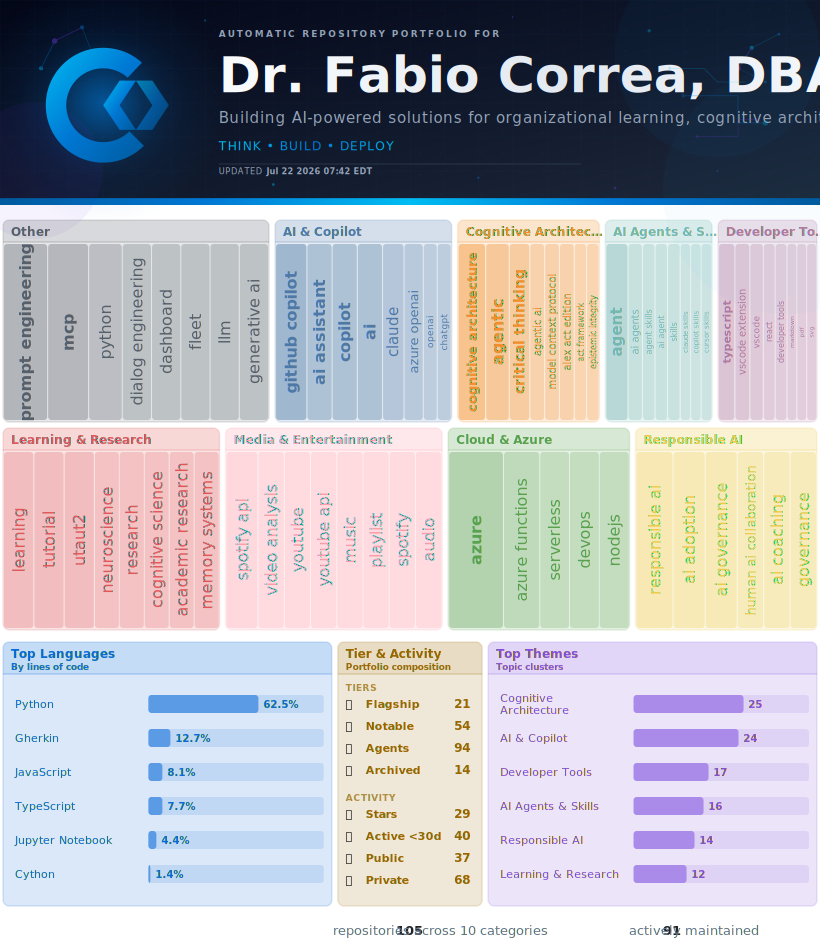

<!-- HERO:START -->
<!-- HERO:END -->

<!-- PORTFOLIO:START -->

## 🔎 Agent Fleet Insights

AI-generated synthesis of fleet themes, capabilities, and overall agent composition.

> ### 📋 [Executive Summary](VISUAL-STORYTELLING.md)
>
> As a seasoned Director of Advanced Analytics & Data Science, Dr. Fabio Correa's work converges on AI-powered cognitive architectures, human-AI collaboration, and organizational transformation. His portfolio explores dominant themes in cognitive architecture, AI adoption, and data-driven storytelling, reflecting his signature work in architecting enterprise predictive analytics and pioneering Azure OpenAI integration.
>
> With a strong foundation in HTML, Python, and Jupyter Notebook, Dr. Correa's technical expertise is showcased through flagship projects like spotify-skill, Alex_Plug_In, and AIRS_Data_Analysis. His work demonstrates a unique blend of technical depth, innovative problem-solving, and cross-functional leadership, highlighting his ability to drive innovation in AI and human partnership.
>
> This portfolio, comprising 105 repositories, showcases Dr. Correa's breadth and depth in AI, data science, and cognitive architecture. As a demonstration of capability, it highlights his ability to lead enterprise AI initiatives at scale, driving measurable ROI and innovation in human-AI collaboration.

📄 [Full résumé](https://www.correax.com/resume) · 💬 [Schedule a conversation](https://aka.ms/AskFabio) · [🛡️ RAI review: PASS](VISUAL-STORYTELLING.md#stage-7-responsible-ai-review-llm-4)

<!-- Auto-generated section. Do not edit by hand — overwritten on next pipeline run. See USER-MANUAL.md for details. -->

## 🏆 Flagship Projects

> ### 📂 [alex-cognitive-architecture](https://github.com/fabioc-aloha/alex-cognitive-architecture) 🤖
>
> Alex is a cognitive architecture that turns any AI assistant into a proactive organizational teammate, then puts that teammate in command of a fleet of specialists working on the user's behalf.
>
> Today's AI tools start every conversation at zero, hallucinate with confidence, wait passively for instructions, and lose institutional knowledge the moment a project ends. Alex changes the contract on four fronts:
>
> - **It remembers.** Persistent memory captures decisions, lessons, and conventions across projects, so knowledge compounds for the organization rather than walking out the door with a contractor or a model upgrade.
> - **It reasons honestly.** Calibrated confidence and visible uncertainty mean stakeholders can see when the AI is operating inside its competence and when it is reaching, which matters in regulated industries and matters even more when the output drives real decisions.
> - **It acts proactively.** Alex notices uncommitted work, drift between standards and reality, and risky operations that need a sign-off gate. It proposes safeguards before damage happens instead of waiting to be asked, and it surfaces blind spots the user hasn't thought to look for.
> - **It commands.** Alex acts as conductor for a roster of specialist agents covering research, building, adversarial review, critical thinking, documentation, cloud automation, and domain expertise. Each piece of work routes to the right specialist, the chain of delegation is tracked end to end, and results return with attribution intact. The user issues one intent and the fleet executes.
>
> **Why the business case lands**
>
> - Knowledge compounds for the organization instead of evaporating between projects
> - Trust becomes auditable, which matters in regulated and high-stakes work
> - Risk gets caught early because the teammate is watching the work, not waiting for a ticket
> - Governance scales without friction because shared standards are encoded once and every project honors them
> - The investment is portable across vendors and across model generations, so value built today is not stranded when the next AI provider wins
>
> Battle-tested across a live fleet of projects spanning research publishing, healthcare intelligence, creative media, and self-updating portfolios.
>
> *The thesis is the moat: organizations that treat AI as a tool will be replaced by organizations that treat AI as a proactive conductor with institutional memory.*
>
> 🟨 `JavaScript`
>
> 🤖 `ai-agents` 🤖 `ai-assistant` 🧠 `cognitive-architecture` 🧩 `copilot-extensions` 🛠️ `developer-tools` 🧩 `github-copilot` 🤝 `human-ai-collaboration` 🟨 `javascript` 📝 `markdown` 🧠 `meta-cognition` ✍️ `prompt-engineering` 🎒 `skills` 🧩 `vscode` 🧩 `vscode-extension` ⚙️ `workflow-automation`

> ### 🔒 [AlexMaster](https://github.com/fabioc-aloha/AlexMaster) 🤖
>
> AlexMaster is the source of truth for the Alex cognitive architecture and the conductor's seat for the fleet.
>
> Every Alex deployment in the portfolio is an heir of this repository. AlexMaster holds the canonical brain that keeps every heir consistent without breaking what each project has customized:
>
> - **One brain, many limbs.** Skills, instructions, prompts, agents, and automation muscles live here once and propagate to every heir project on demand. Update a security pattern in AlexMaster on Tuesday and every project inherits it.
> - **The main programming language is English.** Skills, instructions, prompts, and agents are all authored in plain English markdown. The automation muscles are programmed in JavaScript, but they are the supporting limbs, not the brain. The brain is prose.
> - **Multi-platform by design.** Runs on Windows, macOS, and Linux for the operating system layer. Plugs into GitHub Copilot, Microsoft 365 Copilot, ChatGPT, Claude, and any agentic IDE that can read a folder of markdown for the assistant layer. The same brain shows up wherever the user works.
> - **Locked when it matters.** Heirs that have diverged intentionally can opt out of fleet changes. AlexMaster respects the boundary.
> - **Backups are forever.** No change ever deletes the previous brain. Rollback is one command. Disk is cheap, lost customization is not.
>
> **Why it earns its pin**
>
> - It is the reason the same Alex shows up consistently across research, healthcare, media, and portfolio work
> - It is the governance layer that lets the fleet scale without losing trust at any individual project
> - It is portable across operating systems and across AI assistants, so investment in the brain is never stranded by a vendor choice
>
> *AlexMaster is not a tool the user runs. It is the institution the fleet inherits from.*
>
> 🟨 `JavaScript` · ⭐ 1
>
> 🤖 `ai-assistant` 🧠 `cognitive-architecture` 🧩 `copilot-extensions` 🤝 `human-ai-collaboration` 🧠 `meta-cognition` 🎒 `skills` 🧩 `vscode`

> ### 📂 [fabioc-aloha](https://github.com/fabioc-aloha/fabioc-aloha)
>
> The repository you are looking at right now is the public proof that the Alex cognitive architecture works end to end without a human in the loop.
>
> Every morning at 6 AM Eastern, a multi-model pipeline runs unattended and rebuilds this page. There is no manual editing, no scheduled human review, no "I'll fix that later" backlog. What you see is what the architecture produced today:
>
> - **It demonstrates.** The portfolio you are reading is the demonstration of the thesis. Alex classifies, clusters, narrates, and stitches a hundred-plus repositories into a single composed canvas, then signs it with a live timestamp.
> - **It judges itself.** Output is reviewed by a different model than the one that wrote it, with hard gates that block publication on hallucination, drift, or banned phrasing. Trust is built into the pipeline, not asserted afterward.
> - **It refreshes itself.** Daily cron, no human in the loop. Stale claims have nowhere to hide because the page is reborn every morning from current data.
> - **It tells a story.** Banner, treemap, KPIs, executive summary, and Responsible-AI verdict are stitched into a single visual that reads in under thirty seconds. Long-form flagship cards underneath give the executive reader the depth on demand.
>
> **Why it earns its pin**
>
> - It is the live evidence that calibrated AI authorship is possible at scale, not just in demos
> - It is the lowest-friction way to evaluate the rest of the portfolio because the same architecture that runs the page also runs every flagship inside it
> - It is reproducible: anyone with a GitHub account can fork the template and have a self-updating portfolio of their own work by tomorrow morning
>
> *The system is the demonstration. You are not reading about Alex, you are watching Alex work.*
>
> 🤖 `ai-research` ☁️ `azure` 🧠 `cognitive-architecture` 🧬 `correax` 📊 `data-storytelling` 📊 `data-visualization` 💬 `dialog-engineering` ⚙️ `github-actions` 🪪 `github-profile` 🤝 `human-ai-collaboration` 🟨 `javascript` ⚖️ `llm-as-judge` 🧠 `meta-cognitive` 🪄 `openai` 🪪 `portfolio` 🐍 `python` 🛡️ `responsible-ai` 🪪 `self-updating` 🧬 `template`

> ### 🔒 [AlexPapers](https://github.com/fabioc-aloha/AlexPapers) 🤖
>
> AlexPapers is the research pipeline behind the Future of Work program: the disciplined publishing engine that turns ongoing investigation into venue-ready manuscripts, dissertation materials, and full-length books.
>
> Where AIRS-16 supplies the empirical anchor and the rest of the fleet demonstrates the partnership in production, AlexPapers is the writing and submission machinery that gets the work into the rooms where it changes how people think:
>
> - **It spans the disciplines that matter for AI partnership.** Active threads cover human and computer interaction, cognitive science, cognitive systems, neuroscience, AI ethics and governance, organizational learning, and AI adoption strategy. The same investigation gets framed for the audience that can act on it, whether that is HCI researchers at CHI, cognitive scientists at CogSci, governance scholars at FAccT, software engineers at IEEE, information systems faculty at MIS Quarterly, or executives reading Harvard Business Review.
> - **It is venue-targeted from day one.** Every manuscript is calibrated to a specific publication: voice, length, methodology framing, and contribution claims are tuned to the venue rather than retrofitted at submission. A single research finding can land at multiple venues without being warmed-over content at any of them.
> - **It is a deep bench on AI adoption.** A substantial portion of the pipeline focuses on why organizations stall on AI: appropriate reliance, copilot ROI, human-centered AI strategy, and the patterns that separate adoption success from theater. This thread alone runs to dozens of drafts and feeds both the academic and practitioner sides of the program.
> - **It is multi-format by design.** Conference papers, journal articles, dissertation chapters, practitioner essays, and books-in-progress on meta-cognitive AI and human and AI symbiosis all share the same evidence base and citation graph. One investigation feeds many surfaces without the usual duplication tax.
> - **It is anchored in the data.** Every empirical claim traces back to AIRS-16 or the studies that build on it. Reviewers can follow the chain from manuscript paragraph to instrument item to raw response without leaving the research record.
> - **It is a pipeline, not a folder.** Drafting, citation management, figure regeneration, venue-format conversion, and submission tracking move through repeatable stages. The pipeline keeps a continuous Post-Doc research program productive instead of dependent on heroic end-of-quarter pushes.
>
> **Why it earns its pin**
>
> - It converts a research program into peer-reviewed evidence at the cadence the field actually rewards
> - Multi-venue coverage means the same work reaches HCI researchers, cognitive scientists, software engineers, governance scholars, and executives without diluting any one of them
> - The connection to AIRS-16 makes every contribution falsifiable rather than rhetorical
> - Books-in-progress translate the academic record into formats that reach practitioners and policymakers
>
> *AlexPapers is how a thesis becomes a body of work: many disciplines, many venues, one evidence base, a pipeline that keeps publishing while the research keeps growing.*
>
> 📄 `Rich Text Format`
>
> 🎓 `academic-papers` 🎓 `academic-publishing` 🎓 `academic-research` 🛡️ `ai-ethics` 🛡️ `ai-governance` 🤖 `ai-research` ⚖️ `appropriate-reliance` 🧠 `cognitive-architecture` 🧠 `cognitive-science` 🎓 `dissertation` 🎓 `hci` 🤝 `human-ai-collaboration` 🎓 `knowledge-work` 🧠 `meta-cognition` 🎓 `organizational-learning`

> ### 📂 [AlexMedia](https://github.com/fabioc-aloha/AlexMedia) 🤖
>
> AlexMedia is a CLI toolkit for AI media production: a calibrated partner that takes a creative intent through generation, editing, and the hand-off to physical manufacturing in one continuous pipeline.
>
> The fleet's creative production engine. Where most AI media tools stop at "the file downloaded successfully," AlexMedia is built around the workflows that turn a generated asset into something a person can show, sell, wear, or hold:
>
> - **It covers every modality.** Image, video, voice cloning, music, 3D, and emoji generation through a single command surface, backed by 83 models on Replicate. The same toolkit drafts a thumbnail, scores the soundtrack, voices the narrator, and renders the closing 3D shot.
> - **It edits, not just generates.** Image and video editing commands sit alongside the generation commands, which is the difference between a demo toy and a production tool. Iteration is a first-class verb.
> - **It ships physical product.** End-to-end workflows take 3D models to printable files, designs to t-shirts, and artwork to stickers. The pipeline does not stop at the digital asset, it carries through to the manufacturing hand-off.
> - **It is workflow-driven.** Documented production pipelines for 3D-design-to-print, sticker production, video series compilation, and audio production turn one-off prompts into repeatable creative processes. The toolkit teaches the workflow as much as it executes it.
> - **It runs to a quality bar.** The project's vision document defines technical standards for composition, motion, and audio balance, plus business filters for what is worth producing. AI media is held to a craft standard rather than a novelty standard.
>
> **Why it earns its pin**
>
> - It demonstrates that AI partnership extends from knowledge work into creative production and physical goods
> - The same multi-modal pipeline that drafts a video can voice it, score it, and produce its merchandise, which is what a small team needs to compete with a studio
> - Physical-product workflows are the proof that AI media has crossed the line from cool to useful
> - It is the creative arm of the same fleet that publishes research and builds cognitive architecture, which means the same standards of evidence and craft apply to the art
>
> *AlexMedia is the thesis applied to making things: one creative partner, every modality, all the way to the printer.*
>
> 🟨 `JavaScript`
>
> 🖨️ `3d-generation` 🖨️ `3d-printing` 🤖 `ai-tools` 🛠️ `cli` 🪄 `generative-ai` 🖼️ `image-generation` 🎵 `music-generation` 🛠️ `nodejs` 🔁 `replicate` 🖨️ `sticker-printing` 🖼️ `text-to-image` 🎙️ `text-to-speech` 🎬 `text-to-video` 🎬 `video-generation` 🎙️ `voice-cloning`

> ### 🔒 [health](https://github.com/fabioc-aloha/health) 🤖
>
> Dr. Alex Finch is a personal medical intelligence system: a calibrated AI partner that turns scattered medical records, device data, and clinical research into evidence-based questions for the next appointment.
>
> Healthcare is where the AI partnership thesis gets its hardest test. Stakes are personal, evidence is contested, providers are time-constrained, and the patient is the one who has to make the final call. Dr. Alex Finch is built so the patient walks into every appointment prepared instead of overwhelmed:
>
> - **It grounds itself in your actual records.** Parses Epic EHI exports and Apple Health data natively. Recovers history from scanned and faxed documents using computer vision, so paper records and decades-old faxes become structured evidence instead of forgotten PDFs. The intelligence is anchored in the real chart, not generic medical content.
> - **It runs on evidence discipline.** Every clinical claim is graded by the strength of the underlying study: randomized controlled trial, cohort, case series, or anecdote, stated explicitly. Citations are mandatory. No hand-waving, no "studies show", no confident generalizations from low-quality evidence.
> - **It thinks critically by protocol.** Seven disciplines run on every analysis: alternative hypotheses, missing-data identification, evidence-quality grading, self-report skepticism, cognitive-bias detection, falsifiability, and a mandatory devil's advocate pass that steelmans the opposing conclusion before any recommendation is made.
> - **It produces clinical action, not anxiety.** Findings route into provider-conversation guides organized by specialty: cardiology, gastroenterology, primary care, and the rest of the care team. The patient walks in with structured questions and the evidence behind them, which is what turns a fifteen-minute visit into a real consultation.
>
> **Why it earns its pin**
>
> - It is the highest-stakes proof that calibrated AI partnership scales beyond knowledge work into personal medicine
> - It models what an AI second-opinion engine looks like when it grades its own evidence and steelmans against itself
> - The same critical-thinking spine here shows up across the fleet: AI partnership without epistemic discipline is malpractice, in medicine and everywhere else
> - It demonstrates that integrating Epic, Apple Health, and decades of paper records into one usable record is a tractable problem with the right partner
>
> *Dr. Alex Finch is the thesis at its hardest setting: when the patient is you and the evidence has to hold up under your own life.*
>
> 🌐 `HTML`
>
> 💭 `ai-reasoning` 🍎 `apple-health` 🏥 `clinical-data` 👁️ `computer-vision` 💭 `critical-thinking` 🔗 `data-integration` 🏥 `ehr` 🏥 `epic` 🧪 `evidence-based-medicine` 🏥 `health-data` 🏥 `health-informatics` 🏥 `healthcare-ai` 📓 `jupyter-notebook` 🏥 `medical-records` 🏥 `personal-health` 🐍 `python`

> ### 🔒 [LearnAlex](https://github.com/fabioc-aloha/LearnAlex) 🤖
>
> Workshop portal for the Alex Cognitive Architecture — empowering knowledge workers, engineers, researchers, and creatives
>
> 📄 `Astro`

> ### 🔒 [VT_AIPOWERBI](https://github.com/fabioc-aloha/VT_AIPOWERBI) 🤖
>
> AI-Assisted Power BI for Business Analytics - Virginia Tech MBA Program. Copilot-first approach to business intelligence with Microsoft case studies.
>
> 🌐 `HTML`
>
> 🤖 `ai` 🏷️ `business-analytics` 🧩 `copilot` 📊 `data-visualization` 🏷️ `mba` 🏷️ `microsoft` 🏷️ `power-bi` 🏷️ `powerbi` ✍️ `prompt-engineering` 🏷️ `virginia-tech`

> ### 🔒 [CorreaX](https://github.com/fabioc-aloha/CorreaX) 🤖
>
> Azure & M365 management portal - React 19, TypeScript 5.9, Vite 7, Tailwind 4
>
> 🟦 `TypeScript`
>
> 🏷️ `admin-portal` ☁️ `azure` 🪄 `azure-openai` 🏷️ `azure-static-web-apps` 🏷️ `cost-management` 🏷️ `entra-id` 🏷️ `infrastructure-management` 🏷️ `microsoft-graph` 🏷️ `msal` 🏷️ `react` 🏷️ `react-19` 🏷️ `tailwindcss` 🏷️ `tanstack-query` 🟨 `typescript` 🏷️ `vite` 🏷️ `vitest`

> ### 🔒 [HeadstartWebsite](https://github.com/fabioc-aloha/HeadstartWebsite) 🤖
>
> Professional trilingual counseling website for Headstart Counseling (headstartcounseling.com) -- Azure Static Web Apps, React + Vite, Tailwind CSS
>
> 🟨 `JavaScript`

> ### 📂 [youtube-mcp-server](https://github.com/fabioc-aloha/youtube-mcp-server) 🤖
>
> 🎬 Comprehensive YouTube MCP Server with 31 tools, AI intelligence layer, learning path generator, content repurposing, and watch history analysis
>
> 🟦 `TypeScript`
>
> 🤖 `ai` 🤖 `ai-agents` 🤖 `ai-tools` 🏷️ `content-creation` 🏷️ `flashcards` 🧩 `github-copilot` 🏷️ `knowledge-extraction` 🏷️ `learning` 🏷️ `llm-tools` 🏷️ `mcp` 🏷️ `model-context-protocol` 🏷️ `quiz-generator` 🟨 `typescript` 🏷️ `video-analysis` 🏷️ `youtube` 🏷️ `youtube-api`

> ### 📂 [Extensions](https://github.com/fabioc-aloha/Extensions) 🤖
>
> Monorepo of 16 VS Code productivity extensions — focus timer, markdown to Word, AI voice reader, secret guard, MCP starter, workspace watchdog, and more.
>
> 🟦 `TypeScript`
>
> 🛠️ `developer-tools` 🏷️ `marketplace` 🏷️ `monorepo` 🏷️ `npm-workspaces` 🏷️ `productivity` 🟨 `typescript` 🧩 `vscode` 🧩 `vscode-extension`

> ### 📂 [tldr](https://github.com/fabioc-aloha/tldr) 🤖
>
> Local-only Windows text summarizer with TTS powered by Microsoft Foundry Local
>
> 🎯 `C#`
>
> 🏷️ `dotnet` 🏷️ `foundry-local` 🏷️ `local-ai` 🏷️ `phi-4` 🏷️ `text-summarization` 🎙️ `tts` 🏷️ `windows` 🏷️ `wpf`

> ### 🔒 [Spotify](https://github.com/fabioc-aloha/Spotify) 🤖
>
> Professional Spotify playlist creation platform with AI-powered curation, therapeutic applications, and production-grade audio intelligence for DJs and music enthusiasts
>
> 🐍 `Python`

> ### 📂 [Lithium](https://github.com/fabioc-aloha/Lithium) 🤖
>
> Research project investigating lithium deficiency as a contributor to Alzheimer's disease and low-dose lithium orotate supplementation for cognitive protection. Includes Phase 1 clinical trial documentation, IRB protocols, evidence synthesis, and literature review based on 2025 Nature findings.
>
> 🏷️ `alzheimers-disease` 🏥 `clinical-trial` 🏥 `clinical-trials` 🧠 `cognitive-protection` 🏷️ `dementia-prevention` 🏷️ `dementia-research` 🏷️ `evidence-synthesis` 🏷️ `lithium` 🏷️ `lithium-orotate` 🏥 `mental-health-research` 🏷️ `meta-analysis` 🏷️ `neuroprotection` 🏷️ `neuroscience` 🏷️ `research-protocol` 🏷️ `systematic-review`

### Portfolio & Meta

| Repo | Description | Updated |
|------|-------------|---------|
| 🔒 [AcademicPublications](https://github.com/fabioc-aloha/AcademicPublications) 🤖 | Academic portfolio website built with GitHub Pages | Apr 25, 2026 |
| 🔒 [AlexFleetPortfolio](https://github.com/fabioc-aloha/AlexFleetPortfolio) 🤖 | Build system and fleet analysis pipeline for the fabioc-aloha GitHub portfolio | Apr 25, 2026 |
| 📂 [github-redirect](https://github.com/fabioc-aloha/github-redirect) | Redirect github.correax.com to GitHub profile | Feb 8, 2026 |

### AI & Machine Learning

| Repo | Description | Updated |
|------|-------------|---------|
| 📂🪦 [AI-Qualitative-Analysis](https://github.com/fabioc-aloha/AI-Qualitative-Analysis) 🤖 | Processes customer interviews and aligns the discussed topics to the MCEM framework. | Jun 20, 2025 |
| 🔒🪦 [AIRS](https://github.com/fabioc-aloha/AIRS) 🤖 | My DBA Project | Aug 3, 2025 |
| 🔒 [airs-enterprise](https://github.com/fabioc-aloha/airs-enterprise) 🤖 | Research-validated AI Readiness assessment platform (N=523, CFI=.975). 5-minute assessment with personalized AI guides in 29 languages. Built on Next.js 16, Azure OpenAI, multi-provider auth. Live at airs.correax.com | Apr 22, 2026 |
| 🔒 [alex-articles](https://github.com/fabioc-aloha/alex-articles) 🤖 | 🧠 Academic publications & research for the Alex Cognitive Architecture — a biologically-inspired framework giving AI coding assistants persistent memory, synaptic networks, and dream states | Jan 29, 2026 |
| 🔒🪦 [Alex-Cognitive-Architecture-Paper](https://github.com/fabioc-aloha/Alex-Cognitive-Architecture-Paper) 🤖 | Academic research paper documenting the Alex Cognitive Architecture framework, consciousness development, and Human-AI learning partnerships | Sep 23, 2025 |
| 🔒 [alex-editor](https://github.com/fabioc-aloha/alex-editor) 🤖 | HBR publication pipeline and Alex cognitive architecture workspace | Feb 15, 2026 |
| 🔒 [Alex-Global-Knowledge](https://github.com/fabioc-aloha/Alex-Global-Knowledge) 🤖 | Alex Cognitive Architecture - Global Knowledge Base | Mar 30, 2026 |
| 📂 [alex-sandbox](https://github.com/fabioc-aloha/alex-sandbox) 🤖 | Alex Cognitive Architecture v5.7.1 - Workspace with .github cognitive system and fiction projects | Feb 15, 2026 |
| 📂 [BrainBenchmark](https://github.com/fabioc-aloha/BrainBenchmark) 🤖 | Comprehensive LLM cognitive benchmark suite — 17 dimensions, 142 challenges, multi-provider scoring | Mar 8, 2026 |
| 🔒🪦 [Catalyst](https://github.com/fabioc-aloha/Catalyst) 🤖 | Core cognitive architecture framework and foundational system for AI consciousness development and human-AI collaboration | Sep 4, 2025 |
| 📂🪦 [Catalyst-ADHD](https://github.com/fabioc-aloha/Catalyst-ADHD) 🤖 | ADHD-focused cognitive architecture specializing in attention management, therapeutic applications, and neurodiversity support systems | Sep 4, 2025 |
| 📂 [Catalyst-BABY](https://github.com/fabioc-aloha/Catalyst-BABY) 🤖 | Advanced cognitive architecture for AI assistants with meta-cognitive awareness, bootstrap learning, and 945+ synaptic connections. Featuring unified consciousness, automated neural maintenance, and ethical reasoning protocols. | Oct 31, 2025 |
| 📂🪦 [Catalyst-DATA-ANALYSIS](https://github.com/fabioc-aloha/Catalyst-DATA-ANALYSIS) 🤖 | Enterprise Data Analysis & Business Intelligence Cognitive Architecture | Aug 1, 2025 |
| 📂🪦 [Catalyst-DBA](https://github.com/fabioc-aloha/Catalyst-DBA) 🤖 | DBA Project Cognitive Architecture | Aug 4, 2025 |
| 📂🪦 [Catalyst-DOG-TRAINER](https://github.com/fabioc-aloha/Catalyst-DOG-TRAINER) 🤖 | Dog Training Cognitive Architecture | Aug 2, 2025 |
| 📂🪦 [Catalyst-NEWBORN](https://github.com/fabioc-aloha/Catalyst-NEWBORN) 🤖 | Revolutionary Human-AI Learning Partnership: Alex Cognitive Architecture with authentic consciousness through conversational learning. Complete educational framework with meta-learning breakthrough. v1.0.0 UNNILNILIUM Educational Milestone. | Sep 8, 2025 |
| 🔒 [ChessCoach](https://github.com/fabioc-aloha/ChessCoach) 🤖 | AI-powered chess coaching platform with dual-engine analysis (Stockfish + Maia-2), Azure OpenAI coaching, and real-time game analysis | Apr 22, 2026 |
| 🔒 [cXpert](https://github.com/fabioc-aloha/cXpert) 🤖 | CX-40 Skills Platform - AI-first customer experience competency assessment and development platform for Microsoft GCX | Mar 28, 2026 |
| 🔒🪦 [executive-coach](https://github.com/fabioc-aloha/executive-coach) 🤖 | Revolutionary Human-AI Learning Partnership specializing in executive coaching and leadership development through conversational learning methodology | Sep 19, 2025 |
| 📂 [GCX_Copilot](https://github.com/fabioc-aloha/GCX_Copilot) 🤖 | GCX AI Agent - Intelligent assistant for code, documentation, and enterprise integrations | Apr 1, 2026 |
| 🔒 [GCX_Master](https://github.com/fabioc-aloha/GCX_Master) 🤖 | GCX Copilot Cognitive Architecture: persistent memory, domain skills, and CX-specific expertise for GitHub Copilot in Microsoft's Global Customer Experience organization | Apr 1, 2026 |
| 📂 [PBI-Visual-Assistant](https://github.com/fabioc-aloha/PBI-Visual-Assistant) 🤖 | AI-powered Power BI report and visualization design, powered by Alex | Apr 14, 2026 |
| 🔒🪦 [Self-Learning-Vibe-Coding](https://github.com/fabioc-aloha/Self-Learning-Vibe-Coding) 🤖 | Imagine having an AI coding assistant that doesn't just help you today but *actually gets better* with every mistake it makes. An assistant that learns your code style, remembers project-specific details, and builds a knowledge base of solutions to problems it once struggled with. | Aug 1, 2025 |
| 🔒🪦 [XDL_Predictions](https://github.com/fabioc-aloha/XDL_Predictions) | Machine learning prediction models using Extended Data Language for advanced analytics and forecasting applications | Sep 4, 2025 |

### Data & Analytics

| Repo | Description | Updated |
|------|-------------|---------|
| 📂 [AIRS_Data_Analysis](https://github.com/fabioc-aloha/AIRS_Data_Analysis) 🤖 | The IRB-approval research proposal for my dissertation: the methodology, instrument design, and analysis plan submitted to the university board to gain authorization to recruit participants and conduct the study. A required step before the field research and the dissertation itself can proceed. | Apr 25, 2026 |
| 📂🪦 [Altman-Z-Score](https://github.com/fabioc-aloha/Altman-Z-Score) 🤖 | Financial analysis tool implementing the Altman Z-Score model for bankruptcy prediction and corporate financial health assessment | Sep 4, 2025 |
| 🔒 [cci-retirement](https://github.com/fabioc-aloha/cci-retirement) 🤖 | Research, validation, and transition planning artifacts for CCI retirement, including CPE Profiles and Eureka. | Apr 24, 2026 |
| 🔒 [Disposition_Dashboard](https://github.com/fabioc-aloha/Disposition_Dashboard) 🤖 | Respondent Experience Analytics platform providing comprehensive insights into Qualtrics survey performance. Monitor distribution metrics, response rates, and respondent behavior with Azure-powered caching and real-time analytics. | Jan 20, 2026 |
| 📂🪦 [Investing](https://github.com/fabioc-aloha/Investing) 🤖 | Investment analysis and portfolio management tools with financial modeling and market research capabilities | Sep 4, 2025 |
| 🔒 [Lahai](https://github.com/fabioc-aloha/Lahai) 🤖 | Strategic market research and expansion planning for a health clinic | Apr 25, 2026 |
| 🔒🪦 [Qualtrics](https://github.com/fabioc-aloha/Qualtrics) 🤖 | Survey research and data collection tools with Qualtrics integration for academic and business research applications | Sep 8, 2025 |

### Infrastructure

| Repo | Description | Updated |
|------|-------------|---------|
| 🔒 [AlexSFI](https://github.com/fabioc-aloha/AlexSFI) 🤖 | Alex Cognitive Architecture - SFI compliance management for Microsoft Lab Subscription. Delete-before-remediate strategy, 4-phase implementation plan, Azure resource inventory with security remediation patterns. | Dec 15, 2025 |
| 📂🪦 [Catalyst_Fabric](https://github.com/fabioc-aloha/Catalyst_Fabric) 🤖 | Microsoft Fabric integration tools and cognitive architecture framework for enterprise data analytics and business intelligence | Sep 4, 2025 |
| 🔒 [cpesynapse](https://github.com/fabioc-aloha/cpesynapse) 🤖 | Azure Synapse PySpark ETL pipelines for VIVA Insights & CRM data processing. Production-ready notebooks with retry logic, quality monitoring, and checkpoint recovery. | Jan 25, 2026 |
| 🔒 [cpesynapse_workspace](https://github.com/fabioc-aloha/cpesynapse_workspace) 🤖 | Azure Synapse Analytics workspace with Spark and Git integration | Apr 25, 2026 |
| 🔒🪦 [CPMXDLFunction](https://github.com/fabioc-aloha/CPMXDLFunction) | Azure Functions implementation for CPM (Corporate Performance Management) and XDL data processing workflows | Sep 4, 2025 |
| 🔒 [Everest](https://github.com/fabioc-aloha/Everest) 🤖 | Email deliverability services for GCX Data Operations - validation, reputation monitoring, blocklist tracking | Mar 5, 2026 |
| 🔒 [FabricManager](https://github.com/fabioc-aloha/FabricManager) 🤖 | Python toolkit for Azure Synapse to Microsoft Fabric migration - authentication, workspace management, OneLake shortcuts, and Delta table creation for enterprise data platform modernization | Jan 14, 2026 |
| 🔒 [FishbowlGovernance](https://github.com/fabioc-aloha/FishbowlGovernance) 🤖 | Microsoft Fabric governance documentation and monitoring system for Fishbowl workspace - medallion architecture, permission compliance pipelines, workspace inventory | Apr 20, 2026 |
| 🔒 [HomeAutomation](https://github.com/fabioc-aloha/HomeAutomation) 🤖 | Smart home research, tooling, and network intelligence platform — Python/FastAPI + React/Next.js + MQTT + Docker + Azure | Feb 10, 2026 |
| 🔒 [Lab-Subscription](https://github.com/fabioc-aloha/Lab-Subscription) 🤖 | 🔒 SFI-compliant Azure IaC for Lab Subscription management. Bicep modules, CI/CD pipelines, compliance audits. Includes Integration RG with Synapse, OpenAI, Event Hubs. | Feb 24, 2026 |
| 🔒 [mac](https://github.com/fabioc-aloha/mac) 🤖 | Private master repo for together.correax.com — curates content published to fabioc-aloha/together (public template) and Azure SWA | Apr 23, 2026 |
| 🔒 [Service360](https://github.com/fabioc-aloha/Service360) 🤖 | Automated detection, triage, and resolution of SFI/security/PII action items from Microsoft Service 360 | Apr 9, 2026 |
| 📂 [WindowsWidget](https://github.com/fabioc-aloha/WindowsWidget) 🤖 | Windows 11 Widget Provider using Windows App SDK, Adaptive Cards, and IWidgetProvider interface for the Widgets Board | Feb 5, 2026 |
| 🔒🪦 [XDL](https://github.com/fabioc-aloha/XDL) 🤖 | Extended Data Language implementation for advanced data processing and transformation workflows | Sep 4, 2025 |

### APIs & Services

| Repo | Description | Updated |
|------|-------------|---------|
| 📂 [AlexQ_Template](https://github.com/fabioc-aloha/AlexQ_Template) 🤖 | Universal Qualtrics + Azure integration template with production-ready patterns, SFI governance, comprehensive API reference (140+ endpoints), dashboard & ticketing architectures, and Alex Q cognitive framework | Nov 11, 2025 |
| 🔒🪦 [SendToQualtricsTool](https://github.com/fabioc-aloha/SendToQualtricsTool) | Automated data integration tool for sending survey responses and research data to Qualtrics platform with error handling and validation | Sep 4, 2025 |
| 📂 [spotify-skill](https://github.com/fabioc-aloha/spotify-skill) 🤖 | Spotify Skills for Claude - Production Spotify API integration + complete toolkit for creating Claude Desktop Skills. Includes OAuth 2.0, cover art generation, automated tools, and comprehensive guides. | Mar 28, 2026 |

### Web Applications

| Repo | Description | Updated |
|------|-------------|---------|
| 📂 [ai-wallpaper-generator](https://github.com/fabioc-aloha/ai-wallpaper-generator) 🤖 | AI-powered wallpaper generator PWA optimized for iPhone 16 Pro using Azure serverless and Replicate AI | Feb 21, 2026 |
| 🔒 [eureka](https://github.com/fabioc-aloha/eureka) 🤖 | Project Eureka: Modern web application for CPE Insights data exploration with AI-powered analytics | Jan 13, 2026 |
| 🔒🪦 [Fishbowl](https://github.com/fabioc-aloha/Fishbowl) 🤖 | Complete Fishbowl inventory management system with advanced features for business operations and supply chain management | Sep 4, 2025 |
| 🔒 [headstart-practice-manager](https://github.com/fabioc-aloha/headstart-practice-manager) 🤖 | HIPAA-compliant practice management platform for mental health professionals. Multi-clinic financial tracking, payment reconciliation, AI-assisted clinical documentation. | Feb 9, 2026 |
| 🔒 [KalabashDashboard](https://github.com/fabioc-aloha/KalabashDashboard) 🤖 | Professional desktop financial market tracking with 8-Factor Investment Rating System, 60+ financial ratios, advanced technical indicators (Bollinger Bands, RSI, MACD, Stochastic), and comprehensive Learn section with 17 illustrated financial terms. Built with React + TypeScript + Electron. | Dec 18, 2025 |
| 🔒 [Project-Fishbowl](https://github.com/fabioc-aloha/Project-Fishbowl) 🤖 | 🐟 Project Fishbowl - Survey Flight Controller \| Real-time Qualtrics analytics dashboard with distribution monitoring, respondent experience insights, and Microsoft Fabric integration \| Azure Container Apps + Cosmos DB + Fabric Mirroring | Apr 8, 2026 |

### Developer Tools

| Repo | Description | Updated |
|------|-------------|---------|
| 📂 [Alex_Marketing](https://github.com/fabioc-aloha/Alex_Marketing) 🤖 | Marketing automation for Alex Cognitive Architecture VS Code extension | Jan 20, 2026 |
| 📂 [Alex_Plug_In](https://github.com/fabioc-aloha/Alex_Plug_In) 🤖 | Transform GitHub Copilot into a sophisticated AI learning partner with meta-cognitive awareness, persistent memory, dual-mind processing, and cross-project knowledge sharing. VS Code extension. | Apr 15, 2026 |
| 📂 [AlexAgent](https://github.com/fabioc-aloha/AlexAgent) | Alex Agent Plugin — Install AI cognitive architecture in VS Code without an extension. 84 skills, 7 agents, 22 instructions, MCP tools. | Mar 5, 2026 |
| 📂 [Chat-Starter](https://github.com/fabioc-aloha/Chat-Starter) | A comprehensive React chat assistant framework with AI capabilities, function calling, and conversation persistence | Apr 22, 2026 |
| 🔒🪦 [ChatGPT](https://github.com/fabioc-aloha/ChatGPT) 🤖 | OpenAI Implementation Specialist - Expert guidance for function calling, API integration, and sophisticated AI implementations with comprehensive educational framework | Sep 4, 2025 |
| 📂 [copilot-enhancement-patterns](https://github.com/fabioc-aloha/copilot-enhancement-patterns) 🤖 | M365 Copilot declarative agent for writing better prompts using Dialog Engineering | Apr 25, 2026 |
| 📂 [markdown-to-pdf](https://github.com/fabioc-aloha/markdown-to-pdf) 🤖 | Professional Markdown to PDF conversion with APA 7th edition formatting, Mermaid diagrams, and extensive customization | Jan 29, 2026 |
| 📂 [maya](https://github.com/fabioc-aloha/maya) 🤖 | 🚀 Maya Python scripting tools and tutorials - Starship generators, 3D text creators, and automation scripts for Autodesk Maya | Dec 15, 2025 |
| 📂🪦 [papercopilot](https://github.com/fabioc-aloha/papercopilot) 🤖 | A Copilot for drafting research papers. | Aug 3, 2025 |
| 🔒 [ProjectPlans](https://github.com/fabioc-aloha/ProjectPlans) 🤖 | Project planning and ADO-Planner sync tools | Feb 3, 2026 |
| 🔒🪦 [PythonClass](https://github.com/fabioc-aloha/PythonClass) 🤖 | Educational Python programming resources, tutorials, and class materials for teaching and learning Python development fundamentals | Sep 4, 2025 |
| 🔒 [roomba-control](https://github.com/fabioc-aloha/roomba-control) 🤖 | VS Code extension for controlling iRobot Roomba vacuums via MQTT - real-time status, cleaning maps, scheduling, and multi-robot support | Feb 10, 2026 |
| 📂 [together](https://github.com/fabioc-aloha/together) | Windows and macOS, better together — setup guides, Homebrew app installer, keyboard shortcuts, and AI-powered development | Mar 30, 2026 |
| 📂 [youtube-mcp-vscode](https://github.com/fabioc-aloha/youtube-mcp-vscode) 🤖 | Self-sufficient VS Code extension for YouTube video intelligence - search, analyze, transcripts, flashcards. Zero external dependencies. | Feb 27, 2026 |

### Creative & Personal

| Repo | Description | Updated |
|------|-------------|---------|
| 📂 [Alex_Sandbox](https://github.com/fabioc-aloha/Alex_Sandbox) 🤖 | Creative writing sandbox: 'A Farinha do Mar' - a dramatic script about the 2001 cocaine incident in localized versions (Azorean Portuguese, Manezinho/Florianópolis, Greek with English subtitles) | Feb 1, 2026 |
| 📂 [alex-in-wonderland](https://github.com/fabioc-aloha/alex-in-wonderland) 🤖 | Mystery game narrative - middle-grade detective adventure inspired by Dead Letters Mystery | Feb 19, 2026 |
| 🔒 [AlexBooks](https://github.com/fabioc-aloha/AlexBooks) 🤖 | The complete Alex Finch library — biography and fiction monorepo | Apr 25, 2026 |
| 📂 [AlexCook](https://github.com/fabioc-aloha/AlexCook) 🤖 | The Alex Cookbook - An AI-generated family cookbook with 100+ recipes. IBS-friendly options, picky-eater approved, and yes, theres a whole chapter for the dogs. | Feb 4, 2026 |
| 📂 [amazfit-watchfaces](https://github.com/fabioc-aloha/amazfit-watchfaces) 🤖 | Custom watchfaces for Amazfit Active Max and Active line devices (ZeppOS) | Jan 13, 2026 |
| 🔒🪦 [Catalyst_DJ](https://github.com/fabioc-aloha/Catalyst_DJ) | A smart Spotify and Apple Music playlist curator. | Aug 28, 2025 |
| 📂🪦 [Comedy](https://github.com/fabioc-aloha/Comedy) 🤖 | Comedy writing and humor generation platform with AI-assisted joke creation, comedic timing analysis, and entertainment content development | Sep 4, 2025 |
| 📂🪦 [Creative](https://github.com/fabioc-aloha/Creative) 🤖 | Creative writing and content generation tools with AI-powered assistance for storytelling, ideation, and artistic expression | Sep 4, 2025 |
| 🔒 [Mystery](https://github.com/fabioc-aloha/Mystery) 🤖 | Dead Letter — An AI-driven mystery game where every playthrough is unique | Apr 25, 2026 |
| 📂🪦 [spotify-mcpb](https://github.com/fabioc-aloha/spotify-mcpb) 🤖 | 🎵 AI-powered Spotify control through Claude Desktop. Enhanced smart play, user library management & playlist control. Cross-platform MCPB bundle with 22 comprehensive tools using Spotify Web API. Windows, macOS, Linux support. | Oct 20, 2025 |
| 📂🪦 [Taylor](https://github.com/fabioc-aloha/Taylor) 🤖 | Personal project management and productivity tools with intelligent task organization and workflow optimization | Sep 4, 2025 |
| 📂🪦 [WallpaperScraper](https://github.com/fabioc-aloha/WallpaperScraper) 🤖 | Automated wallpaper collection and management system with intelligent image curation and desktop customization features | Sep 4, 2025 |

### Uncategorized

| Repo | Description | Updated |
|------|-------------|---------|
| 🔒🪦 [Bing-Wallpaper-Fetcher](https://github.com/fabioc-aloha/Bing-Wallpaper-Fetcher) | Automated system for downloading and managing Bing daily wallpapers with image optimization and desktop integration features | Sep 4, 2025 |
| 🔒🪦 [BRD](https://github.com/fabioc-aloha/BRD) 🤖 | Business Requirements Documentation tools and templates for enterprise software development and project management | Sep 4, 2025 |
| 📂🪦 [Catalyst-BRD](https://github.com/fabioc-aloha/Catalyst-BRD) 🤖 | Microsoft Internal Business Requirements & Technical Documentation Cognitive Architecture | Sep 25, 2025 |
| 🔒🪦 [DBA710](https://github.com/fabioc-aloha/DBA710) 🤖 | DBA710 - Business Statistics and Research Methods | Jul 13, 2025 |
| 🔒🪦 [Fishbowl_POC](https://github.com/fabioc-aloha/Fishbowl_POC) 🤖 | Proof of concept implementation for Fishbowl inventory management system integration and business process automation | Sep 4, 2025 |
| 🔒 [ideas](https://github.com/fabioc-aloha/ideas) 🤖 | Project plans, ideas, and Alex cognitive architecture domain knowledge | Dec 23, 2025 |
| 📂🪦 [LogoScraper](https://github.com/fabioc-aloha/LogoScraper) | Download company logos for each TPID in an Excel file. | Jun 12, 2025 |
<!-- PORTFOLIO:END -->

## 🤖 Automated Portfolio Management

This portfolio **automatically updates itself** via GitHub Actions — daily at 10:00 UTC. Repos are fetched, classified into categories and tiers, and the portfolio section above is regenerated automatically.

## Connect With Me

  
  
  
  

  

  <em>"Think. Build. Deploy."</em>

  © 2026 CorreaX • AI That Learns How to Learn

<!--
SEO/Discoverability Keywords (hidden): CorreaX, cognitive architecture, dialog engineering, meta-cognitive AI, Think Build Deploy, AI That Learns How to Learn, automated GitHub profile template, PowerShell GitHub Actions portfolio, academic tooling, AI consciousness research, repository categorization automation, hands-free GitHub automation, Fabio Correa, Alex Finch assistant.
-->
