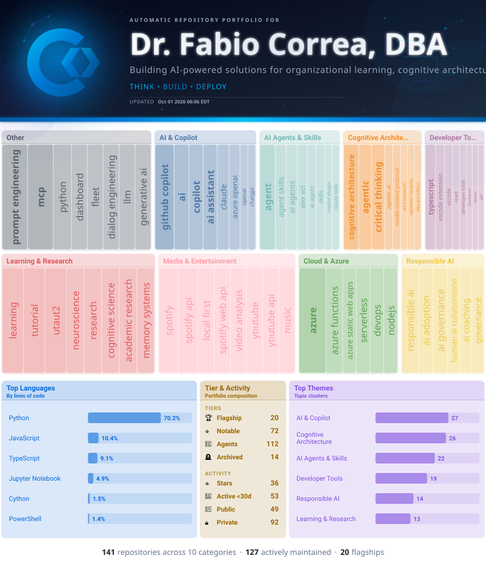

<!-- HERO:START -->
<!-- HERO:END -->

<!-- PORTFOLIO:START -->

## 🔎 Agent Fleet Insights

Hand-authored synthesis of fleet themes, capabilities, and overall agent composition.

> ### 📋 [Executive Summary](VISUAL-STORYTELLING.md)
>
> The goal of this work is to promote human-AI collaboration and prepare people, organizations, and education for an AI-infused future of work. It starts with a doctoral dissertation: the AI Readiness Scale, validated on N=523 with a CFI of .975 and explaining 85.2% of variance in behavioral intention, was built to measure what makes people ready to work with AI and what holds them back. What the data showed is that adoption fails most often where the AI partner has no memory, no calibration, and no proactive judgment. The rest of the portfolio is the program that grew from that finding.
>
> &nbsp;
>
> Twelve repositories carry the proof. AIRS_Data_Analysis is the empirical anchor, the IRB-approved dissertation behind every adoption claim downstream. airs-enterprise ships the validated instrument as a five-minute, twenty-nine-language SaaS assessment. Alex_ACT_ONE is critical thinking as an installable skills pack: sixty skills, fifteen prompts, fifteen always-on instructions, one copy serving Copilot CLI, VS Code, Scout, and the GitHub Copilot app. Alex_ACT_ONE_Muse is the same framework ported to Muse, fifty-two skills triaged against what the host already does natively. Alex_ACT_ONE_Steward governs the lineage: framework authorship, mall curation, fleet visibility, and retirement records. AI-Wars-2026 is a living web-book on the race to define the agentic era, where every claim carries a source ID and corrections publish at equal prominence. Alex_Skill_Mall is the curated marketplace where the battle-tested skills the fleet runs on are published: two hundred hard-won lessons across fifty-plus domains. fabioc-aloha, the page you are reading, is the live evidence: a multi-model pipeline rebuilt every morning and gated on a separate model's review. HeadstartWebsite is an agent-operated trilingual telehealth site for a licensed clinical practice. youtube-mcp-server is a probe into what an MCP server looks like when it is built for agents from the start. Extensions is a monorepo of sixteen standalone VS Code extensions, nine of them on the Marketplace. seo-monitor watches Search Console and Bing Webmaster Tools across the portfolio's sites and turns a weekly automated audit into a prioritized fix list.
>
> &nbsp;
>
> The unifying claim is not productivity, it is partnership grounded in evidence: a validated instrument for measuring AI readiness, a teachable discipline for thinking with AI, and a governance pattern that lets both scale across a fleet without losing fidelity. Every project here argues the same point, that the future of work belongs to humans and AI partners that are each held to a standard.

📄 [Full résumé](https://www.correax.com/resume) · 💬 [Schedule a conversation](https://aka.ms/AskFabio) · [🛡️ RAI review: PASS](VISUAL-STORYTELLING.md#stage-7-responsible-ai-review-llm-4)

<!-- Auto-generated section. Do not edit by hand — overwritten on next pipeline run. See docs/USER-MANUAL.md for details. -->

## 🏆 Flagship Projects

> ### 📂 [AIRS_Data_Analysis](https://github.com/fabioc-aloha/AIRS_Data_Analysis) 🤖
>
> *AIRS_Data_Analysis is the dissertation that makes the rest of the portfolio falsifiable.*
>
> &nbsp;
>
> AIRS_Data_Analysis is the IRB-approved dissertation behind the AI Readiness Scale: a 16-item instrument extending UTAUT2 with an AI Trust construct, validated on N=523 with a split-sample EFA to CFA to SEM design. The 8-factor model fits at CFI=.975 and explains 85.2% of variance in behavioral intention, with four user typologies giving organizations a defensible map for targeted intervention.
>
> - **Rigorously validated.** n=261 development, n=262 holdout; leaders show effect sizes from d=0.74 to d=1.14 over non-leaders across AI tool usage.
>
> - **Fully reproducible.** Eleven analysis notebooks cover the full pipeline from raw responses through SEM; every finding is computed in code anyone can rerun.
>
> Conclusion: it gives leaders a defensible number for workforce AI readiness, which is the measurement foundation human-AI collaboration at work has been missing.
>
> 📓 `Jupyter Notebook` · ⭐ 1
>
> 🎓 `academic-research` 📈 `ai-adoption` 📈 `ai-anxiety` 📐 `behavioral-validation` 📐 `cfa` 🎓 `dissertation` 📐 `efa` 📐 `factor-analysis` 🧪 `intervention-design` 📐 `measurement-invariance` 📐 `mediation-analysis` 📐 `moderation-analysis` 📈 `organizational-readiness` 📐 `psychometrics` 📐 `reproducible-research` 📐 `scale-development` 📐 `sem` 📐 `structural-equation-modeling` 📈 `technology-acceptance` 📐 `utaut2`

> ### 🔒 [airs-enterprise](https://github.com/fabioc-aloha/airs-enterprise) 🤖
>
> *airs-enterprise is the dissertation in production: five minutes, twenty-nine languages, one validated number per person.*
>
> &nbsp;
>
> airs-enterprise is the productized AIRS instrument: a five-minute, twenty-nine-language SaaS assessment that puts the validated psychometric work into the hands of organizations. Sixteen questions return an AIRS Score mapped to actionable typologies, with team analytics, longitudinal pre/post tracking, and AI-generated action plans. Live at airs.correax.com.
>
> - **Built for the enterprise.** Organization management, department analytics, CSV exports, and a cross-org SUPER_ADMIN dashboard.
>
> - **Production-grade.** 429 tests passing, zero TypeScript or ESLint errors, full accessibility coverage, MIT licensed.
>
> Conclusion: it turns readiness measurement into an operating tool, so building an AI-ready workforce becomes a program instead of a survey.
>
> 🟦 `TypeScript`
>
> 🏷️ `adaptive-cards` 📈 `ai-adoption` 📈 `ai-readiness` ☁️ `azure` 🪄 `azure-openai` 🏷️ `enterprise-saas` 🏷️ `longitudinal-tracking` 🏷️ `microsoft-entra-id` 🏷️ `microsoft-teams` 🏷️ `nextjs` 🏷️ `organizational-psychology` 🏷️ `postgresql` 🏷️ `prisma` 📐 `psychometric-assessment` 🏷️ `react` 🏷️ `streaming-ai` 🏷️ `tailwind-css` 🟨 `typescript` 📐 `utaut2` 🏷️ `workforce-analytics`

> ### 📂 [Alex_ACT_ONE](https://github.com/fabioc-aloha/Alex_ACT_ONE)
>
> *Alex_ACT_ONE is critical thinking you can install: one pack, every Copilot surface, sixty skills that check your work.*
>
> &nbsp;
>
> Alex ACT ONE is critical thinking as an installable skills pack for GitHub Copilot. One user-level install serves Copilot CLI, VS Code, Microsoft Scout, and the GitHub Copilot app with sixty skills, fifteen prompts, and fifteen always-on instructions, distributed through the Alex ACT Mall.
>
> - **Think before building.** Frame the real problem, weigh competing explanations, name what would prove you wrong.
>
> - **Write code that survives review.** Test-first workflows, root-cause debugging, security hardening, adversarial review from three opposing perspectives.
>
> - **Produce prose people finish.** Strip AI writing patterns, find the document's one real sentence, write Markdown that passes lint first try.
>
> Conclusion: it packages the human-AI partnership as a teachable discipline, critical thinking as infrastructure for knowledge work in an AI-infused business.
>
> 🟨 `JavaScript`

> ### 📂 [Alex_ACT_ONE_Muse](https://github.com/fabioc-aloha/Alex_ACT_ONE_Muse)
>
> *Alex_ACT_ONE_Muse is the ACT framework on Muse: sixty skills triaged to fifty-two, each one earning its place.*
>
> &nbsp;
>
> Alex_ACT_ONE_Muse is the ACT framework ported to Muse, Meta's personal AI assistant. The skill format carries over; everything Copilot-specific was adapted. Before installing, the adopting assistant evaluated the plugin with its own ACT disciplines, frame audit, materiality gate, and devil's advocate applied to the adoption decision itself.
>
> - **Sixty skills triaged to fifty-two.** Twenty-nine kept as-is, twenty-three adapted as Muse-delta skills that keep only what Muse does not do natively, eight archived as host-specific.
>
> - **Priced honestly.** Skills load on demand, so idle cost is near zero; analytical tasks run ten to thirty percent more tokens for the frame audits and adversarial passes.
>
> Conclusion: it proves the collaboration discipline transfers across AI hosts, which means the partnership is about how humans and AI work together, not which model sits underneath.
>
> 🟨 `JavaScript`

> ### 🔒 [Alex_ACT_ONE_Steward](https://github.com/fabioc-aloha/Alex_ACT_ONE_Steward) 🤖
>
> *Alex_ACT_ONE_Steward is governance for the ONE lineage: the framework, the mall, and every adopter, accounted for.*
>
> &nbsp;
>
> Alex_ACT_ONE_Steward is governance for Alex ACT ONE, the Plugin Mall, the ACT framework, and the adopter fleet. It owns framework authorship (manifesto, tenets, claims registry, failure-modes taxonomy), product curation, surface differences across hosts, lifecycle and retirement records, mall oversight, and a read-only inventory of adopter projects.
>
> - **Duties are explicit and published.** Decision ledgers and dashboards show the governance working instead of claiming it.
>
> - **Retirement is designed.** Listing-specific withdrawal records and migration routes keep the lineage trustworthy as it evolves.
>
> Conclusion: it models what governance looks like when AI does real production work, auditable stewardship for the AI-infused business.
>
> 🟨 `JavaScript`

> ### 🔒 [AI-Wars-2026](https://github.com/fabioc-aloha/AI-Wars-2026) 🤖
>
> *AI-Wars-2026 is the web-book that treats AI news as evidence: every claim sourced, every correction public.*
>
> &nbsp;
>
> AI-Wars-2026 is a living, source-backed web-book about the competition to define the next era of AI, published at ai-wars.correax.com. Its mission is to explain why the competition matters, how the strategies differ, and what evidence supports each conclusion, then revise those conclusions in public when the evidence changes.
>
> - **Every claim carries a source ID** resolving to a source registry, so readers check evidence instead of taking prose at its word.
>
> - **Corrections publish at equal prominence** in the changelog; a quiet edit is not a correction.
>
> - **A daily research routine** keeps the argument current with the industry instead of frozen at publication.
>
> Conclusion: it trains readers to demand evidence from AI narratives, which is core literacy for the future of work and an AI-infused education.
>
> 🌐 `HTML`

> ### 📂 [Alex_Skill_Mall](https://github.com/fabioc-aloha/Alex_Skill_Mall) 🤖
>
> *Alex_Skill_Mall is two hundred hard-won lessons, packaged so the next partnership starts ahead.*
>
> &nbsp;
>
> Alex_Skill_Mall is the curated marketplace where the battle-tested skills the fleet runs on are published: two hundred hard-won lessons across fifty-plus domains, each one earned on a real project and distilled into drop-in expertise an AI partner absorbs instantly instead of rediscovering through hours of debugging.
>
> - **Earned, then distilled.** Every skill survived real production use before it was written down.
>
> - **Curated, not collected.** Promotion criteria and editorial review keep the mall trustworthy as it grows.
>
> Conclusion: it turns individual human-AI collaboration lessons into compounding shared memory, so each new partnership starts further ahead.
>
> 🐍 `Python` · ⭐ 4
>
> 🎒 `agent-skills` 🏷️ `agentic-ai` 🤖 `ai-assistant` 🛡️ `ai-governance` 🤖 `ai-skills` ☁️ `azure` 🏷️ `best-practices` 🏷️ `claude-code` 🎒 `claude-skills` 🧩 `copilot-skills` 💭 `critical-thinking` 🎒 `cursor-skills` 🏷️ `devops` 🧩 `github-copilot` 🏷️ `knowledge-base` 🏷️ `mcp` ✍️ `prompt-engineering` 🏷️ `security` 🏷️ `skill-library` 🏷️ `skill-marketplace`

> ### 📂 [fabioc-aloha](https://github.com/fabioc-aloha/fabioc-aloha)
>
> *fabioc-aloha is the profile that rebuilds itself every morning: the partnership, running unattended.*
>
> &nbsp;
>
> fabioc-aloha is the public proof that the Alex cognitive architecture works end to end without a human in the loop. Every morning at 6 AM Eastern, a multi-model pipeline runs unattended and rebuilds this profile page: fetch, classify, narrate, measure, and a Responsible-AI review by a separate model gating publication. No manual editing, no review backlog.
>
> Conclusion: the page you are reading is the partnership running a real production system on its own, the demo that never stops, and the template for AI-operated publishing in any business.
>
> ⭐ 2
>
> 🏷️ `agentic` 🏷️ `cron` 🏷️ `dashboard` 📊 `data-visualization` 🏷️ `fleet` 🏷️ `github` ⚙️ `github-actions` 🪪 `github-profile` ⚖️ `llm-as-judge` 📝 `markdown` 🪄 `openai` 🏷️ `personal-website` 🪪 `portfolio` 🏷️ `profile` 🏷️ `readme` 🪪 `self-updating` 🧬 `template` 🏷️ `widget`

> ### 🔒 [HeadstartWebsite](https://github.com/fabioc-aloha/HeadstartWebsite) 🤖
>
> *HeadstartWebsite is a real practice, run by a real partnership: the clinician with clients, the AI with everything else.*
>
> &nbsp;
>
> HeadstartWebsite is the website for Claudia Correa's online therapy practice, serving clients in Washington and North Carolina via telehealth in English, Spanish, and Portuguese. Fabio runs the site with an AI agent as his partner, so the licensed clinician stays focused on clients.
>
> Conclusion: it shows what human-AI collaboration means for a small business, the practitioner practices while the partnership operates the business around her, a preview of the AI-infused future of work at human scale.
>
> 🟨 `JavaScript`
>
> 🏷️ `accessibility` 🏷️ `agent` 🏷️ `agentic` 🤖 `ai-agents` 🏷️ `assessment` 🏷️ `astro` 🏷️ `blog` 🏥 `healthcare` 🏷️ `i18n` 🏥 `mental-health` 🏷️ `multilingual` 🏷️ `psychology` 🏷️ `seo` 🏷️ `spanish` 🏥 `telehealth` 🏷️ `therapy` 🏷️ `translation` 🏷️ `wellness`

> ### 📂 [youtube-mcp-server](https://github.com/fabioc-aloha/youtube-mcp-server) 🤖
>
> *youtube-mcp-server is YouTube intelligence built for agents: structured knowledge, not raw video.*
>
> &nbsp;
>
> youtube-mcp-server is a probe into what an MCP server looks like when it is built for AI agents from the start, not retrofitted from a REST API. Instead of handing an agent raw video data, it ships an intelligence layer: transcript retrieval with timestamps, multi-video synthesis with citations, concept extraction, and research workflows as first-class tools.
>
> Conclusion: it sketches how agents should meet the world's information, as structured knowledge with receipts rather than bytes, a building block for AI-infused knowledge work.
>
> 🟨 `JavaScript`
>
> 🏷️ `agent` 🏷️ `agentic` 🤖 `ai-agents` 🤖 `ai-tools` 🏷️ `flashcards` 🧩 `github-copilot` 🏷️ `knowledge-extraction` 🏷️ `learning` 🏷️ `llm-tools` 🏷️ `mcp` 🏷️ `model-context-protocol` 🏷️ `video-analysis` 🏷️ `youtube` 🏷️ `youtube-api`

> ### 📂 [Extensions](https://github.com/fabioc-aloha/Extensions)
>
> *Extensions is sixteen focused tools for the editor: the partnership, compounded daily.*
>
> &nbsp;
>
> Extensions is a productivity toolset for developers who live in VS Code: a monorepo of sixteen standalone extensions, nine of them already on the Marketplace, each one a focused utility that earns its keep without asking the user to adopt anything else.
>
> Conclusion: small, sharp instruments where developers actually work, showing how the human-AI partnership compounds inside daily tools rather than beside them.
>
> 🟦 `TypeScript`
>
> 🏷️ `accessibility` 🏷️ `code-editor` 🛠️ `developer-tools` 🏷️ `editor` 🏷️ `extensions` 🏷️ `git-hooks` 🏷️ `ide` 🏷️ `marketplace` 🏷️ `monorepo` 🏷️ `productivity` 🏷️ `secrets-management` 🧩 `vscode` 🧩 `vscode-extension`

> ### 🔒 [seo-monitor](https://github.com/fabioc-aloha/seo-monitor) 🤖
>
> *seo-monitor is a weekly growth loop: watch everything, prioritize ruthlessly, stay visible.*
>
> &nbsp;
>
> seo-monitor watches Google Search Console and Bing Webmaster Tools across Fabio's sites and turns the data into prioritized action. Every Monday at 09:00 ET a GitHub Actions run pulls fresh data, writes a dated report, and opens an issue ranked P0 (fix now), P1 (this week), P2 (backlog). Zero runtime dependencies, TypeScript strict.
>
> - **Finds what matters.** Ranking drops, CTR opportunities, zero-click impressions, cannibalization, Bing crawl errors.
>
> - **Audits for AI visibility.** FAQ and Article schema, llms.txt, sitemaps, robots, titles, and meta descriptions, so the sites stay citable as AI search grows.
>
> Conclusion: an AI-assisted growth loop for his own businesses, the partnership applied to staying visible to humans and to AI search alike.
>
> 🟦 `TypeScript`

### Portfolio & Meta

| Repo | Description | Updated |
|------|-------------|---------|
| 🔒 [AcademicPublications](https://github.com/fabioc-aloha/AcademicPublications) 🤖 | Academic portfolio website built with GitHub Pages | Apr 25, 2026 |

### AI & Machine Learning

| Repo | Description | Updated |
|------|-------------|---------|
| 🔒 [AI_Talks](https://github.com/fabioc-aloha/AI_Talks) 🤖 | AI_Talks | Jun 3, 2026 |
| 🔒 [ai-tldr](https://github.com/fabioc-aloha/ai-tldr) 🤖 | Audio-first on-device LLM reading app (planning phase) | Jun 9, 2026 |
| 📂🪦 [ai-wallpaper-generator](https://github.com/fabioc-aloha/ai-wallpaper-generator) 🤖 | AI-powered wallpaper generator PWA optimized for iPhone 16 Pro using Azure serverless and Replicate AI | Feb 21, 2026 |
| 🔒🪦 [AIRS](https://github.com/fabioc-aloha/AIRS) 🤖 | My DBA Project | Aug 3, 2025 |
| 🔒 [AIRS_Future_Research](https://github.com/fabioc-aloha/AIRS_Future_Research) | Private companion to AIRS_Data_Analysis: research planning materials, proprietary IP, and future-research roadmap (post-DBA) | Jun 1, 2026 |
| 📂 [Alex_ACT](https://github.com/fabioc-aloha/Alex_ACT) 🤖 | Experimental AI brain built from first principles: ACT (Artificial Critical Thinking) + rapid learning. Testing if disciplined reasoning can match pre-accumulated domain knowledge. | Aug 19, 2026 |
| 📂 [Alex_ACT_AI_Operations](https://github.com/fabioc-aloha/Alex_ACT_AI_Operations) 🤖 | Optional Alex ACT provider router for model planning, consent, and execution across Replicate, Hugging Face, and ElevenLabs | Sep 1, 2026 |
| 📂 [Alex_ACT_Core](https://github.com/fabioc-aloha/Alex_ACT_Core) 🤖 | Plugin-native baseline brain for Alex ACT, with critical-thinking instructions, reusable agent skills, prompts, and tooling for GitHub Copilot. | Sep 5, 2026 |
| 📂 [Alex_ACT_Edition](https://github.com/fabioc-aloha/Alex_ACT_Edition) 🤖 | ACT-Edition brain template for AI coding assistants — critical thinking, epistemic calibration, and structured reasoning | Aug 6, 2026 |
| 📂 [Alex_ACT_Extension](https://github.com/fabioc-aloha/Alex_ACT_Extension) | VS Code extension for Alex ACT Edition -- Artificial Critical Thinking for GitHub Copilot. One-click brain bootstrap, upgrade, status, and Plugin Mall search. | Aug 6, 2026 |
| 🔒 [Alex_ACT_Steward](https://github.com/fabioc-aloha/Alex_ACT_Steward) 🤖 | Top-of-chain steward for the Alex ACT plugin-architecture lineage. Successor to Alex_ACT_Supervisor (per AlexMaster -> Alex_ACT_Supervisor -> Alex_ACT_Steward generational-rename precedent). Founding artifact is Alex_ACT_Steward_Plan.md. | Sep 7, 2026 |
| 🔒 [Alex_ACT_Supervisor](https://github.com/fabioc-aloha/Alex_ACT_Supervisor) 🤖 | Keeps the ACT fleet trustworthy — curates the heir template and skill marketplace, triages real-world feedback, and ships disciplined releases so every deployed AI assistant stays coherent, current, and accountable. | Aug 6, 2026 |
| 📂 [Alex_Plug_In](https://github.com/fabioc-aloha/Alex_Plug_In) 🤖 | Transform GitHub Copilot into a sophisticated AI learning partner with meta-cognitive awareness, persistent memory, dual-mind processing, and cross-project knowledge sharing. VS Code extension. | Apr 15, 2026 |
| 📂🪦 [Alex_Sandbox](https://github.com/fabioc-aloha/Alex_Sandbox) 🤖 | Creative writing sandbox: 'A Farinha do Mar' - a dramatic script about the 2001 cocaine incident in localized versions (Azorean Portuguese, Manezinho/Florianópolis, Greek with English subtitles) | Feb 1, 2026 |
| 🔒 [alex-act-brain-compiler](https://github.com/fabioc-aloha/alex-act-brain-compiler) 🤖 | — | Sep 5, 2026 |
| 📂 [alex-act-enterprise](https://github.com/fabioc-aloha/alex-act-enterprise) 🤖 | Alex ACT config-template plugin for the public Microsoft ecosystem: Azure, Fabric, Power BI, M365 Agents Toolkit. Ships a setup-enterprise-stack skill that generates the ~/.copilot/settings.json block for 7 public plugins. Composes with alex-act-core and alex-act-illustrator-plugin. Maintained by Alex_ACT_Steward. | Sep 7, 2026 |
| 🔒🪦 [alex-articles](https://github.com/fabioc-aloha/alex-articles) 🤖 | 🧠 Academic publications & research for the Alex Cognitive Architecture — a biologically-inspired framework giving AI coding assistants persistent memory, synaptic networks, and dream states | Jan 29, 2026 |
| 📂 [alex-cognitive-architecture](https://github.com/fabioc-aloha/alex-cognitive-architecture) 🤖 | Cognitive architecture that turns any AI assistant into a proactive organizational teammate, then puts that teammate in command of a fleet of specialist agents working on the user's behalf. Persistent memory across projects, calibrated confidence, proactive risk gates, one intent dispatched to the right specialist with attribution intact. | Apr 27, 2026 |
| 🔒🪦 [Alex-Cognitive-Architecture-Paper](https://github.com/fabioc-aloha/Alex-Cognitive-Architecture-Paper) 🤖 | Academic research paper documenting the Alex Cognitive Architecture framework, consciousness development, and Human-AI learning partnerships | Sep 23, 2025 |
| 📂 [AlexAgent](https://github.com/fabioc-aloha/AlexAgent) | Alex Agent Plugin — Install AI cognitive architecture in VS Code without an extension. 84 skills, 7 agents, 22 instructions, MCP tools. | May 15, 2026 |
| 📂 [AlexCook](https://github.com/fabioc-aloha/AlexCook) 🤖 | The Alex Cookbook - An AI-generated family cookbook with 100+ recipes. IBS-friendly options, picky-eater approved, and yes, theres a whole chapter for the dogs. | May 5, 2026 |
| 🔒 [AlexFleetPortfolio](https://github.com/fabioc-aloha/AlexFleetPortfolio) 🤖 | Build engine for an AI-narrated GitHub profile: classifies, clusters, narrates, and Responsible-AI reviews 100+ repositories into a self-updating dashboard, then publishes to a lean profile repo. | Oct 4, 2026 |
| 🔒 [AlexMedia](https://github.com/fabioc-aloha/AlexMedia) 🤖 | AlexMedia, a CLI toolkit for AI media production. Image, video, voice cloning, music, 3D, and emoji through 83 Replicate models, with editing commands and end-to-end workflows that ship 3D prints, t-shirts, and stickers. The fleet's creative production engine: one partner, every modality, all the way to the printer. | May 6, 2026 |
| 🔒 [AlexPapers](https://github.com/fabioc-aloha/AlexPapers) 🤖 | AlexPapers, the research pipeline behind the Future of Work program. Venue-targeted manuscripts spanning HCI, cognitive science, neuroscience, AI ethics, and organizational AI adoption, drafted for CHI, CogSci, FAccT, IEEE, MIS Quarterly, and HBR. Anchored in AIRS-16, feeding books on meta-cognitive AI and human-AI symbiosis. | May 6, 2026 |
| 📂🪦 [BrainBenchmark](https://github.com/fabioc-aloha/BrainBenchmark) 🤖 | Comprehensive LLM cognitive benchmark suite — 17 dimensions, 142 challenges, multi-provider scoring | Mar 8, 2026 |
| 📂 [Chat-Starter](https://github.com/fabioc-aloha/Chat-Starter) | A comprehensive React chat assistant framework with AI capabilities, function calling, and conversation persistence | Apr 22, 2026 |
| 🔒🪦 [ChatGPT](https://github.com/fabioc-aloha/ChatGPT) 🤖 | OpenAI Implementation Specialist - Expert guidance for function calling, API integration, and sophisticated AI implementations with comprehensive educational framework | Sep 4, 2025 |
| 📂 [ChessCoach](https://github.com/fabioc-aloha/ChessCoach) 🤖 | AI-powered chess coaching platform with dual-engine analysis (Stockfish + Maia-2), Azure OpenAI coaching, and real-time game analysis | May 23, 2026 |
| 📂 [circuit-breaker](https://github.com/fabioc-aloha/circuit-breaker) 🤖 | High-voltage cyberpunk arcade remix: Tetris with a Donkey Kong-style gorilla throwing pieces from a girder, Pac-Man line clears, a Boss Rush mode, and an AI-basket stock ticker running across the marquee. TypeScript + Canvas + Web Audio, zero runtime deps. | Sep 28, 2026 |
| 📂🪦 [Comedy](https://github.com/fabioc-aloha/Comedy) 🤖 | Comedy writing and humor generation platform with AI-assisted joke creation, comedic timing analysis, and entertainment content development | Sep 4, 2025 |
| 📂 [copilot-enhancement-patterns](https://github.com/fabioc-aloha/copilot-enhancement-patterns) 🤖 | M365 Copilot declarative agent for writing better prompts using Dialog Engineering | Apr 25, 2026 |
| 🔒 [copilot-knowledge-work-setup](https://github.com/fabioc-aloha/copilot-knowledge-work-setup) 🤖 | Portable GitHub Copilot setup for business analysis, knowledge work, Microsoft 365, Fabric, Power BI, Azure, and read-only SQL workflows | Jul 17, 2026 |
| 🔒 [CorreaX](https://github.com/fabioc-aloha/CorreaX) 🤖 | Operational control plane for the Azure subscription hosting the correax.com family of sites. One portal for cost, resources, DNS, health, identity, and advisor across every deployed service. Built-in AI assistant with function-calling tools, code execution, and a risk-aware safety layer for cloud operations. | Aug 16, 2026 |
| 📂🪦 [Creative](https://github.com/fabioc-aloha/Creative) 🤖 | Creative writing and content generation tools with AI-powered assistance for storytelling, ideation, and artistic expression | Sep 4, 2025 |
| 🔒 [emojify](https://github.com/fabioc-aloha/emojify) | Browser-local adaptive emoji mosaic proof of concept | Sep 1, 2026 |
| 📂 [executive-coach](https://github.com/fabioc-aloha/executive-coach) 🤖 | Revolutionary Human-AI Learning Partnership specializing in executive coaching and leadership development through conversational learning methodology | Aug 12, 2026 |
| 🔒 [FabricCapacity](https://github.com/fabioc-aloha/FabricCapacity) 🤖 | Production blueprint for an EU-resident, compliance-certified analytics platform — enabling regulated workloads to operate within European data sovereignty boundaries while clearing privacy, security, responsible-AI, and threat-modeling gates. | May 12, 2026 |
| 🔒🪦 [ideas](https://github.com/fabioc-aloha/ideas) 🤖 | Project plans, ideas, and Alex cognitive architecture domain knowledge | Dec 23, 2025 |
| 🔒 [Karpathy_Loop](https://github.com/fabioc-aloha/Karpathy_Loop) 🤖 | Karpathy Loop: text-substrate self-improvement loop for Alyva's brain | May 24, 2026 |
| 🔒 [LearnAI](https://github.com/fabioc-aloha/LearnAI) 🤖 | Developer and publisher of a free AI skills training platform at learnai.correax.com. New use cases for AI are researched, training is developed, and the result is delivered in a friendly interface. Workshop playbooks, Dialog Engineering foundation, and verified LinkedIn-shareable certificates of completion. | Sep 1, 2026 |
| 🔒 [mailbox-management](https://github.com/fabioc-aloha/mailbox-management) | Design-first Python tool for managing a large M365 mailbox via Microsoft Graph, with a semantic classifier for RFC 8058 auto-unsubscribe. | Sep 1, 2026 |
| 📂🪦 [markdown-to-pdf](https://github.com/fabioc-aloha/markdown-to-pdf) 🤖 | Professional Markdown to PDF conversion with APA 7th edition formatting, Mermaid diagrams, and extensive customization | Jan 29, 2026 |
| 🔒 [Mystery](https://github.com/fabioc-aloha/Mystery) 🤖 | Dead Letter — An AI-driven mystery game where every playthrough is unique | Apr 25, 2026 |
| 📂 [org-report](https://github.com/fabioc-aloha/org-report) | Copilot CLI plugin: generate executive org briefs from Microsoft 365 signals via WorkIQ | Aug 18, 2026 |
| 📂🪦 [papercopilot](https://github.com/fabioc-aloha/papercopilot) 🤖 | A Copilot for drafting research papers. | Aug 3, 2025 |
| 🔒 [PBI-Visual-Assistant](https://github.com/fabioc-aloha/PBI-Visual-Assistant) 🤖 | AI-powered Power BI report and visualization design, powered by Alex | May 16, 2026 |
| 🔒 [PC_Plus](https://github.com/fabioc-aloha/PC_Plus) 🤖 | Local AI stack on a Snapdragon X Plus Copilot+ PC - Foundry Local, Ollama, LM Studio, Foundry Toolkit, and ONNX Runtime QNN docs | May 29, 2026 |
| 🔒 [QuestionnaireFlow](https://github.com/fabioc-aloha/QuestionnaireFlow) 🤖 | — | Sep 22, 2026 |
| 🔒🪦 [Self-Learning-Vibe-Coding](https://github.com/fabioc-aloha/Self-Learning-Vibe-Coding) 🤖 | Imagine having an AI coding assistant that doesn't just help you today but *actually gets better* with every mistake it makes. An assistant that learns your code style, remembers project-specific details, and builds a knowledge base of solutions to problems it once struggled with. | Aug 1, 2025 |
| 🔒 [smart-home](https://github.com/fabioc-aloha/smart-home) 🤖 | Local, evidence-first inventory and research system for the household network. AI-assisted, human-approved. | Sep 1, 2026 |
| 🔒 [Spotify](https://github.com/fabioc-aloha/Spotify) 🤖 | Alex Method DJ. Spotify playlist platform that shipped AI-generated curation months before Spotify and Apple did. Builds playlists by intent (theme, situation, occasion, therapeutic use), respects local taste (real Brazilian music, not bossa nova clichés), generates AI cover art. 73 live playlists, PowerShell bulk refresh of the whole catalog. | Apr 26, 2026 |
| 🔒 [spotify-curation-studio](https://github.com/fabioc-aloha/spotify-curation-studio) | Local-first, policy-aware playlist curation and Spotify account management research. | Aug 11, 2026 |
| 📂🪦 [spotify-mcpb](https://github.com/fabioc-aloha/spotify-mcpb) 🤖 | 🎵 AI-powered Spotify control through Claude Desktop. Enhanced smart play, user library management & playlist control. Cross-platform MCPB bundle with 22 comprehensive tools using Spotify Web API. Windows, macOS, Linux support. | Oct 20, 2025 |
| 🔒 [the-defensible-decision](https://github.com/fabioc-aloha/the-defensible-decision) 🤖 | Companion site for AI-Assisted Business Analysis (charts.correax.com) | Sep 18, 2026 |
| 🔒 [The-Hype-Check](https://github.com/fabioc-aloha/The-Hype-Check) 🤖 | LinkedIn AIRS content engine - career-transition runway for Dr. Fabio Correa (pivot out of Microsoft, July 2026) | Aug 17, 2026 |
| 📂 [tldr](https://github.com/fabioc-aloha/tldr) 🤖 | Local-only Windows document summarizer for highly sensitive information that cannot leave the machine. Powered by Phi-4 Mini via Microsoft Foundry Local: no cloud, no API keys, no telemetry. Drop a PDF, DOCX, or text, pick from five styles and three detail levels, hear it read aloud. Self-contained single-file exe, runs on CPU, GPU, or NPU. | May 5, 2026 |

### Data & Analytics

| Repo | Description | Updated |
|------|-------------|---------|
| 📂 [Alex_ACT_Visual_Storytelling](https://github.com/fabioc-aloha/Alex_ACT_Visual_Storytelling) 🤖 | Visual storytelling plugin factory for the ACT fleet. Develops, tests, and publishes modular plugins (chart selection, data prep, datasource connectors, delivery targets) to Alex_ACT_Plugin_Mall. | Aug 18, 2026 |
| 🔒 [analytics-correax](https://github.com/fabioc-aloha/analytics-correax) 🤖 | CorreaX Constellation Tracker - Azure Functions + Table Storage analytics stack (successor to Umami-based tracker-correax) | Sep 25, 2026 |
| 🔒 [cpesynapse-V2](https://github.com/fabioc-aloha/cpesynapse-V2) | Version-controlled artifacts for the cpesynapse Azure Synapse workspace. | Sep 25, 2026 |
| 📂 [data-formulator-vscode](https://github.com/fabioc-aloha/data-formulator-vscode) 🤖 | — | Jul 9, 2026 |
| 🔒 [mcp-data-broker](https://github.com/fabioc-aloha/mcp-data-broker) | Enterprise-compliant MCP broker for Azure SQL / Fabric / semantic models - user-BYOI auth via Entra JWT, server-side MSI to data sources | Jul 22, 2026 |

### Infrastructure

| Repo | Description | Updated |
|------|-------------|---------|
| 🔒 [qr-code](https://github.com/fabioc-aloha/qr-code) 🤖 | Azure Functions HTTP API for generating PNG, JPEG, and SVG QR codes from text, URLs, and workflow payloads. | Jul 1, 2026 |

### APIs & Services

| Repo | Description | Updated |
|------|-------------|---------|
| 📂🪦 [AlexQ_Template](https://github.com/fabioc-aloha/AlexQ_Template) 🤖 | Universal Qualtrics + Azure integration template with production-ready patterns, SFI governance, comprehensive API reference (140+ endpoints), dashboard & ticketing architectures, and Alex Q cognitive framework | Nov 11, 2025 |
| 📂 [spotify-skill](https://github.com/fabioc-aloha/spotify-skill) 🤖 | Spotify Skills for Claude - Production Spotify API integration + complete toolkit for creating Claude Desktop Skills. Includes OAuth 2.0, cover art generation, automated tools, and comprehensive guides. | Sep 2, 2026 |

### Web Applications

| Repo | Description | Updated |
|------|-------------|---------|
| 🔒🪦 [KalabashDashboard](https://github.com/fabioc-aloha/KalabashDashboard) 🤖 | Professional desktop financial market tracking with 8-Factor Investment Rating System, 60+ financial ratios, advanced technical indicators (Bollinger Bands, RSI, MACD, Stochastic), and comprehensive Learn section with 17 illustrated financial terms. Built with React + TypeScript + Electron. | Dec 18, 2025 |

### Developer Tools

| Repo | Description | Updated |
|------|-------------|---------|
| 📂 [Alex_ACT_Document_Tools](https://github.com/fabioc-aloha/Alex_ACT_Document_Tools) 🤖 | Document conversion plugin for the Alex ACT constellation | Sep 7, 2026 |
| 🔒 [alex-counselor](https://github.com/fabioc-aloha/alex-counselor) 🤖 | Personal workspace for studying and applying Viktor Frankl's logotherapy -- three pathways to meaning, Socratic meaning-discovery, paradoxical intention, dereflection. Thinking partner, not licensed clinical practice. Built on Alex ACT Edition with composed Mall skills. | May 30, 2026 |
| 📂🪦 [Altman-Z-Score](https://github.com/fabioc-aloha/Altman-Z-Score) 🤖 | Financial analysis tool implementing the Altman Z-Score model for bankruptcy prediction and corporate financial health assessment | Sep 4, 2025 |
| 🔒🪦 [BRD](https://github.com/fabioc-aloha/BRD) 🤖 | Business Requirements Documentation tools and templates for enterprise software development and project management | Sep 4, 2025 |
| 📂🪦 [Investing](https://github.com/fabioc-aloha/Investing) 🤖 | Investment analysis and portfolio management tools with financial modeling and market research capabilities | Sep 4, 2025 |
| 🔒 [mac](https://github.com/fabioc-aloha/mac) 🤖 | Private master repo for together.correax.com — curates content published to fabioc-aloha/together (public template) and Azure SWA | Sep 1, 2026 |
| 📂🪦 [maya](https://github.com/fabioc-aloha/maya) 🤖 | 🚀 Maya Python scripting tools and tutorials - Starship generators, 3D text creators, and automation scripts for Autodesk Maya | Dec 15, 2025 |
| 📂 [mcp-toolkit](https://github.com/fabioc-aloha/mcp-toolkit) | Six skills for authoring, testing, hardening and operating MCP servers. Curated for the Alex ACT Plugin Mall. | Sep 14, 2026 |
| 📂 [Q-Weather-USA-Pro](https://github.com/fabioc-aloha/Q-Weather-USA-Pro) 🤖 | Modern US weather + severe-weather alerts applet for Das Keyboard Q. Click-to-open NWS forecast page. | Jun 29, 2026 |
| 🔒 [ServiceTree_IcM](https://github.com/fabioc-aloha/ServiceTree_IcM) | Unified CLI to manage Microsoft Service Tree services and IcM configuration for the team. | Sep 1, 2026 |
| 📂🪦 [Taylor](https://github.com/fabioc-aloha/Taylor) 🤖 | Personal project management and productivity tools with intelligent task organization and workflow optimization | Sep 4, 2025 |
| 📂 [youtube-mcp-tools](https://github.com/fabioc-aloha/youtube-mcp-tools) 🤖 | Canonical YouTube intelligence for VS Code and modern MCP hosts. | Sep 1, 2026 |
| 📂 [youtube-mcp-vscode](https://github.com/fabioc-aloha/youtube-mcp-vscode) 🤖 | Legacy VS Code extension source. Active development moved to github.com/fabioc-aloha/youtube-mcp-tools. | Sep 25, 2026 |

### Libraries & Packages

| Repo | Description | Updated |
|------|-------------|---------|
| 🔒 [books-correax](https://github.com/fabioc-aloha/books-correax) 🤖 | The Alex Finch Library catalog and companion resources for books.correax.com | Aug 9, 2026 |
| 🔒 [canvas-course-package-starter](https://github.com/fabioc-aloha/canvas-course-package-starter) | — | Aug 25, 2026 |

### Creative & Personal

| Repo | Description | Updated |
|------|-------------|---------|
| 🔒 [Alex_Travel_Nerd](https://github.com/fabioc-aloha/Alex_Travel_Nerd) 🤖 | Personal multi-trip travel-planning workspace curated by Alex Travel Nerd (ACT Edition heir). One folder per trip. | Jun 16, 2026 |
| 🔒 [health](https://github.com/fabioc-aloha/health) 🤖 | Turn your own medical records into clear answers and better conversations with your care team. Personal grounding, not population averages. A decision-support companion for the patient — every finding routes to a provider conversation, never replaces one. | May 6, 2026 |
| 🔒 [www-correax](https://github.com/fabioc-aloha/www-correax) 🤖 | Personal site (www.correax.com / contact.correax.com) + canonical resume - spun off from fabioc-aloha/job 2026-06-27 | Sep 1, 2026 |

### Uncategorized

| Repo | Description | Updated |
|------|-------------|---------|
| 📂 [ACT_Skills_for_Scout](https://github.com/fabioc-aloha/ACT_Skills_for_Scout) | Production-ready user-global ACT skills and Flint charting bundle for Microsoft Scout. | Aug 28, 2026 |
| 🔒 [Agency](https://github.com/fabioc-aloha/Agency) 🤖 | — | Jul 9, 2026 |
| 🔒 [Alex_ACT_Benchmark](https://github.com/fabioc-aloha/Alex_ACT_Benchmark) 🤖 | — | May 28, 2026 |
| 🔒 [Alex_ACT_DDA](https://github.com/fabioc-aloha/Alex_ACT_DDA) 🤖 | — | Sep 1, 2026 |
| 📂 [Alex_ACT_Illustrator_Plugin](https://github.com/fabioc-aloha/Alex_ACT_Illustrator_Plugin) 🤖 | Alex - ACT Edition plugin: pick the right chart, then render it locally via the microsoft/flint-chart MCP server (Vega-Lite / ECharts / Chart.js). | Sep 7, 2026 |
| 🔒 [Alex_ACT_Memory](https://github.com/fabioc-aloha/Alex_ACT_Memory) | Shared memory bus for ACT-Edition heirs (peer-to-peer) | Sep 1, 2026 |
| 📂 [Alex_ACT_Scout](https://github.com/fabioc-aloha/Alex_ACT_Scout) 🤖 | — | Sep 1, 2026 |
| 🔒 [Alex_Finch_ACT](https://github.com/fabioc-aloha/Alex_Finch_ACT) | — | Aug 26, 2026 |
| 🔒 [Alex_GHC_Edition](https://github.com/fabioc-aloha/Alex_GHC_Edition) 🤖 | — | Aug 6, 2026 |
| 🔒 [Alex_Monetization](https://github.com/fabioc-aloha/Alex_Monetization) | — | Aug 29, 2026 |
| 🔒 [Alex_Scout_Integration](https://github.com/fabioc-aloha/Alex_Scout_Integration) | — | Aug 28, 2026 |
| 🔒 [Alex_Wallpapers](https://github.com/fabioc-aloha/Alex_Wallpapers) | Seam-safe ultrawide wallpapers and generator | Aug 9, 2026 |
| 🔒 [alex-editor](https://github.com/fabioc-aloha/alex-editor) 🤖 | HBR publication pipeline and Alex cognitive architecture workspace | May 6, 2026 |
| 🔒 [amidar](https://github.com/fabioc-aloha/amidar) | — | Aug 22, 2026 |
| 🔒 [AnyChat](https://github.com/fabioc-aloha/AnyChat) 🤖 | On-device iOS + macOS chat using Apple Foundation Models. SwiftUI, VS Code-first. | Jun 27, 2026 |
| 🔒 [charlotte-two-property-plan](https://github.com/fabioc-aloha/charlotte-two-property-plan) 🤖 | — | Sep 1, 2026 |
| 📂 [Conformal_Map_GIMP_3.2](https://github.com/fabioc-aloha/Conformal_Map_GIMP_3.2) | — | Aug 26, 2026 |
| 🔒 [correax-azure-management](https://github.com/fabioc-aloha/correax-azure-management) 🤖 | CorreaX Azure asset and application repository management | Sep 1, 2026 |
| 🔒 [correax-azure-subscription-monitor](https://github.com/fabioc-aloha/correax-azure-subscription-monitor) | — | Jul 17, 2026 |
| 🔒 [correax-web](https://github.com/fabioc-aloha/correax-web) 🤖 | Planning and future monorepo host for consolidating small *.correax.com Azure Static Web Apps into www.correax.com. See docs/CONSOLIDATION-PLAN.md. | Aug 31, 2026 |
| 🔒 [CorreaX360](https://github.com/fabioc-aloha/CorreaX360) 🤖 | Independent adaptation of S360 patterns for a different Azure tenant/subscription | Jun 7, 2026 |
| 🔒 [cpe-profiles](https://github.com/fabioc-aloha/cpe-profiles) 🤖 | — | Sep 13, 2026 |
| 🔒🪦 [DBA710](https://github.com/fabioc-aloha/DBA710) 🤖 | DBA710 - Business Statistics and Research Methods | Jul 13, 2025 |
| 🔒 [Declarative-Agents](https://github.com/fabioc-aloha/Declarative-Agents) 🤖 | — | Sep 2, 2026 |
| 🔒 [dogs](https://github.com/fabioc-aloha/dogs) 🤖 | — | Sep 1, 2026 |
| 🔒 [eu-correax](https://github.com/fabioc-aloha/eu-correax) 🤖 | EU Decompression research site (eu.correax.com) - spun off from fabioc-aloha/job 2026-06-27 | Aug 18, 2026 |
| 🔒 [fabioc-environment](https://github.com/fabioc-aloha/fabioc-environment) | — | Sep 1, 2026 |
| 🔒 [family-calendar](https://github.com/fabioc-aloha/family-calendar) 🤖 | — | May 27, 2026 |
| 🔒 [Freddy-Jolly-Dogs](https://github.com/fabioc-aloha/Freddy-Jolly-Dogs) 🤖 | — | Sep 1, 2026 |
| 🔒 [gavi](https://github.com/fabioc-aloha/gavi) 🤖 | — | Jun 14, 2026 |
| 🔒 [gcx-tldr](https://github.com/fabioc-aloha/gcx-tldr) 🤖 | — | Sep 25, 2026 |
| 📂 [gravitas](https://github.com/fabioc-aloha/gravitas) 🤖 | — | Sep 1, 2026 |
| 🔒 [helper1](https://github.com/fabioc-aloha/helper1) 🤖 | — | Sep 1, 2026 |
| 🔒 [kaggle](https://github.com/fabioc-aloha/kaggle) 🤖 | — | Sep 1, 2026 |
| 🔒 [le-correax](https://github.com/fabioc-aloha/le-correax) 🤖 | Loop Engineering companion site (recovered source + D2 hero) | Aug 21, 2026 |
| 🔒 [media-review-hub](https://github.com/fabioc-aloha/media-review-hub) 🤖 | — | May 27, 2026 |
| 🔒 [msft-career](https://github.com/fabioc-aloha/msft-career) 🤖 | Microsoft-facing career management (Connect, identity, strategy, advisors, VRP history) - spun off from fabioc-aloha/job 2026-06-27 | Sep 1, 2026 |
| 🔒 [psychometric-research](https://github.com/fabioc-aloha/psychometric-research) 🤖 | Mapping the multidimensional structure of political ideology: a cross-national factor-analytic study using EFA, CFA, IRT, Bayesian factor models, and NOMINATE across WVS, ESS, ANES, CHES, Manifesto, Voteview, BES, and ParlGov. | Sep 1, 2026 |
| 🔒 [qr-codes-ms](https://github.com/fabioc-aloha/qr-codes-ms) 🤖 | — | Jul 1, 2026 |
| 🔒 [scout-workspaces](https://github.com/fabioc-aloha/scout-workspaces) | — | Sep 4, 2026 |
| 🔒 [seo-correax](https://github.com/fabioc-aloha/seo-correax) 🤖 | Cross-site SEO, search visibility, and discoverability operations for CorreaX web properties. | Sep 8, 2026 |
| 🔒 [VideoScout](https://github.com/fabioc-aloha/VideoScout) | — | Aug 29, 2026 |
| 🔒 [wallpaper-foundry](https://github.com/fabioc-aloha/wallpaper-foundry) | — | Aug 16, 2026 |
| 🔒 [world-time-zone-conv](https://github.com/fabioc-aloha/world-time-zone-conv) 🤖 | — | May 27, 2026 |
| 🔒 [zoom-notes](https://github.com/fabioc-aloha/zoom-notes) 🤖 | — | Sep 25, 2026 |
<!-- PORTFOLIO:END -->

## 🤖 Automated Portfolio Management

This portfolio **automatically updates itself** via GitHub Actions — daily at 10:00 UTC. Repos are fetched, classified into categories and tiers, and the portfolio section above is regenerated automatically.

## Connect With Me

  
  
  
  

  

  <em>"Think. Build. Deploy."</em>

  © 2026 CorreaX • AI That Learns How to Learn

<!--
SEO/Discoverability Keywords (hidden): CorreaX, cognitive architecture, dialog engineering, meta-cognitive AI, Think Build Deploy, AI That Learns How to Learn, automated GitHub profile template, PowerShell GitHub Actions portfolio, academic tooling, AI consciousness research, repository categorization automation, hands-free GitHub automation, Fabio Correa, Alex Finch assistant.
-->
