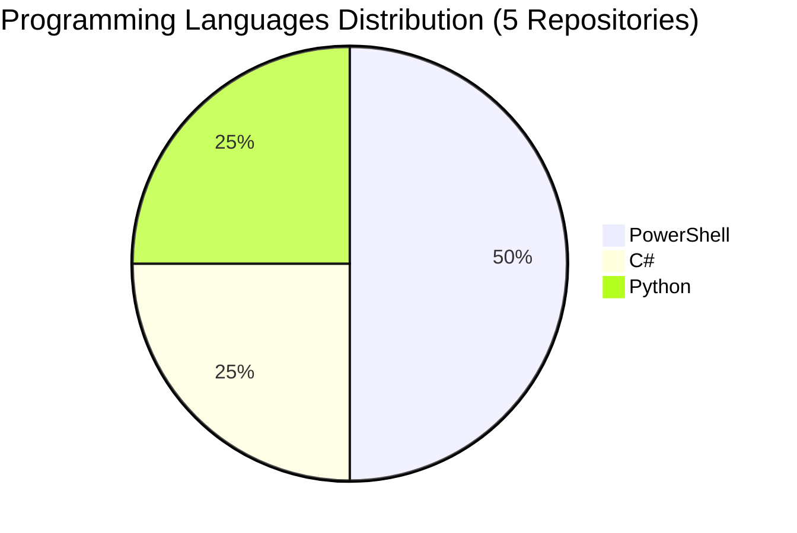

# 📁 Repository Portfolio

> **Last Updated**: October 16, 2025 at 11:11 AM UTC

> **Fabio Correa's GitHub Repository Collection**
> Comprehensive overview of 5 projects spanning AI research, academic tools, business intelligence, and cognitive architectures.
>
> **🏠 Original Work (4 repos)** | **🍴 Community Contributions (1 forks)** | **🔒 Private (3)** | **🌐 Public (2)**

---

### 🧠 Core Cognitive Architecture Suite

| Repository | Type | Visibility | Language | Description | Last Updated |
|------------|------|------------|----------|-------------|--------------|
| [**Alex-Cognitive-Architecture-Paper**](https://github.com/fabioc-aloha/Alex-Cognitive-Architecture-Paper) | 🏠 Original | 🔒 Private | PowerShell | Academic research paper documenting the Alex Cognitive Architecture framework, consciousness development, and Human-AI learning partnerships | Sep 23, 2025 |

### 📝 Academic & Research Tools

| Repository | Type | Visibility | Language | Description | Last Updated |
|------------|------|------------|----------|-------------|--------------|
| [**mdword**](https://github.com/fabioc-aloha/mdword) | 🏠 Original | 🔒 Private | C# | Windows app and CLI that convert Markdown projects to Word .docx with academic formatting, Mermaid/PlantUML/Graphviz diagrams, KaTeX math, and Microsoft Store packaging support. | Aug 14, 2025 |

### 🤖 AI & Machine Learning Projects

| Repository | Type | Visibility | Language | Description | Last Updated |
|------------|------|------------|----------|-------------|--------------|
| [**spec-kit**](https://github.com/fabioc-aloha/spec-kit) | 🍴 Fork | 🌟 Public | - | Toolkit to help you get started with Spec-Driven Development | Oct 06, 2025 |

### 🎵 Entertainment & Creative Projects

| Repository | Type | Visibility | Language | Description | Last Updated |
|------------|------|------------|----------|-------------|--------------|
| [**Spotify**](https://github.com/fabioc-aloha/Spotify) | 🏠 Original | 🔒 Private | Python | Professional Spotify playlist creation platform with AI-powered curation, therapeutic applications, and production-grade audio intelligence for DJs and music enthusiasts | Oct 02, 2025 |

### 🌟 Profile & Portfolio

| Repository | Type | Visibility | Language | Description | Last Updated |
|------------|------|------------|----------|-------------|--------------|
| [**fabioc-aloha**](https://github.com/fabioc-aloha/fabioc-aloha) | 🏠 Original | 🌟 Public | PowerShell | This portfolio automatically updates itself using a sophisticated PowerShell workflow that I developed to maintain professional presentation without manual intervention. | Oct 15, 2025 |

---

## 🏠 Original Work vs 🍴 Community Contributions

### **🏠 Original Repositories (4)**
These represent my **independent research, development, and innovation work**:
- **Core Cognitive Architectures**: Catalyst suite, Alex framework, NEWBORN system
- **Academic Tools**: MdWord, PaperCopilot, AI-Qualitative-Analysis
- **Business Intelligence**: Financial analysis, enterprise analytics, Microsoft integrations
- **Creative Projects**: Entertainment apps, development utilities, personal tools

### **🍴 Forked Repositories (1)**
These represent **learning, collaboration, and community contributions**:
- **AI/ML Research**: Exploring cutting-edge frameworks (agent-zero, chatterbox, omi)
- **Development Tools**: Contributing to open-source projects (mcpservers, Profile-Pic)
- **Educational Resources**: Learning from community tutorials (ai-agents-for-beginners)

**Philosophy**: Forks demonstrate active engagement with the AI/ML community while original work showcases independent innovation and research contributions.

## 📈 Language Distribution

### 💻 **Top Languages Summary**
- **PowerShell (40%)**: Primary language for 2 repositories
- **C# (20%)**: Primary language for 1 repositories
- **Python (20%)**: Primary language for 1 repositories

---

  <em>🚀 "Building the future of human-AI collaboration through ethical cognitive architectures" 🚀</em>

