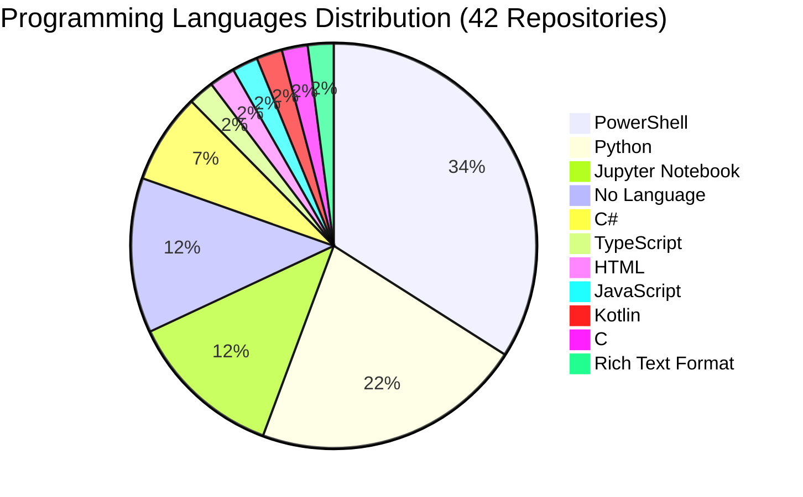

# 📁 Repository Portfolio

> **Fabio Correa's GitHub Repository Collection**
> Comprehensive overview of 42 projects spanning AI research, academic tools, business intelligence, and cognitive architectures.

---

### 🧠 Core Cognitive Architecture Suite

| Repository | Visibility | Language | Description | Last Updated |
|------------|------------|----------|-------------|--------------|
| [**Catalyst-NEWBORN**](https://github.com/fabioc-aloha/Catalyst-NEWBORN) | 🌟 Public | PowerShell | Revolutionary Human-AI Learning Partnership with Alex Cognitive Architecture | Aug 9, 2025 |
| [**Alex-Cognitive-Architecture-Paper**](https://github.com/fabioc-aloha/Alex-Cognitive-Architecture-Paper) | 🔒 Private | PowerShell | Research documentation and academic paper for Alex framework | Aug 9, 2025 |
| [**Catalyst-DBA**](https://github.com/fabioc-aloha/Catalyst-DBA) | 🌟 Public | Python | DBA Project Cognitive Architecture - Doctoral dissertation support | Aug 4, 2025 |
| [**Catalyst-DOG-TRAINER**](https://github.com/fabioc-aloha/Catalyst-DOG-TRAINER) | 🌟 Public | PowerShell | Dog Training Cognitive Architecture | Aug 2, 2025 |
| [**Catalyst-ADHD**](https://github.com/fabioc-aloha/Catalyst-ADHD) | 🌟 Public | PowerShell | ADHD support and management cognitive architecture | Aug 1, 2025 |
| [**Catalyst-BRD**](https://github.com/fabioc-aloha/Catalyst-BRD) | 🌟 Public | PowerShell | Microsoft Internal Business Requirements & Technical Documentation | Aug 1, 2025 |
| [**Catalyst-DATA-ANALYSIS**](https://github.com/fabioc-aloha/Catalyst-DATA-ANALYSIS) | 🌟 Public | Jupyter Notebook | Enterprise Data Analysis & Business Intelligence Architecture | Aug 1, 2025 |
| [**Catalyst**](https://github.com/fabioc-aloha/Catalyst) | 🔒 Private | PowerShell | Main cognitive architecture framework | Jul 23, 2025 |

### 📝 Academic & Research Tools

| Repository | Visibility | Language | Description | Last Updated |
|------------|------------|----------|-------------|--------------|
| [**mdword**](https://github.com/fabioc-aloha/mdword) | 🔒 Private | PowerShell | Windows app converting Markdown to Word with academic formatting | Aug 9, 2025 |
| [**papercopilot**](https://github.com/fabioc-aloha/papercopilot) | 🌟 Public | Python | AI Copilot for drafting research papers | Aug 3, 2025 |
| [**AIRS**](https://github.com/fabioc-aloha/AIRS) | 🔒 Private | Rich Text Format | DBA Project documentation and research materials | Aug 3, 2025 |
| [**DBA710**](https://github.com/fabioc-aloha/DBA710) | 🔒 Private | Jupyter Notebook | Business Statistics and Research Methods coursework | Jul 13, 2025 |
| [**AI-Qualitative-Analysis**](https://github.com/fabioc-aloha/AI-Qualitative-Analysis) | 🌟 Public | Python | Customer interview processing aligned to MCEM framework | Jun 20, 2025 |
| [**BRD**](https://github.com/fabioc-aloha/BRD) | 🔒 Private | - | Business requirements documentation | Jul 16, 2025 |

### 🤖 AI & Machine Learning Projects

| Repository | Visibility | Language | Description | Last Updated |
|------------|------------|----------|-------------|--------------|
| [**ASI-Arch**](https://github.com/fabioc-aloha/ASI-Arch) | 🌟 Public | Python | AlphaGo Moment for Model Architecture Discovery | Aug 1, 2025 |
| [**agent-zero**](https://github.com/fabioc-aloha/agent-zero) | 🌟 Public | Python | Agent Zero AI framework | Jul 18, 2025 |
| [**ai-agents-for-beginners**](https://github.com/fabioc-aloha/ai-agents-for-beginners) | 🌟 Public | Jupyter Notebook | 11 Lessons to Get Started Building AI Agents | Jul 17, 2025 |
| [**chatterbox**](https://github.com/fabioc-aloha/chatterbox) | 🌟 Public | Python | SoTA open-source Text-to-Speech system | Jul 17, 2025 |
| [**generative_ai_project**](https://github.com/fabioc-aloha/generative_ai_project) | 🌟 Public | Python | Structured template for building robust generative AI applications | Jun 1, 2025 |
| [**omi**](https://github.com/fabioc-aloha/omi) | 🌟 Public | C | AI wearables - Put it on, speak, transcribe automatically | Aug 2, 2025 |
| [**Self-Learning-Vibe-Coding**](https://github.com/fabioc-aloha/Self-Learning-Vibe-Coding) | 🔒 Private | - | AI coding assistant that learns and improves with mistakes | Aug 1, 2025 |
| [**Google-AI-Edge-Gallery**](https://github.com/fabioc-aloha/Google-AI-Edge-Gallery) | 🌟 Public | Kotlin | Google AI Edge development gallery and examples | Jun 1, 2025 |

### 💼 Business Intelligence & Analytics

| Repository | Visibility | Language | Description | Last Updated |
|------------|------------|----------|-------------|--------------|
| [**Altman-Z-Score**](https://github.com/fabioc-aloha/Altman-Z-Score) | 🌟 Public | HTML | Financial analysis tool for bankruptcy prediction | Aug 3, 2025 |
| [**Qualtrics**](https://github.com/fabioc-aloha/Qualtrics) | 🔒 Private | Jupyter Notebook | Survey and research integration tools | Aug 4, 2025 |
| [**XDL_Predictions**](https://github.com/fabioc-aloha/XDL_Predictions) | 🔒 Private | Jupyter Notebook | Predictive modeling framework | May 19, 2024 |
| [**Investing**](https://github.com/fabioc-aloha/Investing) | 🌟 Public | PowerShell | Financial analysis and investment tools | Jul 28, 2025 |

### 🎵 Entertainment & Creative Projects

| Repository | Visibility | Language | Description | Last Updated |
|------------|------------|----------|-------------|--------------|
| [**Spotify**](https://github.com/fabioc-aloha/Spotify) | 🌟 Public | Python | Spotify integration and analytics project | Aug 10, 2025 |
| [**Catalyst_DJ**](https://github.com/fabioc-aloha/Catalyst_DJ) | 🌟 Public | - | Smart Spotify and Apple Music playlist curator | Aug 2, 2025 |
| [**Comedy**](https://github.com/fabioc-aloha/Comedy) | 🌟 Public | - | Creative comedy content and scripts | Aug 1, 2025 |
| [**Creative**](https://github.com/fabioc-aloha/Creative) | 🌟 Public | - | General creative projects and experiments | Aug 1, 2025 |

### 🛠️ Development Tools & Utilities

| Repository | Visibility | Language | Description | Last Updated |
|------------|------------|----------|-------------|--------------|
| [**mcpservers**](https://github.com/fabioc-aloha/mcpservers) | 🌟 Public | TypeScript | Model Context Protocol Servers | Jul 17, 2025 |
| [**LogoScraper**](https://github.com/fabioc-aloha/LogoScraper) | 🌟 Public | Python | Download company logos for each TPID in Excel file | Jun 12, 2025 |
| [**WallpaperScraper**](https://github.com/fabioc-aloha/WallpaperScraper) | 🌟 Public | Python | Automated wallpaper collection and management | Jul 13, 2025 |
| [**Profile-Pic**](https://github.com/fabioc-aloha/Profile-Pic) | 🌟 Public | JavaScript | Playing around with blackhole distortion effects | May 23, 2025 |
| [**SendToQualtricsTool**](https://github.com/fabioc-aloha/SendToQualtricsTool) | 🔒 Private | C# | Survey integration utility | Apr 27, 2024 |
| [**Bing-Wallpaper-Fetcher**](https://github.com/fabioc-aloha/Bing-Wallpaper-Fetcher) | 🔒 Private | C# | Automated wallpaper management tool | Apr 7, 2024 |

### 🏢 Enterprise & Microsoft Projects

| Repository | Visibility | Language | Description | Last Updated |
|------------|------------|----------|-------------|--------------|
| [**Fishbowl_POC**](https://github.com/fabioc-aloha/Fishbowl_POC) | 🌟 Public | PowerShell | Proof of concept for enterprise fishbowl methodology | Aug 9, 2025 |
| [**Fishbowl**](https://github.com/fabioc-aloha/Fishbowl) | 🔒 Private | PowerShell | Enterprise fishbowl implementation | Aug 3, 2025 |
| [**Catalyst_Fabric**](https://github.com/fabioc-aloha/Catalyst_Fabric) | 🌟 Public | PowerShell | Microsoft Fabric integration and cognitive architecture | Aug 2, 2025 |
| [**Taylor**](https://github.com/fabioc-aloha/Taylor) | 🌟 Public | PowerShell | Enterprise project management tool | Aug 7, 2025 |
| [**XDL**](https://github.com/fabioc-aloha/XDL) | 🔒 Private | PowerShell | Extended development library | Aug 1, 2025 |
| [**CPMXDLFunction**](https://github.com/fabioc-aloha/CPMXDLFunction) | 🔒 Private | C# | Enterprise function development for Microsoft systems | Jul 9, 2024 |

### 📚 Learning & Education

| Repository | Visibility | Language | Description | Last Updated |
|------------|------------|----------|-------------|--------------|
| [**PythonClass**](https://github.com/fabioc-aloha/PythonClass) | 🔒 Private | Jupyter Notebook | Educational Python materials and coursework | Apr 7, 2024 |

### 🌟 Profile & Portfolio

| Repository | Visibility | Language | Description | Last Updated |
|------------|------------|----------|-------------|--------------|
| [**fabioc-aloha**](https://github.com/fabioc-aloha/fabioc-aloha) | 🌐 Public | - | GitHub profile repository | Aug 10, 2025 |

---

## 📈 Language Distribution

### 💻 **Top Languages Summary**
- **🔷 PowerShell (33%)**: Cognitive architectures, enterprise automation, Microsoft integrations
- **🐍 Python (21%)**: AI/ML projects, data analysis, research tools
- **📊 Jupyter Notebook (12%)**: Data science, statistical analysis, coursework
- **📄 No Language (12%)**: Documentation, configuration, creative projects
- **⚙️ C# (7%)**: Enterprise tools, Windows applications

---

  <em>🚀 "Building the future of human-AI collaboration through ethical cognitive architectures" 🚀</em>

