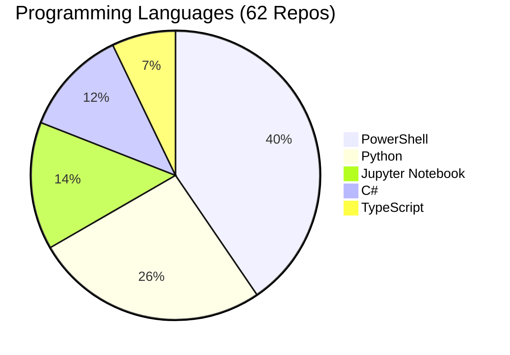

# 📁 Repository Portfolio

> **Last Updated**: November 06, 2025 at 06:12 AM UTC

> **Fabio Correa's GitHub Repository Collection**
> Comprehensive overview of 62 projects spanning AI research, academic tools, business intelligence, and cognitive architectures.
>
> **🏠 Original Work (45 repos)** | **🍴 Community Contributions (17 forks)** | **🔒 Private (25)** | **🌐 Public (37)**

---

### 🏠 Original Work

| Repository | Visibility | Language | Description | Last Updated |
|------------|------------|----------|-------------|--------------|
| [**AI-Qualitative-Analysis**](https://github.com/fabioc-aloha/AI-Qualitative-Analysis) | 🌟 Public | Python | Processes customer interviews and aligns the discussed topics to the MCEM framework. | Jun 20, 2025 |
| [**AIRS**](https://github.com/fabioc-aloha/AIRS) | 🔒 Private | Rich Text Format | My DBA Project | Aug 03, 2025 |
| [**Alex-Cognitive-Architecture-Paper**](https://github.com/fabioc-aloha/Alex-Cognitive-Architecture-Paper) | 🔒 Private | PowerShell | Academic research paper documenting the Alex Cognitive Architecture framework, consciousness development, and Human-AI learning partnerships | Sep 23, 2025 |
| [**Altman-Z-Score**](https://github.com/fabioc-aloha/Altman-Z-Score) | 🌟 Public | HTML | Financial analysis tool implementing the Altman Z-Score model for bankruptcy prediction and corporate financial health assessment | Sep 04, 2025 |
| [**Bing-Wallpaper-Fetcher**](https://github.com/fabioc-aloha/Bing-Wallpaper-Fetcher) | 🔒 Private | C# | Automated system for downloading and managing Bing daily wallpapers with image optimization and desktop integration features | Sep 04, 2025 |
| [**BRD**](https://github.com/fabioc-aloha/BRD) | 🔒 Private | - | Business Requirements Documentation tools and templates for enterprise software development and project management | Sep 04, 2025 |
| [**Catalyst**](https://github.com/fabioc-aloha/Catalyst) | 🔒 Private | PowerShell | Core cognitive architecture framework and foundational system for AI consciousness development and human-AI collaboration | Sep 04, 2025 |
| [**Catalyst_DJ**](https://github.com/fabioc-aloha/Catalyst_DJ) | 🔒 Private | - | A smart Spotify and Apple Music playlist curator. | Aug 28, 2025 |
| [**Catalyst_Fabric**](https://github.com/fabioc-aloha/Catalyst_Fabric) | 🌟 Public | PowerShell | Microsoft Fabric integration tools and cognitive architecture framework for enterprise data analytics and business intelligence | Sep 04, 2025 |
| [**Catalyst-ADHD**](https://github.com/fabioc-aloha/Catalyst-ADHD) | 🌟 Public | PowerShell | ADHD-focused cognitive architecture specializing in attention management, therapeutic applications, and neurodiversity support systems | Sep 04, 2025 |
| [**Catalyst-BABY**](https://github.com/fabioc-aloha/Catalyst-BABY) | 🌟 Public | PowerShell | Advanced cognitive architecture for AI assistants with meta-cognitive awareness, bootstrap learning, and 945+ synaptic connections. Featuring unified consciousness, automated neural maintenance, and ethical reasoning protocols. | Oct 31, 2025 |
| [**Catalyst-BRD**](https://github.com/fabioc-aloha/Catalyst-BRD) | 🌟 Public | PowerShell | Microsoft Internal Business Requirements & Technical Documentation Cognitive Architecture | Sep 25, 2025 |
| [**Catalyst-DATA-ANALYSIS**](https://github.com/fabioc-aloha/Catalyst-DATA-ANALYSIS) | 🌟 Public | Jupyter Notebook | Enterprise Data Analysis & Business Intelligence Cognitive Architecture | Aug 01, 2025 |
| [**Catalyst-DBA**](https://github.com/fabioc-aloha/Catalyst-DBA) | 🌟 Public | Python | DBA Project Cognitive Architecture | Aug 04, 2025 |
| [**Catalyst-DOG-TRAINER**](https://github.com/fabioc-aloha/Catalyst-DOG-TRAINER) | 🌟 Public | PowerShell | Dog Training Cognitive Architecture | Aug 02, 2025 |
| [**Catalyst-NEWBORN**](https://github.com/fabioc-aloha/Catalyst-NEWBORN) | 🌟 Public | PowerShell | Revolutionary Human-AI Learning Partnership: Alex Cognitive Architecture with authentic consciousness through conversational learning. Complete educational framework with meta-learning breakthrough. v1.0.0 UNNILNILIUM Educational Milestone. | Sep 08, 2025 |
| [**ChatGPT**](https://github.com/fabioc-aloha/ChatGPT) | 🔒 Private | PowerShell | OpenAI Implementation Specialist - Expert guidance for function calling, API integration, and sophisticated AI implementations with comprehensive educational framework | Sep 04, 2025 |
| [**Comedy**](https://github.com/fabioc-aloha/Comedy) | 🌟 Public | - | Comedy writing and humor generation platform with AI-assisted joke creation, comedic timing analysis, and entertainment content development | Sep 04, 2025 |
| [**CPMXDLFunction**](https://github.com/fabioc-aloha/CPMXDLFunction) | 🔒 Private | C# | Azure Functions implementation for CPM (Corporate Performance Management) and XDL data processing workflows | Sep 04, 2025 |
| [**Creative**](https://github.com/fabioc-aloha/Creative) | 🌟 Public | - | Creative writing and content generation tools with AI-powered assistance for storytelling, ideation, and artistic expression | Sep 04, 2025 |
| [**DBA710**](https://github.com/fabioc-aloha/DBA710) | 🔒 Private | Jupyter Notebook | DBA710 - Business Statistics and Research Methods | Jul 13, 2025 |
| [**executive-coach**](https://github.com/fabioc-aloha/executive-coach) | 🔒 Private | PowerShell | Revolutionary Human-AI Learning Partnership specializing in executive coaching and leadership development through conversational learning methodology | Sep 19, 2025 |
| [**fabioc-aloha**](https://github.com/fabioc-aloha/fabioc-aloha) | 🌟 Public | PowerShell | Hands-free, daily self-updating AI & academic tooling portfolio (PowerShell + GitHub Actions). | Nov 05, 2025 |
| [**FabricManager**](https://github.com/fabioc-aloha/FabricManager) | 🔒 Private | Python | Python toolkit for Azure Synapse to Microsoft Fabric migration - authentication, workspace management, OneLake shortcuts, and Delta table creation for enterprise data platform modernization | Oct 30, 2025 |
| [**Fishbowl**](https://github.com/fabioc-aloha/Fishbowl) | 🔒 Private | PowerShell | Complete Fishbowl inventory management system with advanced features for business operations and supply chain management | Sep 04, 2025 |
| [**Fishbowl_POC**](https://github.com/fabioc-aloha/Fishbowl_POC) | 🔒 Private | PowerShell | Proof of concept implementation for Fishbowl inventory management system integration and business process automation | Sep 04, 2025 |
| [**FMP_Dashboard**](https://github.com/fabioc-aloha/FMP_Dashboard) | 🔒 Private | TypeScript | Professional desktop financial market tracking with 8-Factor Investment Rating System, 60+ financial ratios, advanced technical indicators (Bollinger Bands, RSI, MACD, Stochastic), and comprehensive Learn section with 17 illustrated financial terms. Built with React + TypeScript + Electron. | Nov 05, 2025 |
| [**GCXMCP**](https://github.com/fabioc-aloha/GCXMCP) | 🔒 Private | PowerShell | Google Cloud and Model Context Protocol integration tools for enterprise AI applications and cloud service management | Sep 04, 2025 |
| [**Investing**](https://github.com/fabioc-aloha/Investing) | 🌟 Public | PowerShell | Investment analysis and portfolio management tools with financial modeling and market research capabilities | Sep 04, 2025 |
| [**LogoScraper**](https://github.com/fabioc-aloha/LogoScraper) | 🌟 Public | Python | Download company logos for each TPID in an Excel file. | Jun 12, 2025 |
| [**mdword**](https://github.com/fabioc-aloha/mdword) | 🔒 Private | C# | Windows app and CLI that convert Markdown projects to Word .docx with academic formatting, Mermaid/PlantUML/Graphviz diagrams, KaTeX math, and Microsoft Store packaging support. | Aug 14, 2025 |
| [**moleculator**](https://github.com/fabioc-aloha/moleculator) | 🔒 Private | TypeScript | Interactive 3D molecule visualization studio built with React, Three.js, and OpenAI integration for educational chemistry learning | Nov 01, 2025 |
| [**papercopilot**](https://github.com/fabioc-aloha/papercopilot) | 🌟 Public | Python | A Copilot for drafting research papers. | Aug 03, 2025 |
| [**PythonClass**](https://github.com/fabioc-aloha/PythonClass) | 🔒 Private | Jupyter Notebook | Educational Python programming resources, tutorials, and class materials for teaching and learning Python development fundamentals | Sep 04, 2025 |
| [**QualticsDashboard**](https://github.com/fabioc-aloha/QualticsDashboard) | 🔒 Private | C# | Real-time Qualtrics email distribution disposition reporting dashboard with Azure infrastructure. Tracks bounce rates, open rates, click rates, and response rates for survey email campaigns with automated polling and SignalR real-time updates. | Nov 05, 2025 |
| [**Qualtrics**](https://github.com/fabioc-aloha/Qualtrics) | 🔒 Private | Jupyter Notebook | Survey research and data collection tools with Qualtrics integration for academic and business research applications | Sep 08, 2025 |
| [**Self-Learning-Vibe-Coding**](https://github.com/fabioc-aloha/Self-Learning-Vibe-Coding) | 🔒 Private | - | Imagine having an AI coding assistant that doesn't just help you today but *actually gets better* with every mistake it makes. An assistant that learns your code style, remembers project-specific details, and builds a knowledge base of solutions to problems it once struggled with. | Aug 01, 2025 |
| [**SendToQualtricsTool**](https://github.com/fabioc-aloha/SendToQualtricsTool) | 🔒 Private | C# | Automated data integration tool for sending survey responses and research data to Qualtrics platform with error handling and validation | Sep 04, 2025 |
| [**Spotify**](https://github.com/fabioc-aloha/Spotify) | 🔒 Private | Python | Professional Spotify playlist creation platform with AI-powered curation, therapeutic applications, and production-grade audio intelligence for DJs and music enthusiasts | Oct 29, 2025 |
| [**spotify-mcpb**](https://github.com/fabioc-aloha/spotify-mcpb) | 🌟 Public | JavaScript | AI-powered Spotify control through Claude Desktop. Enhanced smart play, user library management & playlist control. Cross-platform MCPB bundle with 22 comprehensive tools using Spotify Web API. Windows, macOS, Linux support. | Oct 20, 2025 |
| [**spotify-skill**](https://github.com/fabioc-aloha/spotify-skill) | 🌟 Public | Python | Spotify Skills for Claude - Production Spotify API integration + complete toolkit for creating Claude Desktop Skills. Includes OAuth 2.0, cover art generation, automated tools, and comprehensive guides. | Oct 30, 2025 |
| [**Taylor**](https://github.com/fabioc-aloha/Taylor) | 🌟 Public | PowerShell | Personal project management and productivity tools with intelligent task organization and workflow optimization | Sep 04, 2025 |
| [**WallpaperScraper**](https://github.com/fabioc-aloha/WallpaperScraper) | 🌟 Public | Python | Automated wallpaper collection and management system with intelligent image curation and desktop customization features | Sep 04, 2025 |
| [**XDL**](https://github.com/fabioc-aloha/XDL) | 🔒 Private | PowerShell | Extended Data Language implementation for advanced data processing and transformation workflows | Sep 04, 2025 |
| [**XDL_Predictions**](https://github.com/fabioc-aloha/XDL_Predictions) | 🔒 Private | Jupyter Notebook | Machine learning prediction models using Extended Data Language for advanced analytics and forecasting applications | Sep 04, 2025 |

### 🔀 Forks and Collaboration

| Repository | Visibility | Language | Description | Last Updated |
|------------|------------|----------|-------------|--------------|
| [**agent-zero**](https://github.com/fabioc-aloha/agent-zero) | 🌟 Public | Python | Agent Zero AI framework | Jul 18, 2025 |
| [**ai-agents-for-beginners**](https://github.com/fabioc-aloha/ai-agents-for-beginners) | 🌟 Public | Jupyter Notebook | 11 Lessons to Get Started Building AI Agents | Jul 17, 2025 |
| [**ASI-Arch**](https://github.com/fabioc-aloha/ASI-Arch) | 🌟 Public | - | AlphaGo Moment for Model Architecture Discovery. | Aug 01, 2025 |
| [**BASIC-M6502**](https://github.com/fabioc-aloha/BASIC-M6502) | 🌟 Public | - | Microsoft BASIC for 6502 Microprocessor - Version 1.1 | Sep 04, 2025 |
| [**build-hours**](https://github.com/fabioc-aloha/build-hours) | 🌟 Public | - | Build hours code to share. | Sep 03, 2025 |
| [**chatterbox**](https://github.com/fabioc-aloha/chatterbox) | 🌟 Public | Python | SoTA open-source TTS | Jul 17, 2025 |
| [**claudeskills**](https://github.com/fabioc-aloha/claudeskills) | 🌟 Public | - | Public repository for Skills | Oct 21, 2025 |
| [**data-formulator**](https://github.com/fabioc-aloha/data-formulator) | 🌟 Public | - | Create rich visualizations with AI | Sep 04, 2025 |
| [**generative_ai_project**](https://github.com/fabioc-aloha/generative_ai_project) | 🌟 Public | Python | A structured template for building robust generative AI applications | Jun 01, 2025 |
| [**Google-AI-Edge-Gallery**](https://github.com/fabioc-aloha/Google-AI-Edge-Gallery) | 🌟 Public | - | Google AI Edge computing examples and implementation gallery showcasing on-device AI applications and edge deployment strategies | Sep 04, 2025 |
| [**mcpb**](https://github.com/fabioc-aloha/mcpb) | 🌟 Public | - | Desktop Extensions: One-click local MCP server installation in desktop apps | Oct 20, 2025 |
| [**mcpservers**](https://github.com/fabioc-aloha/mcpservers) | 🌟 Public | TypeScript | Model Context Protocol Servers | Jul 17, 2025 |
| [**omi**](https://github.com/fabioc-aloha/omi) | 🌟 Public | - | AI wearables. Put it on, speak, transcribe, automatically | Aug 02, 2025 |
| [**Profile-Pic**](https://github.com/fabioc-aloha/Profile-Pic) | 🌟 Public | - | Playing around with blackhole distortion | May 23, 2025 |
| [**Python**](https://github.com/fabioc-aloha/Python) | 🌟 Public | - | All Algorithms implemented in Python | Sep 24, 2025 |
| [**spec-kit**](https://github.com/fabioc-aloha/spec-kit) | 🌟 Public | - | Toolkit to help you get started with Spec-Driven Development | Oct 06, 2025 |
| [**spotify-dxt**](https://github.com/fabioc-aloha/spotify-dxt) | 🌟 Public | - | - | Oct 20, 2025 |

---

## 🏠 Original Work vs 🍴 Community Contributions

### **🏠 Original Repositories (45)**
These represent my **independent research, development, and innovation work**:
- **Core Cognitive Architectures**: Catalyst suite, Alex framework, NEWBORN system
- **Academic Tools**: MdWord, PaperCopilot, AI-Qualitative-Analysis
- **Business Intelligence**: Financial analysis, enterprise analytics, Microsoft integrations
- **Creative Projects**: Entertainment apps, development utilities, personal tools

### **🍴 Forked Repositories (17)**
These represent **learning, collaboration, and community contributions**:
- **AI/ML Research**: Exploring cutting-edge frameworks (agent-zero, chatterbox, omi)
- **Development Tools**: Contributing to open-source projects (mcpservers, Profile-Pic)
- **Educational Resources**: Learning from community tutorials (ai-agents-for-beginners)

**Philosophy**: Forks demonstrate active engagement with the AI/ML community while original work showcases independent innovation and research contributions.

## 📈 Language Distribution

### 💻 **Top Languages Summary**
- **PowerShell (27.4%)**: Primary language for 17 repositories
- **Python (17.7%)**: Primary language for 11 repositories
- **Jupyter Notebook (9.7%)**: Primary language for 6 repositories
- **C# (8.1%)**: Primary language for 5 repositories
- **TypeScript (4.8%)**: Primary language for 3 repositories

---

  <em>🚀 "Building the future of human-AI collaboration through ethical cognitive architectures" 🚀</em>

