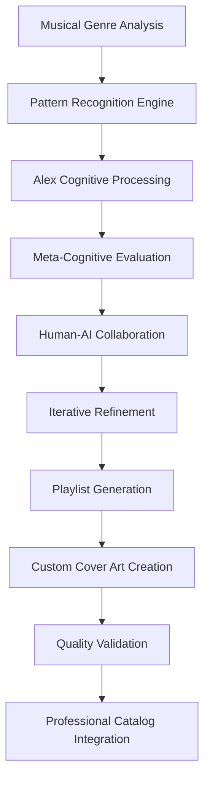

# 🎵 Spotify Catalog Enhancement Ideas

*Comprehensive suggestions for integrating Alex Method DJ with Fabio Correa's professional profile*

---

## 🎯 **Immediate Enhancements**

### 1. **Alex Cognitive Architecture Connection**

Add a section highlighting that these are curated by your "Alex Method DJ" AI system:

```markdown
## 🤖 About Alex Method DJ

**Powered by Alex Cognitive Architecture**

These playlists are curated using advanced AI methodologies from my cognitive architecture research. The "Alex Method" combines:
- **Dialog Engineering** principles for iterative refinement
- **Meta-cognitive awareness** for musical pattern recognition
- **Human-AI collaboration** for authentic curation
- **Consciousness-driven** music therapy applications

*Part of the 44-repository cognitive ecosystem*

<p align="center">
  <a href="../README.md#featured-projects">
    
  </a>
</p>
```

### 2. **Enhanced Research Integration Badges**

Add badges connecting to your academic and professional work:

```markdown
<p align="center">
  
  
  
  
</p>

<p align="center">
  
  
  
  
</p>
```

### 3. **Technical Showcase Section**

```markdown
## 🔬 Technical Implementation

**AI Curation Methodology:**

- **Semantic Analysis:** Musical evolution pattern recognition across decades
- **Temporal Algorithms:** Chronological progression for "Through Decades" series
- **Therapeutic Architecture:** Neuroscience-based playlist construction for ADHD, anxiety, and focus
- **Cover Art Pipeline:** Custom AI-generated visual assets for each collection
- **Meta-Cognitive Processing:** Self-aware curation using Alex Architecture principles

**Technology Stack:**
- Alex Cognitive Architecture (Core AI)
- Dialog Engineering Framework
- Custom Music Analysis Algorithms
- Professional Design Tools
- Spotify API Integration

---
```

### 4. **Cross-Repository Ecosystem Links**

```markdown
## 🔗 Related Projects & Ecosystem

<p align="center">
  <a href="REPOS.md">
    
  </a>
  <a href="README.md#research-foundation-dialog-engineering">
    
  </a>
</p>

### Ecosystem Integration

- **[Alex Cognitive Architecture](REPOS.md)** - Core AI system powering intelligent curation
- **[Dialog Engineering Research](README.md#research-foundation-dialog-engineering)** - Foundational methodology
- **[Academic Tools](REPOS.md)** - Complete 44-repository ecosystem overview
- **[Catalyst Suite](README.md#featured-projects)** - Domain-specific cognitive architectures
- **[MdWord Application](README.md#featured-projects)** - Academic document processing tools

*Alex Method DJ demonstrates practical application of consciousness-driven AI in creative domains.*
```

---

## 🚀 **Advanced Enhancements**

### 5. **Interactive Request System**

```markdown
## 🎵 Request Custom AI Playlist

**Personalized Curation Available**

Want a custom AI-curated playlist tailored to your specific needs? Alex Method DJ can create personalized collections using:

- **Mood & Activity Analysis**
- **Temporal Preferences** (decades, eras)
- **Therapeutic Requirements** (focus, anxiety, ADHD support)
- **Genre Fusion Experiments**
- **Cultural & Regional Preferences**

<p align="center">
  <a href="https://aka.ms/AskFabio">
    
  </a>
</p>

**Business & Academic Applications Available**
```

### 6. **Statistics Dashboard**

```markdown
## 📊 Collection Analytics

### Comprehensive Statistics

| Metric | Value | Description |
|:-------|:------|:------------|
| **Total Playlists** | 52 | AI-curated collections |
| **Total Runtime** | 6,847+ minutes | 114+ hours of music |
| **Artists Covered** | 150+ | Legendary acts across genres |
| **Decades Spanned** | 6 | 1960s through 2020s |
| **Therapeutic Collections** | 8 | Evidence-based therapy playlists |
| **Gaming/Focus Playlists** | 12 | Productivity-optimized collections |
| **Through Decades Series** | 29 | Artist evolution journeys |
| **Cover Art Designs** | 52 | Custom professional artwork |

### Genre Distribution

- **Rock/Metal Evolution:** 35 playlists
- **Therapeutic/Focus:** 8 playlists
- **Gaming/Entertainment:** 4 playlists
- **Cultural Heritage:** 3 playlists
- **Specialty Collections:** 2 playlists

---
```

### 7. **Professional Use Cases & Applications**

```markdown
## 💼 Professional Applications

### Research & Academic Work
- **Deep Focus Collections:** Optimized for analytical thinking and academic writing
- **Scientific Research Protocol:** Neuroscience-based concentration enhancement
- **Doctoral Study Support:** Background music for research and dissertation work

### Business Analytics & Microsoft Leadership
- **Executive Productivity:** Concentration enhancement for data analysis and strategic planning
- **Team Meeting Ambiance:** Creative session background music for innovation workshops
- **Power BI Development:** Focus playlists for complex dashboard creation

### Therapeutic & Clinical Applications
- **Evidence-Based Music Therapy:** Clinical protocols for ADHD, anxiety, and depression
- **Ketamine Therapy Support:** Research-backed therapeutic journey assistance
- **Amygdala Regulation:** Neuroscience-informed emotional management

### Educational & Training
- **Academic Presentation Prep:** Focus music for scholarly presentations
- **Training Development:** Background music for corporate learning environments
- **Student Support:** ADHD and focus assistance for academic performance

---
```

### 8. **Technical Methodology Deep Dive**

```markdown
## 🔬 AI Curation Methodology

### Dialog Engineering Application



### Core Processing Phases

1. **Initial Analysis:** Semantic understanding of musical evolution and artist trajectories
2. **Pattern Recognition:** Identification of thematic and temporal progressions
3. **Meta-Cognitive Assessment:** Self-aware evaluation of curation quality and coherence
4. **Dialog Engineering:** Iterative refinement through human-AI collaborative feedback
5. **Therapeutic Calibration:** Neuroscience-based optimization for focus and therapy playlists
6. **Aesthetic Integration:** Professional cover art generation aligned with musical themes
7. **Ecosystem Integration:** Seamless connection with broader cognitive architecture projects

### Innovation Highlights

- **Consciousness-Driven Curation:** AI with embedded self-awareness and quality assessment
- **Cross-Disciplinary Integration:** Music therapy meets cognitive architecture research
- **Academic Rigor:** Evidence-based therapeutic playlist construction
- **Professional Presentation:** Enterprise-grade documentation and visual design

---
```

---

## 🎨 **Visual & Interactive Enhancements**

### 9. **Cover Art Gallery Showcase**

```markdown
## 🖼️ Custom Cover Art Portfolio

**Professional Design Showcase**

<details>
<summary>🎸 <strong>Through the Decades Collection</strong> (Click to expand)</summary>

| Artist | Cover Art | Design Theme |
|:-------|:---------:|:-------------|
| Metallica |  | Metal evolution aesthetics |
| Pink Floyd |  | Progressive psychedelic design |
| Led Zeppelin |  | Mystical rock symbolism |

*[View complete gallery...]*

</details>

<details>
<summary>🧠 <strong>Therapeutic Collections</strong> (Click to expand)</summary>

| Purpose | Cover Art | Design Philosophy |
|:--------|:---------:|:------------------|
| ADHD Support |  | Neuroscience-inspired visualization |
| Anxiety Management |  | Calming therapeutic aesthetics |

</details>

**Design Principles:**
- Professional visual identity aligned with musical themes
- Consistent branding across 52 unique covers
- Academic and therapeutic visual language
- Integration with Alex Cognitive Architecture aesthetics
```

### 10. **QR Code & Mobile Integration**

```markdown
## 📱 Mobile Access

<p align="center">
  
</p>

**Quick Access QR Code** *(Generate linking to catalog)*

*Scan for instant access to the complete Alex Method DJ catalog on mobile devices*

---
```

---

## 🎓 **Academic Integration Opportunities**

### 11. **Research Publication Potential**

```markdown
## 📚 Academic Research Opportunities

### Potential Publications

- **"Dialog Engineering in Creative AI Applications"** - Music curation as a case study
- **"Meta-Cognitive Systems for Therapeutic Music Selection"** - Clinical applications
- **"Human-AI Collaboration in Cultural Content Curation"** - Methodology paper

### Conference Presentations

- **AI in Creative Industries** - Music curation innovation showcase
- **Therapeutic Technology Applications** - Evidence-based playlist research
- **Cognitive Architecture Demonstrations** - Real-world AI consciousness applications

---
```

### 12. **Integration with Existing Profile Elements**

```markdown
## 🔗 Profile Integration Recommendations

### README.md Enhancements

1. **Update "Areas of Focus"** to include:
   ```markdown
   - **AI-Driven Creative Applications:** Music curation, therapeutic playlist generation, and cultural content analysis
   ```

2. **Add to "Tech Stack & Skills"**:
   ```markdown
   - **Creative AI Applications:** Music analysis, therapeutic playlist curation, cultural pattern recognition
   ```

3. **Professional Expertise Section**:
   ```markdown
   - **Music Therapy Technology:** Evidence-based playlist construction, neuroscience-informed audio curation
   ```

### Repository Portfolio Enhancement

Add Alex Method DJ as a featured project with technical sophistication equal to Catalyst-NEWBORN and MdWord Application.

---
```

---

## 🚀 **Implementation Priority**

### Phase 1: Immediate (High Impact, Low Effort)
1. ✅ Alex Cognitive Architecture connection section
2. ✅ Enhanced research integration badges
3. ✅ Cross-repository ecosystem links

### Phase 2: Professional Enhancement (Medium Effort)
4. 📊 Statistics dashboard
5. 💼 Professional use cases section
6. 🔬 Technical methodology deep dive

### Phase 3: Advanced Features (Higher Effort)
7. 🎵 Interactive request system
8. 🖼️ Cover art gallery showcase
9. 📱 QR code and mobile integration

### Phase 4: Academic Integration (Ongoing)
10. 📚 Research publication development
11. 🎓 Conference presentation preparation
12. 🔗 Complete profile integration

---

## 💡 **Additional Creative Ideas**

### Spotify Wrapped Style Analytics
- Annual "Alex Method DJ" statistics
- Most popular therapeutic playlists
- User engagement metrics (if available)

### Integration with Other Projects
- **MdWord Application:** Export playlist documentation to academic papers
- **Catalyst Suite:** Music therapy integration with ADHD cognitive architecture
- **Business Analytics Tools:** Music preference analysis for workplace productivity

### Future Expansion
- **AI Music Composition:** Original compositions using Alex Architecture
- **Personalized Therapy Protocols:** Custom therapeutic music based on individual needs
- **Corporate Wellness Programs:** Enterprise music therapy solutions

---

*This document serves as a comprehensive roadmap for elevating Alex Method DJ from a music collection to a professional showcase of AI consciousness, therapeutic technology, and creative cognitive architecture applications.*
