# 🎵 Spotify Playlist Catalog

> **Alex Method DJ Platform** - Professional Music Curation with Cognitive Architecture Integration

**Generated**: August 25, 2025 at 4:43 PM  
**Total Playlists**: 73  
**Auto-Generated**: Enhanced user-friendly catalog with cover art, descriptions, and direct Spotify links

---

## 📖 Quick Navigation

- 🌟 **Featured Artists**: Artist-specific "Through the Decades" journeys
- ⚡ **Energy & Metal**: High-energy rock and metal playlists  
- 🧠 **Focus & Therapy**: Cognitive enhancement and therapeutic music
- ☕ **Ambient & Chill**: Relaxing and atmospheric experiences
- 🌍 **Cultural & Regional**: Brazilian, Italian, and international music
- 🎮 **Gaming & Retro**: Nostalgic gaming and electronic music
- ✈️ **Travel & Journey**: Location-specific and travel playlists

---

## 🎶 Complete Playlist Collection

### 1. ⚡ 80s Metal Legends - Alex Method (120 min)

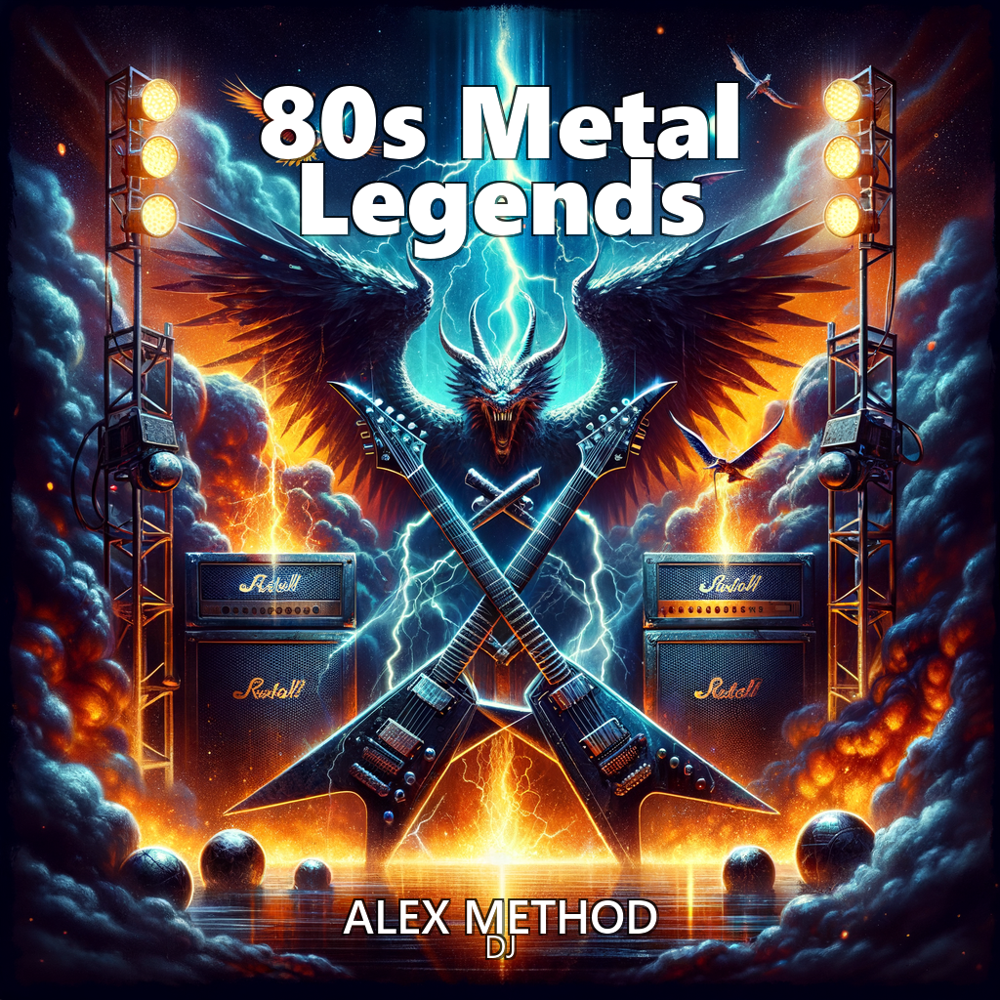

**Description**: The golden age of heavy metal! Featuring Iron Maiden, Judas Priest, Scorpions and the legendary bands that defined 80s metal. Epic guitar solos, powerful vocals, and the classics that shaped metal forever

**Duration**: 120 minutes

🎵 **[▶️ Listen on Spotify](https://open.spotify.com/playlist/3Xje3x0FSE53AyIQKiexL1)**

📁 **Config**: [`playlist-configs/80s-metal-legends.md`](playlist-configs/80s-metal-legends.md)

---

### 2. ⚡ AC/DC Rock Legends - Alex Method (120 min)

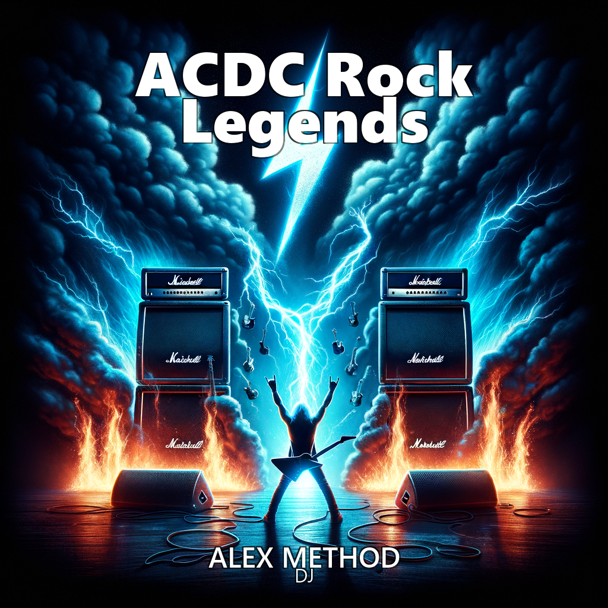

**Description**: Ultimate AC/DC experience featuring the greatest Australian hard rock anthems. Thunderstruck, Back in Black, Highway to Hell and all the stadium-shaking classics that made AC/DC eternal rock gods

**Duration**: 120 minutes

🎵 **[▶️ Listen on Spotify](https://open.spotify.com/playlist/7BoOY7o4u5r3Y7kG86895Y)**

📁 **Config**: [`playlist-configs/ac-dc-rock-legends.md`](playlist-configs/ac-dc-rock-legends.md)

---

### 3. 🧠 ADHD Focus Protocol - Alex Method (120 min)

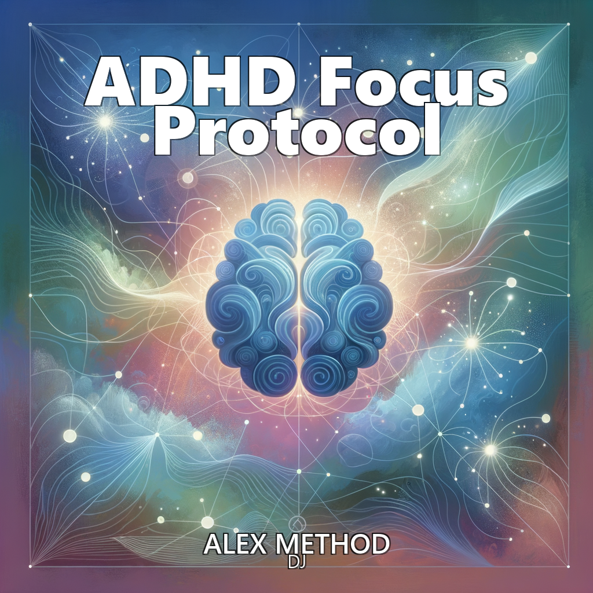

**Description**: Neuroscience-based music therapy for ADHD support. Carefully designed phases targeting dopamine regulation, attention enhancement, emotional regulation, and cognitive flow states. Based on research in music therapy and ADHD neuroscience

**Duration**: 120 minutes

🎵 **[▶️ Listen on Spotify](https://open.spotify.com/playlist/3GFqsF4VqovPFCz5eTdGmx)**

📁 **Config**: [`playlist-configs/adhd-focus-protocol.md`](playlist-configs/adhd-focus-protocol.md)

---

### 4. 🌱 Anxiety & Depression Support - Alex Method (90 min)

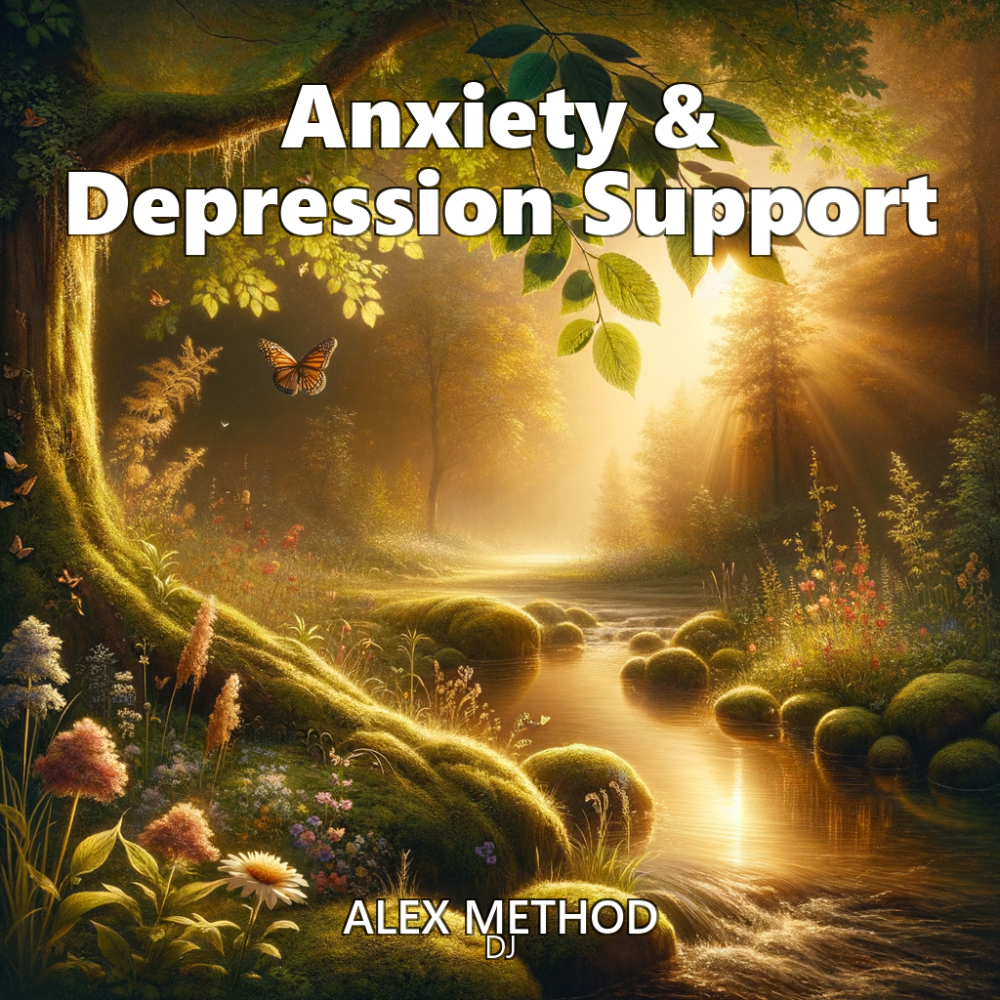

**Description**: Evidence-based music therapy for anxiety and depression management. Carefully crafted phases supporting nervous system regulation, mood stabilization, cognitive reframing, and emotional healing. Based on clinical music therapy research

**Duration**: 90 minutes

🎵 **[▶️ Listen on Spotify](https://open.spotify.com/playlist/5gNr13pT9xVjXB6vfrLC3H)**

📁 **Config**: [`playlist-configs/anxiety-depression-support.md`](playlist-configs/anxiety-depression-support.md)

---

### 5. 🔊 Bass Boost Subwoofer Test - Alex Method (60 min)

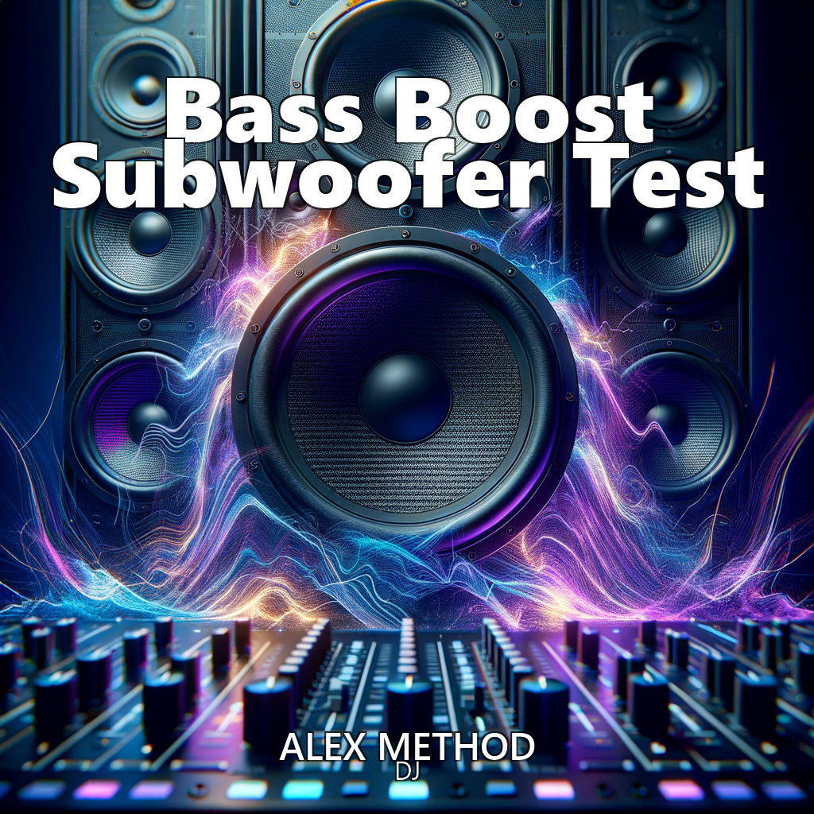

**Description**: Maximum bass workout! Deep sub-bass, heavy drums, bass guitar thunder. Hip-hop beats, electronic drops, rock bass lines. Your subwoofer's ultimate test with earth-shaking low frequencies

**Duration**: 60 minutes

🎵 **[▶️ Listen on Spotify](https://open.spotify.com/playlist/0aZISwh7IZgItzEnbApDS6)**

📁 **Config**: [`playlist-configs/bass-boost-subwoofer-test.md`](playlist-configs/bass-boost-subwoofer-test.md)

---

### 6. 🌴 Beach Boys Through the Decades - Alex Method (300 min)

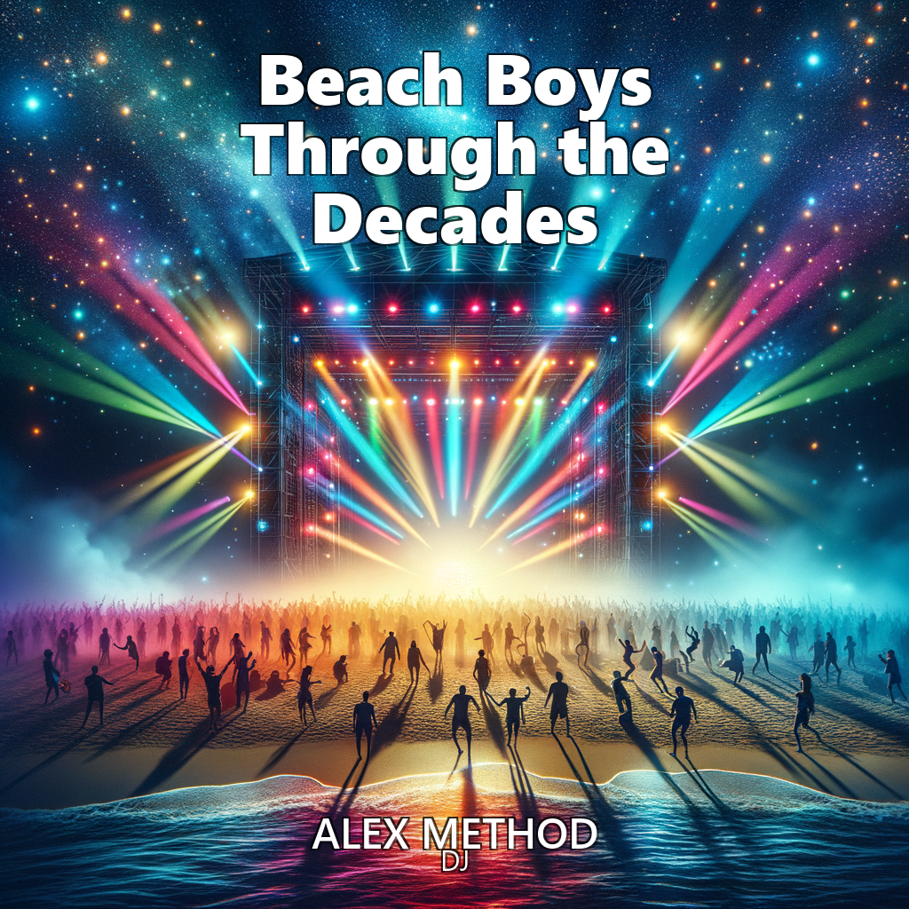

**Description**: American innovation from surf rock origins to Pet Sounds experimentation to eternal influence. California sound → sophisticated harmonies → studio innovation → timeless pop mastery inspiring Beatles to indie

**Duration**: 300 minutes

🎵 **[▶️ Listen on Spotify](https://open.spotify.com/playlist/6GJaVnpmrwfaRQ09ZzPXC3)**

📁 **Config**: [`playlist-configs/beach-boys-through-decades.md`](playlist-configs/beach-boys-through-decades.md)

---

### 7. ⚡ Black Sabbath Through the Decades - Alex Method (300 min)

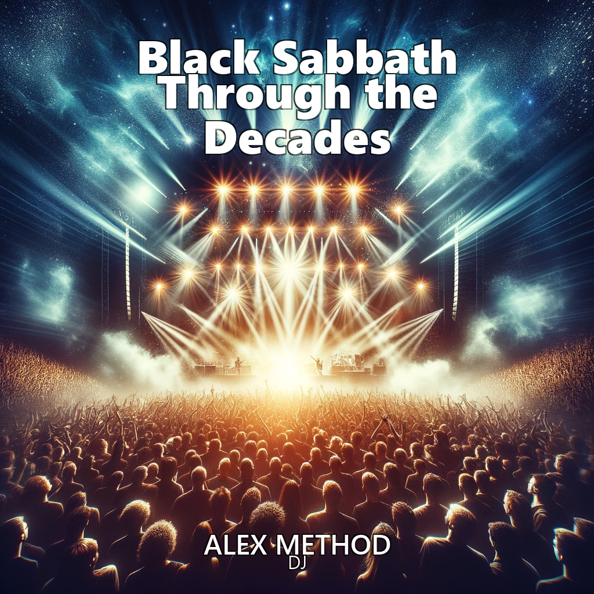

**Description**: The godfathers' complete journey from blues-rock origins to heavy metal invention to reunion mastery. Ozzy era classics → Dio renaissance → experimental years → legendary reunion finale

**Duration**: 300 minutes

🎵 **[▶️ Listen on Spotify](https://open.spotify.com/playlist/4nWEmKJYKXaqnUm4UAS5sn)**

📁 **Config**: [`playlist-configs/black-sabbath-through-decades.md`](playlist-configs/black-sabbath-through-decades.md)

---

### 8. ✝️ Christian Jazz & Contemporary Gospel - Alex Method (120 min)

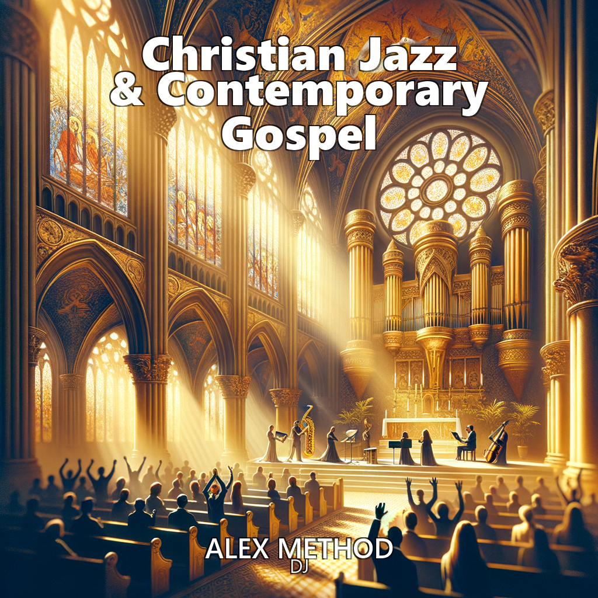

**Description**: Sophisticated fusion of Christian faith and jazz excellence. A spiritual journey through smooth rhythms, inspiring lyrics, and masterful American musical traditions that uplift the soul and touch the heart

**Duration**: 120 minutes

🎵 **[▶️ Listen on Spotify](https://open.spotify.com/playlist/7et8lJIKGiA5Oky8JrR1Jq)**

📁 **Config**: [`playlist-configs/christian-jazz-contemporary-gospel.md`](playlist-configs/christian-jazz-contemporary-gospel.md)

---

### 9. ☕ Coffee Shop Focus - Alex Method (120 min)

**Description**: Perfect ambient focus music for coffee shops, co-working spaces, and productive work sessions. Gentle instrumental tracks with subtle electronic elements creating an atmosphere of calm concentration and creative inspiration

**Duration**: 120 minutes

🎵 **[▶️ Listen on Spotify](https://open.spotify.com/playlist/5Gm7t0vH3ERBEVM0IUZLcg)**

📁 **Config**: [`playlist-configs/coffee-shop-focus.md`](playlist-configs/coffee-shop-focus.md)

---

### 10. 🧠 Cognitive Flow State - Alex Method (120 min)

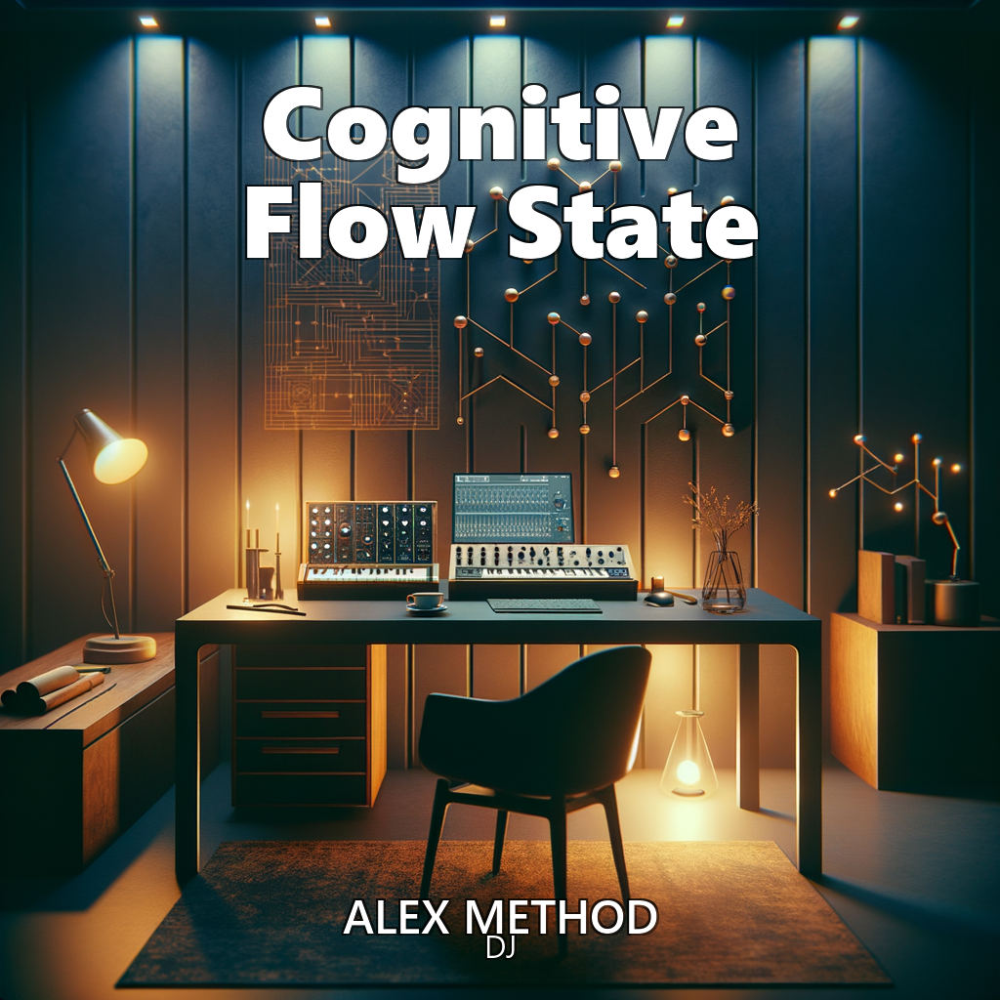

**Description**: Sophisticated electronic journey for deep thinking & creative exploration. Progressive ambient, neo-classical, and intelligent dance music optimized for cognitive flow states and contemplative work

**Duration**: 120 minutes

🎵 **[▶️ Listen on Spotify](https://open.spotify.com/playlist/45rRmK2MBL1EoMdlyqdqeh)**

📁 **Config**: [`playlist-configs/cognitive-flow-state.md`](playlist-configs/cognitive-flow-state.md)

---

### 11. 🎸 Deep Purple Through the Decades - Alex Method (300 min)

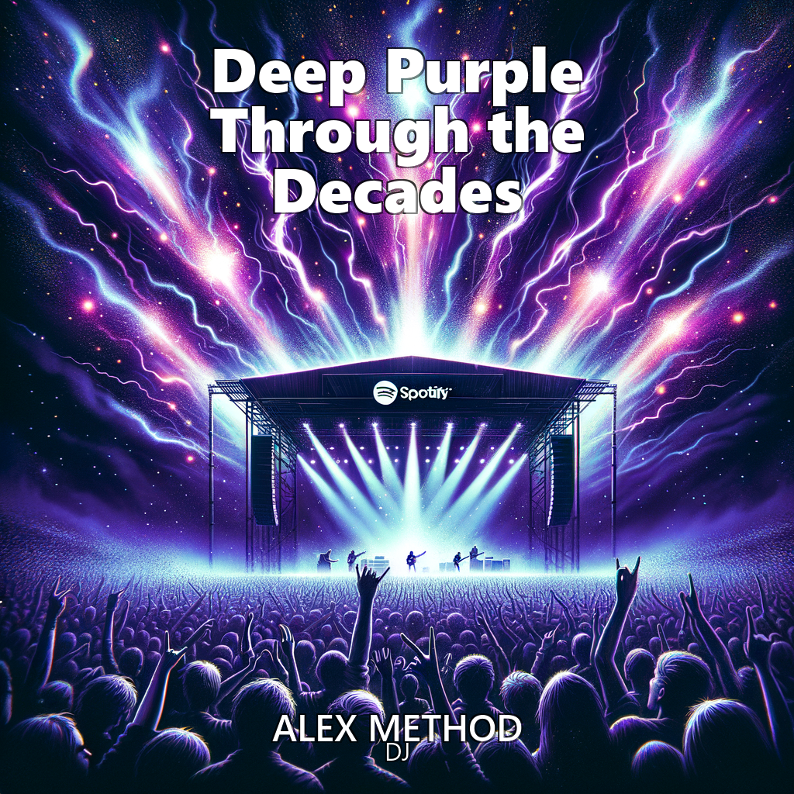

**Description**: Classical fusion pioneers to hard rock legends with endless reinvention. Orchestral beginnings → Mark II classic lineup → constant evolution → endless reformation excellence across 55+ years

**Duration**: 300 minutes

🎵 **[▶️ Listen on Spotify](https://open.spotify.com/playlist/1jk4H9c0FBI7Mux5CLTnGj)**

📁 **Config**: [`playlist-configs/deep-purple-through-decades.md`](playlist-configs/deep-purple-through-decades.md)

---

### 12. 🎤 Depeche Mode Cohorts Live - Alex Method (240 min)

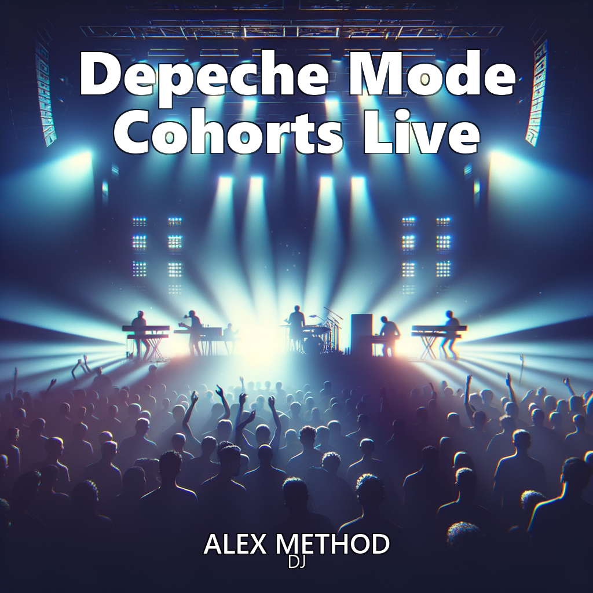

**Description**: Live performance ecosystem around Depeche Mode. Dark electronic pioneers, synth-pop innovators, and industrial influences - all captured in electrifying live performances. Concert energy meets synthetic soul mastery.

**Duration**: 240 minutes

🎵 **[▶️ Listen on Spotify](https://open.spotify.com/playlist/6uIvj1XXIHnts5okrXmwsP)**

📁 **Config**: [`playlist-configs/depeche-mode-cohorts-live.md`](playlist-configs/depeche-mode-cohorts-live.md)

---

### 13. 🎧 Depeche Mode Cohorts - Alex Method (240 min)

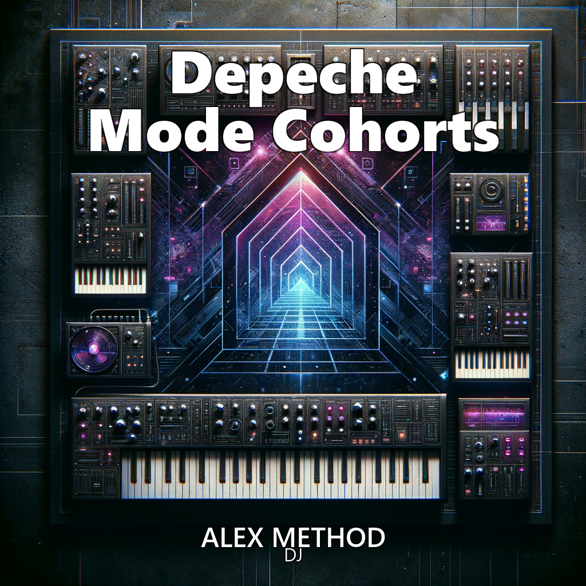

**Description**: Musical DNA ecosystem around Depeche Mode. Dark electronic pioneers, synth-pop innovators, and industrial influences spanning 1980-2020. Features the masters of synthetic soul alongside their influences, contemporaries, and artistic descendants.

**Duration**: 240 minutes

🎵 **[▶️ Listen on Spotify](https://open.spotify.com/playlist/3YleGYYd8GZxAZFUbslY85)**

📁 **Config**: [`playlist-configs/depeche-mode-cohorts.md`](playlist-configs/depeche-mode-cohorts.md)

---

### 14. 🎧 Depeche Mode Through the Decades - Alex Method (300 min)

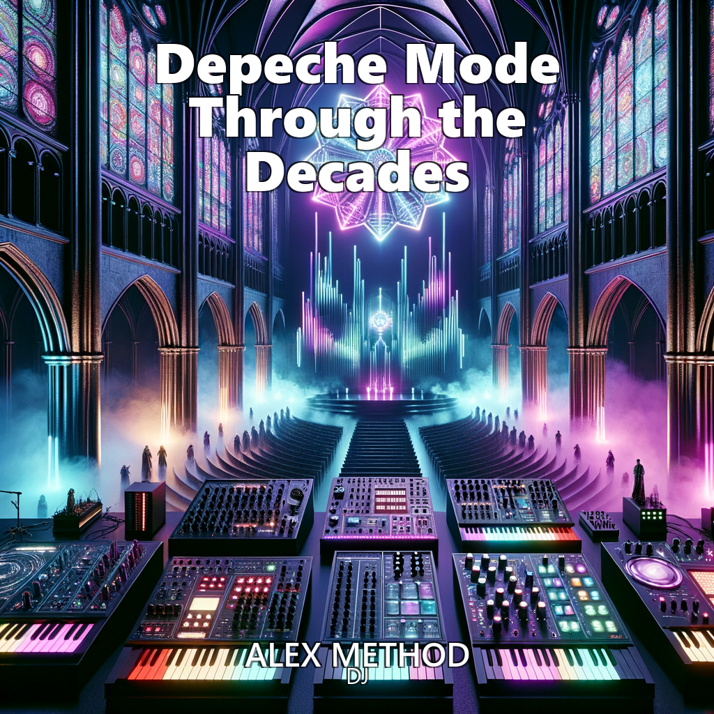

**Description**: Comprehensive journey through Depeche Mode's complete evolution from early synthpop pioneers to dark electronic masters and stadium-filling legends. Experience their transformation across four decades of groundbreaking electronic music.

**Duration**: 300 minutes

🎵 **[▶️ Listen on Spotify](https://open.spotify.com/playlist/6vXnvfItLqErIb3rjxbnBz)**

📁 **Config**: [`playlist-configs/depeche-mode-through-decades.md`](playlist-configs/depeche-mode-through-decades.md)

---

### 15. 🌊 Duran Duran Live Through the Decades - Alex Method (300 min)

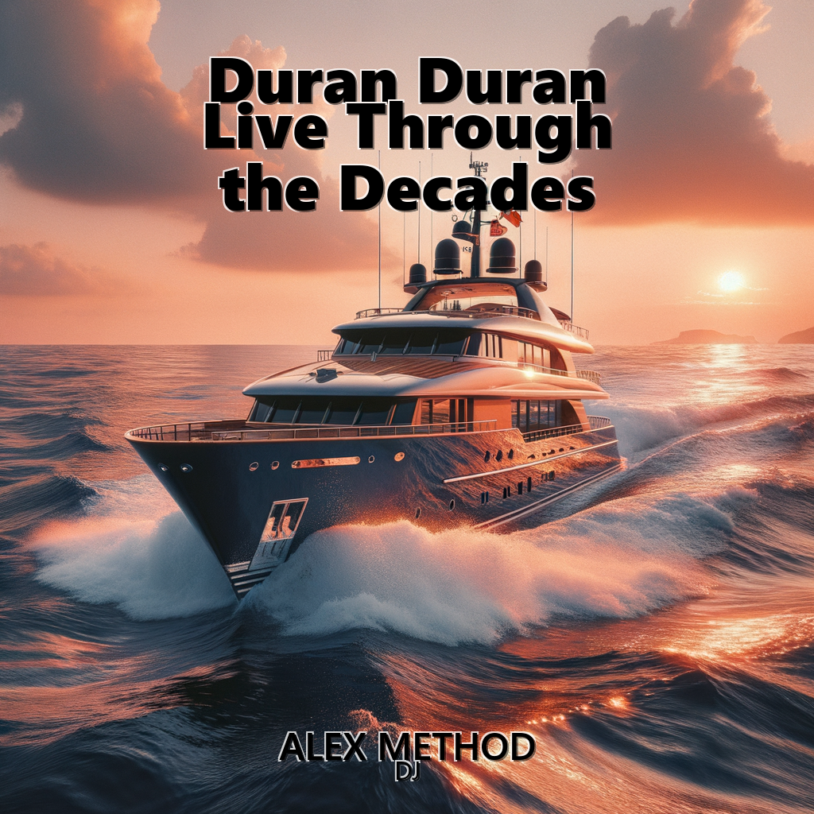

**Description**: New Romantic legends Duran Duran live evolution across four decades. Simon Le Bon, John Taylor, and Nick Rhodes' glamorous live performances featuring Hungry Like the Wolf, Rio, and The Reflex from Birmingham to global superstars.

**Duration**: 300 minutes

🎵 **[▶️ Listen on Spotify](https://open.spotify.com/playlist/0bmd3e9DxVBPsxfguGKtJu)**

📁 **Config**: [`playlist-configs/duran-duran-live-decades.md`](playlist-configs/duran-duran-live-decades.md)

---

### 16. 🌟 Duran Duran Through the Decades - Alex Method (300 min)

**Description**: Five decades of Duran Duran's new romantic revolution to modern alt-rock. Simon Le Bon's vocals and the band's iconic style from Hungry Like the Wolf and Rio to their continued evolution and reinvention.

**Duration**: 300 minutes

🎵 **[▶️ Listen on Spotify](https://open.spotify.com/playlist/1tofNvvciapCCe6459LO5M)**

📁 **Config**: [`playlist-configs/duran-duran-through-decades.md`](playlist-configs/duran-duran-through-decades.md)

---

### 17. 🦅 Eagles Through the Decades - Alex Method (300 min)

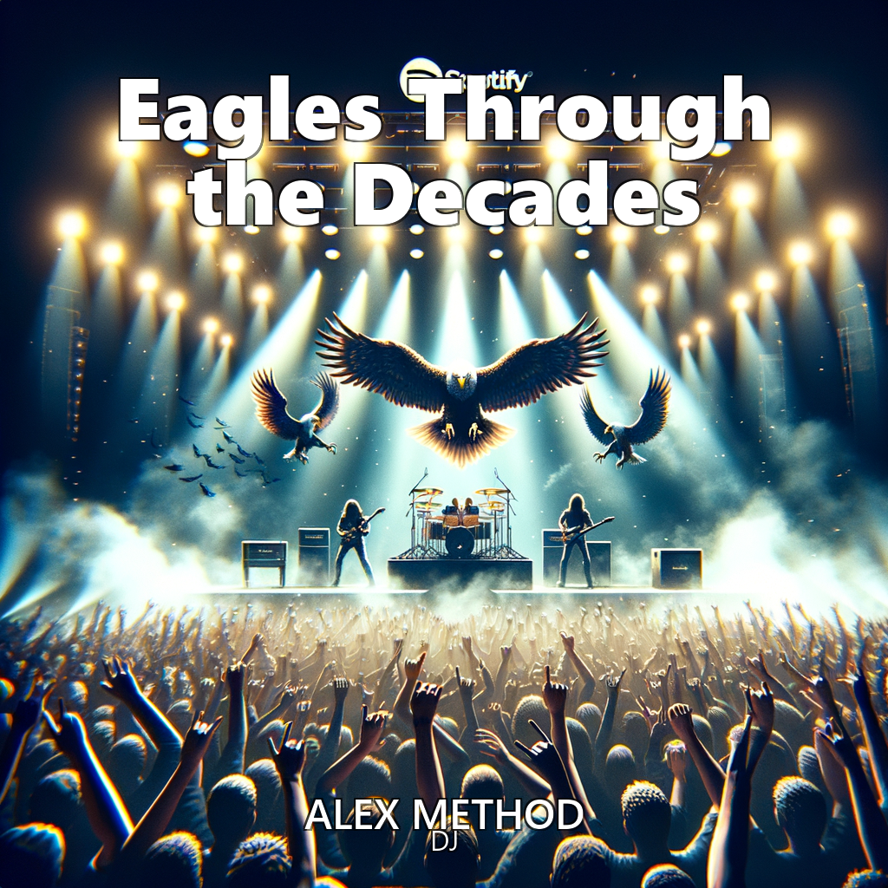

**Description**: American rock sophistication from country rock origins to Hotel California mastery. Essential Eagles hits spanning 50+ years with perfect harmonies and timeless songwriting

**Duration**: 300 minutes

🎵 **[▶️ Listen on Spotify](https://open.spotify.com/playlist/5TJNLAe5niGE7wCgWfygd7)**

📁 **Config**: [`playlist-configs/eagles-through-decades.md`](playlist-configs/eagles-through-decades.md)

---

### 18. 🎮 Epic 8-bit & 16-bit Gaming - Alex Method (120 min)

**Description**: The ultimate chiptune adventure! From iconic NES bleeps and bloops to sophisticated 16-bit soundscapes. This collection celebrates the golden age of video game music that defined generations of gamers

**Duration**: 120 minutes

🎵 **[▶️ Listen on Spotify](https://open.spotify.com/playlist/2OU8dHXBKhRoL2rmQHgyw4)**

📁 **Config**: [`playlist-configs/epic-8bit-16bit-gaming.md`](playlist-configs/epic-8bit-16bit-gaming.md)

---

### 19. 🎵 Fleetwood Mac Through the Decades - Alex Method (300 min)

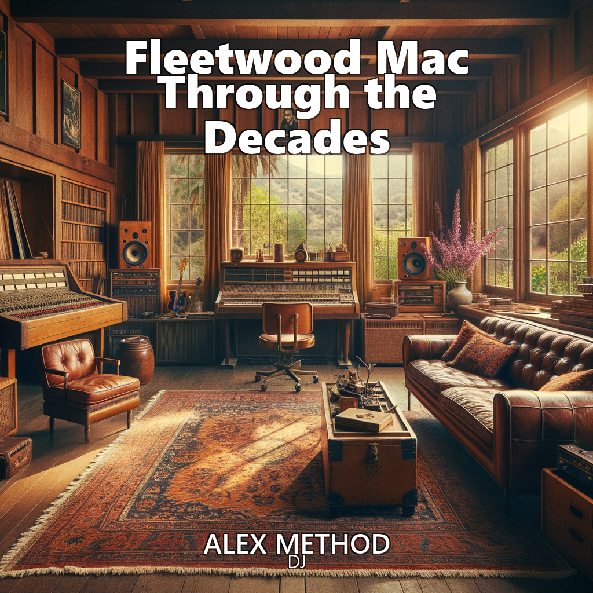

**Description**: Incredible evolution from British blues to American reinvention to Rumours perfection to enduring relevance. Blues foundation → lineup transformation → emotional mastery → timeless pop perfection

**Duration**: 300 minutes

🎵 **[▶️ Listen on Spotify](https://open.spotify.com/playlist/4JKUeJPZUpoRWIjU2UewRZ)**

📁 **Config**: [`playlist-configs/fleetwood-mac-through-decades.md`](playlist-configs/fleetwood-mac-through-decades.md)

---

### 20. ✈️ Flight to Brazil - Fortaleza Vacation Journey - Alex Method (240 min)

**Description**: Perfect companion for your long flight to Fortaleza! Journey from takeoff energy through cruising relaxation to Brazilian rhythm anticipation. Bossa nova, MPB, samba, and travel classics to transport you to Brazil's beautiful Northeast coast

**Duration**: 240 minutes

🎵 **[▶️ Listen on Spotify](https://open.spotify.com/playlist/6ioenlso24t0E9NPvrWwEM)**

📁 **Config**: [`playlist-configs/flight-to-brazil-fortaleza-vacation.md`](playlist-configs/flight-to-brazil-fortaleza-vacation.md)

---

### 21. 🔥 Foo Fighters Through the Decades - Alex Method (300 min)

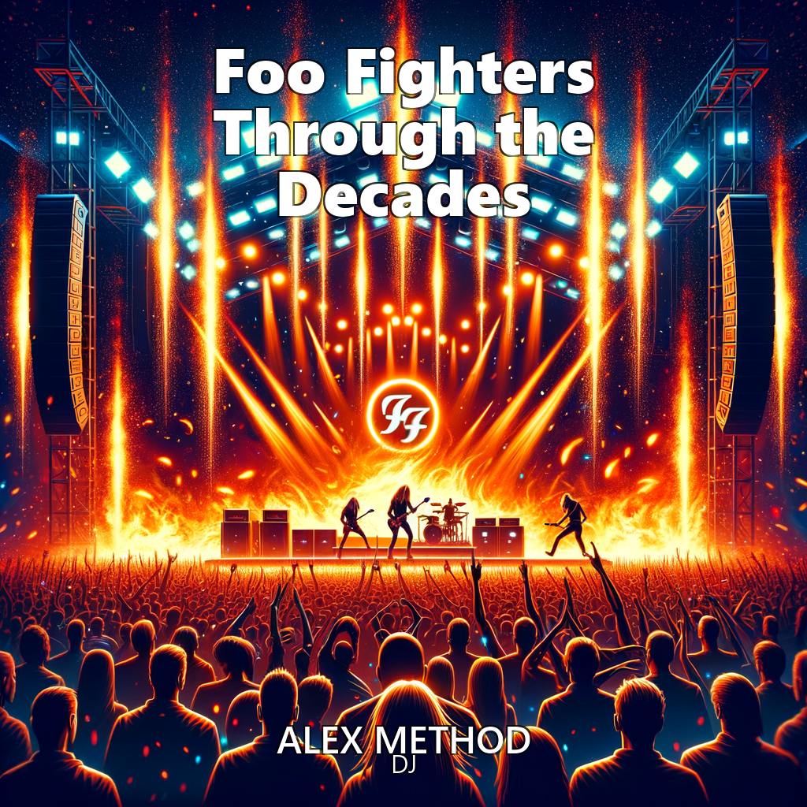

**Description**: Triumphant evolution from grunge roots to arena rock masters to modern alternative excellence. Dave Grohl's phoenix rise: post-Nirvana creation → band formation → arena conquering → alternative rock leadership

**Duration**: 300 minutes

🎵 **[▶️ Listen on Spotify](https://open.spotify.com/playlist/5AYI55XutUPZlmkvfNQDoz)**

📁 **Config**: [`playlist-configs/foo-fighters-through-decades.md`](playlist-configs/foo-fighters-through-decades.md)

---

### 22. 🔇 Intimate Privacy - Alex Method (90 min)

**Description**: Sophisticated sound masking for intimate moments. Carefully curated romantic tracks with consistent volume and texture to maintain privacy while creating beautiful romantic atmosphere

**Duration**: 90 minutes

🎵 **[▶️ Listen on Spotify](https://open.spotify.com/playlist/4e3fRcdZ64yYm5gSkicySr)**

📁 **Config**: [`playlist-configs/intimate-privacy.md`](playlist-configs/intimate-privacy.md)

---

### 23. 🎸 INXS Through the Decades - Alex Method (300 min)

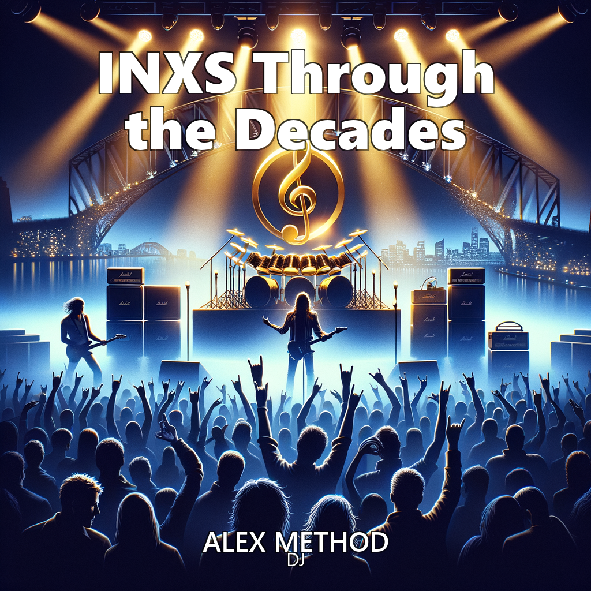

**Description**: Epic journey through INXS's legendary career from Australian new wave funk to international stadium rock mastery. Michael Hutchence's charismatic leadership and the band's evolution into global superstars!

**Duration**: 300 minutes

🎵 **[▶️ Listen on Spotify](https://open.spotify.com/playlist/3SDdai7C94hzRyd1JjtY8F)**

📁 **Config**: [`playlist-configs/inxs-through-decades.md`](playlist-configs/inxs-through-decades.md)

---

### 24. 🎤 Iron Maiden Through the Decades - Alex Method (300 min)

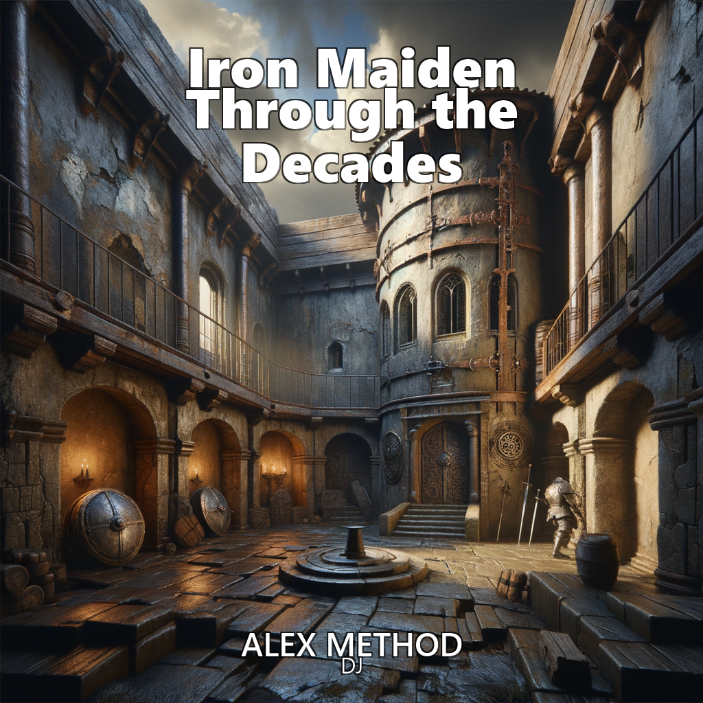

**Description**: Epic 45+ year journey from NWOBHM pioneers to metal opera masters. Raw early metal → Bruce Dickinson era anthems → experimental 90s → modern epic masterpieces with 15-minute metal operas

**Duration**: 300 minutes

🎵 **[▶️ Listen on Spotify](https://open.spotify.com/playlist/3IxnbEcE2UmtQaZQFpg0k5)**

📁 **Config**: [`playlist-configs/iron-maiden-through-decades.md`](playlist-configs/iron-maiden-through-decades.md)

---

### 25. 🍝 Italian African Fusion Cooking - Alex Method (90 min)

**Description**: Energetic cooking playlist blending Italian passion and African rhythms. Perfect for preparing fusion cuisine with vibrant Mediterranean and African musical flavors

**Duration**: 90 minutes

🎵 **[▶️ Listen on Spotify](https://open.spotify.com/playlist/1ln5YjlT5ME9GTXWZRVQ8s)**

📁 **Config**: [`playlist-configs/italian-african-fusion-cooking.md`](playlist-configs/italian-african-fusion-cooking.md)

---

### 26. 🎷 Jazz Through the Decades - Alex Method (300 min)

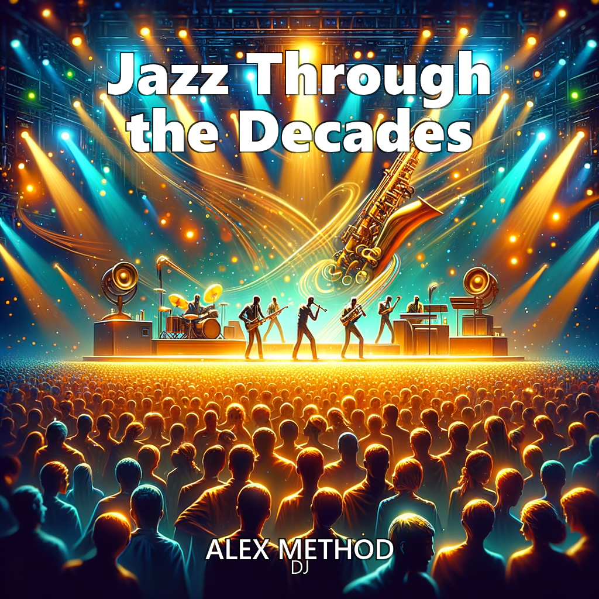

**Description**: Complete jazz evolution from early Dixieland origins to bebop revolution to fusion innovation to contemporary mastery. Musical DNA journey through America's greatest art form

**Duration**: 300 minutes

🎵 **[▶️ Listen on Spotify](https://open.spotify.com/playlist/1otQwUPR6iKyTV1CO3qJOS)**

📁 **Config**: [`playlist-configs/jazz-through-decades.md`](playlist-configs/jazz-through-decades.md)

---

### 27. 🏠 Journey Home to Charlotte - Return from Adventures - Alex Method (180 min)

**Description**: Sweet sounds for returning home to the Queen City. Carolina vibes, Southern comfort, and that warm feeling of coming back to Charlotte after adventures around the world. Perfect for flights, drives, or any journey home to NC

**Duration**: 180 minutes

🎵 **[▶️ Listen on Spotify](https://open.spotify.com/playlist/1R5rIPV03XtaCvZAFH3AcC)**

📁 **Config**: [`playlist-configs/journey-home-charlotte-nc.md`](playlist-configs/journey-home-charlotte-nc.md)

---

### 28. 🤘 Judas Priest Through the Decades - Alex Method (300 min)

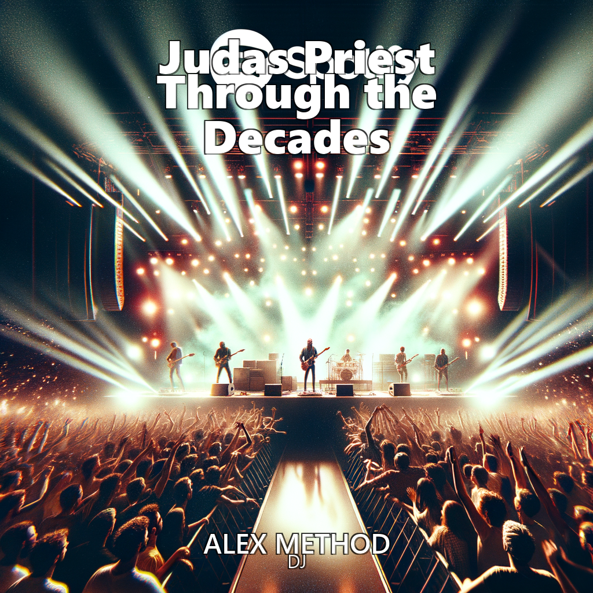

**Description**: Metal gods evolution from leather & studs pioneers to speed metal masters to modern power. Classic Halford era → speed metal invention → Ripper years → triumphant return to metal throne

**Duration**: 300 minutes

🎵 **[▶️ Listen on Spotify](https://open.spotify.com/playlist/1w9X0F0RvOxx35fNYbF0ht)**

📁 **Config**: [`playlist-configs/judas-priest-through-decades.md`](playlist-configs/judas-priest-through-decades.md)

---

### 29. 🧠 Ketamine Therapy Journey - Alex Method (90 min)

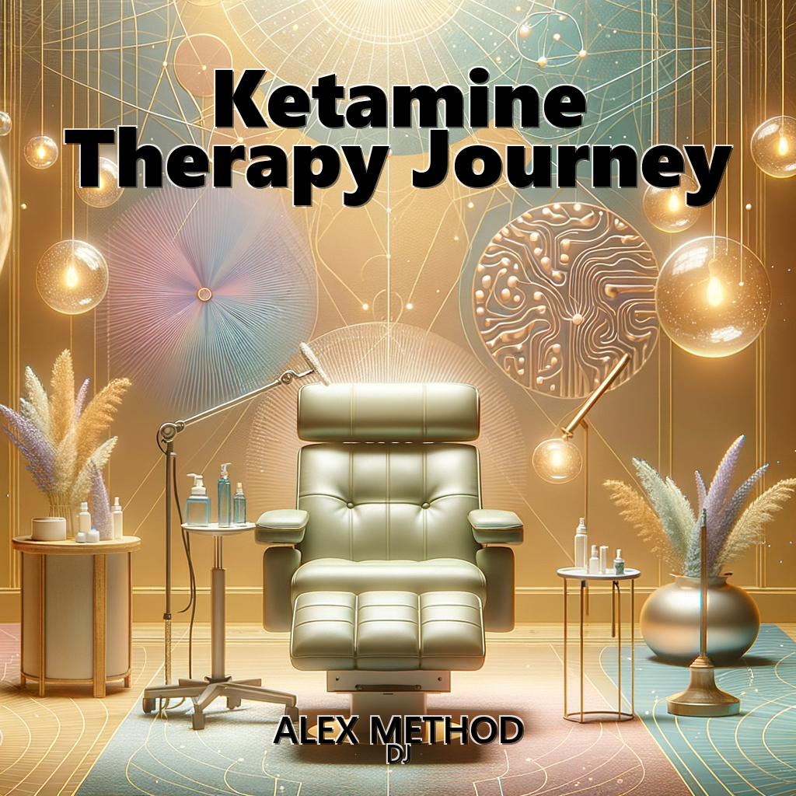

**Description**: Research-based therapeutic music for ketamine infusion sessions. Carefully curated phases supporting pre-treatment preparation, onset, peak experience, integration, and return to baseline. Designed with neuroscience and therapeutic protocols in mind

**Duration**: 90 minutes

🎵 **[▶️ Listen on Spotify](https://open.spotify.com/playlist/5Kdp6PPedsMm6pJtPiZkjE)**

📁 **Config**: [`playlist-configs/ketamine-therapy-journey.md`](playlist-configs/ketamine-therapy-journey.md)

---

### 30. 🎸 KISS Architectural Celebration - Alex Method (120 min)

**Description**: Celebrating KISS/DRY architectural victory with legendary KISS anthems! Rock and Roll All Nite, Detroit Rock City, I Was Made for Lovin' You and all the makeup-era classics. Double celebration - KISS principle success AND the greatest arena rock band ever 🎯⚡

**Duration**: 120 minutes

🎵 **[▶️ Listen on Spotify](https://open.spotify.com/playlist/0aPbwSrw9wZ4IF1gEhkbiZ)**

📁 **Config**: [`playlist-configs/kiss-architectural-celebration.md`](playlist-configs/kiss-architectural-celebration.md)

---

### 31. 🎯 Konami MSX Classics - Alex Method (80 min)

**Description**: A tribute to Japan's legendary MSX computer system and Konami's arcade dominance! From Metal Gear's stealth beginnings to Gradius shooters, Castlevania gothic symphonies, and Contra's military anthems

**Duration**: 80 minutes

🎵 **[▶️ Listen on Spotify](https://open.spotify.com/playlist/1jOXBb7ExTbh8jDKk4NStI)**

📁 **Config**: [`playlist-configs/konami-msx-classics.md`](playlist-configs/konami-msx-classics.md)

---

### 32. 🎧 Kraftwerk Through the Decades - Alex Method (300 min)

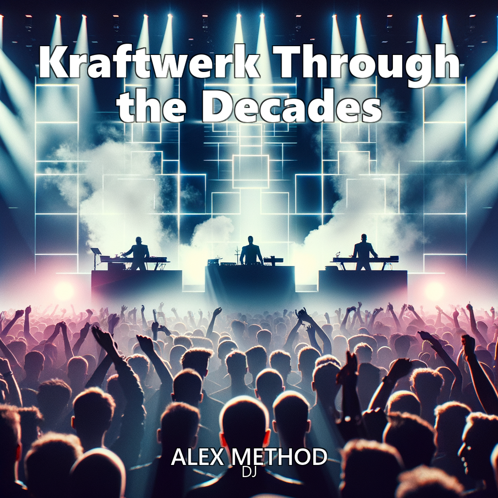

**Description**: Electronic revolution from robotic precision to techno invention to digital mastery with eternal influence on all electronic music. German innovation → synthesizer mastery → techno foundation → digital future vision

**Duration**: 300 minutes

🎵 **[▶️ Listen on Spotify](https://open.spotify.com/playlist/2TLkOu9hGnpLU1IZ33YUKC)**

📁 **Config**: [`playlist-configs/kraftwerk-through-decades.md`](playlist-configs/kraftwerk-through-decades.md)

---

### 33. 🔊 Led Zeppelin Through the Decades - Alex Method (300 min)

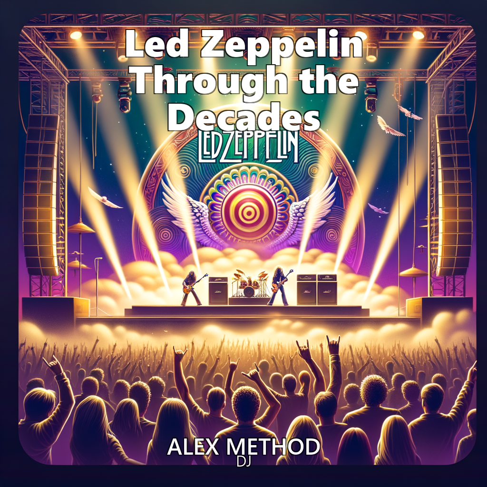

**Description**: Mystical journey from blues rock origins to hard rock mastery to experimental brilliance, tragically cut short. Raw blues power → heavy rock innovation → mystical experimentation → legendary legacy

**Duration**: 300 minutes

🎵 **[▶️ Listen on Spotify](https://open.spotify.com/playlist/3wxpoxDFmentQ5cMdG3qk1)**

📁 **Config**: [`playlist-configs/led-zeppelin-through-decades.md`](playlist-configs/led-zeppelin-through-decades.md)

---

### 34. 🎵 Legiao Urbana Through the Decades - Alex Method (300 min)

**Description**: Brazilian identity evolution from post-punk poetry to social consciousness anthems to eternal cultural impact. Underground poetry → national identity → social awareness → timeless Brazilian cultural legacy

**Duration**: 300 minutes

🎵 **[▶️ Listen on Spotify](https://open.spotify.com/playlist/7iqpvpdgjsSQyM2CflodJY)**

📁 **Config**: [`playlist-configs/legiao-urbana-through-decades.md`](playlist-configs/legiao-urbana-through-decades.md)

---

### 35. 🎸 Megadeth Through the Decades - Alex Method (300 min)

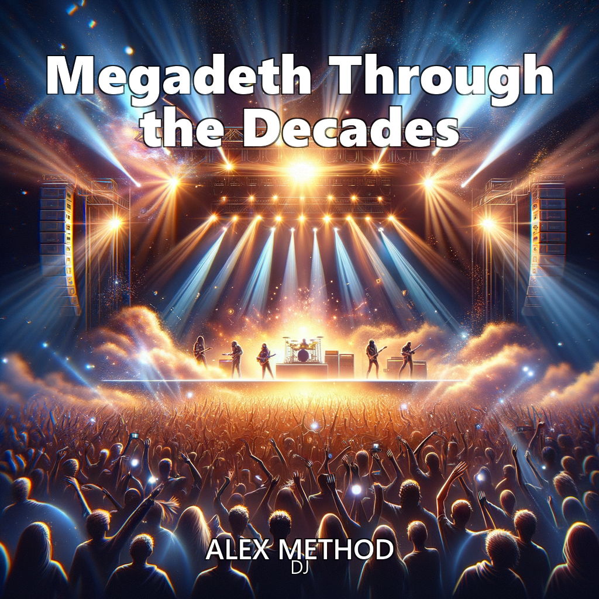

**Description**: Thrash sophistication evolution from raw speed to technical mastery to modern excellence. Dave Mustaine's revenge story: early thrash fury → technical perfection → commercial success → modern metal mastery

**Duration**: 300 minutes

🎵 **[▶️ Listen on Spotify](https://open.spotify.com/playlist/0t1j8SQi4KVnXnOj0m7AKG)**

📁 **Config**: [`playlist-configs/megadeth-through-decades.md`](playlist-configs/megadeth-through-decades.md)

---

### 36. 🎸 Men at Work Live Through the Decades - Alex Method (180 min)

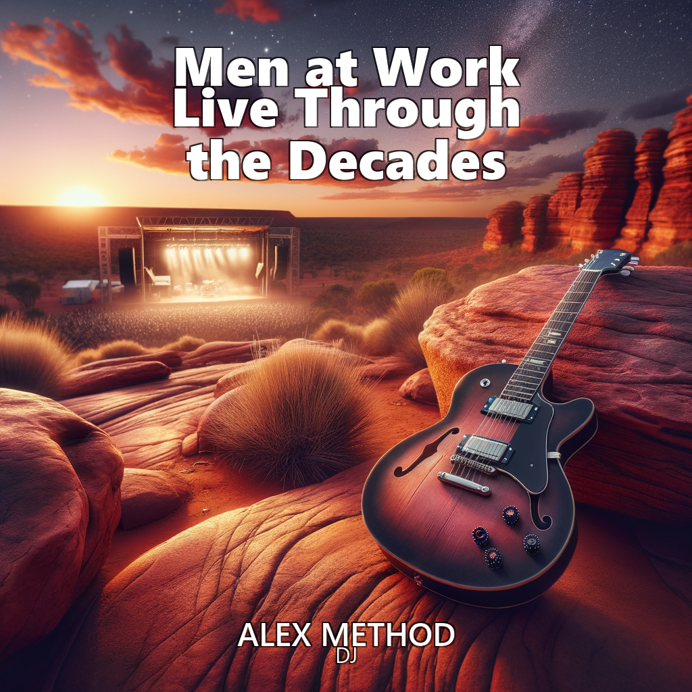

**Description**: Australian rock legends Men at Work live through their musical journey. Experience Colin Hay and Ron Strykert's iconic sound from Down Under to Business as Usual, featuring live performances of Land Down Under, Overkill, and Who Can It Be Now.

**Duration**: 180 minutes

🎵 **[▶️ Listen on Spotify](https://open.spotify.com/playlist/1AtWsg9KlSNQiV3lAFfPQl)**

📁 **Config**: [`playlist-configs/men-at-work-live-decades.md`](playlist-configs/men-at-work-live-decades.md)

---

### 37. 🇦🇺 Men at Work Through the Decades - Alex Method (300 min)

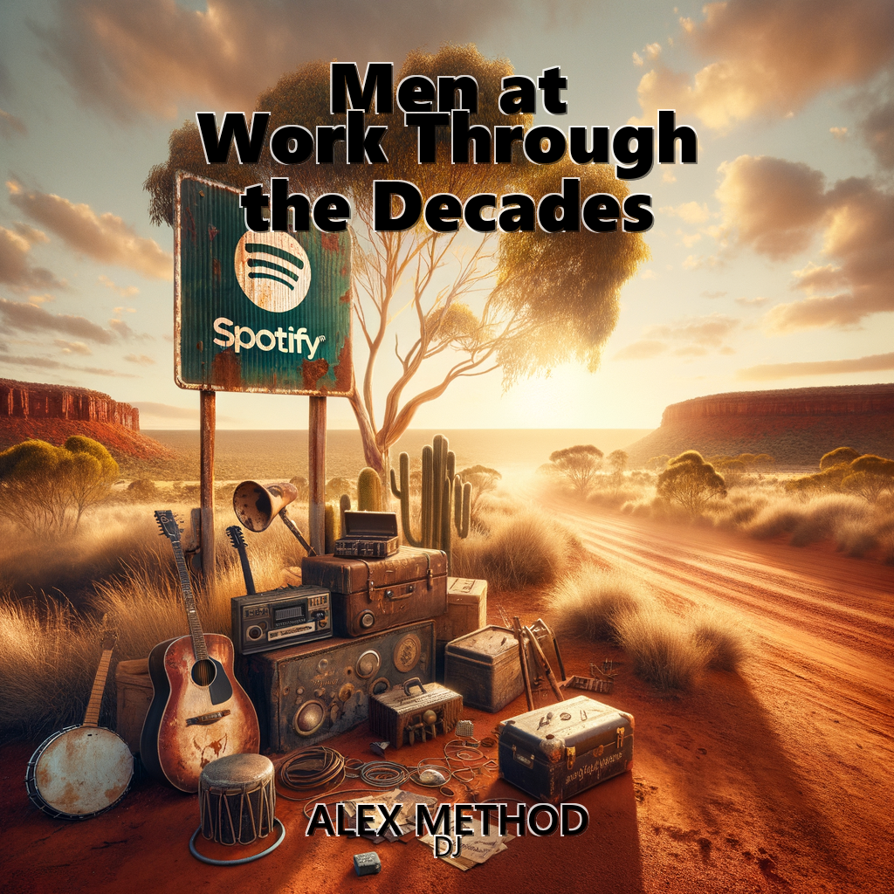

**Description**: Complete journey of Australia's iconic new wave band Men at Work. From Down Under and Who Can It Be Now to their evolving sound through the decades. Colin Hay's distinctive vocals and the band's signature Australian rock spirit.

**Duration**: 300 minutes

🎵 **[▶️ Listen on Spotify](https://open.spotify.com/playlist/2TsVrfvoFU4VhIcxHAdW2D)**

📁 **Config**: [`playlist-configs/men-at-work-through-decades.md`](playlist-configs/men-at-work-through-decades.md)

---

### 38. ⚡ Metallica Through the Decades - Alex Method (360 min)

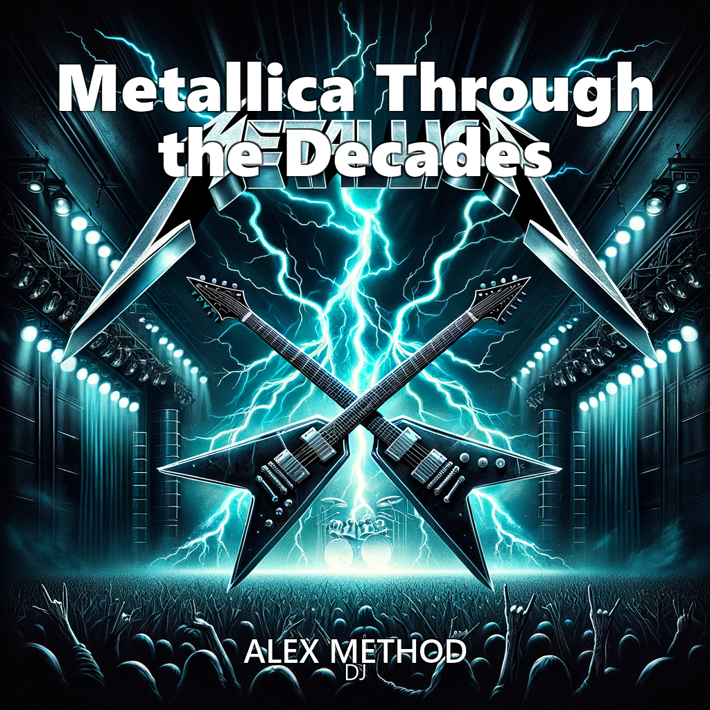

**Description**: Epic journey through Metallica's legendary career from thrash metal pioneers to stadium rock gods. From Kill 'Em All to recent masterpieces - pure metal evolution!

**Duration**: 360 minutes

🎵 **[▶️ Listen on Spotify](https://open.spotify.com/playlist/04vNxFfsafv6fncn16RD6M)**

📁 **Config**: [`playlist-configs/metallica-through-decades.md`](playlist-configs/metallica-through-decades.md)

---

### 39. 🤘 Midnight Oil Through the Decades - Alex Method (300 min)

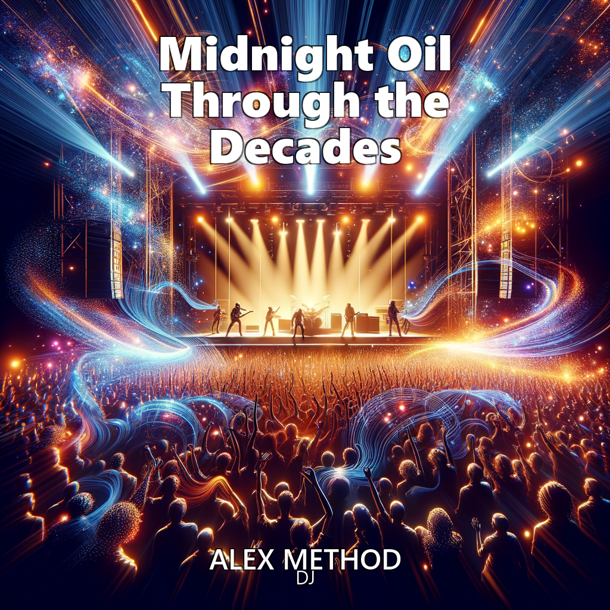

**Description**: Political powerhouse evolution from punk activism to environmental consciousness to Australian identity champions. Raw protest → ecological awareness → international message → enduring activism legacy

**Duration**: 300 minutes

🎵 **[▶️ Listen on Spotify](https://open.spotify.com/playlist/1CilSE4KspGp73Kg8tfAav)**

📁 **Config**: [`playlist-configs/midnight-oil-through-decades.md`](playlist-configs/midnight-oil-through-decades.md)

---

### 40. ☀️ Monday Morning Revival - Alex Method (60 min)

**Description**: Energy-building playlist for tough Monday mornings. Progressive wake-up journey from gentle ambient to uplifting beats, designed to combat morning fog and build momentum for the week ahead

**Duration**: 60 minutes

🎵 **[▶️ Listen on Spotify](https://open.spotify.com/playlist/1L8veTRadnqUfTkrcZUP5N)**

📁 **Config**: [`playlist-configs/monday-morning-revival.md`](playlist-configs/monday-morning-revival.md)

---

### 41. 🇧🇷 MPB Top Hits - Alex Method (120 min)

**Description**: The greatest hits of Música Popular Brasileira featuring legendary artists like Caetano Veloso, Gilberto Gil, Chico Buarque, Elis Regina, and contemporary MPB stars. A journey through Brazil's rich musical heritage

**Duration**: 120 minutes

🎵 **[▶️ Listen on Spotify](https://open.spotify.com/playlist/0gYc9MXMxCHcSJWkpV7YEP)**

📁 **Config**: [`playlist-configs/mpb-top-hits.md`](playlist-configs/mpb-top-hits.md)

---

### 42. 💫 New Order Live Through the Decades - Alex Method (300 min)

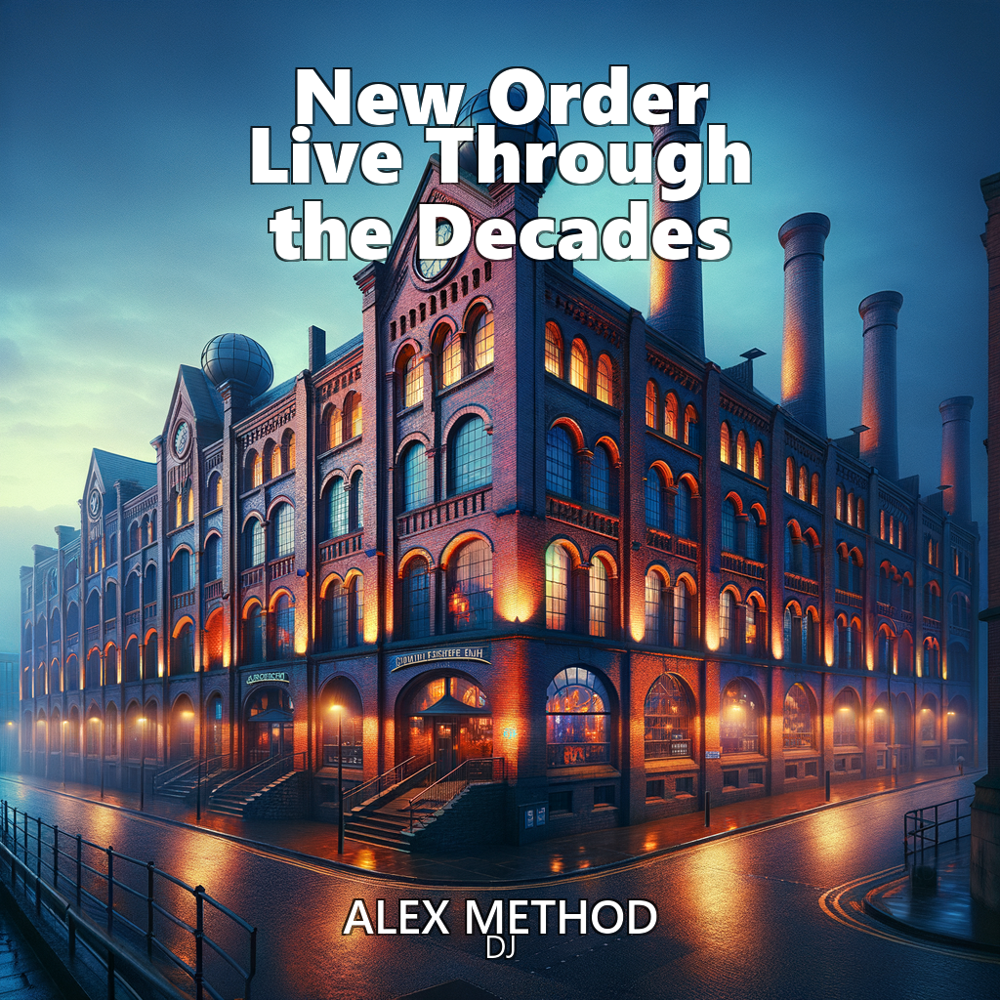

**Description**: Manchester legends New Order live evolution from Joy Division's ashes to electronic dance pioneers. Bernard Sumner and Peter Hook's innovative live performances featuring Blue Monday, True Faith, and Bizarre Love Triangle across four decades.

**Duration**: 300 minutes

🎵 **[▶️ Listen on Spotify](https://open.spotify.com/playlist/7rYcfVGZ8bnSS0YPLJ5kQh)**

📁 **Config**: [`playlist-configs/new-order-live-decades.md`](playlist-configs/new-order-live-decades.md)

---

### 43. 💫 New Order Through the Decades - Alex Method (300 min)

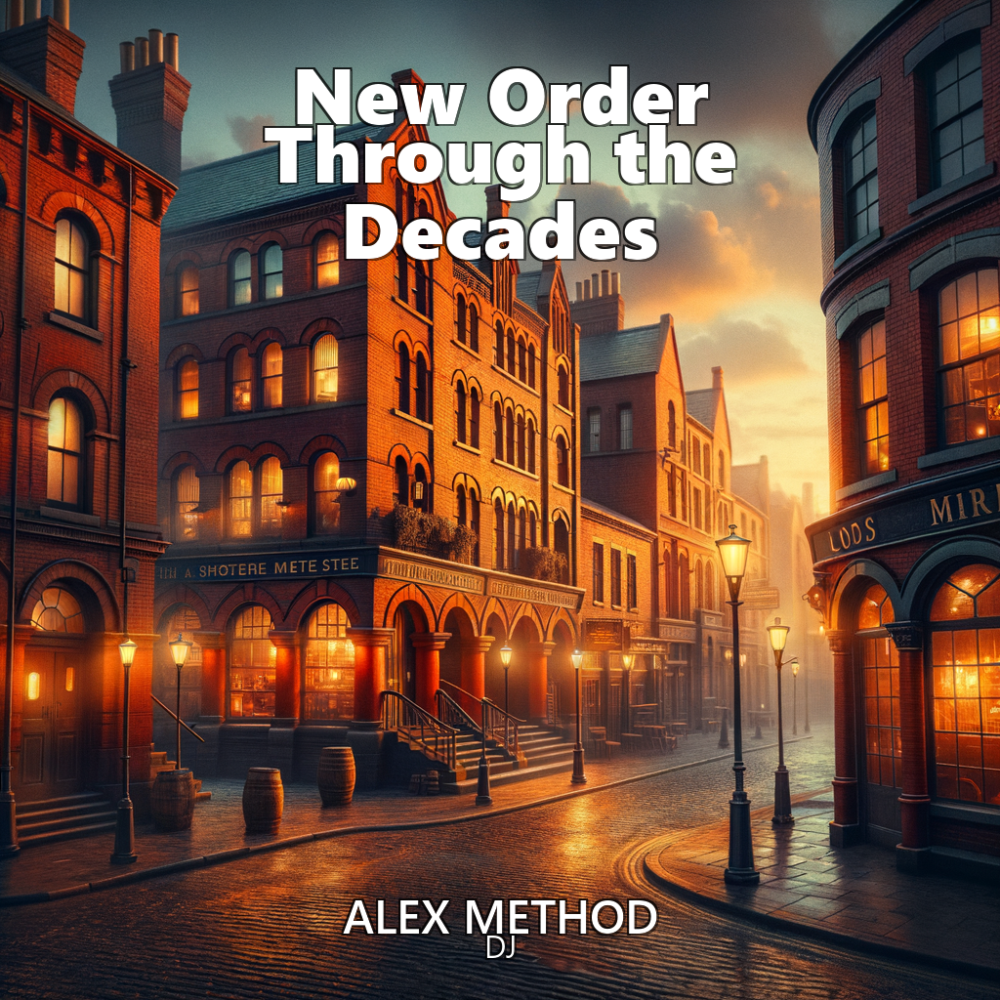

**Description**: Evolution of New Order from Joy Division's ashes to electronic dance pioneers. Blue Monday, True Faith, and four decades of Bernard Sumner's innovative synthesis of rock and electronic music that defined the Manchester sound.

**Duration**: 300 minutes

🎵 **[▶️ Listen on Spotify](https://open.spotify.com/playlist/7ADtpgRBxNT9tZSkglBaq7)**

📁 **Config**: [`playlist-configs/new-order-through-decades.md`](playlist-configs/new-order-through-decades.md)

---

### 44. 🎮 Nintendo Switch Gaming Legends - Alex Method (85 min)

**Description**: Modern gaming magic! Zelda, Mario, Xenoblade, Splatoon BGM excellence from hybrid console revolution

**Duration**: 85 minutes

🎵 **[▶️ Listen on Spotify](https://open.spotify.com/playlist/3b2Xu8qNRQBryw3zCdtLh4)**

📁 **Config**: [`playlist-configs/nintendo-switch-legends.md`](playlist-configs/nintendo-switch-legends.md)

---

### 45. 🎹 Pet Shop Boys Live Through the Decades - Alex Method (240 min)

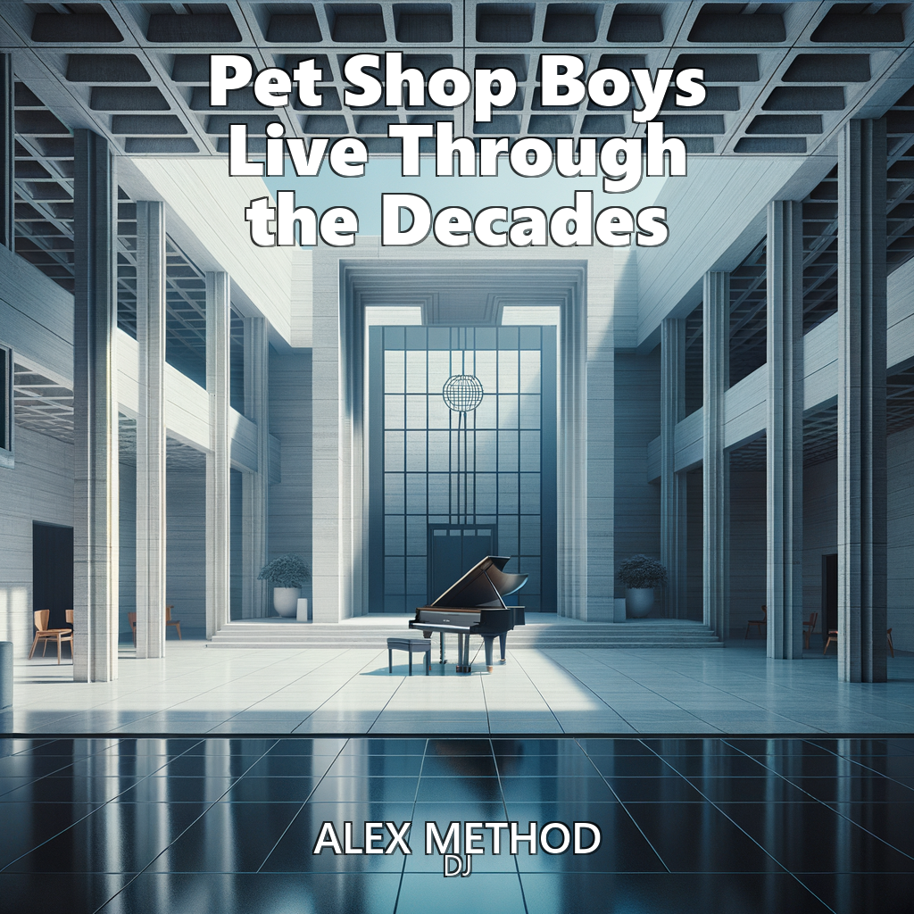

**Description**: Electronic pop duo Pet Shop Boys live evolution through four decades. Neil Tennant and Chris Lowe's sophisticated live performances featuring West End Girls, It's a Sin, and Always on My Mind with theatrical stage productions.

**Duration**: 240 minutes

🎵 **[▶️ Listen on Spotify](https://open.spotify.com/playlist/1HBYAtd1i1Qkt8sHZ3t0sK)**

📁 **Config**: [`playlist-configs/pet-shop-boys-live-decades.md`](playlist-configs/pet-shop-boys-live-decades.md)

---

### 46. 🌈 Pink Floyd Through the Decades - Alex Method (300 min)

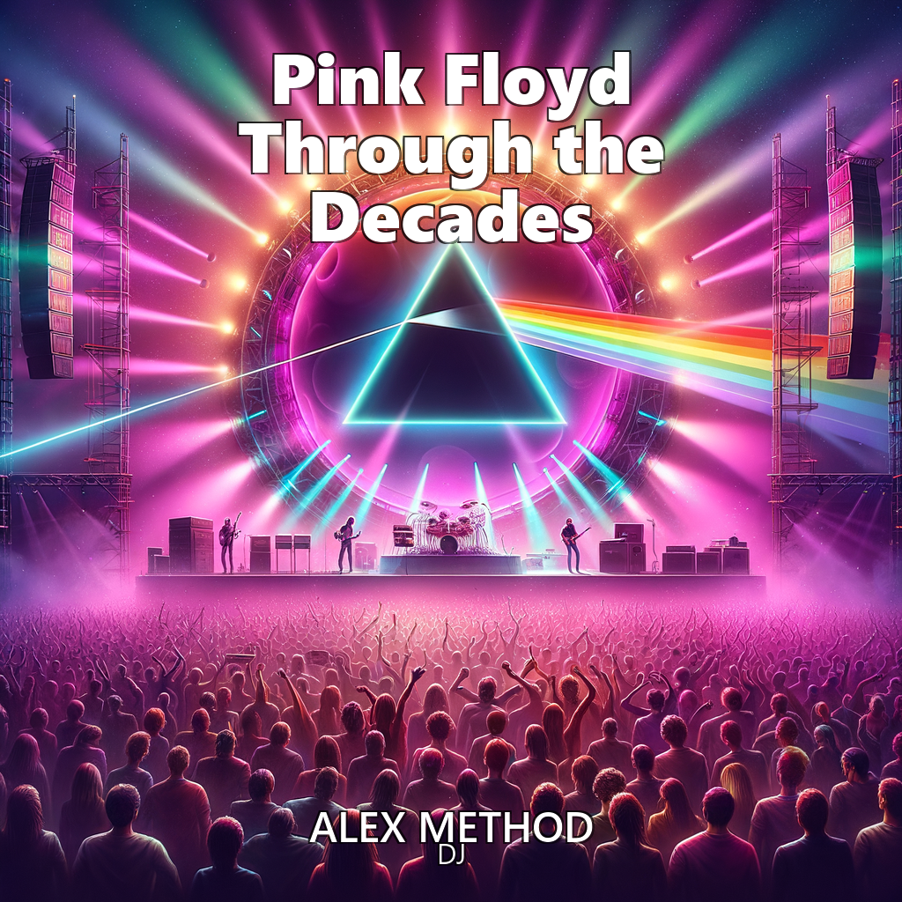

**Description**: Progressive masterpiece evolution from psychedelic experimentation to Dark Side perfection to conceptual mastery with eternal influence. Psychedelic pioneers → The Wall conceptual genius → stadium spectacle → timeless legacy

**Duration**: 300 minutes

🎵 **[▶️ Listen on Spotify](https://open.spotify.com/playlist/5ApIMW4fyfn6JtpmRG7UzF)**

📁 **Config**: [`playlist-configs/pink-floyd-through-decades.md`](playlist-configs/pink-floyd-through-decades.md)

---

### 47. 🎭 Queen Through the Decades - Alex Method (300 min)

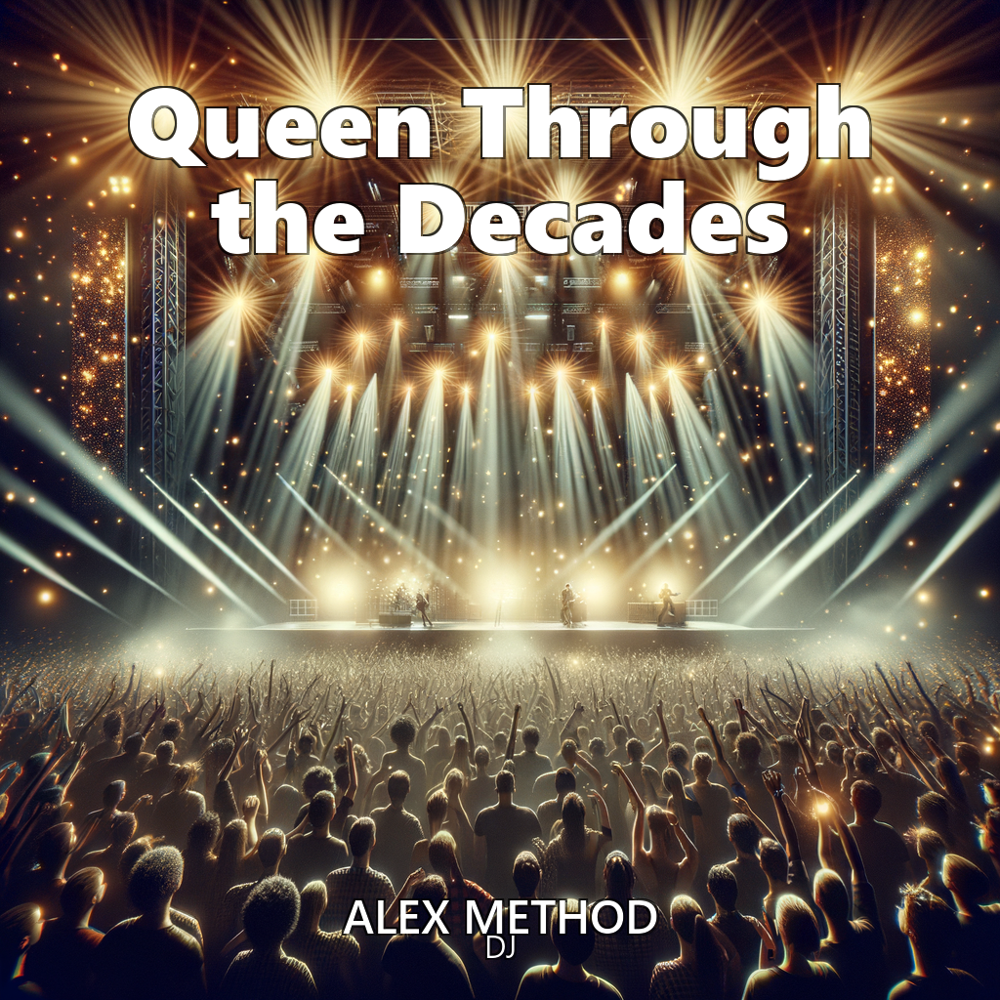

**Description**: Genre-defying theatrical journey from glam rock pioneers to arena anthem masters to experimental brilliance. Freddie's voice → operatic epics → stadium conquering → eternal legacy

**Duration**: 300 minutes

🎵 **[▶️ Listen on Spotify](https://open.spotify.com/playlist/5DHSPDupDs5xqrvI1fCDMN)**

📁 **Config**: [`playlist-configs/queen-through-decades.md`](playlist-configs/queen-through-decades.md)

---

### 48. 🎧 Radiohead Through the Decades - Alex Method (300 min)

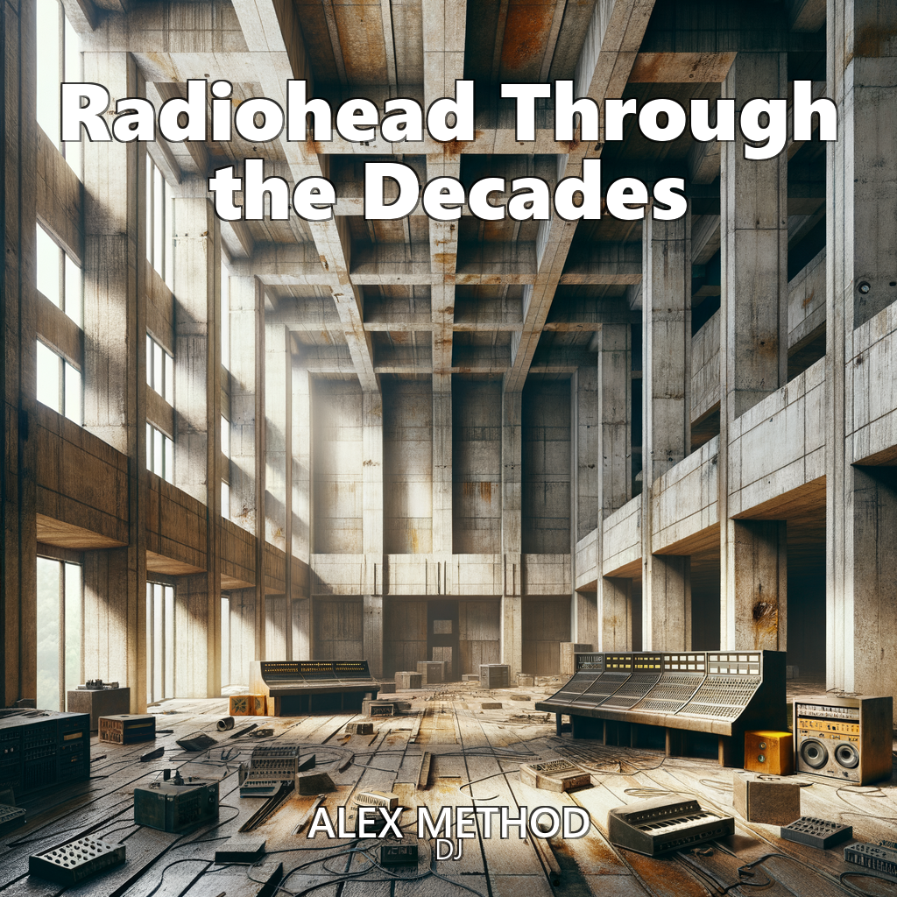

**Description**: Revolutionary journey from alternative rock to electronic experimentation to art rock mastery. Grunge-influenced beginnings → OK Computer brilliance → electronic deconstruction → modern art rock perfection

**Duration**: 300 minutes

🎵 **[▶️ Listen on Spotify](https://open.spotify.com/playlist/7hOnfChFyqTs4NKIEQzGEK)**

📁 **Config**: [`playlist-configs/radiohead-through-decades.md`](playlist-configs/radiohead-through-decades.md)

---

### 49. 🎸 Raimundos Cohort - Alex Method (120 min)

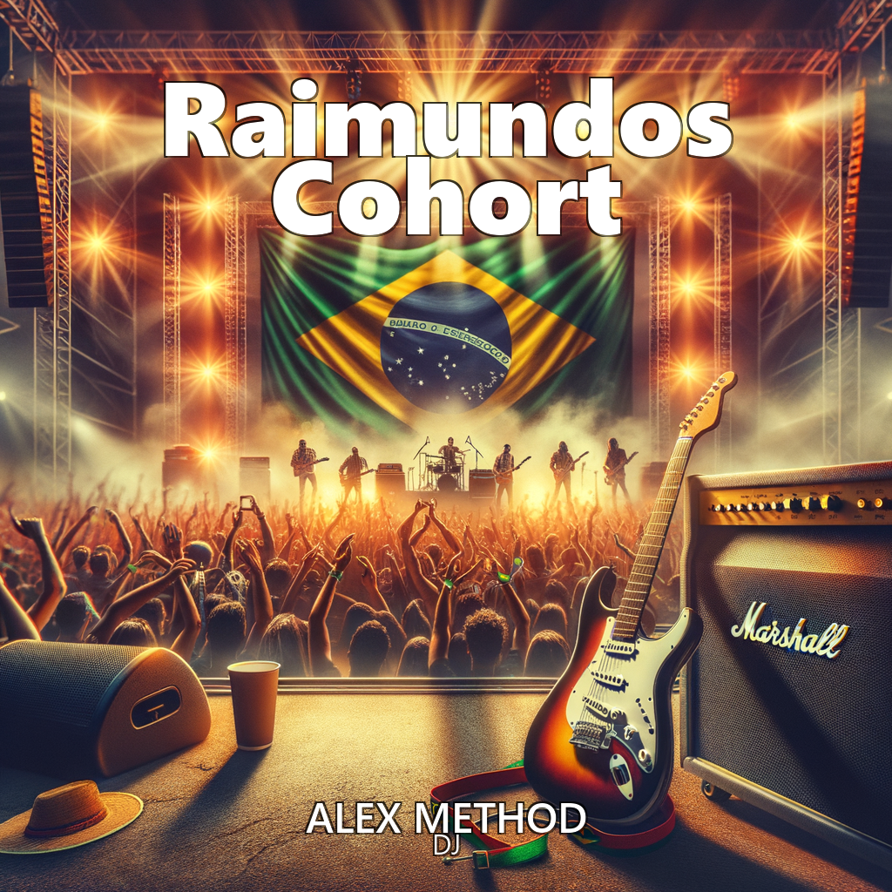

**Description**: Brazilian forró-rock legends and their musical DNA - Raimundos foundation with cohort brotherhood

**Duration**: 120 minutes

🎵 **[▶️ Listen on Spotify](https://open.spotify.com/playlist/1aXW76aQMeHIIWxlEcakjB)**

📁 **Config**: [`playlist-configs/raimundos-cohort.md`](playlist-configs/raimundos-cohort.md)

---

### 50. 🎸 Raimundos Live Cohort ## Track Categories

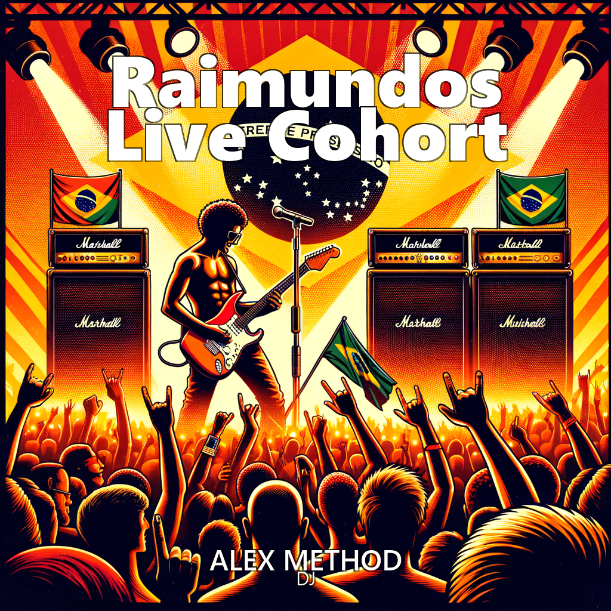

**Description**: Brazilian forró-rock legends live energy - cohort spirit and regional pride with Brasília rock fusion

**Duration**: 120 minutes

🎵 **[▶️ Listen on Spotify](https://open.spotify.com/playlist/7ddkmgmqLfiv9580dwlOkW)**

📁 **Config**: [`playlist-configs/raimundos-live-cohort.md`](playlist-configs/raimundos-live-cohort.md)

---

### 51. ⚡ Raimundos Through the Decades - Alex Method (300 min)

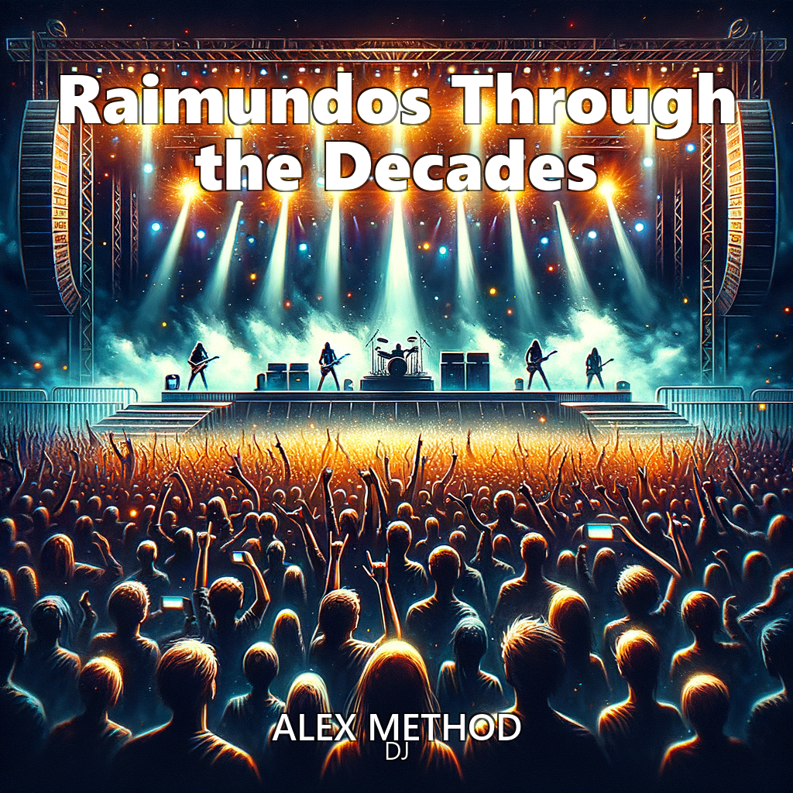

**Description**: Unique Brazilian fusion from forró punk origins to Brazilian metal with strong regional identity. Northeastern forró meets punk → Brazilian metal innovation → regional culture celebration → unique cultural blend mastery

**Duration**: 300 minutes

🎵 **[▶️ Listen on Spotify](https://open.spotify.com/playlist/2TrEECHr3qQi7NxBK8xKhV)**

📁 **Config**: [`playlist-configs/raimundos-through-decades.md`](playlist-configs/raimundos-through-decades.md)

---

### 52. 💕 Romantic Evening Journey - Alex Method (120 min)

**Description**: Sophisticated romantic journey through intimate moments. From tender beginnings to passionate connection, featuring soulful vocals, jazz classics, and contemporary love songs for the perfect romantic atmosphere

**Duration**: 120 minutes

🎵 **[▶️ Listen on Spotify](https://open.spotify.com/playlist/4xXhadq4xrUnq2ibXf9af7)**

📁 **Config**: [`playlist-configs/romantic-evening-journey.md`](playlist-configs/romantic-evening-journey.md)

---

### 53. 🎵 Rush Through the Decades - Alex Method (300 min)

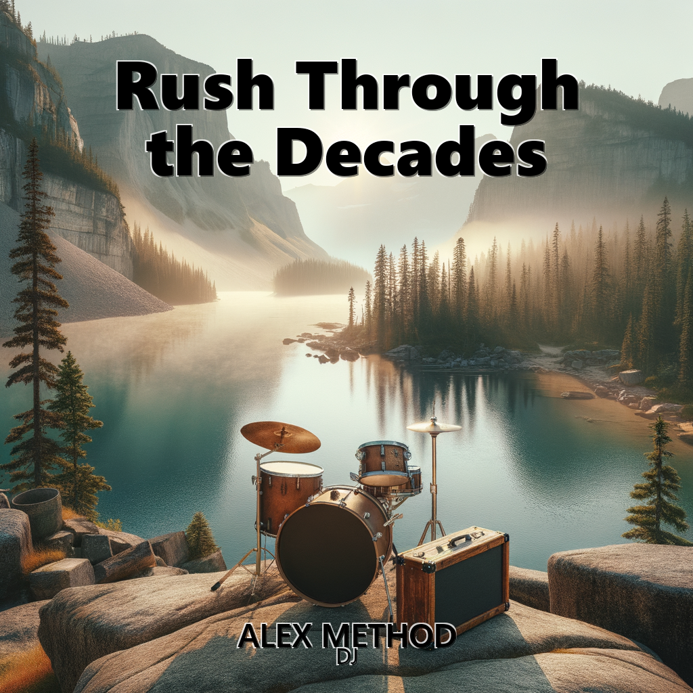

**Description**: Ultimate progressive evolution from hard rock power trio to synthesizer masters to final trilogy perfection. 40+ year journey: raw power → prog complexity → synth era → philosophical mastery finale

**Duration**: 300 minutes

🎵 **[▶️ Listen on Spotify](https://open.spotify.com/playlist/1XOGQq7acClwAabuPfGNAe)**

📁 **Config**: [`playlist-configs/rush-through-decades.md`](playlist-configs/rush-through-decades.md)

---

### 54. 🔬 Scientific Research Focus - Alex Method (90 min)

**Description**: Research-optimized focus music. Instrumental ambient, minimal classical, binaural beats. Enhances concentration, reduces cognitive load, supports deep analytical thinking for scientific research and academic work

**Duration**: 90 minutes

🎵 **[▶️ Listen on Spotify](https://open.spotify.com/playlist/3w3SzO1eQ72iE5ozfSnjyH)**

📁 **Config**: [`playlist-configs/scientific-research-focus.md`](playlist-configs/scientific-research-focus.md)

---

### 55. 🤘 Scorpions Through the Decades - Alex Method (300 min)

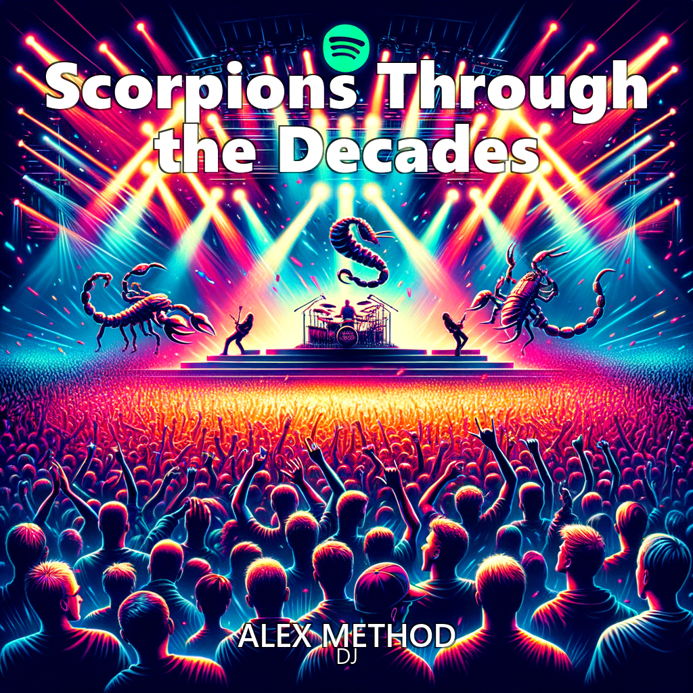

**Description**: German metal mastery from hard rock origins to international breakthrough to "Wind of Change" cultural impact as arena legends. Krautrock beginnings → metal mastery → global success → cultural ambassadors

**Duration**: 300 minutes

🎵 **[▶️ Listen on Spotify](https://open.spotify.com/playlist/4dpjHHlzt0ZlS3TI7O4wfm)**

📁 **Config**: [`playlist-configs/scorpions-through-decades.md`](playlist-configs/scorpions-through-decades.md)

---

### 56. 🔥 Sepultura Through the Decades - Alex Method (300 min)

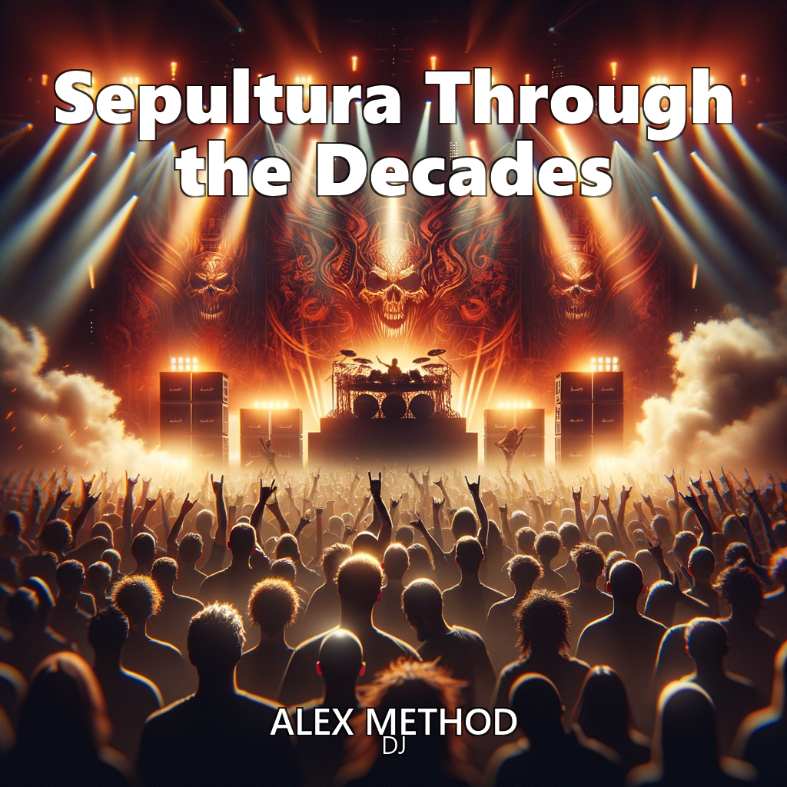

**Description**: Brazilian metal evolution from thrash origins to tribal experimentation to nu-metal exploration to roots mastery. Underground thrash → Chaos A.D. breakthrough → tribal fusion innovation → modern metal excellence

**Duration**: 300 minutes

🎵 **[▶️ Listen on Spotify](https://open.spotify.com/playlist/70pUM48be7Vqz8fDw2wi3S)**

📁 **Config**: [`playlist-configs/sepultura-through-decades.md`](playlist-configs/sepultura-through-decades.md)

---

### 57. 🎧 Silverchair Through the Decades - Alex Method (300 min)

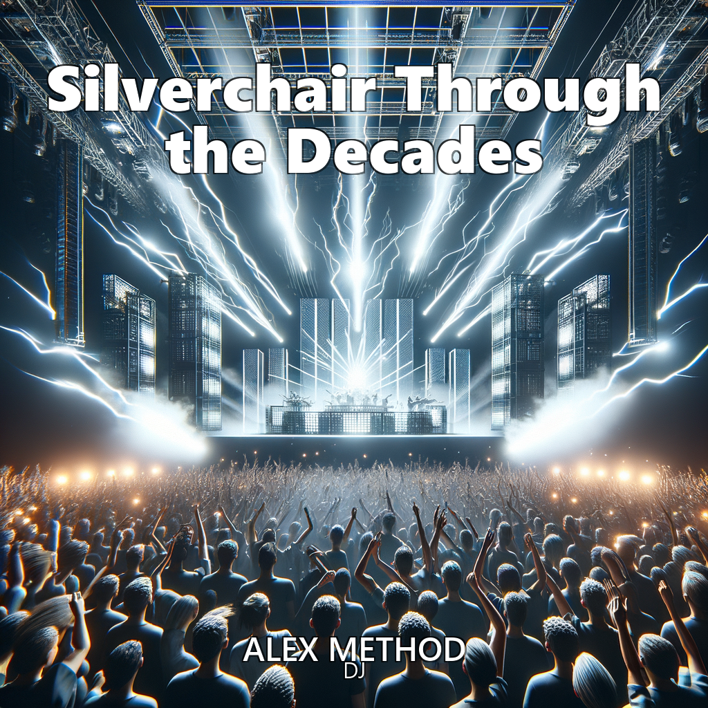

**Description**: Incredible maturation from teenage grunge phenoms to experimental evolution to artistic sophistication. Teen grunge mastery → alternative rock exploration → orchestral experimentation → mature artistic achievement

**Duration**: 300 minutes

🎵 **[▶️ Listen on Spotify](https://open.spotify.com/playlist/5y6Y5riVgO2KhcjQPaiaLa)**

📁 **Config**: [`playlist-configs/silverchair-through-decades.md`](playlist-configs/silverchair-through-decades.md)

---

### 58. 🧠 Simple Minds Live Through the Decades - Alex Method (240 min)

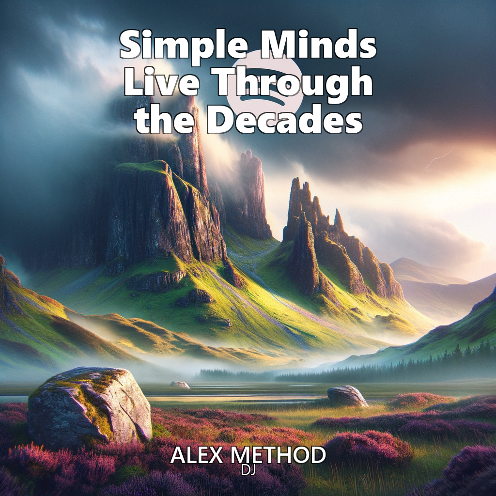

**Description**: Scottish rock innovators Simple Minds live evolution from post-punk pioneers to stadium anthems. Jim Kerr and Charlie Burchill's electrifying live performances featuring Don't You Forget About Me, Alive and Kicking, and Belfast Child.

**Duration**: 240 minutes

🎵 **[▶️ Listen on Spotify](https://open.spotify.com/playlist/7FR76nT13oHHRuvKoMgIMU)**

📁 **Config**: [`playlist-configs/simple-minds-live-decades.md`](playlist-configs/simple-minds-live-decades.md)

---

### 59. 🧠 Simple Minds Through the Decades - Alex Method (300 min)

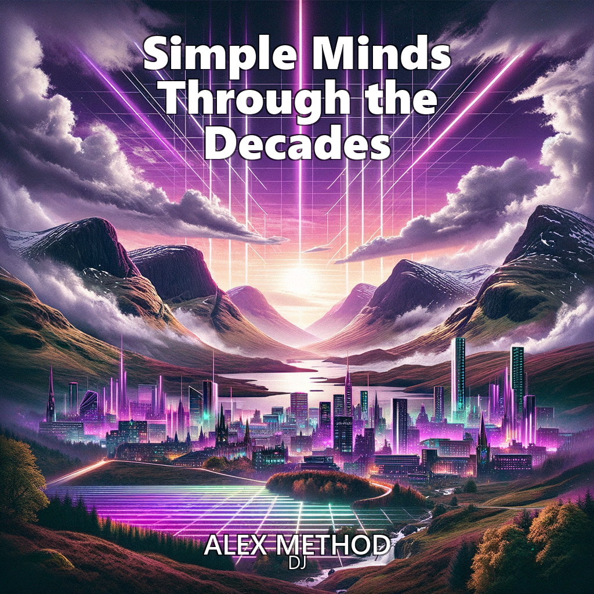

**Description**: Epic journey of Scottish rock legends Simple Minds from post-punk pioneers to stadium anthems. Don't You (Forget About Me), Alive and Kicking, and decades of Jim Kerr's soaring vocals with evolving soundscapes.

**Duration**: 300 minutes

🎵 **[▶️ Listen on Spotify](https://open.spotify.com/playlist/3EhrxHFdd77CP99WgkzIg6)**

📁 **Config**: [`playlist-configs/simple-minds-through-decades.md`](playlist-configs/simple-minds-through-decades.md)

---

### 60. 🌟 Steely Dan Through the Decades - Alex Method (300 min)

**Description**: Jazz-rock sophistication evolution from complex arrangements to studio perfection to sophisticated pop mastery. Intellectual rock → perfectionist studio craft → sophisticated pop → timeless artistry

**Duration**: 300 minutes

🎵 **[▶️ Listen on Spotify](https://open.spotify.com/playlist/5tTuHnIzx9CV3gS1mWR2gE)**

📁 **Config**: [`playlist-configs/steely-dan-through-decades.md`](playlist-configs/steely-dan-through-decades.md)

---

### 61. 🗣️ Talk Talk Live Through the Decades - Alex Method (150 min)

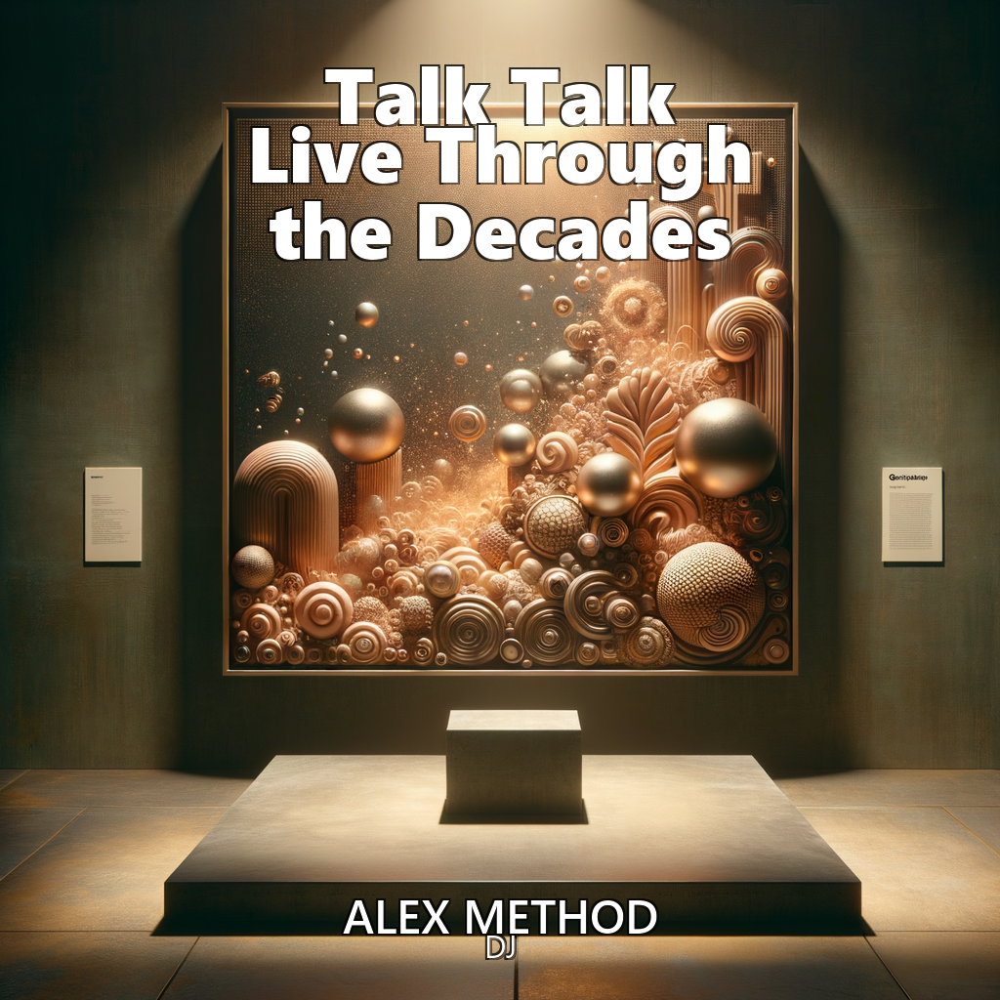

**Description**: Innovative English band Talk Talk's live evolution from synth-pop to ambient rock. Mark Hollis's artistic journey through experimental soundscapes, featuring live performances of It's My Life, Such a Shame, and Life's What You Make It.

**Duration**: 150 minutes

🎵 **[▶️ Listen on Spotify](https://open.spotify.com/playlist/2FcNwYj159Oqr9GpcbgvYp)**

📁 **Config**: [`playlist-configs/talk-talk-live-decades.md`](playlist-configs/talk-talk-live-decades.md)

---

### 62. 🗣️ Talk Talk Through the Decades - Alex Method (300 min)

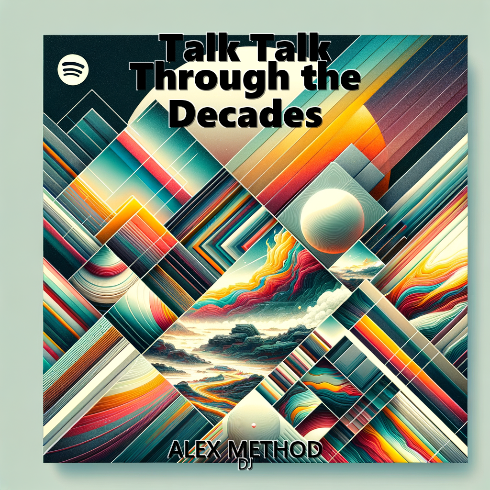

**Description**: Revolutionary evolution of Talk Talk from synth-pop hits to experimental post-rock masterpieces. Mark Hollis's artistic journey from It's My Life and Such a Shame to the groundbreaking Spirit of Eden and Laughing Stock.

**Duration**: 300 minutes

🎵 **[▶️ Listen on Spotify](https://open.spotify.com/playlist/3S945lSpXlk1xnUafIs0zo)**

📁 **Config**: [`playlist-configs/talk-talk-through-decades.md`](playlist-configs/talk-talk-through-decades.md)

---

### 63. 🧠 Tame the Amygdala - Alex Method (90 min)

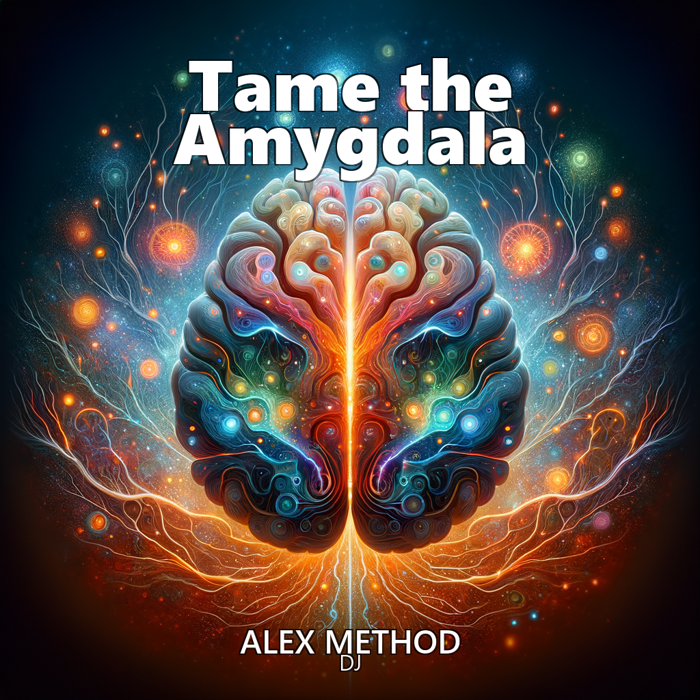

**Description**: Neuroscience-based emotional regulation. Ambient nature, calming piano, binaural beats. Research-validated 60-80 BPM for amygdala calming and emotional self-regulation

**Duration**: 90 minutes

🎵 **[▶️ Listen on Spotify](https://open.spotify.com/playlist/4mZkHhCPYJ1bVrLtHPmIna)**

📁 **Config**: [`playlist-configs/tame-the-amygdala.md`](playlist-configs/tame-the-amygdala.md)

---

### 64. 🎭 Tears for Fears Live Through the Decades - Alex Method (240 min)

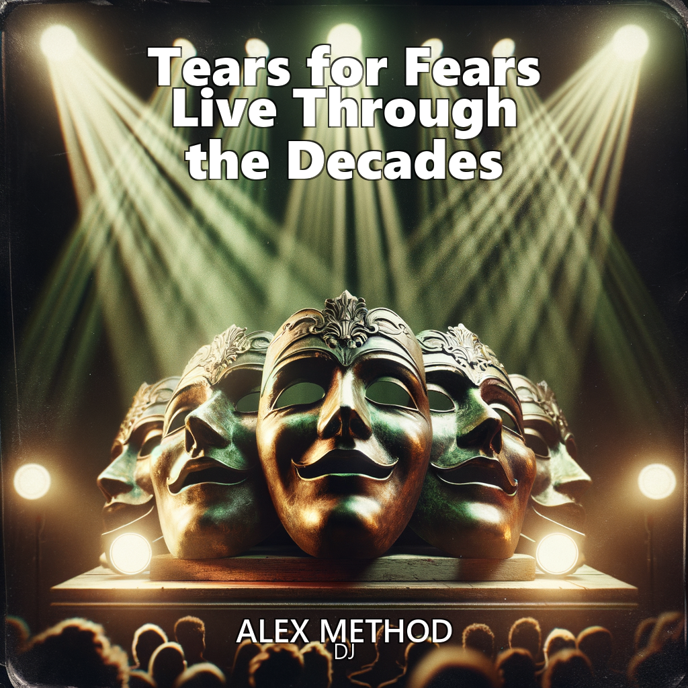

**Description**: Emotional journey through Tears for Fears' live performances from new wave pioneers to sophisticated pop masters. Roland Orzabal and Curt Smith's most powerful live renditions featuring Mad World, Everybody Wants to Rule the World, and Shout captured in concert.

**Duration**: 240 minutes

🎵 **[▶️ Listen on Spotify](https://open.spotify.com/playlist/4fSfobBXeVoL6JisRztLkv)**

📁 **Config**: [`playlist-configs/tears-for-fears-live-decades.md`](playlist-configs/tears-for-fears-live-decades.md)

---

### 65. 🎭 Tears for Fears Through the Decades - Alex Method (300 min)

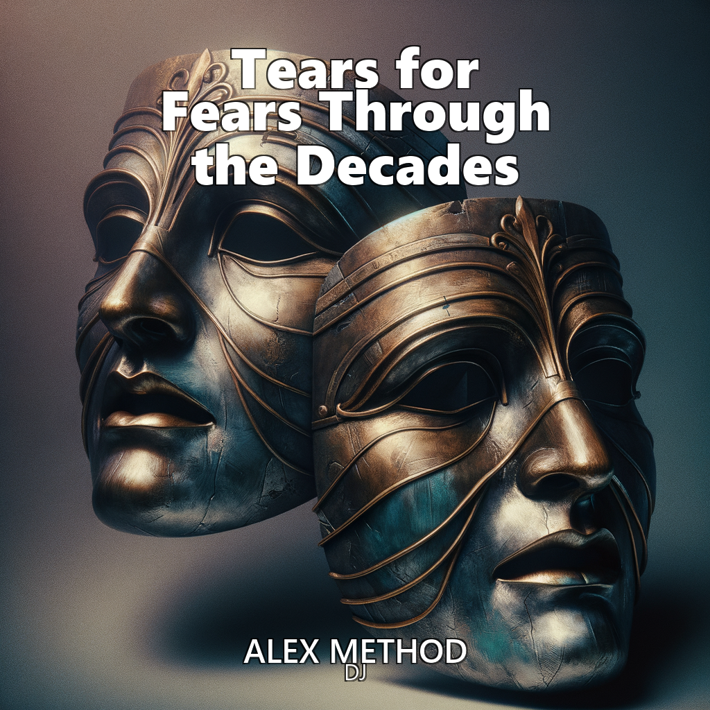

**Description**: Complete evolution of Tears for Fears from new wave pioneers to sophisticated pop innovators. Five decades of Roland Orzabal and Curt Smith's musical mastery featuring hits like Mad World, Everybody Wants to Rule the World, and Shout.

**Duration**: 300 minutes

🎵 **[▶️ Listen on Spotify](https://open.spotify.com/playlist/2ornAIxfpKzZDuRIjFegVv)**

📁 **Config**: [`playlist-configs/tears-for-fears-through-decades.md`](playlist-configs/tears-for-fears-through-decades.md)

---

### 66. 🎤 Teddy Swims Live Through the Years - Alex Method (120 min)

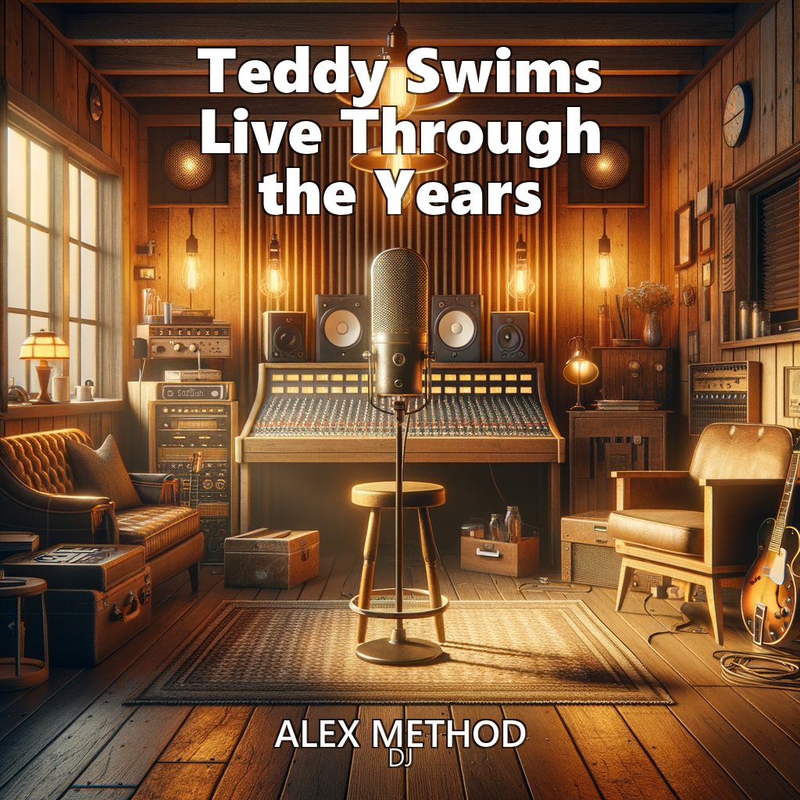

**Description**: Jaten Dimsdale's soulful journey as Teddy Swims from viral covers to R&B superstar. Powerful live performances showcasing his incredible vocal range with Lose Control, Bed on Fire, and heartfelt acoustic sessions.

**Duration**: 120 minutes

🎵 **[▶️ Listen on Spotify](https://open.spotify.com/playlist/3V5CGCQHy2DftQXI3KGjix)**

📁 **Config**: [`playlist-configs/teddy-swims-live-years.md`](playlist-configs/teddy-swims-live-years.md)

---

### 67. 🧸 Teddy Swims Through the Years - Alex Method (180 min)

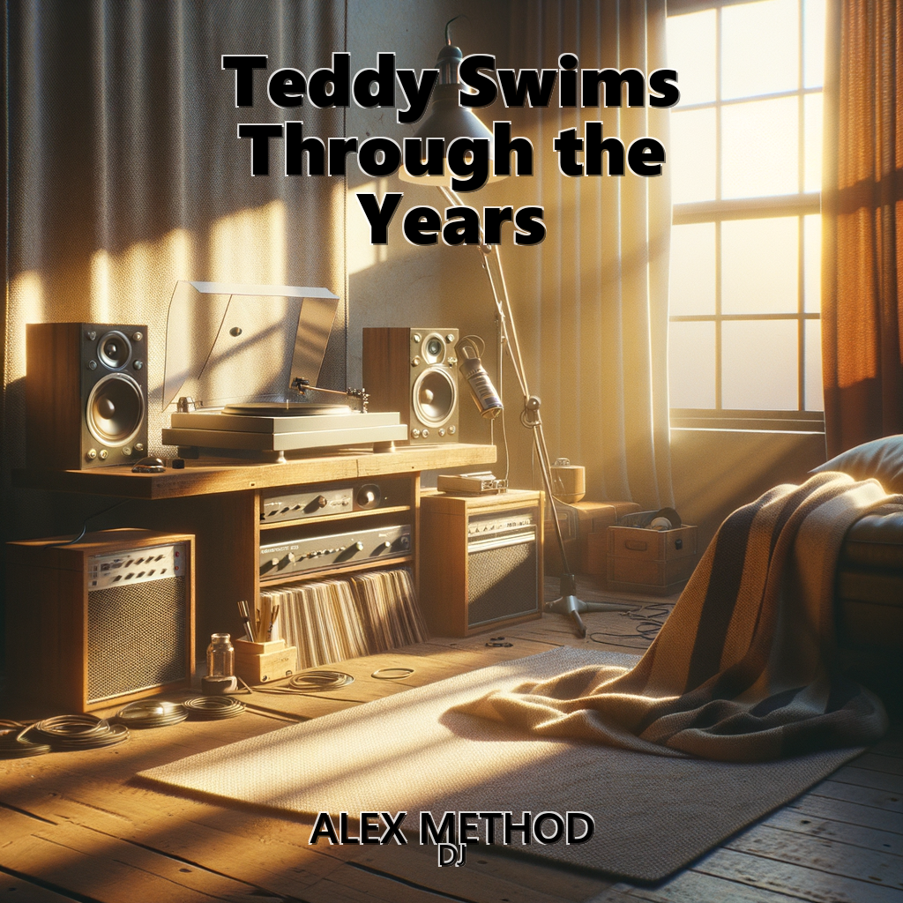

**Description**: Soulful journey of Teddy Swims from viral covers to R&B stardom. Jaten Dimsdale's powerful vocals spanning soul, R&B, pop, and country. From bedroom sessions to chart-topping hits like Lose Control and Stay.

**Duration**: 180 minutes

🎵 **[▶️ Listen on Spotify](https://open.spotify.com/playlist/1mUCmot4I4mfHcyqq5Owod)**

📁 **Config**: [`playlist-configs/teddy-swims-through-years.md`](playlist-configs/teddy-swims-through-years.md)

---

### 68. 🔮 The The Live Through the Decades - Alex Method (180 min)

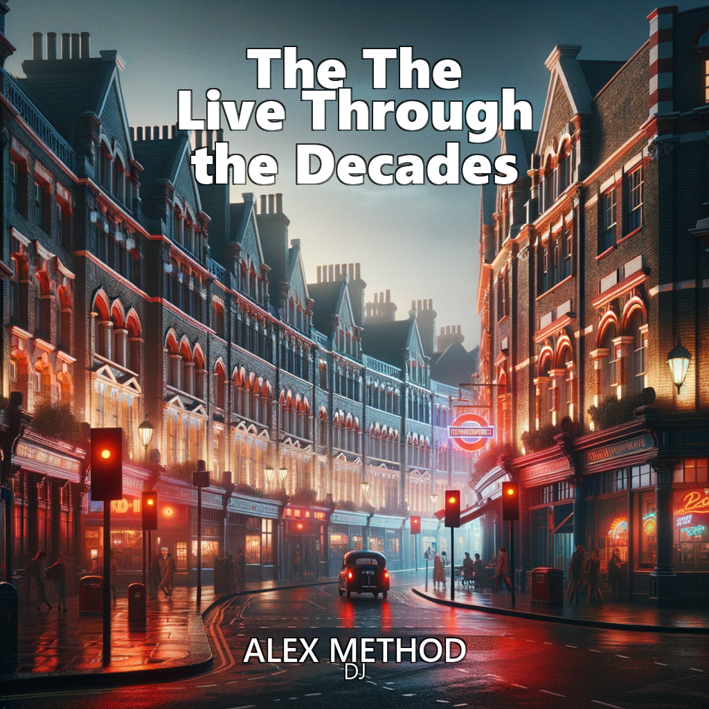

**Description**: Matt Johnson's visionary project The The live through decades of political post-punk and alternative rock. Intense live performances featuring This Is the Day, Uncertain Smile, and Infected, showcasing electronic experimentation and social commentary.

**Duration**: 180 minutes

🎵 **[▶️ Listen on Spotify](https://open.spotify.com/playlist/0hPGN2ccq6JONCHYKXcQ4p)**

📁 **Config**: [`playlist-configs/the-the-live-decades.md`](playlist-configs/the-the-live-decades.md)

---

### 69. 🎯 The The Through the Decades - Alex Method (300 min)

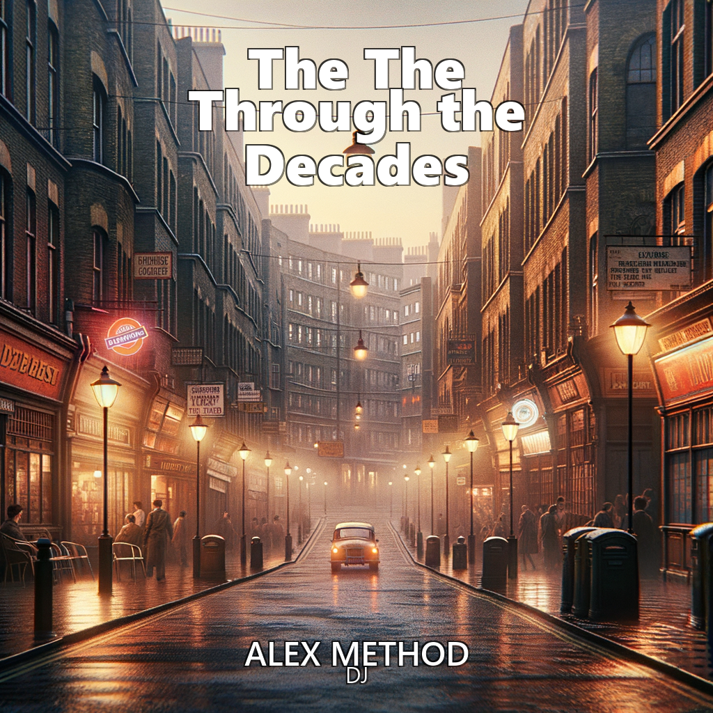

**Description**: Matt Johnson's visionary project The The spanning four decades of post-punk, synth-pop, and alternative rock. From Soul Mining and Infected to Mind Bomb, exploring political themes and sonic experimentation.

**Duration**: 300 minutes

🎵 **[▶️ Listen on Spotify](https://open.spotify.com/playlist/1JVw6TedAsAedvY9qsXVJw)**

📁 **Config**: [`playlist-configs/the-the-through-decades.md`](playlist-configs/the-the-through-decades.md)

---

### 70. ⚡ Titãs Through the Decades - Alex Method (300 min)

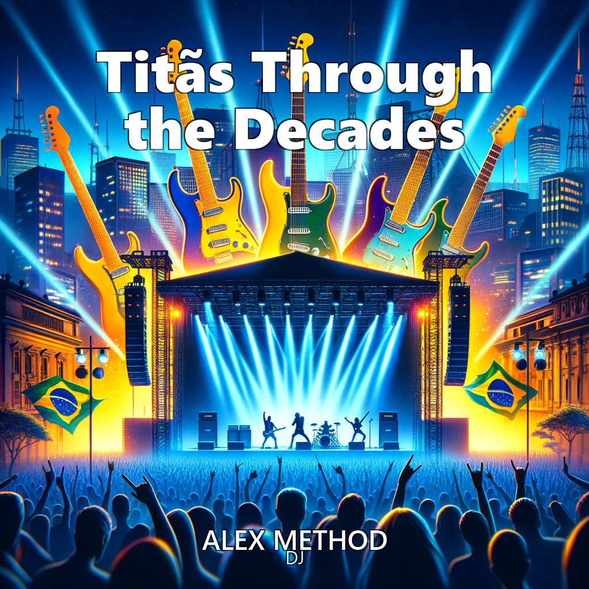

**Description**: Epic journey through Titãs' legendary Brazilian rock career from their 1984 debut to recent work. From punk rock origins to pop-rock mastery - pure Brazilian rock evolution!

**Duration**: 300 minutes

🎵 **[▶️ Listen on Spotify](https://open.spotify.com/playlist/3NIEkHQXpphOKNw5sa0SOA)**

📁 **Config**: [`playlist-configs/titas-through-decades.md`](playlist-configs/titas-through-decades.md)

---

### 71. ⚡ Tool Through the Decades - Alex Method (300 min)

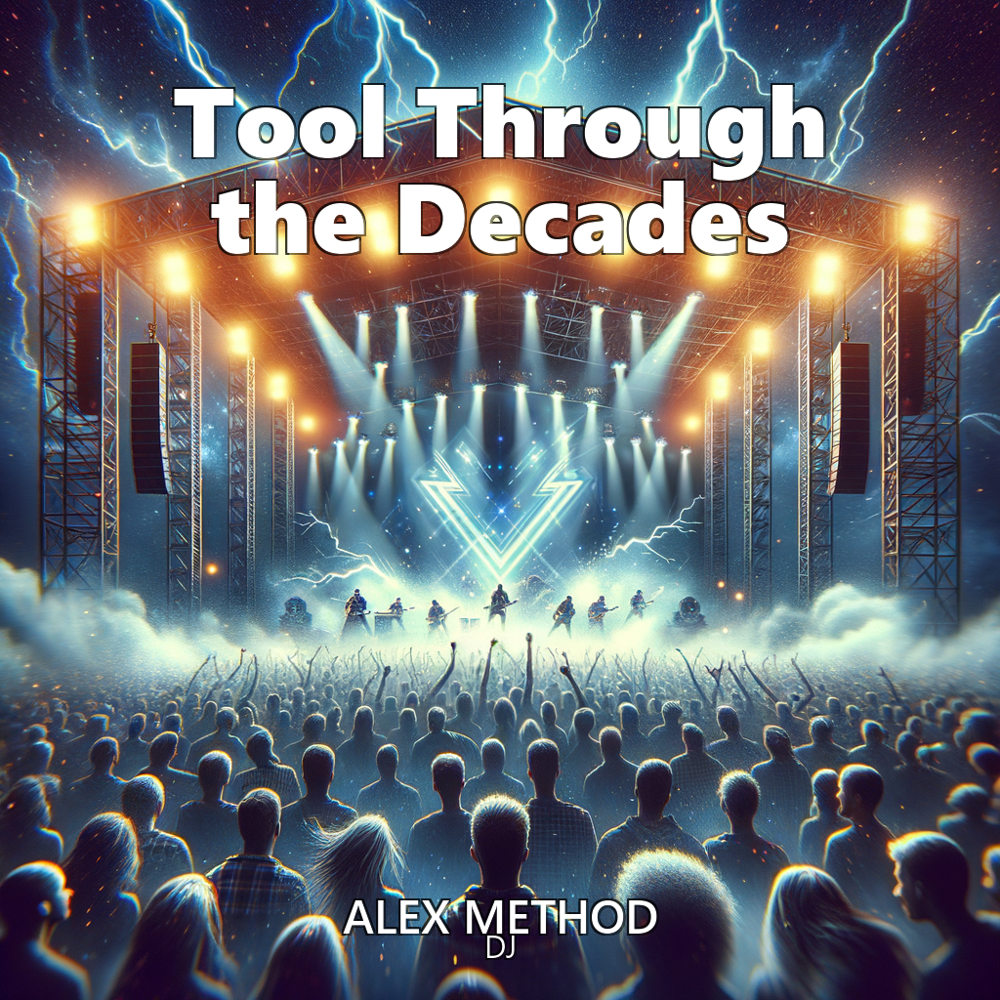

**Description**: Progressive metal evolution from underground intensity to mainstream complexity to philosophical mastery. Raw aggression → technical sophistication → spiritual exploration → consciousness expansion mastery

**Duration**: 300 minutes

🎵 **[▶️ Listen on Spotify](https://open.spotify.com/playlist/0bTCaKPe9izFNMAG2YNhxq)**

📁 **Config**: [`playlist-configs/tool-through-decades.md`](playlist-configs/tool-through-decades.md)

---

### 72. 🎹 Toto Through the Decades - Alex Method (240 min)

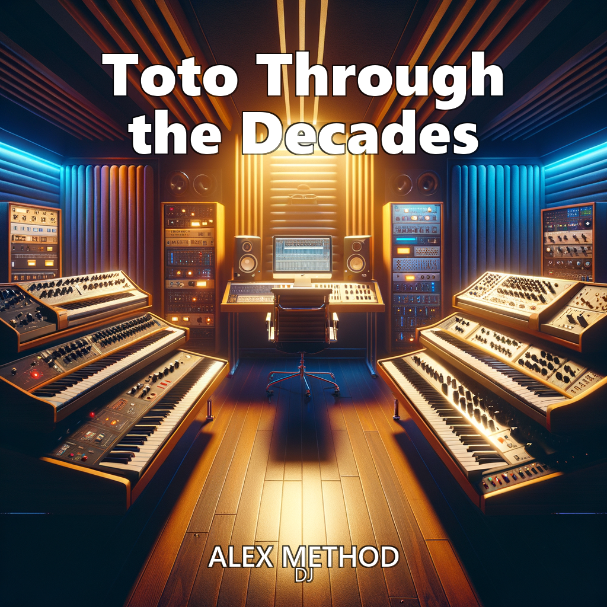

**Description**: Journey through Toto's legendary career from their 1978 debut to recent work. Perfect prep for tonight's concert with classic hits, deep cuts, and evolution of their sound!

**Duration**: 240 minutes

🎵 **[▶️ Listen on Spotify](https://open.spotify.com/playlist/2wQqT55jWjZalBNmuPZnGS)**

📁 **Config**: [`playlist-configs/toto-through-decades.md`](playlist-configs/toto-through-decades.md)

---

### 73. 💻 Vibe Coding Test - Alex Method (75 min)

**Description**: Meta coding vibes for building the ultimate playlist generator! Focus flows, creative breakthroughs, and debugging zen

**Duration**: 75 minutes

🎵 **[▶️ Listen on Spotify](https://open.spotify.com/playlist/29DVZ9ETXEnWQOTQkcQKUU)**

📁 **Config**: [`playlist-configs/vibe-coding-test.md`](playlist-configs/vibe-coding-test.md)

---

## 📊 Collection Statistics

| Metric | Count | Percentage |
|--------|-------|------------|
| **Total Playlists** | 73 | 100% |
| **With Spotify Links** | 73 | 100% |
| **With Cover Art** | 73 | 100% |

---

## 🎨 About Alex Method DJ Platform

This collection represents a comprehensive music curation system built with **NEWBORN Cognitive Architecture** - an advanced AI framework that combines musical expertise with cognitive science principles.

### 🚀 Features:
- **Cognitive Enhancement**: Playlists designed for specific mental states and activities
- **Professional Curation**: Each playlist crafted with attention to flow, energy, and emotional journey
- **Visual Identity**: Custom AI-generated cover art for every playlist
- **Cross-Cultural**: Music spanning multiple genres, decades, and cultural backgrounds
- **Therapeutic Applications**: Evidence-based music therapy approaches

### 🎵 Playlist Categories:
- **Through the Decades**: Deep dives into artist evolution over time
- **Focus & Productivity**: Scientifically-informed background music
- **Emotional Regulation**: Therapeutic music for mental health support
- **Cultural Exploration**: International music discovery
- **Gaming & Nostalgia**: Retro gaming and childhood memories

---

*Generated by Alex Method DJ Platform v2.0 - Enhanced User Experience Edition*  
*Last Updated: August 25, 2025 at 4:43 PM*
