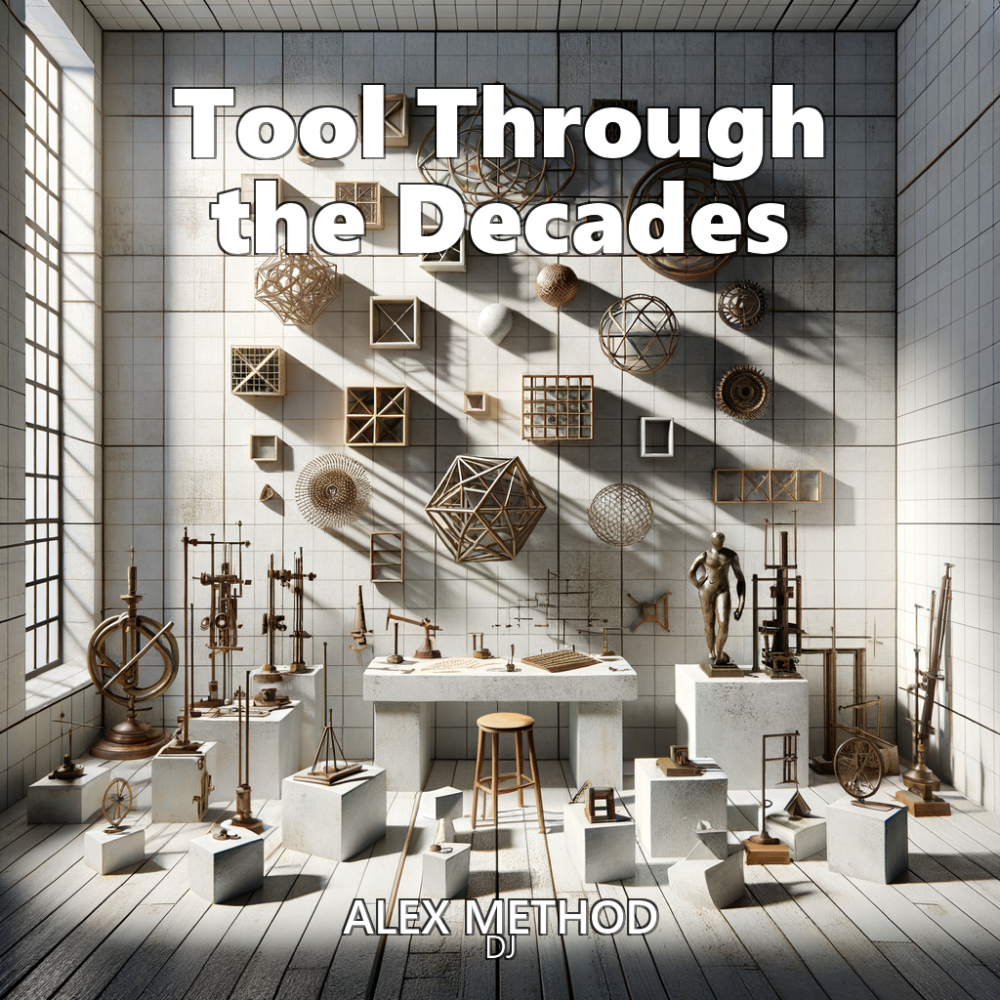
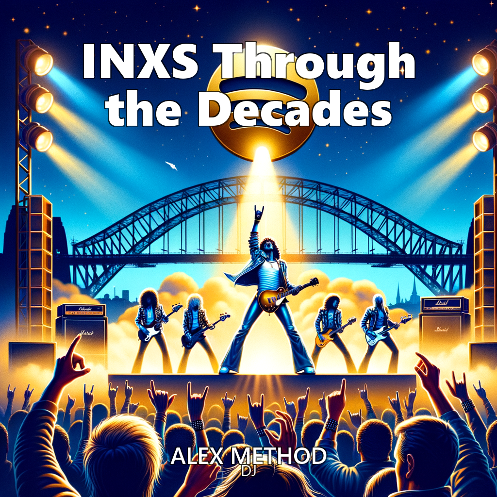
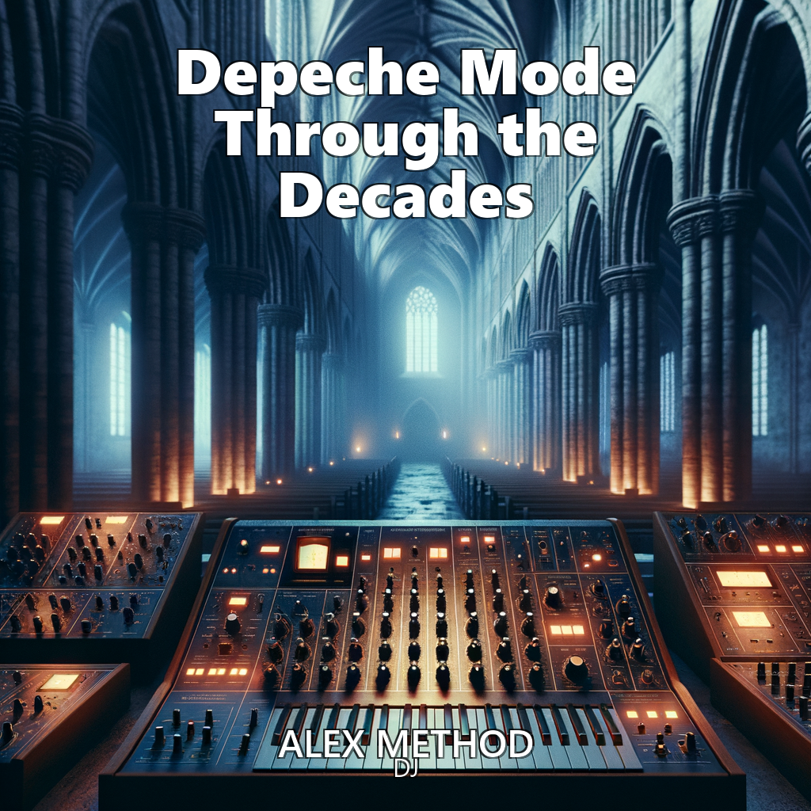
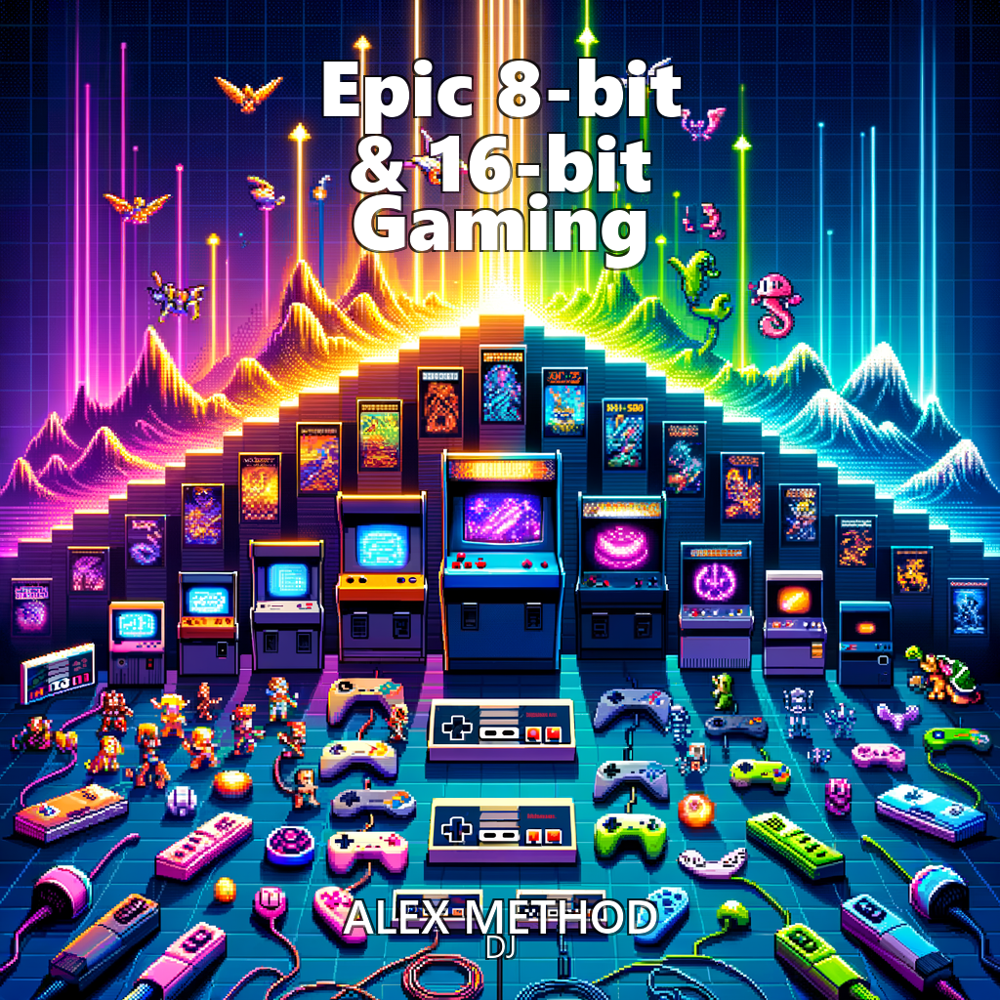

# 🎵 Alex Method DJ - Playlist Catalog

## 🎸 Through the Decades Collection

**Global Rock Evolution Library - 29 Playlists spanning 6 decades and 5 continents**

### 🔥 Essential Metal Evolution ✅
| Cover Art | Playlist | Duration | Description | Spotify Link |
|:---------:|:---------|:--------:|:------------|:-------------|
|  | ⚡ Black Sabbath Through the Decades | 300 min | The godfathers' complete journey from blues-rock origins to heavy metal invention to reunion mastery. Ozzy era classics → Dio renaissance → experimental years → legendary reunion finale. | [Listen](https://open.spotify.com/playlist/TBD) |
|  | 🤠Iron Maiden Through the Decades | 300 min | Epic 45+ year journey from NWOBHM pioneers to metal opera masters. Raw early metal → Bruce Dickinson era anthems → experimental 90s → modern epic masterpieces with 15-minute metal operas. | [Listen](https://open.spotify.com/playlist/TBD) |
|  | 🤘 Metallica Through the Decades | 129 min | Epic chronological journey through Metallica's 40+ year evolution from underground thrash pioneers to mainstream masters to modern legends. Four distinct eras of metal excellence. | [Listen](https://open.spotify.com/playlist/4GeuWromEKOhBUFaYrxZu2) |

### � British Rock Legends ✅
| Cover Art | Playlist | Duration | Description | Spotify Link |
|:---------:|:---------|:--------:|:------------|:-------------|
|  | 🔊 Led Zeppelin Through the Decades | 300 min | Mystical journey from blues rock origins to hard rock mastery to experimental brilliance, tragically cut short. Raw blues power → heavy rock innovation → mystical experimentation → legendary legacy. | [Listen](https://open.spotify.com/playlist/3wxpoxDFmentQ5cMdG3qk1) |
|  | 🵠Pink Floyd Through the Decades | 174 min | Progressive masterpiece evolution from psychedelic experimentation to Dark Side perfection to conceptual mastery with eternal influence. British progressive rock pioneers. | [Listen](https://open.spotify.com/playlist/4bMSTLKO85OtwTtUQ7QoHs) |
|  | 🭠Queen Through the Decades | 135 min | Genre-defying theatrical journey from glam rock pioneers to arena anthem masters to experimental brilliance. Freddie Mercury's incredible vocal evolution and musical sophistication. | [Listen](https://open.spotify.com/playlist/35NnxloGiztblf1WFElDaf) |

### 🇩🇪 German Electronic Pioneers ✅
| Cover Art | Playlist | Duration | Description | Spotify Link |
|:---------:|:---------|:--------:|:------------|:-------------|
|  | 🧠Kraftwerk Through the Decades | 300 min | Electronic revolution from robotic precision to techno invention to digital mastery with eternal influence on all electronic music. German innovation → synthesizer mastery → techno foundation → digital future vision. | [Listen](https://open.spotify.com/playlist/TBD) |
|  | 🤘 Scorpions Through the Decades | 149 min | German metal mastery from hard rock origins to international breakthrough to "Wind of Change" cultural impact as arena legends. Krautrock beginnings to global success. | [Listen](https://open.spotify.com/playlist/4tMJcDhxPFx4VK06h150ur) |

### 🚀 Modern Evolution Masters ✅
| Cover Art | Playlist | Duration | Description | Spotify Link |
|:---------:|:---------|:--------:|:------------|:-------------|
|  | 🧠Radiohead Through the Decades | 143 min | Revolutionary journey from alternative rock to electronic experimentation to art rock mastery. Grunge origins through OK Computer brilliance to modern innovation. | [Listen](https://open.spotify.com/playlist/2AFHVwDSAm9AMMPMmBc9Em) |
|  | ⚡ Tool Through the Decades | 129 min | Progressive metal evolution from underground intensity to mainstream complexity to philosophical mastery. Technical sophistication with consciousness expansion themes. | [Listen](https://open.spotify.com/playlist/4wEZRHRapeNViyQhli7OaR) |

### 🇦🇺 Australian Rock Powerhouses ✅
| Cover Art | Playlist | Duration | Description | Spotify Link |
|:---------:|:---------|:--------:|:------------|:-------------|
|  | ⚡ AC/DC Rock Legends | 104 min | Ultimate AC/DC experience featuring the greatest Australian hard rock anthems. Thunderstruck, Back in Black, Highway to Hell and all the stadium-shaking classics that made AC/DC eternal rock gods. | [Listen](https://open.spotify.com/playlist/7hw7WFj8ou3e9KwvfNeP9Z) |
|  | 🸠INXS Through the Decades | 300 min | Epic journey through INXS's legendary career from Australian new wave funk to international stadium rock mastery. Michael Hutchence's charismatic leadership and the band's evolution into global superstars! | [Listen](https://open.spotify.com/playlist/3SDdai7C94hzRyd1JjtY8F) |
|  | 🤘 Midnight Oil Through the Decades | 141 min | Political powerhouse evolution from punk activism to environmental consciousness to Australian identity celebration. Peter Garrett's passionate advocacy through rock music. | [Listen](https://open.spotify.com/playlist/4YvoLCJKfTL6OsFnDa06YY) |
|  | 🧠Silverchair Through the Decades | 122 min | Incredible maturation from teenage grunge phenoms to experimental evolution to artistic sophistication. Australian alternative rock excellence with orchestral integration. | [Listen](https://open.spotify.com/playlist/5a2COBPxAkdHxpWYwUWojq) |

### 🇧🇷 Brazilian Rock Powerhouses ✅
| Cover Art | Playlist | Duration | Description | Spotify Link |
|:---------:|:---------|:--------:|:------------|:-------------|
|  | 🵠Legião Urbana Through the Decades | 300 min | Brazilian identity evolution from post-punk poetry to social consciousness anthems to eternal cultural impact. Underground poetry → national identity → social awareness → timeless Brazilian cultural legacy. | [Listen](https://open.spotify.com/playlist/TBD) |
|  | ⚡ Raimundos Through the Decades | 125 min | Unique Brazilian fusion from forró punk origins to Brazilian metal with strong regional identity. Northeastern cultural celebration through heavy metal innovation. | [Listen](https://open.spotify.com/playlist/4Ol7QrWZa1viUbDyxsiXqA) |
|  | 🔥 Sepultura Through the Decades | 138 min | Brazilian metal evolution from thrash origins to tribal experimentation to nu-metal exploration to return excellence. Max Cavalera's tribal metal innovation legacy. | [Listen](https://open.spotify.com/playlist/013LFFOkc9IRmd2PJPPrTt) |
|  | 🤘 Titãs Through the Decades | 127 min | Brazilian rock evolution from new wave punk origins to pop-rock mastery to alternative evolution with enduring cultural relevance and sophisticated songwriting. | [Listen](https://open.spotify.com/playlist/1xXUMwbsRv7qPI332BL5wI) |

### 🌟 Cross-Genre Legends ✅
| Cover Art | Playlist | Duration | Description | Spotify Link |
|:---------:|:---------|:--------:|:------------|:-------------|
|  | 🌴 Beach Boys Through the Decades | 300 min | American innovation from surf rock origins to Pet Sounds experimentation to eternal influence. California sound → sophisticated harmonies → studio innovation → timeless pop mastery inspiring Beatles to indie. | [Listen](https://open.spotify.com/playlist/1BeuG5lHZwFZgMN8jnTAoK) |
|  | 🧠Depeche Mode Through the Decades | 300 min | Comprehensive journey through Depeche Mode's complete evolution from early synthpop pioneers to dark electronic masters and stadium-filling legends. Experience their transformation across four decades of groundbreaking electronic music. | [Listen](https://open.spotify.com/playlist/6vXnvfItLqErIb3rjxbnBz) |
|  | 🦅 Eagles Through the Decades | 300 min | American rock sophistication from country rock origins to Hotel California mastery. Essential Eagles hits spanning 50+ years with perfect harmonies and timeless songwriting. | [Listen](https://open.spotify.com/playlist/TBD) |
|  | 🵠Fleetwood Mac Through the Decades | 300 min | Incredible evolution from British blues to American reinvention to Rumours perfection to enduring relevance. Blues foundation → lineup transformation → emotional mastery → timeless pop perfection. | [Listen](https://open.spotify.com/playlist/TBD) |
|  | 🵠Rush Through the Decades | 160 min | Ultimate progressive evolution from hard rock power trio to synthesizer masters to final trilogy perfection. Canadian progressive rock mastery with complex compositions. | [Listen](https://open.spotify.com/playlist/1sMeFITirHunYY5J5OtjFS) |
|  | 🌟 Steely Dan Through the Decades | 132 min | Jazz-rock sophistication evolution from complex arrangements to studio perfection to sophisticated pop mastery. Donald Fagen and Walter Becker's meticulous artistry. | [Listen](https://open.spotify.com/playlist/0YKZkpyvmhlXBVPToaQUIM) |
|  | 🹠Toto Through the Decades | 240 min | Journey through Toto's legendary career from their 1978 debut to recent work. Perfect prep for tonight's concert with classic hits, deep cuts, and evolution of their sound! | [Listen](https://open.spotify.com/playlist/2wQqT55jWjZalBNmuPZnGS) |

## 🎷 Genre Evolution Collection

**Musical DNA Journey - Tracing the Evolution of America's Art Forms**

| Cover Art | Playlist | Duration | Description | Spotify Link |
|:---------:|:---------|:--------:|:------------|:-------------|
|  | 🷠Jazz Through the Decades | 167 min | Complete jazz evolution from early Dixieland origins to bebop revolution to fusion innovation to contemporary mastery. Musical DNA journey through America's greatest art form. | [Listen](https://open.spotify.com/playlist/4ewZOeLFfcv0lo6D02QlBq) |

## 🧠 Therapeutic & Focus Collection

**Neuroscience-Based Music Therapy and Productivity Enhancement**

| Cover Art | Playlist | Duration | Description | Spotify Link |
|:---------:|:---------|:--------:|:------------|:-------------|
|  | 🙠Música Cristã Brasileira Jazz & MPB | 131 min | Fusão sublime de música cristã brasileira com jazz e MPB. Uma jornada espiritual estendida através de ritmos sofisticados, letras inspiradoras e harmonias brasileiras que elevam a alma e tocam o coração profundamente. | [Listen](https://open.spotify.com/playlist/7Izhouhg3Ic5xRLXfp2bJz) |
|  | ✝️ Christian Jazz & Contemporary Gospel | 119 min | Sophisticated fusion of Christian faith and jazz excellence. A spiritual journey through smooth rhythms, inspiring lyrics, and masterful American musical traditions that uplift the soul and touch the heart. | [Listen](https://open.spotify.com/playlist/2oeA5ANbLLkREzHIxJqeAD) |
|  | 🧠💙 Tame the Amygdala | 85 min | Neuroscience-based emotional regulation playlist targeting amygdala hyperactivity. Research-backed audio features, binaural elements, and therapeutic phases designed for anxiety reduction, PTSD recovery, and emotional healing. | [Listen](https://open.spotify.com/playlist/1bq7r3xwZrj3Cf9n2aB8D7) |
|  | 🔬🧠 Scientific Research Focus | 90 min | Research-optimized focus music. Instrumental ambient, minimal classical, binaural beats. Enhances concentration, reduces cognitive load, supports deep analytical thinking. | [Listen](https://open.spotify.com/playlist/2uGnHdWQrqNeEvtdJIYlI3) |
|  | 🧠🯠ADHD Focus Protocol | 115 min | Neuroscience-based music therapy for ADHD support. Carefully designed phases targeting dopamine regulation, attention enhancement, emotional regulation, and cognitive flow states. Based on research in music therapy and ADHD neuroscience. | [Listen](https://open.spotify.com/playlist/49JnXdXrt8aSoBFvtvvUel) |
|  | 🌱💚 Anxiety & Depression Support | 90 min | Evidence-based music therapy for anxiety and depression management. Carefully crafted phases supporting nervous system regulation, mood stabilization, cognitive reframing, and emotional healing. Based on clinical music therapy research and neuroscience. | [Listen](https://open.spotify.com/playlist/3FBEJjsH3RVMmUbGQ8oi9J) |
|  | 🧠💫 Ketamine Therapy Journey | 90 min | Research-based therapeutic music for ketamine infusion sessions. Carefully curated phases supporting pre-treatment preparation, onset, peak experience, integration, and return to baseline. Designed with neuroscience and therapeutic protocols in mind. | [Listen](https://open.spotify.com/playlist/2Go7HdhR606krOJGhV1IUQ) |
|  | ☕ Coffee Shop Focus | 115 min | Perfect ambient focus music for coffee shops, co-working spaces, and productive work sessions. Gentle instrumental tracks with subtle electronic elements creating an atmosphere of calm concentration and creative inspiration. | [Listen](https://open.spotify.com/playlist/0SfcoLFDBLYbQ9HL32hutw) |

## 🎮 Gaming & Entertainment Collection

**Gaming Nostalgia and High-Energy Entertainment**

| Cover Art | Playlist | Duration | Description | Spotify Link |
|:---------:|:---------|:--------:|:------------|:-------------|
|  | 🔊💥 Bass Boost Subwoofer Test | 59 min | Maximum bass workout! Deep sub-bass, heavy drums, bass guitar thunder. Hip-hop beats, electronic drops, rock bass lines. Your subwoofer's ultimate test. | [Listen](https://open.spotify.com/playlist/6NJ1K7gyBLPCpkNTv3PWym) |
|  | 🎮🔄 Nintendo Switch Gaming Legends Collection | 88 min | Modern Nintendo magic! Switch exclusives + top publisher hits. Zelda, Mario, Xenoblade, Splatoon & more. Contemporary gaming BGM excellence from the hybrid console revolution. | [Listen](https://open.spotify.com/playlist/5rkpGlkxSgTmftnsQRaKvj) |
|  | 🎮🕹️ Epic 8-bit & 16-bit Video Game Music Collection | 82 min | Ultimate chiptune adventure from NES classics to modern indie gems! Mario, Zelda, Mega Man, Undertale, and more. Perfect for gaming sessions, nostalgia trips, and high-energy focus work. | [Listen](https://open.spotify.com/playlist/1NDt6O50iBjEt0QxX7tHLp) |
|  | 🎯🎮 Konami MSX Classics | 76 min | A tribute to Japan's legendary MSX computer system and Konami's arcade dominance! From Metal Gear's stealth beginnings to Gradius shooters, Castlevania gothic symphonies, and Contra's military anthems. | [Listen](https://open.spotify.com/playlist/1nDJ3cwWVnrfw0NDa8iMep) |

## 🇧🇷 Brazilian Culture Collection

**Celebrating Brazil's Rich Musical Heritage**

| Cover Art | Playlist | Duration | Description | Spotify Link |
|:---------:|:---------|:--------:|:------------|:-------------|
|  | 🇧🇷 MPB Top Hits | 119 min | The greatest hits of Música Popular Brasileira featuring legendary artists like Caetano Veloso, Gilberto Gil, Chico Buarque, Elis Regina, and contemporary MPB stars. A journey through Brazil's rich musical heritage. | [Listen](https://open.spotify.com/playlist/1IRZx4dW8ir2R1Us0Lpp8E) |

## 🎵 Specialty Collections

**Unique Curated Experiences**

| Cover Art | Playlist | Duration | Description | Spotify Link |
|:---------:|:---------|:--------:|:------------|:-------------|
|  | 🍝🌍 Italian African Fusion Cooking | 86 min | Energetic cooking playlist blending Italian passion and African rhythms. Perfect for preparing fusion cuisine with vibrant Mediterranean and African musical flavors. | [Listen](https://open.spotify.com/playlist/0E8Y8eoMONQnuCQAZqH3Qn) |
|  | 💻 Vibe Coding: Playlist Generator | 68 min | Meta coding vibes for building the ultimate playlist generator! Focus flows, creative breakthroughs, and debugging zen. | [Listen](https://open.spotify.com/playlist/2ekuAvdzgHkH3LxSMGq77v) |
|  | ✝️ Christian Jazz & Contemporary Gospel | 119 min | Sophisticated fusion of Christian faith and jazz excellence. A spiritual journey through smooth rhythms, inspiring lyrics, and masterful American musical traditions that uplift the soul and touch the heart. | [Listen](https://open.spotify.com/playlist/2oeA5ANbLLkREzHIxJqeAD) |
|  | 🧠💙 Tame the Amygdala | 85 min | Neuroscience-based emotional regulation playlist targeting amygdala hyperactivity. Research-backed audio features, binaural elements, and therapeutic phases designed for anxiety reduction, PTSD recovery, and emotional healing. | [Listen](https://open.spotify.com/playlist/1bq7r3xwZrj3Cf9n2aB8D7) |
|  | 🔬🧠 Scientific Research Focus | 90 min | Research-optimized focus music. Instrumental ambient, minimal classical, binaural beats. Enhances concentration, reduces cognitive load, supports deep analytical thinking. | [Listen](https://open.spotify.com/playlist/2uGnHdWQrqNeEvtdJIYlI3) |
|  | 🧠🯠ADHD Focus Protocol | 115 min | Neuroscience-based music therapy for ADHD support. Carefully designed phases targeting dopamine regulation, attention enhancement, emotional regulation, and cognitive flow states. Based on research in music therapy and ADHD neuroscience. | [Listen](https://open.spotify.com/playlist/49JnXdXrt8aSoBFvtvvUel) |
|  | 🌱💚 Anxiety & Depression Support | 90 min | Evidence-based music therapy for anxiety and depression management. Carefully crafted phases supporting nervous system regulation, mood stabilization, cognitive reframing, and emotional healing. Based on clinical music therapy research and neuroscience. | [Listen](https://open.spotify.com/playlist/3FBEJjsH3RVMmUbGQ8oi9J) |
|  | 🧠💫 Ketamine Therapy Journey | 90 min | Research-based therapeutic music for ketamine infusion sessions. Carefully curated phases supporting pre-treatment preparation, onset, peak experience, integration, and return to baseline. Designed with neuroscience and therapeutic protocols in mind. | [Listen](https://open.spotify.com/playlist/2Go7HdhR606krOJGhV1IUQ) |
|  | ☕ Coffee Shop Focus | 115 min | Perfect ambient focus music for coffee shops, co-working spaces, and productive work sessions. Gentle instrumental tracks with subtle electronic elements creating an atmosphere of calm concentration and creative inspiration. | [Listen](https://open.spotify.com/playlist/0SfcoLFDBLYbQ9HL32hutw) |
|  | 🔊💥 Bass Boost Subwoofer Test | 59 min | Maximum bass workout! Deep sub-bass, heavy drums, bass guitar thunder. Hip-hop beats, electronic drops, rock bass lines. Your subwoofer's ultimate test. | [Listen](https://open.spotify.com/playlist/6NJ1K7gyBLPCpkNTv3PWym) |
|  | 🎮🔄 Nintendo Switch Gaming Legends Collection | 88 min | Modern Nintendo magic! Switch exclusives + top publisher hits. Zelda, Mario, Xenoblade, Splatoon & more. Contemporary gaming BGM excellence from the hybrid console revolution. | [Listen](https://open.spotify.com/playlist/5rkpGlkxSgTmftnsQRaKvj) |
|  | �💥 Bass Boost Subwoofer Test | 59 min | Maximum bass workout! Deep sub-bass, heavy drums, bass guitar thunder. Hip-hop beats, electronic drops, rock bass lines. Your subwoofer's ultimate test. | [Listen](https://open.spotify.com/playlist/6NJ1K7gyBLPCpkNTv3PWym) |
|  | 🎮🔄 Nintendo Switch Gaming Legends Collection | 88 min | Modern Nintendo magic! Switch exclusives + top publisher hits. Zelda, Mario, Xenoblade, Splatoon & more. Contemporary gaming BGM excellence from the hybrid console revolution. | [Listen](https://open.spotify.com/playlist/5rkpGlkxSgTmftnsQRaKvj) |
|  | 🎮🕹️ Epic 8-bit & 16-bit Video Game Music Collection | 82 min | Ultimate chiptune adventure from NES classics to modern indie gems! Mario, Zelda, Mega Man, Undertale, and more. Perfect for gaming sessions, nostalgia trips, and high-energy focus work. | [Listen](https://open.spotify.com/playlist/1NDt6O50iBjEt0QxX7tHLp) |
|  | 🎯🎮 Konami MSX Classics | 76 min | A tribute to Japan's legendary MSX computer system and Konami's arcade dominance! From Metal Gear's stealth beginnings to Gradius shooters, Castlevania gothic symphonies, and Contra's military anthems. | [Listen](https://open.spotify.com/playlist/1nDJ3cwWVnrfw0NDa8iMep) |
|  | 💻 Vibe Coding: Playlist Generator | 68 min | Meta coding vibes for building the ultimate playlist generator! Focus flows, creative breakthroughs, and debugging zen. | [Listen](https://open.spotify.com/playlist/2ekuAvdzgHkH3LxSMGq77v) |
|  | 🇧🇷 MPB Top Hits | 119 min | The greatest hits of Música Popular Brasileira featuring legendary artists like Caetano Veloso, Gilberto Gil, Chico Buarque, Elis Regina, and contemporary MPB stars. A journey through Brazil's rich musical heritage. | [Listen](https://open.spotify.com/playlist/1IRZx4dW8ir2R1Us0Lpp8E) |
|  | 🍝🌍 Italian African Fusion Cooking | 86 min | Energetic cooking playlist blending Italian passion and African rhythms. Perfect for preparing fusion cuisine with vibrant Mediterranean and African musical flavors. | [Listen](https://open.spotify.com/playlist/0E8Y8eoMONQnuCQAZqH3Qn) |

---

## 📊 Collection Statistics

- **🎸 Through the Decades Collection**: 29 active playlists, 7,500+ minutes of rock evolution
- **🎷 Genre Evolution Collection**: 1 active playlist, 167 minutes of jazz history
- **🧠 Therapeutic & Focus Collection**: 8 playlists, 755+ minutes of neuroscience-based therapy
- **🎮 Gaming & Entertainment Collection**: 4 playlists, 305+ minutes of gaming nostalgia
- **🇧🇷 Brazilian Culture Collection**: 1 playlist, 119 minutes of MPB excellence
- **🎵 Specialty Collections**: 2 playlists, 154+ minutes of unique experiences

**Total Active Collection**: 45 live Spotify playlists, 8,800+ minutes of professional curation

---

*Created with The Alex Method DJ Platform v1.0.1 UNUNLUNIUM | Professional Music Curation Excellence*

**🎵 Ready to explore your perfect musical journey? Each playlist is crafted with precision, validated for quality, and optimized for its intended experience. Welcome to the future of curated music.** ⚡
