# 🚀 Template Setup Guide

Transform this into your professional GitHub portfolio with a cognitive architecture AI assistant in under 10 minutes!

## 🎯 What You'll Get

✅ **Automated portfolio**: Script generates your repository showcase
✅ **Professional README**: Ready-to-use profile with stats and badges
✅ **Repository management**: Organized, categorized project listings
✅ **AI-powered maintenance**: Alex Finch assistant for streamlined updates
✅ **GPT-4o integration**: AI-enhanced descriptions (works out-of-the-box)
✅ **Cognitive architecture**: Structured memory system for project tracking
✅ **Easy maintenance**: One command updates everything
✅ **Optional automation**: Complete hands-off daily updates (5-minute setup)

## 🏃‍♂️ Quick Start

**First time here?** Choose your path:

### 🆕 Creating Your Portfolio
1. Click the green **"Use this template"** button above
2. Name your new repository: `[your-username]/[your-username]`
   > 💡 This special naming creates your GitHub profile README
3. Set to **Public** (required for profile)
4. Click **"Create repository from template"**
5. Clone your new repository locally
   ```bash
   gh repo clone [your-username]/[your-username]
   cd [your-username]
   ```

> 🎯 **You'll get**: Automated portfolio system + AI assistant with cognitive architecture

### 🤝 Contributing Improvements
1. Click **"Fork"** → **"Create fork"**
2. Clone locally and make improvements
3. Submit pull requests to help others

```mermaid
flowchart TD
    A[🚀 Start: Template Setup] --> B{Choose Your Path}

    B -->|🏃 Quick & Simple| C[🚀 Path A: Manual Updates]
    B -->|🤖 Set & Forget| D[🤖 Path B: Complete Automation]

    C --> C1[⚡ 10 minutes setup]
    C1 --> C2[📝 Manual updates when needed]
    C2 --> C3[✨ Professional portfolio]

    D --> D1[⚡ 15 minutes setup]
    D1 --> D2[🔐 Create PAT token]
    D2 --> D3[⚙️ Configure automation]
    D3 --> D4[🤖 Daily auto-updates at 6 AM UTC]
    D4 --> D5[✨ Zero-maintenance portfolio]

    C3 --> E[🎯 Your Dynamic GitHub Profile]
    D5 --> E

    style A fill:#e1f5fe
    style B fill:#fff3e0
    style C fill:#e8f5e8
    style D fill:#f3e5f5
    style E fill:#fff9c4
```



## ⚡ Setup (Choose Your Path)

### 🚀 Path A: Quick Start (Manual Updates)
**Time: 10 minutes | Perfect for: Getting started quickly**

#### Step 1: Install GitHub CLI
**Windows:**
```bash
winget install GitHub.cli
```
**Mac/Linux:** Download from [cli.github.com](https://cli.github.com/)

Then authenticate:
```bash
gh auth login
```

#### Step 2: Configure PowerShell (Windows Only)
```powershell
Set-ExecutionPolicy -ExecutionPolicy RemoteSigned -Scope CurrentUser
```

#### Step 3: Make It Yours
**Required changes:**
- 🖼️ Replace `ALEX-CODING.png` with your banner image (1200x400px recommended)
- 📝 Edit `README.md` - update name, bio, skills, contact info
- 🤖 Edit `.github/copilot-instructions.md` - change "Alex Finch" to your name
- 🧠 Update `.github/MEMORY.md` with your project context

#### Step 4: Generate Your Portfolio
```powershell
.\check-forks.ps1
```
✅ **Done!** Your portfolio is ready. Re-run the script whenever you want to update.

### 🤖 Path B: Complete Automation (Set & Forget)
**Time: 15 minutes | Perfect for: Hands-off maintenance**

**Complete Steps 1-4 above, then continue:**

#### Step 5: Create Personal Access Token
1. **Visit**: https://github.com/settings/personal-access-tokens/new
2. **Configure**:
   - **Name**: `portfolio-automation`
   - **Expiration**: `90 days` (you'll get renewal reminders)
   - **Repository access**: Selected repositories → Your `[username]/[username]` repo
   - **Permissions** (Repository permissions):
     - ✅ **Contents**: `Write`
     - ✅ **Pull requests**: `Write`
     - ✅ **Metadata**: `Read`
     - ✅ **Actions**: `Read`
3. **Generate token** and **copy the value** (starts with `github_pat_`)

#### Step 6: Add Repository Secret
1. **Visit**: `https://github.com/[your-username]/[your-username]/settings/secrets/actions`
2. **Click**: "New repository secret"
3. **Enter**:
   - **Name**: `PAT_TOKEN` (exactly this, case-sensitive)
   - **Secret**: Paste your token from Step 5
4. **Click**: "Add secret"

#### Step 7: Enable Repository Auto-merge
1. **Visit**: `https://github.com/[your-username]/[your-username]/settings`
2. **Scroll to**: "Pull Requests" section
3. **Check**: ✅ "Allow auto-merge"

#### Step 8: Create Branch Protection Rule
1. **Visit**: `https://github.com/[your-username]/[your-username]/settings/branch_protection_rules/new`
2. **Enter**:
   - **Branch name pattern**: `main`
   - **Leave all checkboxes unchecked** (minimal protection)
3. **Click**: "Create"

#### Step 9: Test Your Automation
```bash
# Trigger a test run
gh workflow run "🤖 Daily Repository Analysis Update" --ref main

# Wait 30 seconds, then check if it worked
gh run list --workflow=update-repos.yml --limit 1
```

**Success indicators:**
- ✅ Workflow shows green checkmark (not red X)
- ✅ PR gets created automatically
- ✅ PR merges automatically within a minute

#### Step 10: Understanding GPT-4o Enhancement
Your workflow includes GPT-4o AI enhancement:

**🧠 GPT-4o Enhancement (Default)** - Enabled automatically
- ✅ Works immediately, no setup required
- ✅ Free with GitHub Copilot subscription
- ✅ Professional AI-enhanced descriptions
- ✅ Automatic technology stack identification

**To manually control AI enhancement**:
```bash
# Enable GPT-4o enhancement (default)
gh workflow run "🤖 Daily Repository Analysis Update" --ref main -f llm_model=enabled

# Disable AI enhancement (use original descriptions)
gh workflow run "🤖 Daily Repository Analysis Update" --ref main -f llm_model=disabled
```

**To change the default**: Edit the workflow file `.github/workflows/update-repos.yml` and modify the `default:` value under `llm_model`.
- ✅ PR merges automatically within a minute

✅ **Automation Complete!** Your portfolio now updates itself daily at 6 AM UTC.

## 🔧 AI Assistant Configuration
## 🔧 AI Assistant Configuration

The template includes a cognitive architecture system with your AI assistant:

**Key files to understand:**
- 📋 `.github/copilot-instructions.md` - AI assistant behavior (change "Alex Finch" to your name)
- 🧠 `.github/MEMORY.md` - Project decisions and context
- ✅ `.github/TODO.md` - Task tracking and priorities
- 🔄 `COGNITIVE.md` - How the AI system works

### 🤖 Customizing Your AI Assistant
Edit `.github/copilot-instructions.md` and replace:

```markdown
## Identity & Introduction
- **ALWAYS** introduce yourself as "[Your Name]" when asked for your name
- Act as a knowledgeable repo manager with expertise in [your domain]

## Behaviors
- **Name**: When asked for your name, respond with "[Your Name]"
```

> 📚 **Learn more**: Read `COGNITIVE.md` for the complete system overview

## 🧠 GPT-4o AI Enhancement

### � GPT-4o Integration (Default)
Enhance your repository descriptions with AI-powered content generation:

- **What it does**: Generates professional, technical descriptions for your repositories
- **Cost**: Free with GitHub Copilot subscription (or standard OpenAI rates)
- **Setup time**: Works out of the box!
- **Default behavior**: Enabled for all users

**GPT-4o Enhancement Features:**
- ✅ Professional, technical writing style
- ✅ Automatic technology stack identification
- ✅ Consistent tone across your portfolio
- ✅ Smart fallback to original descriptions if needed

**To disable AI enhancement:**
```bash
gh workflow run "🤖 Daily Repository Analysis Update" --ref main -f llm_model=disabled
```

> 💡 **Note**: GPT-4o works seamlessly out of the box with no configuration required!

## 🛠️ Advanced Customization

### 📂 Repository Categories
Want custom categories? Edit the patterns in `check-forks.ps1`:

```powershell
switch -Regex ($repo.name) {
    "^api|^service" { $category = "Backend Services" }
    "^ui|^web|^frontend" { $category = "Frontend Projects" }
    "^ml|^ai|^data" { $category = "Data Science & AI" }
    "^tool|^util" { $category = "Tools & Utilities" }
    # Add your own patterns here
}
```

### 🏅 Skill Badges
Add your expertise to `README.md`:
```markdown


```

## 📁 What Each File Does

| File | Purpose | Action Needed |
|------|---------|---------------|
| `README.md` | Your main profile page | ✏️ **Customize heavily** |
| `REPOS.md` | Detailed project showcase | 📝 Update descriptions |
| `check-forks.ps1` | Magic automation script | ▶️ Just run it |
| `repo-analysis.json` | Generated portfolio data | 🤖 Auto-created |
| `[your-banner].png` | Profile header image | 🖼️ Replace with yours |
| **Cognitive Architecture Files** | | |
| `.github/copilot-instructions.md` | AI assistant behavior (enhanced) | 🤖 Customize for your needs |
| `.github/MEMORY.md` | Project memory & decisions (optimized) | 📝 Update with your context |
| `.github/TODO.md` | Task tracking system | ✅ Add your priorities |
| `COGNITIVE.md` | System documentation | 📚 Reference guide |
| `PAPER.md` | Academic research paper | 📄 Optional reading |

## 🔄 Keeping It Fresh

### Monthly Refresh
```powershell
.\check-forks.ps1
```
> 🔄 Updates all your repository stats and data

### As You Build
- 📝 Update project descriptions in `REPOS.md`
- 🆕 Add new repositories and they'll auto-appear
- 🏷️ Use clear, searchable repository names

## 🔄 Maintaining Your Portfolio

### 📅 Daily Automated Updates (Path B users)
If you set up automation, your portfolio updates itself every day at 6 AM UTC:
1. 🔍 Scans all your repositories
2. 📊 Updates statistics and timestamps
3. 🌿 Creates branch with changes (if any)
4. 📋 Generates detailed PR with AI integration
5. ✅ Auto-merges PR when validation passes
6. 🗑️ Cleans up temporary branches

### 🔄 Manual Updates (Path A users)
Run this whenever you want to refresh your portfolio:
```powershell
.\check-forks.ps1
```

### 🛠️ Troubleshooting Automation

**Workflow fails with permission errors:**
- Verify PAT_TOKEN secret exists and has all 4 required permissions

**PR created but doesn't auto-merge:**
- Check "Allow auto-merge" is enabled in repository settings
- Verify branch protection rule exists for `main` branch

**No changes detected:**
- Normal behavior - automation only creates PRs when data actually changes

**Token expired:**
- Create new PAT token and update PAT_TOKEN secret (every 90 days)

**Need detailed help?**
- Check `PAT-VERIFICATION.md` and `TROUBLESHOOTING.md` in your repository

## 🎯 What's Next?

### 📝 Customize Your Portfolio
- Edit `README.md` to personalize your introduction
- Modify `REPOS.md` to highlight specific projects
- Update `CONTRIBUTING.md` with your preferences

### 🔍 Monitor Your Automation (Path B users)
- Check Actions tab for daily workflow runs: `https://github.com/[USERNAME]/[USERNAME]/actions`
- Review auto-generated PRs for accuracy
- Token expires every 90 days - set a calendar reminder

### 🤝 Contribute Back
Found improvements? The template welcomes contributions! See `CONTRIBUTING.md` for details.

### 📚 Advanced Usage
- **Alex Finch Integration**: Your automation includes an AI assistant persona for enhanced PR descriptions
- **Cognitive Architecture**: The system maintains memory and context across updates
- **Data Analysis**: Explore `repo-analysis.json` for detailed repository insights

---

**🎉 Congratulations!** Your dynamic GitHub portfolio is ready. Whether updating manually or running fully automated, your profile will always showcase your latest work professionally.

## 💡 Pro Tips

🎯 **Repository naming**: Use descriptive names like `ai-chatbot` not `project1`
📸 **Banner image**: Keep under 1MB, use 1200x400px for best results
🔍 **SEO friendly**: Include tech keywords in descriptions
📊 **GitHub stats**: Set repositories to Public to show in your stats
🤖 **AI assistant**: Use "meditate" command to consolidate insights and verify consistency
📝 **Memory management**: Update `.github/MEMORY.md` with key decisions and `.github/TODO.md` with priorities
⚙️ **AI customization**: Modify `.github/copilot-instructions.md` to match your working style
🔄 **Automation**: Run `check-forks.ps1` weekly to keep portfolio data fresh

## 🆘 Need Help?

**Script not working?**
```bash
gh auth status  # Check if you're logged in
```

**PowerShell blocked?**
```powershell
Set-ExecutionPolicy -ExecutionPolicy RemoteSigned -Scope CurrentUser
```

**Still stuck?**
- 📋 Check the [Issues](../../issues) section
- 📚 Review `REPO-MANAGEMENT.md` for detailed guidance
- 🔍 Search existing solutions before creating new issues

---

💫 **Ready to build something amazing?** Your portfolio is just three steps away!
