# Self-Updating GitHub Profile Template - User Guide

<p align="center">
  
  
  
</p>

## Overview

This repository serves as both a **professional GitHub profile** and a **reusable template** for creating your own self-maintaining portfolio. The automation framework uses PowerShell and GitHub Actions to keep your repository list, statistics, and documentation always current.

### 🚀 Choose Your Path

```mermaid
flowchart TD
    A[🚀 Start: Template Setup] --> B{Choose Your Path}

    B -->|🏃 Quick & Simple| C[🚀 Path A: Manual Updates]
    B -->|🤖 Set & Forget| D[🤖 Path B: Complete Automation]

    C --> C1[⚡ 10 minutes setup]
    C1 --> C2[📝 Manual updates when needed]
    C2 --> C3[✨ Professional portfolio]

    D --> D1[⚡ 15 minutes setup]
    D1 --> D2[🔐 Create PAT token]
    D2 --> D3[⚙️ Configure automation]
    D3 --> D4[🤖 Daily auto-updates at 6 AM UTC]
    D4 --> D5[✨ Zero-maintenance portfolio]

    C3 --> E[🎯 Your Dynamic GitHub Profile]
    D5 --> E

    style A fill:#e1f5fe
    style B fill:#fff3e0
    style C fill:#e8f5e8
    style D fill:#f3e5f5
    style E fill:#fff9c4
```



**Path A (Quick Start)**: Perfect for getting started quickly - manual updates when needed (10 minutes)
**Path B (Full Automation)**: Set it and forget it - daily automatic updates (15 minutes)

---

## Table of Contents

1. [What You Get](#what-you-get)
2. [Prerequisites](#prerequisites)
3. [Quick Start](#quick-start)
4. [GitHub Actions Setup (Full Automation)](#github-actions-setup-full-automation)
5. [Configuration](#configuration)
6. [AI Assistant Configuration](#ai-assistant-configuration)
7. [Automation Architecture](#automation-architecture)
8. [Local Development](#local-development)
9. [Customization Guide](#customization-guide)
10. [Troubleshooting](#troubleshooting)
11. [Best Practices](#best-practices)
12. [Pro Tips](#pro-tips)

---

## What You Get

### ✨ Core Features

- **🔄 Automated Repository Discovery**: Dynamically fetches all your repositories via GitHub API
- **📊 Live Statistics**: Real-time counts of repositories, languages, stars, and forks
- **🏷️ Smart Categorization**: Automatically organizes projects into logical categories
- **📄 Auto-Generated Documentation**: Creates and updates `REPOS.md` with current data
- **🤖 GitHub Actions Integration**: Daily automated updates at 6 AM UTC
- **✅ Auto-Merge Capability**: Optional hands-free PR merging
- **🎨 Professional Layout**: Clean badges, organized sections, and beautiful formatting
- **🔍 Fork Detection**: Shows parent relationships and tracks community contributions
- **📈 Scalable**: Handles unlimited repositories automatically

### 🎯 Perfect For

- Software developers showcasing their portfolio
- Academic researchers documenting projects
- Open-source maintainers tracking contributions
- Students building their professional presence
- Anyone wanting a dynamic, always-current GitHub profile

---

## Prerequisites

### Required Tools

1. **GitHub CLI (`gh`)**: Version >= 2.55
   ```powershell
   # Install on Windows
   winget install --id GitHub.cli

   # Verify installation
   gh --version
   ```

2. **PowerShell**: Version 5.1 or later (included with Windows)
   ```powershell
   # Check version
   $PSVersionTable.PSVersion
   ```

3. **Git**: For repository operations
   ```powershell
   # Verify installation
   git --version
   ```

### GitHub Authentication

Authenticate GitHub CLI to access your repositories:
```powershell
gh auth login
```

Follow the prompts to authenticate via browser or token.

---

## Quick Start

### Step 1: Use This Template

1. Click the **"Use this template"** button at the top of this repository
2. Name your new repository: `<your-username>/<your-username>`
   - Example: `johndoe/johndoe`
   - This creates a special GitHub profile README

3. Set repository to **Public**
4. Click **"Create repository from template"**

### Step 2: Clone Your Repository

```powershell
git clone https://github.com/<your-username>/<your-username>.git
cd <your-username>
```

### Step 3: Initial Customization

Edit `README.md` to replace placeholder content with your information:

```markdown
# Key Sections to Update:
- Name and title
- Location and role
- Specialization areas
- About Me section
- Research/project descriptions
- Contact information
```

### Step 4: Run First Update

```powershell
# Generate your repository portfolio
.\refresh-repos.ps1
```

This will:
- Fetch all your GitHub repositories
- Categorize them automatically
- Generate `REPOS.md`
- Create `repo-analysis.json`

### Step 5: Review and Commit

```powershell
git add .
git commit -m "feat: initial profile customization"
git push origin main
```

---

## Configuration

### Repository Categorization

The script automatically categorizes repositories based on naming patterns and topics. You can customize categories by editing `refresh-repos.ps1`:

```powershell
# Example category patterns
$categories = @{
    "Cognitive Architecture" = @("catalyst", "alex", "cognitive")
    "AI/ML" = @("ai", "ml", "model", "agent")
    "Academic Tools" = @("academic", "research", "paper")
    "Web Development" = @("web", "app", "frontend")
    # Add your own categories
}
```

### Exclusion Rules

Exclude specific repositories from appearing in your portfolio:

```powershell
# Edit refresh-repos.ps1
$excludeRepos = @(
    "private-project",
    "test-repo",
    "archived-work"
)
```

### Badge Customization

Modify badges in `README.md` to match your tech stack:

```markdown

```

Browse badges at: [shields.io](https://shields.io)

---

## AI Assistant Configuration

The template includes an optional cognitive architecture system for AI-powered portfolio maintenance (e.g., GitHub Copilot integration).

### Key Files

| File | Purpose |
|------|---------|
| `.github/copilot-instructions.md` | AI assistant behavior and personality |
| `.github/MEMORY.md` | Project decisions and context |
| `.github/TODO.md` | Task tracking and priorities |
| `COGNITIVE.md` | Complete system documentation |

### Customizing Your AI Assistant

Edit `.github/copilot-instructions.md` to personalize the AI assistant:

```markdown
## Identity & Introduction
- **ALWAYS** introduce yourself as "[Your Name]" when asked for your name
- Act as a knowledgeable repo manager with expertise in [your domain]

## Behaviors
- **Name**: When asked for your name, respond with "[Your Name]"
- **Response style**: [Your preferred communication style]
- **Focus areas**: [Your areas of expertise]
```

### Using the Cognitive System

The AI assistant can help with:
- **Portfolio maintenance**: Keeping README and REPOS.md current
- **Task tracking**: Managing `.github/TODO.md` priorities
- **Context preservation**: Maintaining `.github/MEMORY.md` decisions
- **Consistency**: Use "meditate" command to consolidate and verify

> 📚 **Learn more**: Read `COGNITIVE.md` for complete system documentation

---

## Automation Architecture

### How It Works


### Files Involved

| File | Purpose |
|------|---------|
| `refresh-repos.ps1` | Main automation script - fetches and processes repository data |
| `repo-analysis.json` | Machine-readable repository metadata |
| `REPOS.md` | Human-readable portfolio documentation |
| `.github/workflows/update-repos.yml` | GitHub Actions workflow configuration |
| `check-forks.ps1` | Helper script for fork relationship detection |
| `auto-update-repos.ps1` | Wrapper script for automated updates |

---

## Local Development

### Manual Portfolio Update

Run locally whenever you want to refresh your portfolio:

```powershell
.\refresh-repos.ps1
```

### Testing Changes

Before pushing, verify the generated files:

```powershell
# Check generated documentation
cat REPOS.md

# Verify JSON data
cat repo-analysis.json | ConvertFrom-Json | Format-List

# Review changes
git diff
```

### Workflow Commands

```powershell
# Complete workflow (recommended)
.\refresh-repos.ps1
git add .
git commit -m "docs: update repository portfolio"
git push origin main

# Quick check without committing
.\refresh-repos.ps1
git status
```

---

## GitHub Actions Setup (Full Automation)

### Complete Automation - Path B

If you want fully hands-free portfolio updates, follow these steps to enable GitHub Actions automation.

#### Step 1: Create Personal Access Token (PAT)

1. **Visit**: https://github.com/settings/personal-access-tokens/new
2. **Configure**:
   - **Name**: `portfolio-automation`
   - **Expiration**: `90 days` (you'll get renewal reminders)
   - **Repository access**: Selected repositories → Your `[username]/[username]` repo
   - **Permissions** (Repository permissions):
     - ✅ **Contents**: `Write`
     - ✅ **Pull requests**: `Write`
     - ✅ **Metadata**: `Read`
     - ✅ **Actions**: `Read`
3. **Generate token** and **copy the value** (starts with `github_pat_`)

> ⚠️ **Important**: Copy the token now - you won't be able to see it again!

#### Step 2: Add Repository Secret

1. **Visit**: `https://github.com/[your-username]/[your-username]/settings/secrets/actions`
2. **Click**: "New repository secret"
3. **Enter**:
   - **Name**: `PAT_TOKEN` (exactly this, case-sensitive)
   - **Secret**: Paste your token from Step 1
4. **Click**: "Add secret"

#### Step 3: Enable Repository Auto-merge

1. **Visit**: `https://github.com/[your-username]/[your-username]/settings`
2. **Scroll to**: "Pull Requests" section
3. **Check**: ✅ "Allow auto-merge"
4. **Save changes**

#### Step 4: Create Branch Protection Rule (Optional but Recommended)

1. **Visit**: `https://github.com/[your-username]/[your-username]/settings/branch_protection_rules/new`
2. **Enter**:
   - **Branch name pattern**: `main`
   - **Leave all checkboxes unchecked** (minimal protection for auto-merge)
3. **Click**: "Create"

#### Step 5: Test Your Automation

```powershell
# Trigger a test run
gh workflow run "🤖 Daily Repository Analysis Update" --ref main

# Wait 30 seconds, then check if it worked
gh run list --workflow=update-repos.yml --limit 1
```

**Success indicators:**
- ✅ Workflow shows green checkmark (not red X)
- ✅ PR gets created automatically
- ✅ PR merges automatically within a minute

✅ **Automation Complete!** Your portfolio now updates itself daily at 6 AM UTC.

### Workflow Configuration

The repository includes a pre-configured GitHub Actions workflow that runs daily.

#### Configuration File: `.github/workflows/update-repos.yml`

```yaml
name: Update Repository Portfolio

on:
  schedule:
    - cron: '0 6 * * *'  # Daily at 6 AM UTC
  workflow_dispatch:     # Manual trigger

jobs:
  update:
    runs-on: ubuntu-latest
    steps:
      - uses: actions/checkout@v4
      - name: Run portfolio update
        run: pwsh ./refresh-repos.ps1
      - name: Create Pull Request
        uses: peter-evans/create-pull-request@v5
        with:
          title: 'chore: automated repository portfolio update'
          branch: 'automated-update'
          delete-branch: true
      - name: Enable auto-merge
        run: gh pr merge --auto --squash
        env:
          GH_TOKEN: ${{ secrets.PAT_TOKEN }}
```

### Manual Trigger

Run the workflow on-demand:

1. Go to **Actions** tab in your repository
2. Select **"Update Repository Portfolio"** workflow
3. Click **"Run workflow"**
4. Select branch (usually `main`)
5. Click **"Run workflow"** button

### Token Maintenance

> 📅 **Important**: PAT tokens expire every 90 days. Set a calendar reminder to:
> 1. Create a new token (same steps as above)
> 2. Update the `PAT_TOKEN` secret in repository settings
> 3. Test the workflow to ensure it still works

---

## Customization Guide

### 1. Personalize README Header

```markdown
# Replace banner image


# Update name and title
<h1 align="center">Your Name</h1>
<em>Your Professional Title | Your Institution | Your Focus</em>
```

### 2. Add Custom Sections

```markdown
## Your Custom Section

Your content here with badges, links, and formatting.

<p align="center">
  <a href="your-link">
    
  </a>
</p>
```

### 3. Modify Tech Stack

Replace the tech stack section with your technologies:

```markdown
**Core Technologies**: Your languages and frameworks

**Specializations**: Your unique skills and methodologies
```

### 4. Update Contact Information

```markdown
- **Your Role**: your-email@company.com
- **Personal**: your-personal@email.com
- **Schedule Meeting**: your-booking-link
```

### 5. Customize Automation Timing

Edit `.github/workflows/update-repos.yml`:

```yaml
schedule:
  - cron: '0 12 * * *'  # Daily at noon UTC
  - cron: '0 0 * * 1'   # Weekly on Monday
  - cron: '0 0 1 * *'   # Monthly on 1st
```

Use [crontab.guru](https://crontab.guru) for scheduling help.

---

## Troubleshooting

### Common Issues

#### 1. **Script fails with "gh: command not found"**

**Solution**: Install GitHub CLI
```powershell
winget install --id GitHub.cli
gh auth login
```

#### 2. **Authentication errors**

**Solution**: Re-authenticate GitHub CLI
```powershell
gh auth logout
gh auth login
```

#### 3. **Workflow doesn't run automatically**

**Checks**:
- Verify workflow file is in `.github/workflows/`
- Ensure repository has had activity in last 60 days
- Check Actions tab for error messages
- Verify cron syntax is correct

#### 4. **Empty or incorrect repository list**

**Solution**: Verify API access
```powershell
gh repo list --limit 100 --json name,description
```

#### 5. **Categories not working as expected**

**Debug**: Check repository names and topics
```powershell
gh repo view <repo-name> --json name,repositoryTopics
```

### Debug Mode

Enable verbose output in PowerShell:

```powershell
$VerbosePreference = "Continue"
.\refresh-repos.ps1
```

### Getting Help

- **Template Issues**: [Open an issue](https://github.com/fabioc-aloha/fabioc-aloha/issues)
- **GitHub Actions**: [GitHub Actions Documentation](https://docs.github.com/actions)
- **PowerShell**: [PowerShell Documentation](https://docs.microsoft.com/powershell)

---

## Best Practices

### 1. **Keep README Focused**

- Highlight your most important projects
- Use clear, professional language
- Avoid overloading with too many badges
- Update contact information regularly

### 2. **Maintain Repository Quality**

- Add descriptions to all public repositories
- Use topics/tags for better categorization
- Keep repositories organized and well-documented
- Archive old/inactive projects

### 3. **Customize Thoughtfully**

- Align automation with your workflow
- Don't auto-merge if you want manual review
- Adjust update frequency based on your activity
- Test locally before relying on automation

### 4. **Professional Presentation**

- Use high-quality banner images
- Maintain consistent formatting
- Proofread all content
- Keep sections concise and scannable

### 5. **Security Considerations**

- Never commit tokens or secrets
- Use GitHub's built-in secrets for workflows
- Review automated PRs before merging (if not using auto-merge)
- Keep repository visibility settings appropriate

---

## Project Architecture

### Script Hierarchy

```
refresh-repos.ps1          # Main entry point
├─ check-forks.ps1        # Fork detection utility
└─ auto-update-repos.ps1  # Automation wrapper

Generated Files:
├─ REPOS.md               # Portfolio documentation
└─ repo-analysis.json     # Data store
```

### Data Flow

1. **Fetch**: GitHub API retrieves repository metadata
2. **Process**: PowerShell categorizes and formats data
3. **Generate**: Creates Markdown documentation and JSON data
4. **Commit**: Git operations stage and push changes
5. **Automate**: GitHub Actions orchestrates the workflow

---

## Advanced Features

### Custom Category Logic

Implement complex categorization rules:

```powershell
function Get-RepositoryCategory {
    param($repo)

    # Check topics first
    if ($repo.topics -contains "ai") { return "AI/ML" }

    # Check description patterns
    if ($repo.description -match "cognitive|consciousness") {
        return "Cognitive Architecture"
    }

    # Check file contents (more advanced)
    if (Test-Path "$($repo.name)/requirements.txt") {
        return "Python Projects"
    }

    return "Other"
}
```

### Statistics Dashboard

Extend `repo-analysis.json` with custom metrics:

```powershell
$stats = @{
    TotalRepos = $repos.Count
    TotalStars = ($repos | Measure-Object -Property stargazers_count -Sum).Sum
    Languages = $repos.languages | Get-Unique
    LastUpdated = Get-Date -Format "yyyy-MM-dd"
    # Add your metrics
}
```

### Integration with Other Tools

Use the generated JSON for:
- Portfolio websites
- Resume generators
- Analytics dashboards
- CI/CD pipelines

---

## Example Implementations

### Minimal Configuration

Simple profile with basic automation:
- Edit README header and about section
- Run `refresh-repos.ps1` manually
- No GitHub Actions

### Full Automation

Complete hands-free setup:
- GitHub Actions with auto-merge enabled
- Daily updates at 6 AM UTC
- Custom categorization rules
- Badge integration

### Academic Portfolio

Focused on research outputs:
- Categories: Publications, Tools, Research Projects
- Links to papers and citations
- Academic contact information

### Professional Profile

Business-focused presentation:
- Categories: Enterprise Solutions, Open Source, Contributions
- Skills and expertise sections
- Speaking and consulting availability

---

## Pro Tips

### 🎯 Repository Best Practices

- **Descriptive Names**: Use clear names like `ai-chatbot` not `project1`
- **Good Descriptions**: Write concise, searchable repository descriptions
- **Topics & Tags**: Add relevant topics for better categorization
- **Public Visibility**: Set repositories to Public to appear in stats

### 🖼️ Visual Polish

- **Banner Image**: Keep under 1MB, use 1200x400px for best results
- **Consistent Branding**: Use consistent colors and styles across badges
- **Professional Photos**: High-quality images improve first impressions

### 🔍 SEO & Discoverability

- **Keywords**: Include tech keywords in descriptions and README
- **Clear Titles**: Use recognizable technology names
- **Active Maintenance**: Regular commits improve repository ranking

### 🤖 AI Assistant Usage

- **"Meditate" Command**: Use to consolidate insights and verify consistency
- **Memory Management**: Update `.github/MEMORY.md` with key decisions
- **Priority Tracking**: Keep `.github/TODO.md` current with active tasks
- **Customization**: Modify `.github/copilot-instructions.md` to match your style

### 🔄 Maintenance Schedule

- **Daily**: Automatic updates handle this (if using Path B)
- **Weekly**: Review generated content for accuracy
- **Monthly**: Check repository descriptions and categories
- **Quarterly**: Update PAT token (if expiring), review overall structure

### 📊 Portfolio Impact

- **Feature Projects**: Highlight 3-5 top projects in README
- **Show Activity**: Contribution graphs demonstrate consistency
- **Link Everything**: Connect repositories to live demos and documentation
- **Tell Stories**: Explain the "why" behind projects, not just the "what"

---

## License & Attribution

This template is released under the **MIT License**. You are free to:
- ✅ Use for personal or commercial projects
- ✅ Modify and customize
- ✅ Distribute and share
- ✅ Remove attribution (but appreciated!)

### Acknowledgments

Built by [Fabio Correa](https://github.com/fabioc-aloha) as part of the **Dialog Engineering** research initiative, demonstrating practical applications of human-AI collaboration methodologies.

---

## Support & Contributing

### Getting Support

- 📖 Read the [main documentation](README.md)
- 🔧 Check [troubleshooting guide](#troubleshooting)
- 💬 Open a [GitHub issue](https://github.com/fabioc-aloha/fabioc-aloha/issues)

### Contributing

We welcome contributions! Please:
1. Read [CONTRIBUTING.md](CONTRIBUTING.md)
2. Follow the [Code of Conduct](CODE_OF_CONDUCT.md)
3. Submit issues or pull requests

---

## Additional Resources

- **GitHub Profiles Guide**: [Creating a Profile README](https://docs.github.com/en/account-and-profile/setting-up-and-managing-your-github-profile/customizing-your-profile/managing-your-profile-readme)
- **PowerShell Gallery**: [PowerShell Modules](https://www.powershellgallery.com)
- **GitHub Actions Marketplace**: [Workflow Actions](https://github.com/marketplace?type=actions)
- **Shields.io**: [Badge Generator](https://shields.io)

---

<p align="center">
  <em>Transform your GitHub profile into a dynamic, self-maintaining portfolio</em>
</p>

<p align="center">
  <a href="README.md">← Back to Main Profile</a>
</p>
