# 🔧 PAT Token Troubleshooting - Complete Guide

Having trouble with your GitHub portfolio automation? This guide provides visual flowcharts and step-by-step solutions to get your PAT (Personal Access Token) working correctly.

**🎯 What you'll find here:**
- 📊 **Visual diagnostic flowcharts** - Follow the paths to identify your specific issue
- 🔧 **Step-by-step fixes** - Clear instructions for each problem type
- ✅ **Verification checklists** - Ensure everything is configured correctly
- 🚨 **Common error solutions** - Quick fixes for frequent issues

**💡 How to use this guide:**
1. Start with the diagnostic flowchart below
2. Follow the colored paths based on your symptoms
3. Jump to the relevant detailed sections for fixes
4. Use the verification checklist to confirm success

## 🔍 Quick Diagnostic Flowchart

```mermaid
flowchart TD
    A["🚀 Automation Not Working"] --> B{"PAT_TOKEN exists in secrets?"}

    B -->|"❌ No"| C["Create PAT Token"]
    B -->|"✅ Yes"| D{"Workflow runs but fails?"}

    C --> C1["🔐 Generate token at GitHub"]
    C1 --> C2["📝 Add PAT_TOKEN secret"]
    C2 --> E["🧪 Test workflow"]

    D -->|"Uses github-actions[bot]"| F["❌ Token invalid/expired"]
    D -->|"Permission errors"| G["❌ Insufficient permissions"]
    D -->|"Works but no auto-merge"| H["❌ Repository settings"]

    F --> I["🔄 Generate new token"]
    G --> J["✅ Add Write permissions"]
    H --> K["⚙️ Enable auto-merge"]

    I --> C2
    J --> C2
    K --> E

    E --> L{"Success?"}
    L -->|"✅ Yes"| M["🎉 Automation Working!"]
    L -->|"❌ No"| N["📋 Follow Step-by-Step Guide"]

    style A fill:#ffebee
    style B fill:#fff3e0
    style M fill:#e8f5e8
    style N fill:#e3f2fd
```



## 🎯 Current Situation
- ✅ Workflow runs successfully
- ✅ Auto-merge functionality is coded correctly
- ❌ Still using `github-actions[bot]` account (should be your username)
- ❌ PR creation fails with permission errors

**This means: PAT token is either missing, expired, or not configured correctly**

## 🚨 Common PAT Generation Issues

### Issue 1: Token Expiration
**Symptom:** Automation worked before, now fails
**Solution:** PAT tokens expire every 90 days
- Check token age in GitHub Settings
- Create new token with same permissions
- Update `PAT_TOKEN` secret

### Issue 2: Insufficient Permissions
**Symptom:** Token exists but workflow fails with "GraphQL: not permitted"

```mermaid
graph TD
    A[🔑 PAT Token Permissions] --> B{All 4 Required?}

    B --> C[✅ Contents: Write]
    B --> D[✅ Pull requests: Write]
    B --> E[✅ Metadata: Read]
    B --> F[✅ Actions: Read]

    C --> G{Write Access?}
    D --> H{Write Access?}
    E --> I{Read Access?}
    F --> J{Read Access?}

    G -->|❌ Read only| K[❌ Can't modify files]
    G -->|✅ Write| L[✅ File operations OK]

    H -->|❌ Read only| M[❌ Can't create PRs]
    H -->|✅ Write| N[✅ PR operations OK]

    I -->|✅ Read| O[✅ Repository access OK]
    J -->|✅ Read| P[✅ Workflow access OK]

    K --> Q[🔄 Update to Write]
    M --> Q

    L --> R[🎉 All Permissions Valid]
    N --> R
    O --> R
    P --> R

    style A fill:#e3f2fd
    style Q fill:#ffebee
    style R fill:#e8f5e8
```



**Required permissions (must have ALL 4):**
- ✅ **Contents**: `Write` (not Read!)
- ✅ **Pull requests**: `Write` (not Read!)
- ✅ **Metadata**: `Read`
- ✅ **Actions**: `Read`

### Issue 3: Wrong Repository Scope
**Symptom:** Token created but workflow can't access repository
**Solution:** Token must have access to your `[username]/[username]` repository specifically
- Don't use "All repositories" (security risk)
- Select "Selected repositories" → Choose your profile repo

### Issue 4: Case-Sensitive Secret Name
**Symptom:** Token created correctly but workflow says "PAT_TOKEN secret not found"
**Solution:** Secret name must be exactly `PAT_TOKEN` (all caps, no spaces)

## 📋 Simple 5-Step Fix

### Step 1: Check if PAT Secret Exists
**Click this link:** `https://github.com/[your-username]/[your-username]/settings/secrets/actions`

**What to look for:**
- Do you see `PAT_TOKEN` in the list?
  - ✅ **YES** → Go to Step 2
  - ❌ **NO** → Go to Step 3

### Step 2: Test Current Setup (If PAT_TOKEN exists)
```powershell
# Run a test workflow
gh workflow run "🤖 Daily Repository Analysis Update" --ref main

# Wait 30 seconds, then check logs for this message:
gh run view --log $(gh run list --workflow=update-repos.yml --limit 1 --json databaseId --jq '.[0].databaseId') | Select-String "PAT_TOKEN found"
```

**Results:**
- ✅ **See "PAT_TOKEN found"** → PAT is working, problem elsewhere
- ❌ **See "PAT_TOKEN secret not found"** → Secret exists but token is invalid
- ❌ **No message at all** → Go to Step 4 (workflow issue)

### Step 3: Create PAT Token and Secret (If PAT_TOKEN missing)

```mermaid
flowchart TD
    A[🔐 Create PAT Token] --> A1[📝 Token Name: portfolio-automation]
    A1 --> A2[⏰ Expiration: 90 days]
    A2 --> A3[🎯 Repository: Selected → Your repo]
    A3 --> A4[🔑 Permissions]

    A4 --> B1[✅ Contents: Write]
    A4 --> B2[✅ Pull requests: Write]
    A4 --> B3[✅ Metadata: Read]
    A4 --> B4[✅ Actions: Read]

    B1 --> C[🎫 Generate Token]
    B2 --> C
    B3 --> C
    B4 --> C

    C --> D[📋 Copy github_pat_...]
    D --> E[🔒 Add to Repository Secrets]
    E --> F[📛 Name: PAT_TOKEN]
    F --> G[🎉 Ready to Test!]

    style A fill:#e3f2fd
    style C fill:#fff3e0
    style G fill:#e8f5e8
```



#### 3a. Create Personal Access Token
1. **Visit:** https://github.com/settings/personal-access-tokens/new
2. **Fill out:**
   - **Token name:** `portfolio-automation` (descriptive name)
   - **Expiration:** `90 days` (⚠️ set calendar reminder for renewal)
   - **Repository access:** Click "Selected repositories" → Choose your `[username]/[username]` repo
   - **Description:** (optional) "Automation for GitHub profile portfolio"

3. **Set Permissions (CRITICAL - must have ALL 4):**
   - ✅ **Contents:** `Write` (allows file modifications)
   - ✅ **Pull requests:** `Write` (allows PR creation)
   - ✅ **Metadata:** `Read` (allows repository info access)
   - ✅ **Actions:** `Read` (allows workflow interaction)

4. **Click:** "Generate token"
5. **⚠️ IMPORTANT:** Copy the token immediately
   - **Fine-grained tokens:** Start with `github_pat_`
   - **Classic tokens:** Start with `ghp_`
   - You can't see it again after leaving the page
   - Store temporarily in secure notepad while adding to secrets
   - Verify the entire token was copied (they're quite long!)

#### 3b. Add Repository Secret
1. **Visit:** https://github.com/[your-username]/[your-username]/settings/secrets/actions
2. **Click:** "New repository secret"
3. **Enter EXACTLY:**
   - **Name:** `PAT_TOKEN` (case-sensitive, no spaces)
   - **Secret:** Paste your `github_pat_` token from step 3a
4. **Click:** "Add secret"
5. **Verify:** You should see `PAT_TOKEN` in the secrets list

### Step 4: Quick Verification Test
```powershell
# Test the automation
gh workflow run "🤖 Daily Repository Analysis Update" --ref main

# Check if it worked (wait 30 seconds first)
gh run list --workflow=update-repos.yml --limit 1
```

**Success indicators:**
- Status shows ✅ (green checkmark), not ❌ (red X)
- PR gets created automatically
- Auth shows your username, not `github-actions[bot]`

### Step 5: If Still Not Working

Run this diagnostic command and share the output:

```powershell
# Get detailed workflow logs
$runId = (gh run list --workflow=update-repos.yml --limit 1 --json databaseId --jq '.[0].databaseId')
gh run view --log $runId | Select-String -Pattern "PAT_TOKEN|github-actions|permissions|GraphQL" -Context 1
```

## 🎯 What Success Looks Like

**Before PAT (current state):**
```
✓ Logged in to github.com account github-actions[bot] (GH_TOKEN)
pull request create failed: GraphQL: GitHub Actions is not permitted...
```

**After PAT (success state):**
```
✓ Logged in to github.com account YOUR_USERNAME (GH_TOKEN)
✓ Created pull request #X
✓ Auto-merge enabled for PR #X
```

## 🆘 Advanced Diagnostics

### Check Token Validity
```powershell
# Test if GitHub CLI can use your auth
gh auth status

# Check if you can access your repository with current auth
gh repo view [your-username]/[your-username] --json name,owner

# Verify workflow permissions (optional - requires jq)
gh api /repos/[your-username]/[your-username]/actions/permissions
```

**Note:** Replace `[your-username]` with your actual GitHub username in the commands above.

### Common Permission Errors and Solutions

```mermaid
flowchart TD
    A[❌ Workflow Error] --> B{Error Message Type}

    B -->|GraphQL: not permitted to create PRs| C[🔑 Missing Pull Request Permissions]
    B -->|Resource not accessible by integration| D[🎯 Wrong Repository Scope]
    B -->|Bad credentials| E[⚰️ Token Expired/Revoked]
    B -->|PAT_TOKEN secret not found| F[📛 Secret Name Error]
    B -->|fine-grained token permission error| G[🔧 Wrong Token Type]

    C --> C1[✅ Add Pull requests: Write]
    D --> D1[🎯 Select correct repository]
    E --> E1[🔄 Generate new token]
    F --> F1[📝 Use exact name: PAT_TOKEN]
    G --> G1[🔀 Use classic token or fix permissions]

    C1 --> H[🧪 Test Again]
    D1 --> H
    E1 --> H
    F1 --> H
    G1 --> H

    H --> I{Works Now?}
    I -->|✅ Yes| J[🎉 Success!]
    I -->|❌ No| K[📋 Check Step-by-Step Guide]

    style A fill:#ffebee
    style J fill:#e8f5e8
    style K fill:#fff3e0
```



**Error:** `GraphQL: GitHub Actions is not permitted to create pull requests`
- **Cause:** Token missing or has insufficient permissions
- **Fix:** Recreate token with `Pull requests: Write` permission

**Error:** `Resource not accessible by integration`
- **Cause:** Token doesn't have access to the repository
- **Fix:** Check repository selection when creating token

**Error:** `Bad credentials`
- **Cause:** Token expired or was revoked
- **Fix:** Generate new token and update secret

**Error:** `PAT_TOKEN secret not found`
- **Cause:** Secret name doesn't match exactly
- **Fix:** Ensure secret is named `PAT_TOKEN` (case-sensitive)

**Error:** `fine-grained personal access token does not have permission`
- **Cause:** Using fine-grained token with insufficient repository permissions
- **Fix:** Either add specific permissions or use classic token with "repo" scope

**Error:** `Token has expired`
- **Cause:** 90-day expiration reached (or custom expiration set)
- **Fix:** Generate new token and update secret immediately

**Error:** `Context access might be invalid: PAT_TOKEN`
- **Cause:** Secret exists but token value is malformed or incomplete
- **Fix:** Verify token was copied completely and starts with `github_pat_` or `ghp_`

### PAT Generation Troubleshooting

**Can't find Personal Access Token settings?**
- Direct link: https://github.com/settings/personal-access-tokens/new
- Or: GitHub Settings → Developer settings → Personal access tokens → Fine-grained tokens

**"Selected repositories" option grayed out?**
- You might be in the wrong token type
- Use "Fine-grained personal access tokens" (recommended for specific repos)
- Or use "Tokens (classic)" if you prefer broader scope

**Permission options don't match documentation?**
- GitHub UI changes frequently
- For Fine-grained tokens, look for:
  - "Contents" = Repository contents
  - "Pull requests" = Pull request management
  - "Metadata" = Repository metadata
  - "Actions" = GitHub Actions
- For Classic tokens, select "repo" scope (includes all needed permissions)**Token not working immediately?**
- GitHub can take 1-2 minutes to propagate permissions
- Wait 2 minutes after creating token before testing
- Try triggering workflow again if first attempt fails

### Token Expiration Management
Set a 90-day calendar reminder:
```
Title: "Renew GitHub PAT Token"
Description: "Generate new PAT token and update PAT_TOKEN secret"
URL: https://github.com/settings/personal-access-tokens/new
```

## 🔍 Step-by-Step Verification Checklist

```mermaid
flowchart TD
    A[🔍 Verification Checklist] --> B[🔑 Token Permissions]
    A --> C[🎯 Repository Settings]
    A --> D[🔒 Secret Configuration]

    B --> B1{Contents: Write?}
    B --> B2{Pull requests: Write?}
    B --> B3{Metadata: Read?}
    B --> B4{Actions: Read?}

    C --> C1{Auto-merge enabled?}
    C --> C2{Branch protection exists?}
    C --> C3{Correct repository selected?}

    D --> D1{Secret named PAT_TOKEN?}
    D --> D2{Token starts with github_pat_?}
    D --> D3{Token copied correctly?}

    B1 -->|✅| E[Token Valid]
    B2 -->|✅| E
    B3 -->|✅| E
    B4 -->|✅| E

    C1 -->|✅| F[Settings Valid]
    C2 -->|✅| F
    C3 -->|✅| F

    D1 -->|✅| G[Secret Valid]
    D2 -->|✅| G
    D3 -->|✅| G

    E --> H{All Green?}
    F --> H
    G --> H

    H -->|✅ All Valid| I[🎉 Ready for Automation!]
    H -->|❌ Issues Found| J[🔧 Fix Red Items First]

    B1 -->|❌| J
    B2 -->|❌| J
    C1 -->|❌| J
    D1 -->|❌| J

    style I fill:#e8f5e8
    style J fill:#ffebee
```



Before creating a new token, verify each step:

- [ ] Token has `Write` access to `Contents` (not just Read)
- [ ] Token has `Write` access to `Pull requests` (not just Read)
- [ ] Token has `Read` access to `Metadata`
- [ ] Token has `Read` access to `Actions`
- [ ] Token is scoped to your `[username]/[username]` repository
- [ ] Secret is named exactly `PAT_TOKEN` (case-sensitive)
- [ ] Token was copied correctly (starts with `github_pat_`)
- [ ] Auto-merge is enabled in repository settings
- [ ] Branch protection rule exists for `main` branch

## 🆘 Still Confused?

If you're still stuck, run this and share the output:

```powershell
# Show current auth status
gh auth status

# Show latest workflow result
gh run list --workflow=update-repos.yml --limit 1

# Show repository secrets (this won't show values, just names)
Start-Process "https://github.com/fabioc-aloha/fabioc-aloha/settings/secrets/actions"
```

Tell me:
1. What you see at the secrets URL
2. The output from `gh auth status`
3. The output from `gh run list`

I'll help you figure out exactly what's wrong!
