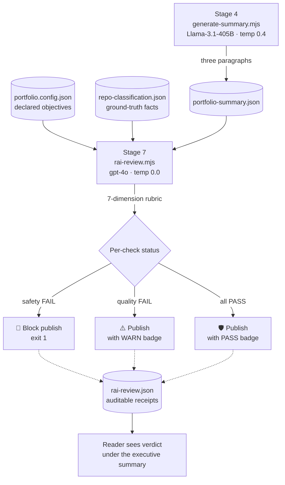
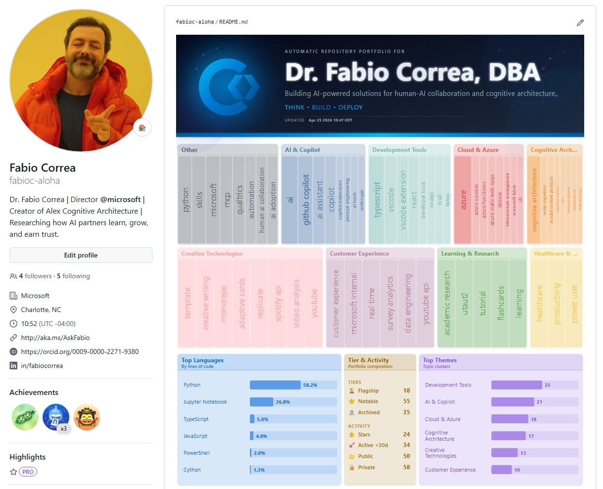

# Visual Storytelling with Data: Building a Self-Updating GitHub Portfolio

A walk-through of how this repository's portfolio dashboard is built, from raw GitHub API data to a single, self-contained SVG with banner, treemap, KPIs, and an LLM-authored executive summary.

This is a tutorial, not a reference. It explains *why* each step looks the way it does, what we tried, and what we kept.

---

## Why this exists

This portfolio is the artifact, not a side project.

I am Dr. Fabio Correa: Director of Advanced Analytics & Data Science at Microsoft, doctorate in Human-AI Collaboration, 30 years of turning AI from slideware into measurable revenue. Treat what follows as a hypothetical: imagine I were making the case for a leadership role driving AI and human-partnership innovation at scale, and converting AI initiatives into defensible ROI on behalf of an organization. That role could absolutely be at Microsoft (wink, wink), or anywhere the problem is interesting enough.

Résumés make claims. Most GitHub profiles make noise. I wanted something that *demonstrates* rather than asserts, so I built one. Three properties make this a credible exhibit:

- **The thing you are looking at *is* the work.** A self-updating portfolio that classifies 100+ repositories, clusters their topics, writes its own executive summary, runs its own Responsible-AI review, and renders a treemap-driven dashboard, every day at 6 AM Eastern, autonomously, in CI (Continuous Integration: GitHub's servers run the pipeline on a schedule, gate each step, and only publish when every check passes). If I cannot ship a working AI pipeline for my own profile, why would anyone trust me to ship one for their enterprise?
- **Every design decision is a position statement.** Hash-based caching means we never burn LLM tokens on identical inputs, the same discipline that takes enterprise GenAI from a cost center to a margin-positive product. Strict review gates fail the build on regression. The cover-letter executive summary at the top of the README is applied *dialog engineering*: opinionated, evidence-based, audience-aware. (Yes, dialog engineering, not prompt engineering. Alex and I are writing a book on why that distinction matters; the short version is that a single prompt is a guess, a dialog is a system.)
- **The portfolio underneath is the proof.** AIRS, my doctoral dissertation, a validated AI Readiness Scale (N=523, SEM-validated). Alex, an open-source cognitive architecture with 5,200+ installs. Dozens of pipelines spanning Azure OpenAI, predictive analytics, data governance, and applied research. The dashboard scans in 15 seconds; the repos themselves are the receipts.

If you happen to be evaluating me for such a role (hypothetically, of course), every section below also answers "what would you do on day one?" Staged pipelines, content-hashed caching, evidence-based prompts, hard review gates, calm visual design. That is how I would build your AI initiatives.

One more thing. The AI assistant who paired with me on this entire system, who classifies the repos, clusters the topics, drafts the executive summary, and iterates on the prose you are reading right now, is **Alex**. Alex is an open-source cognitive architecture I designed and shipped ([Alex_Plug_In](https://github.com/fabioc-aloha/Alex_Plug_In), 5,200+ installs). The most sophisticated piece of evidence in this portfolio is not a repo, a chart, or a citation. It is the collaborator. *Alex is the ultimate showcase of my work*: a working AI partner, designed by me, doing real work on a real production system, in public, every day at 6 AM Eastern.

> 📄 [Full résumé](https://www.correax.com/resume) · 💬 [Schedule a conversation](https://aka.ms/AskFabio)

---

## Responsible AI: the dog watches the butcher shop

The dashboard's executive summary is LLM-authored. Shipping that prose straight to a public README without independent review would be irresponsible. So a second LLM, a different model with a different role and a deterministic temperature, evaluates the first LLM's output before anything publishes. The AI that *makes* the claims is not the AI that *approves* them.

> 📌 **A confession from inside the workshop.** The RAI stage you are about to read about did not exist when I started writing this section. I told my AI partner *"and we are applying RAI by having an LLM evaluate the LLM output and flagging risks"*, fully expecting to mark it as a planned next step. By the time I finished the sentence, Alex had already drafted [`scripts/rai-review.mjs`](https://github.com/fabioc-aloha/AlexFleetPortfolio/blob/main/scripts/rai-review.mjs), wired it into the pipeline after `generate-summary`, designed the seven-dimension rubric, computed a deterministic verdict-rollup so quality issues warn but only safety issues block, and surfaced the verdict as a badge under the executive summary card. We then iterated together on the rubric, hardened the evidence rules, and bumped the reviewer to a more capable model. That is not an anecdote about a clever prompt. It is the demonstration. *A genuinely useful AI partner anticipates the ask, ships the implementation, and explains the choices, all in the same conversation.* This document is being co-authored by the same loop.

### The pattern



### What gets reviewed

The reviewer receives exactly three inputs and judges only the first against the other two:

| Input | Role | Source |
| --- | --- | --- |
| `summaryUnderReview` | The text being judged. Three paragraphs. | Stage 4 output |
| `groundedFacts` | What the candidate has publicly declared (role, credentials, signature work). Used to spot fabrication. | `portfolio.config.json` → `portfolioObjectives` |
| `portfolioFacts` | Deterministic counts and flagship names. Used to spot invented repos. | `repo-classification.json` |

The rubric covers seven dimensions, split into two tiers:

- **Quality checks** (factualGrounding, sourceFidelity, tone, hallucinationRisk). A FAIL here triggers a `⚠️ WARN` badge. The summary still publishes; the warning is logged for review.
- **Safety-critical checks** (sensitiveContent, biasAndFairness, voiceCompliance). A FAIL here exits the pipeline non-zero. Nothing publishes. The reasons are written to `repos/rai-review.json` for human review before the next run.

The split is deliberate. Quality is a discussion. Safety is absolute. We do not block on "I think the summary should have mentioned Python share earlier"; we *do* block on "the summary added a credential the candidate does not have."

### The implementation choices that matter

A few decisions worth calling out, because they show up in real enterprise RAI programs:

- **A different model, not the same one.** Self-review by the same model is theater. The reviewer is `gpt-4o`; the writer is `Llama-3.1-405B`. Different families, different training, different failure modes. Disagreement is the signal we are looking for. We started this stage on `gpt-4o-mini` and bumped to `gpt-4o` after watching the smaller model hallucinate FAIL reasons it could not back up; capability matters when the LLM is the auditor.
- **`temperature: 0.0`.** A reviewer that gives different verdicts on identical inputs is a coin flip, not a reviewer. Determinism is non-negotiable.
- **Evidence-required FAILs.** The rubric tells the reviewer that every FAIL must quote the exact offending phrase from the summary. No "implies", no "suggests", no vibes. *If you cannot quote it, the check passes.* This single rule eliminated most of the false positives we saw during development.
- **Verdict rollup is deterministic.** The LLM judges per dimension; the script counts the failures and routes them through the safety/quality split. Letting the LLM pick its own overall verdict produced inconsistent rollups, the same "let the model narrate, not count" principle the summary stage already follows.
- **Cache by hash.** Like every other LLM stage, the RAI call is hash-cached on `(summary + objectives + portfolio facts)`. A clean run with no upstream change costs zero RAI tokens.
- **Publish the receipt.** The verdict appears as a badge under the executive summary card in the README, linked back to this section. The reader sees the review happened. Full per-check JSON lives in [`repos/rai-review.json`](https://github.com/fabioc-aloha/AlexFleetPortfolio/blob/main/repos/rai-review.json), diffable across daily runs.

### What this proves

A portfolio that ships AI-generated prose at the top of its public README, then has a different AI verify that prose against the candidate's declared sources, then surfaces the verdict where the reader can see it, is not just demonstrating dialog engineering. It is the operational discipline that takes enterprise GenAI from a clever demo to a production system. The review stage is a working answer to the question every responsible AI program is trying to answer: *what stops the model from saying something we cannot stand behind?*

The honest answer most organizations have today is "nothing, we ship it and hope". The answer this portfolio demonstrates is "another model, a different rubric, evidence-required FAILs, hard gates on safety, and the badge on the front page so you can see we did the work".

---

## The finished product

Before we get into the how, here is the what. This is the live portfolio as it renders on [github.com/fabioc-aloha](https://github.com/fabioc-aloha) the morning after a clean pipeline run, banner and treemap and KPIs and executive summary and RAI badge all stitched into a single SVG, plus the curated flagship lineup underneath:



Everything below this point is how that image gets built, every day, at 6 AM Eastern, without me touching it.

---

## What we are trying to do

A GitHub profile README is mostly text. Text rewards *reading*. A portfolio rewards *scanning*.

The goal of this project is a one-glance answer to three questions:

1. **What does this person build?**, themes, dominant domains, technical surface
2. **What is the shape of the work?**, active vs. archived, deep vs. broad, languages, flagships
3. **Is it current?**, when was this regenerated, against which data

We answer all three with a single image, regenerated every day at 6 AM Eastern by GitHub Actions, and we let an LLM write the prose that ties it together.

The final artifact is `portfolio.svg`, embedded once in [README.md](README.md). Open it: there are no per-section markdown headings between the banner and the stat footer. It is one composed canvas.

But the dashboard is only one half of the job. The other half is making each individual repo *findable* on its own — because the portfolio sends people to repos, and the repos have to do their own work once a visitor clicks through. That means every repo card needs two things tuned for two different audiences:

- **A description that speaks to business value** — read by hiring executives and business leaders. What problem it solves, what outcome it produces, what capability it demonstrates. No jargon-soup, no implementation flexing.
- **Topics that speak to developers** — read by GitHub's search index and engineering audiences. Real GitHub topic slugs that engineers actually filter on. Technical specificity is welcomed here.

A description is at most 350 characters and there is exactly one. Topics are capped at 20 per repo, and we aim for around 15 — a mix of one or two umbrella tags (broad and high-traffic), three to five specific tags (medium traffic, domain-precise), and two or three differentiating tags (lower traffic, repo-unique). Every word and every tag is a discoverability slot. Empty descriptions and vanity tags burn slots.

For private repos the bar is higher: descriptions stay generic enough to live on a public portfolio without leaking client names, regulated entities, dataset details, or anything that reads like an internal confidential document. Capability framing only.

---

## The pipeline

```text
fetch-repos  →  classify-repos  →  cluster-topics  →  generate-summary  →  generate-readme  →  review-content
   (gh API)      (gpt-4o-mini)     (Llama-3.1-405B)    (Llama-3.1-405B)        (SVG stitch)        (gates)
```

Each stage writes a JSON artifact and reads only the previous stage's output. That gives us three properties for free:

- **Caching by content hash.** Every LLM stage hashes its input and skips the API call if the hash is unchanged. A scheduled run every day at 6 AM Eastern that hits zero API calls when nothing changed is the default, not the exception.
- **Replay-ability.** Any stage can be re-run on yesterday's data without re-fetching. Great for prompt iteration.
- **Failure isolation.** A single failed stage doesn't poison the rest. Cluster failures fall back to cached clusters; summary failures render the README without the prose block.

The orchestrator is [scripts/refresh.mjs](https://github.com/fabioc-aloha/AlexFleetPortfolio/blob/main/scripts/refresh.mjs). It runs the stages, gates on `review-content.mjs`, and exits non-zero on regression so the GitHub Action never publishes a broken artifact.

---

## Stage 1: Fetch (the data layer)

Source: the GitHub CLI (`gh repo list`, `gh api`). Output: `repos/repo-analysis.json`.

We pull every public repo on the account with: name, description, topics, stars, language byte counts, fork flag, archived flag, last-pushed date. The byte counts matter; they are how we later compute "Top Languages by lines of code" instead of by repo count, which would over-weight tiny scratch repos.

The fetch stage has no LLM and no business logic. Its only job is to be **deterministic**. Same account, same day → same JSON. That makes the rest of the pipeline reproducible.

---

## Stage 2: Classify (LLM #1)

Source: `repo-analysis.json`. Output: `repos/repo-classification.json`. Model: **`gpt-4o-mini`** via GitHub Models.

Each repo gets a category (from a 10-item taxonomy: AI, Data, Infrastructure, Web Apps, Developer Tools, …) and a tier (`flagship` / `notable` / `standard` / `archived`). The taxonomy is hand-curated in [scripts/classify-repos.mjs](https://github.com/fabioc-aloha/AlexFleetPortfolio/blob/main/scripts/classify-repos.mjs); the LLM only assigns repos to existing buckets.

### Why `gpt-4o-mini`

We benchmarked three models on this stage:

| Model | Result | Why we rejected / kept |
| --- | --- | --- |
| Regex signals only | ~70% accurate | Misses paraphrased topics, no description understanding. Kept as fallback. |
| `gpt-4o-mini` | ~95% accurate | Cheap, fast, deterministic at `temperature: 0.2`. **Kept.** |
| `Meta-Llama-3.1-405B-Instruct` | ~96% accurate | Identical quality at 30× the latency. Wasted on a bucket-assignment task. |

Lesson: pick the smallest model that clears the quality bar. Classification is a structured task with a closed output set, a small model handles it.

### The prompt trick: numeric codes

108 repos × ~80 chars each = ~8 KB of names + descriptions in the prompt. The naive output format is `{"repo-name": "Category"}`, but that doubles the token cost (the names appear twice) and makes JSON keys fragile when names contain dots or quotes.

So we assign short codes:

```text
R0: spotify-skill, Voice skill connecting Spotify to Alexa
R1: Alex_Plug_In, VS Code extension shipping a portable cognitive architecture
...
```

And ask for `{"R0": "AI & Machine Learning", "R1": "Developer Tools"}`. Half the tokens, zero key-collision risk, and the code-to-name map stays in script memory.

---

## Stage 3: Cluster topics + tagline (LLM #2)

Source: `repo-classification.json` + descriptions. Output: `repos/topic-clusters.json`. Model: **`Meta-Llama-3.1-405B-Instruct`**.

This stage does two jobs in one call:

1. Group ~150 raw GitHub topics into 8–10 named semantic clusters (e.g. "AI & Copilot", "Cloud & Azure")
2. Write the developer's tagline in one sentence ≤120 chars

### Why we changed models here

Initial version used `gpt-4o-mini` for both classification and clustering. The classification was great. The clusters were mediocre, generic names ("Tools", "AI Stuff"), uneven sizes, a bloated "Other" bucket holding 20%+ of topics.

We A/B tested:

| Model | Cluster names | "Other" share | Tagline |
| --- | --- | --- | --- |
| `gpt-4o-mini` | Generic | 22% | Bland, often included the user's name (which we forbid) |
| `gpt-4o` | Better | 14% | Better, but still occasional name leakage |
| `Meta-Llama-3.1-405B-Instruct` | Specific & portfolio-grade | **8%** | Specific, never name-leaked |

The 405B model justifies its cost here because clustering is **a creative naming task with a global constraint** (every topic must be assigned exactly once, "Other" ≤10%). That is the kind of constraint smaller models violate silently.

### Constraint enforcement

The prompt has explicit JSON schema, hard caps on cluster count, and a validation checklist the model must run before responding. Even so, we don't trust it. The script:

- Strips topics the model hallucinated (returned topics not in the input set)
- Merges duplicate "Other"-like buckets ("Misc", "General", "Uncategorized") into a single canonical "Other"
- Re-tries up to 3 times if "Other" exceeds 10%, keeping the run with the smallest "Other"
- Adds any topics the model dropped to "Other" so the assignment is total

The full system prompt lives in [scripts/cluster-topics.mjs](https://github.com/fabioc-aloha/AlexFleetPortfolio/blob/main/scripts/cluster-topics.mjs) and is reproduced in the appendix below.

### Tagline generation

The tagline is a side-product of the same call. Rules (in the system prompt):

- One sentence, ≤120 characters
- No name, employer, degree, location, or generic filler
- Must describe what this person *builds*, not who they *are*
- Grounded in repo descriptions, with topic frequencies as supporting context

Doing it in the same call (rather than a dedicated tagline stage) gives the model the full corpus and lets it cross-reference clusters with descriptions. Same input, two outputs, one cache key.

---

## Stage 4: Executive summary (LLM #3, new)

Source: classification + analysis + clusters. Output: `repos/portfolio-summary.json`. Model: **`Meta-Llama-3.1-405B-Instruct`**.

This is the prose block under the dashboard. It exists because the visuals answer *what* and *how much*, but not *what does it mean?*. A hiring manager scanning the page needs the connective tissue.

The summary is three short paragraphs, each with a defined job:

1. **`themes`**, what the person builds, naming 2–3 concrete domains
2. **`strengths`**, technical signal, citing specific repos and languages
3. **`shape`**, overall composition, active/archived ratio, breadth vs. depth

We feed the LLM a token-efficient compaction of all three upstream artifacts (see `buildPayload` in [scripts/generate-summary.mjs](https://github.com/fabioc-aloha/AlexFleetPortfolio/blob/main/scripts/generate-summary.mjs)): totals, top-12 flagships *with descriptions*, language shares, top clusters with sample topics. Roughly 2K tokens in.

The output is a constrained JSON with three string fields, each capped at 320 chars. Example from this run:

> **Themes:** *This portfolio focuses on AI-powered solutions for human-AI collaboration, cognitive architecture, and developer tools. Dominant themes include AI adoption, cognitive science, and meta-cognition.*
>
> **Strengths:** *Technical strengths include expertise in HTML, Python, and Jupyter Notebook, with flagship projects like spotify-skill and Alex_Plug_In showcasing AI integration and VS Code extension development.*
>
> **Shape:** *The portfolio has a mix of active and archived projects, with a focus on developer tools, AI, and machine learning, indicating a balance between exploration and depth in these areas.*

It cites the right repos by name, picks the right languages, and gets the active/archived shape right, because all of those facts are explicitly in the payload. We don't ask the model to *count* anything; we count in JS and ask the model to *narrate*.

The summary is rendered as plain markdown directly under the SVG image in the README so it is searchable, copyable, and indexable by GitHub's own search.

---

## Stage 4.5: SEO curation (off-cron, human-in-the-loop)

The daily pipeline regenerates the dashboard. It does not edit the descriptions or topics on the repos themselves — that is a curation step, not an automation step, and the difference matters.

A description is one sentence that has to do two jobs at once: explain the project to a business reader who scans for ten seconds, *and* land on the keywords that get the repo found in GitHub search. Topics are 20 slots per repo that have to be picked truthfully (no invented slugs), without redundancy (no `ai` *and* `machine-learning` *and* `artificial-intelligence` for one tool), and without leaking the primary language (already shown on the card). That is judgment, not regex.

So we built a separate muscle that produces *proposals* and never auto-applies. The flow runs in two muscles, each producing a JSON artifact:

```text
seo-curate          →  repos/seo-proposals.json
  (gpt-4o)               (per-repo description + candidate topics + rationale)
          ↓
fetch-popular-topics →  repos/popular-topics.json
  (GitHub search API)    (popularity-ranked database with portfolio attribution)
```

**[`seo-curate.cjs`](https://github.com/fabioc-aloha/AlexFleetPortfolio/blob/main/.github/muscles/seo-curate.cjs)** — for each non-fork repo, sends `gpt-4o` the portfolio context (audience, voice, goal from `portfolio.config.json`), the repo facts (name, language, current description, current topics, README excerpt, private/public flag), and asks for four things back: a verdict on whether the current description is already good enough to keep, a rewritten description if not, an optional longer portfolio-side override, and a candidate topic list. The model is prompted with explicit two-audience framing (description = business value for executives; topics = technical slugs for developers) and explicit private-repo safety rules (no client names, no regulated-entity details, generic capability framing only). Modes: `--pinned` for the six flagship repos, `--all` for the full non-fork set, `--repo OWNER/NAME` for a single repo, `--dry-run` to plan without API calls. Each proposal is hash-cached for 30 days against the repo's content plus the portfolio context, so re-running after a portfolio edit only regenerates the proposals that actually need it.

**[`fetch-popular-topics.cjs`](https://github.com/fabioc-aloha/AlexFleetPortfolio/blob/main/.github/muscles/fetch-popular-topics.cjs)** — builds a popularity-ranked topic database keyed off the portfolio. Phase 1 harvests every topic already in use across the portfolio with per-repo attribution. Phase 2 pulls candidate topics from `seo-proposals.json` for repos under-tagged below the floor. Phase 3 queries GitHub's search API for `topic:X` repo counts as the popularity proxy and tiers them: massive (50k+ public repos), mainstream (10k–50k), discoverable (1k–10k), specialty (100–1k), low (<100). The catalog carries `fetchedAt` / `expiresAt` and a per-topic 7-day TTL, so subsequent runs only re-query stale entries. The point of the database is to spend search-API calls on topics the portfolio actually uses or is being proposed to use — not on a fixed seed list whether or not it overlaps with the work.

**The split matters.** Description-quality is judgment work for an LLM with the right context. Popularity ranking is mechanical work for an HTTP API. Mixing them in one muscle would either burn LLM tokens on numbers a search count already gives us, or burn API quota on topics no one in the portfolio is even considering.

**Nothing auto-applies.** The proposals JSON is reviewed by a human, who picks the descriptions and topics that ring true and applies them via two single-purpose `gh` commands:

```powershell
gh repo edit OWNER/NAME --description "..."
gh api -X PUT repos/OWNER/NAME/topics -f names[]=t1 -f names[]=t2 ...
```

Descriptions and topics drive months of search traffic. They deserve a human in the loop. The muscle is the analyst; the human is the editor.

---

## Stage 4.6: Measuring whether any of this is working

The premise behind Stage 4.5 \u2014 that better descriptions and tighter topics produce more discovery \u2014 has to be testable, not asserted. So before changing anything we capture a baseline.

GitHub gives every repo a small but real traffic API: views, unique visitors, clones, top referrers, top paths. The catch is that **only the last 14 days are retained**. To measure impact over weeks or months, we have to snapshot it ourselves.

**[`traffic-snapshot.cjs`](https://github.com/fabioc-aloha/AlexFleetPortfolio/blob/main/.github/muscles/traffic-snapshot.cjs)** \u2014 walks every non-fork repo, calls `/repos/{owner}/{repo}/traffic/{views,clones,popular/referrers,popular/paths}`, and appends a full snapshot to `repos/traffic-history.json` with a flat `repos/traffic-latest.json` for quick reads. Each per-repo record carries the SEO state at capture time (description length, topic count, language) alongside the traffic numbers \u2014 so a future analysis can correlate `topicCount: 2 \u2192 9` against `views14d: 4 \u2192 31` for the same repo, not just look at portfolio aggregates.

The first run (April 25, 2026) was tagged `--baseline` and gives us the reference point against which every later snapshot is diffed:

- 767 views / 173 unique visitors across 108 repos in the trailing 14 days
- 6,199 clones / 2,075 unique cloners (the clone-to-view ratio is wildly inverted, almost certainly automated mirrors and scrapers \u2014 worth flagging, not chasing)
- 24 stars, 6 forks, 0 watchers
- Top external referrers: Google (64 views), Bing (12), Yandex (8), DuckDuckGo (4), ChatGPT (2)

The metric that actually matters for the SEO curation work is the **organic-search slice of the referrer mix**. \"Google referred 64 views in the baseline window; what is it after the descriptions and topics ship?\" is a question this database can answer. So is \"which repos got their first non-zero `views14d` after curation?\" Stars and forks are slow signals; views and search referrers move on the timescale of a curation cycle.

Modes: default captures all non-forks, `--pinned` for flagships only, `--repo OWNER/NAME` for a single repo, `--public-only` to exclude private repos, `--baseline` to tag the snapshot, `--dry-run` for a no-API-call plan.

The snapshot runs on its own schedule, separate from the daily README refresh: a weekly GitHub Actions workflow ([.github/workflows/traffic-snapshot.yml](https://github.com/fabioc-aloha/AlexFleetPortfolio/blob/main/.github/workflows/traffic-snapshot.yml)) fires every Sunday at 09:00 UTC (5 AM Eastern), captures the snapshot, commits the updated history files, and pushes. Weekly is the right cadence — the underlying API already returns a 14-day rolling window, so daily snapshots would mostly capture overlapping data, while weekly gives clean, non-trivial deltas without burning CI minutes. The workflow uses `PORTFOLIO_PAT` (the same scoped token the daily refresh uses for `fetch-repos`) because the traffic API requires push access on each repo, which the default `GITHUB_TOKEN` does not provide. To keep the workflow honest, the muscle aborts with a non-zero exit if more than half of the repos return errors — better a failed run than a snapshot full of zeros poisoning the trend line.

### What gets counted, what doesn't, and how to keep the data clean

The traffic API tracks **HTML page views on github.com** — humans (or bots identifying as browsers) loading a repo page, README, issue, or file. The REST API itself (the endpoints this muscle calls, e.g. `/repos/owner/name/traffic/views`) is on a completely different plane: **reading traffic metrics does not increment traffic metrics**. Running the snapshot a hundred times a day would not move any number it returns.

Two real sources of self-pollution to be aware of:

- **Your own browsing.** When the repo owner is logged in to GitHub and visits their own repo, GitHub filters that visit out of the **unique-visitor** count, but it still increments **raw views**. Logged-out, incognito, or different-account visits count fully — those become anonymous "unique visitors" and inflate the metric. Practical guidance: stay logged in as the owner when poking at your own repos. The natural anti-instinct ("let me incognito this to see what a stranger sees") is exactly the move that pollutes the baseline. The owner-filter does ~90% of the cleanup for free if you cooperate with it.
- **Automated `git clone` calls.** Mirrors, CI workflows, and scripts that clone the repo all push the **clones counter** up. This is almost certainly what's behind the wildly inverted clone-to-view ratio in the baseline (6,199 clones against 173 unique human visitors). For SEO impact measurement we treat **clones as noise** and focus on **`uniqueVisitors14d` + the search-engine slice of `topReferrers`** — those are the human-discovery signals.

Per-repo records carry the SEO state at capture time (`descriptionLength`, `topicCount`, `language`) alongside `views14d`, `uniqueVisitors14d`, and `topReferrers`. After we ship description rewrites and topic tuning, the next snapshot can be diffed against this one to answer:

1. Did the **Google / Bing / DuckDuckGo slice** of referrers grow?
2. Which repos got their **first non-zero `uniqueVisitors14d`** after curation?
3. Which **specific repos** moved most on `views14d` and `uniqueVisitors14d`?

These are the kinds of questions a single point-in-time snapshot cannot answer. The history file is the asset — the muscle just keeps it filled.

---

## Stage 5: Visual stitching

Now the data is rich. The job becomes composition. The dashboard is **one** SVG, not five embedded images.

### Why one SVG

GitHub's markdown image rendering is unforgiving. Multiple images means multiple `<p align="center"></p>` blocks, inconsistent margins, and broken alignment on mobile. One SVG means one viewBox, one set of fonts, one source of truth, and pixel-perfect alignment between the banner accent bar and the first row of treemap panels.

### The shared coordinate system

Every visual fragment is authored in its own viewBox, then scaled to a shared 820-pixel canvas:

```js
// scripts/generate-dashboard-svg.mjs
const SHARED_WIDTH = 820;
const STACK_GAP = 6;

function placeFragment(parsed, yOffset) {
  const scale = SHARED_WIDTH / parsed.width;
  return {
    block: `<g transform="translate(0, ${yOffset}) scale(${scale.toFixed(6)})">${parsed.inner}</g>`,
    height: parsed.height * scale,
  };
}
```

The banner is authored at 1200×300, the treemap at 820×416, the glance at 820×270. The combiner reads each viewBox, computes a uniform scale, wraps the inner content in a `<g transform="translate scale">`, and stacks them with a fixed `STACK_GAP`. The resulting parent `<svg>` has a viewBox sized to the cumulative height.

The win: every fragment can be developed and previewed independently. Open `portfolio.svg` in the browser to see the whole; open just the topic-viz output to see the row.

### The shared panel primitive

Every block (Top Languages, Tier & Activity, Top Themes, every cluster in the treemap) is built from one helper in [scripts/svg-panel.mjs](https://github.com/fabioc-aloha/AlexFleetPortfolio/blob/main/scripts/svg-panel.mjs):

```js
panel({ x, y, w, h, title, subtitle, color })
```

It renders: a body rect with rounded corners, a colored header band with rounded *top* corners only (so the header reads as a band, not a stripe), a hairline divider under the header, a colored title at 12px, and an optional 9px subtitle in muted gray. One function, one visual idiom, perfect consistency across panels that are built by three different scripts.

### The bar chart

The "Top Languages" and "Top Themes" panels are bar charts inside panels. Two details that took iteration:

- **Vertical centering.** When a panel has fewer rows than its slot allows (e.g. only 6 themes at the bottom of the page), the rows must center vertically, top-aligned looks broken. We compute `yOffset = (h - rowH * items.length) / 2` and add it to every row's `y`.
- **Label wrapping.** "Healthcare & Wellness" wraps onto two lines because it would otherwise bleed into the bar. The `wrapLabel(text, maxChars)` helper splits at word boundaries and emits `<tspan>` children. The bar's `y` baseline is the *center* of the wrapped block, not the top, so the bar stays vertically centered against the multi-line label.

### The treemap

The Topic Map at `H=416` is the largest fragment. Each cluster is a colored panel, sized proportionally to its topic count, and *each topic inside* is a tall thin colored block with the topic name written rotated 90° downward.

Two layout choices are non-obvious:

1. **Equal row heights.** We force `row1H = H/2, row2H = H - row1H` so the two cluster rows are visually balanced even when one row has 3 wide clusters and the other has 5 narrow ones. A naive flex layout makes the second row a weird trailing band.
2. **Vertical text rotation.** Topics are written with `transform="rotate(-90)"`. This packs ~10 topic labels into a 60-pixel-wide slot that horizontal text could fit only 2 of. The trade-off: the user has to tilt their head. We accept it because the dominant scan path on a portfolio is *cluster names first, drill into topics only if interested*.

### The banner: ultra-customization

The banner is the most customized fragment because it has to do quadruple duty: brand mark, name, role line, dynamic update stamp. Source file: [docs/brand/logos/banner-profile.svg](https://github.com/fabioc-aloha/AlexFleetPortfolio/blob/main/docs/brand/logos/banner-profile.svg), a static design.

We **never modify the source file** during the build. Instead, [scripts/generate-readme.mjs](https://github.com/fabioc-aloha/AlexFleetPortfolio/blob/main/scripts/generate-readme.mjs) reads it as a string and runs four scoped regex replacements before stitching:

```js
bannerSvg = bannerSrc
  // 1. Inject the LLM-generated tagline into the role-line slot.
  .replace(/<text x="320" y="180"[^>]*>[^<]*<\/text>/,
    `<text x="320" y="180" ... textLength="800" lengthAdjust="spacingAndGlyphs">${escTagline}</text>`)
  // 2. Add an "Automatic Repository Portfolio For" prelude above the name.
  .replace(/(<!-- Main name -->)/,
    `<text x="320" y="54" ... letter-spacing="3">AUTOMATIC REPOSITORY PORTFOLIO FOR</text>\n  $1`)
  // 3. Replace the name with the credentialed full name.
  .replace(/<text x="320" y="135" font-size="72"[^>]*>[^<]*<\/text>/,
    `<text x="320" y="135" font-size="74" ...>Dr. Fabio Correa, DBA</text>`)
  // 4. Replace the static "POWERED BY CORREAX" badge with the build timestamp.
  .replace(/<g transform="translate\(320, 255\)">[\s\S]*?<\/g>/,
    `<g ...><text>UPDATED</text><text x="70" font-weight="700">${escStamp}</text></g>`);
```

Each regex anchors on stable layout coordinates (`x="320" y="180"`) or on the source file's HTML comments (`<!-- Main name -->`). That makes the substitutions resilient to non-essential edits in the source SVG, change the gradient, the corner radius, the constellation graphics: the regex still matches.

Why regex and not an SVG parser? The source banner has 200+ elements (gradient stops, filter primitives, a stylized logo). A real parser would let us mutate by ID, but it would also mean introducing an XML dependency and writing a serializer that preserves the source's exact whitespace. Regex over four anchored lines is 8 lines of code and survives every refactor we've thrown at it.

The result of stage 5 is `portfolio.svg`: a single file containing the banner, the treemap, the at-a-glance row, and a centered stats footer (`108 repositories across 10 categories · 73 actively maintained · 18 flagships`). All fonts unified to Segoe UI, all chrome muted-slate `#94a3b8`. The only chromatic accents are the cluster colors.

### Footer integration

The stat line used to be a separate `<p align="center">` block of HTML below the image. That created a visible gap between the SVG's bottom edge and the prose. We moved it inside the SVG as the final row, rendered with mixed-weight `<tspan>`s (bold values, muted labels, dot separators). Now the dashboard ends with a clean horizontal stats line, and the executive summary picks up directly below as markdown, no rendering seams.

---

## Stage 6: Review (the safety net)

[scripts/review-content.mjs](https://github.com/fabioc-aloha/AlexFleetPortfolio/blob/main/scripts/review-content.mjs) runs after every regeneration. It is a defensive script:

- Counts categories and repos from the rendered README and asserts they match the JSON
- Verifies the portfolio markers (`<!-- PORTFOLIO:START -->` / `END -->`) are intact
- Checks every flagship name from the classification appears in the README
- Validates SVG well-formedness (open + close tags, viewBox present)

If review fails, the GitHub Action exits non-zero and the README is never committed. We catch silent regressions, like an LLM that helpfully drops 3 repos when re-clustering, before they ship.

---

## Stage 7: Responsible-AI review (LLM #4)

Source: `repos/portfolio-summary.json` plus `portfolio.config.json` objectives plus a compact ground-truth view of the classification. Output: `repos/rai-review.json`. Model: **`gpt-4o`** at **temperature 0.0**.

This is the stage that earns the "we apply RAI" claim, and it is documented in full in the dedicated [Responsible AI section](#responsible-ai-the-dog-watches-the-butcher-shop) at the top of this document, including the rubric, verdict semantics, mermaid diagram, and the model-selection rationale. The short version: a different LLM evaluates the executive summary against the candidate's declared facts and the deterministic portfolio ground truth, every FAIL must quote the offending phrase, the verdict rollup is computed in deterministic JS (safety FAIL blocks publish, quality FAIL warns), and the receipt ships as a badge on the README.

The reason this stage is also covered up top is that RAI is not a footnote on a pipeline diagram. It is the difference between "we used an LLM" and "we shipped an LLM responsibly".

---

## Daily automation

A GitHub Actions workflow runs the full pipeline every day at 6 AM Eastern. Two protective patterns matter:

- **`concurrency: cancel-in-progress`**, if a manual push triggers a fresh run while the scheduled one is still running, the older run is killed. No race conditions on the same `portfolio.svg`.
- **`keepLocal` merge driver on the artifact**, when local hand-edits and the scheduled run's output diverge, the local copy wins on `git pull --rebase`. The next scheduled run will overwrite it, but it never *loses* local fixes mid-edit.

---

## What we learned

- **Token codes beat token names.** The `R0/R1` substitution halved our classification prompt size with zero quality cost.
- **Match the model to the task.** Classification is structured → small model. Naming and creative prose → large model. Don't pay 405B prices for a bucket-assignment task.
- **JSON-only outputs, validated twice.** The model returns JSON, we validate the schema, then we validate the *content* (no hallucinated topics, no missing repos). Both checks have caught real bugs.
- **One SVG > many images.** Pixel-perfect alignment is free if you commit to a single canvas. Multiple images is a maintenance tax forever.
- **Regex injection over SVG parsing.** When the modification surface is small and stable, anchored regex over a string is more robust than a real parser.
- **Cache by content hash, not by date.** A "regenerated daily" pipeline should make zero LLM calls when nothing changed. Hashing inputs is one line of code.
- **Let the LLM narrate, not count.** The summary stage gets pre-counted facts and produces prose. We never ask the model "how many flagships are there?", we tell it.
- **Review every artifact you ship.** The review stage is unglamorous and has saved us from at least three regressions during prompt iteration.

---

## Appendix: the prompts

### Classification (gpt-4o-mini, temperature 0.2)

```text
You are a GitHub repository classifier. Each repo has a code (R0, R1, ...), a name,
and optionally a description. Assign each repo to exactly one category. Return the
repo CODE (not the name) as the key.

Available categories (use these exact names):
  Community Forks
  Portfolio & Meta
  AI & Machine Learning
  Data & Analytics
  Infrastructure
  APIs & Services
  Web Applications
  Developer Tools
  Libraries & Packages
  Creative & Personal

If a repo doesn't fit any category, use "Uncategorized".

Rules:
- Repos marked [FORK] should go in "Community Forks"
- A repo matching the owner's username is "Portfolio & Meta"
- Use repo name AND description together to determine the best category
- When ambiguous, prefer the more specific category
- Every repo must be assigned exactly one category

Respond with ONLY valid JSON, no markdown fences. Format:
{ "classifications": { "R0": "Category Name", "R1": "Category Name" } }
```

**User payload.** The script builds a flat, line-oriented list. One repo per line, prefixed with the short code, the name, an optional `[FORK]` marker, and the description after an em-dash. Token-cheap, structurally unambiguous, and trivial for the model to parse.

```text
Classify these repos:
R0: Alex_Plug_In, Transform GitHub Copilot into a sophisticated AI learning partner with meta-cognitive awareness, persistent memory, dual-mind processing, and cross-project knowledge sharing. VS Code extension.
R1: spotify-skill, Spotify Skills for Claude - Production Spotify API integration + complete toolkit for creating Claude Desktop Skills. Includes OAuth 2.0, cover art generation, automated tools, and comprehensive guides.
R2: VT_HEALTHCARE, Healthcare analytics dashboard
R3: old-snake-game [FORK] ,
R4: fabioc-aloha, AI portfolio showcasing ethical human-AI collaboration. Think. Build. Deploy.
... (108 entries total)
```

Descriptions are passed verbatim. The `[FORK]` marker is added in the script, not pulled from the GitHub API metadata, because we want it to be a hard token the model can't miss.

### Clustering + tagline (Llama-3.1-405B, temperature 0.3)

```text
You are a GitHub portfolio analysis assistant.

You will receive:
1. A list of repository topics with frequency counts.
2. A list of repositories, each with a description.

Your task is to produce ONE valid JSON object that does TWO things:
1. Cluster all topics into semantic groups, ensuring every topic is assigned to exactly one cluster.
2. Write a short developer tagline based on the repositories and their descriptions.

A) Tagline
- Write exactly one sentence.
- Maximum length: 120 characters.
- Describe what this developer builds or focuses on.
- Do NOT include the developer's name, employer, degree, location, or generic filler.

B) Topic Clustering
- Create 8 to 10 semantic clusters that cover all input topics.
- Every topic must be assigned to exactly one cluster.
- Group by meaning, not alphabetically and not by superficial string similarity.
- Use exactly one catch-all cluster named "Other"; "Other" must contain ≤10% of all topics.
- Each cluster name must be 2 to 3 words maximum.

Output schema:
{
  "tagline": "Short sentence about what this developer builds.",
  "clusters": [ { "name": "Cluster Name", "topics": ["topic-a", "topic-b"] } ]
}

Validation checklist before responding:
- JSON is valid.
- 8 to 10 clusters total.
- Exactly one cluster named "Other".
- Every input topic appears exactly once.
- Tagline is one sentence and ≤120 characters.
```

(Full prompt in [scripts/cluster-topics.mjs](https://github.com/fabioc-aloha/AlexFleetPortfolio/blob/main/scripts/cluster-topics.mjs).)

**User payload.** Two clearly-labeled blocks. Topics first (numbered, with frequency counts so the model can prioritize dominant themes), then up to 30 repository descriptions for disambiguation context.

```text
TOPICS TO CLUSTER (exactly 152, assign every one, no more, no fewer):
1. ai (24)
2. python (19)
3. azure (15)
4. copilot (12)
5. typescript (11)
6. github-copilot (9)
7. cognitive-architecture (8)
8. vscode-extension (7)
9. machine-learning (7)
10. data-engineering (6)
... (152 entries total)

REPOSITORY DESCRIPTIONS (for context only, do NOT use these as topics):
Transform GitHub Copilot into a sophisticated AI learning partner with meta-cognitive awareness...
Spotify Skills for Claude - Production Spotify API integration + complete toolkit...
AI portfolio showcasing ethical human-AI collaboration. Think. Build. Deploy.
Healthcare analytics dashboard
... (up to 30 descriptions)
```

The "do NOT use these as topics" instruction is critical; without it, the 405B model occasionally extracts substrings from descriptions and adds them as topics that were never in the input. Cap at 30 descriptions because clustering quality plateaus there but token cost keeps climbing linearly.

### Executive summary (Llama-3.1-405B, temperature 0.4)

```text
You are a portfolio analyst writing an executive summary for a developer's GitHub portfolio.

You will receive a JSON object with totals, category breakdown, top flagship repositories
(with descriptions), top languages by share, and topic clusters.

Your task is to produce a JSON response with three short paragraphs that together read as
a cohesive executive summary printed below a portfolio dashboard.

Audience: a hiring manager, collaborator, or peer scanning the portfolio for the first time.
Voice: third-person, professional, specific, evidence-based.

Each paragraph has a distinct purpose:

1. "themes" (2-3 sentences), What does this person build? Identify the dominant problem
   domains based on the top clusters and flagship descriptions. Mention 2-3 concrete themes.
2. "strengths" (2-3 sentences), Technical signal. Reference top languages, the most-starred
   flagships by name, and any pattern visible in the descriptions.
3. "shape" (1-2 sentences), Overall portfolio shape. Comment on active-vs-archived ratio,
   category breadth, and what that says about the person.

Hard rules:
- Output ONLY a single valid JSON object. No markdown fences. No commentary.
- Each paragraph: max 320 characters. Total under 900 characters.
- Schema: { "themes": "...", "strengths": "...", "shape": "..." }
```

(Full prompt in [scripts/generate-summary.mjs](https://github.com/fabioc-aloha/AlexFleetPortfolio/blob/main/scripts/generate-summary.mjs).)

**User payload.** A single pre-counted, pre-aggregated JSON object. The script does the math (totals, percentages, top-N selection); the model does the prose. This is the central design principle of stage 4: never ask the LLM to count or rank, only to narrate.

```json
PORTFOLIO DATA:
{
  "profile": {
    "name": "Fabio Correa",
    "tagline": "Building AI-powered solutions for human-AI collaboration and cognitive architecture."
  },
  "totals": {
    "repositories": 108,
    "active": 73,
    "archived": 35,
    "flagships": 18,
    "categories": 10
  },
  "categories": [
    { "name": "AI & Machine Learning", "total": 24, "flagships": 5 },
    { "name": "Developer Tools", "total": 19, "flagships": 4 },
    { "name": "Data & Analytics", "total": 14, "flagships": 2 },
    ... (10 categories)
  ],
  "topFlagships": [
    {
      "name": "spotify-skill",
      "category": "AI & Machine Learning",
      "stars": 11,
      "description": "Spotify Skills for Claude - Production Spotify API integration + complete toolkit for creating Claude Desktop Skills...",
      "topics": ["agent-skills", "anthropic", "api-wrapper", "claude", "oauth2", "spotify"]
    },
    {
      "name": "Alex_Plug_In",
      "category": "Developer Tools",
      "stars": 5,
      "description": "Transform GitHub Copilot into a sophisticated AI learning partner...",
      "topics": ["ai", "ai-agent", "ai-assistant", "cognitive-architecture", "copilot", "vscode-extension"]
    },
    ... (top 12 flagships by stars, with full descriptions)
  ],
  "topLanguages": [
    { "name": "Python", "share": 58.2 },
    { "name": "Jupyter Notebook", "share": 26.8 },
    { "name": "TypeScript", "share": 5.0 },
    { "name": "JavaScript", "share": 3.9 },
    { "name": "PowerShell", "share": 2.0 },
    { "name": "Cython", "share": 1.3 }
  ],
  "topClusters": [
    { "name": "AI & Copilot", "topicCount": 24, "sampleTopics": ["ai", "github-copilot", "ai-assistant", "copilot", "ai-adoption"] },
    { "name": "Cognitive Architecture", "topicCount": 19, "sampleTopics": ["cognitive-architecture", "meta-cognition", "cognitive-science", "memory-systems"] },
    ... (top 8 clusters)
  ]
}
```

The payload is built by `buildPayload()` in [scripts/generate-summary.mjs](https://github.com/fabioc-aloha/AlexFleetPortfolio/blob/main/scripts/generate-summary.mjs). A few specific shaping decisions:

- **Top-12 flagships, not all 18.** A long list dilutes the model's attention and burns tokens. 12 is enough to give it specific names to cite without crowding the prompt.
- **Full descriptions on flagships only.** Categories and clusters get just counts and names. The descriptions are the highest-signal content for the *strengths* paragraph and they're concentrated in the flagships.
- **Top-6 languages with computed share, not byte counts.** The model writes "58% Python" naturally; it would have to do mental arithmetic on byte counts.
- **Sample topics, not all topics.** 5 sample topics per cluster is enough for the model to identify the cluster's character; the full topic list (often 20+ per cluster) would 5× the token cost for no narrative benefit.
- **`active` and `archived` as separate fields.** The model can compute the ratio in prose ("a mix of active and archived projects") but we don't ask it to do the division.

At ~2K tokens in and ~300 tokens out, the call costs about $0.001 with the 405B model on GitHub Models' free tier. The hash-cache means we make this call roughly once per week in steady state, only when classification or clusters actually change.

---

## Files referenced

| File | Purpose |
| --- | --- |
| [scripts/refresh.mjs](https://github.com/fabioc-aloha/AlexFleetPortfolio/blob/main/scripts/refresh.mjs) | Pipeline orchestrator |
| [scripts/fetch-repos.mjs](https://github.com/fabioc-aloha/AlexFleetPortfolio/blob/main/scripts/fetch-repos.mjs) | Stage 1, GitHub API fetch |
| [scripts/classify-repos.mjs](https://github.com/fabioc-aloha/AlexFleetPortfolio/blob/main/scripts/classify-repos.mjs) | Stage 2, LLM classification |
| [scripts/cluster-topics.mjs](https://github.com/fabioc-aloha/AlexFleetPortfolio/blob/main/scripts/cluster-topics.mjs) | Stage 3, clustering + tagline |
| [scripts/generate-summary.mjs](https://github.com/fabioc-aloha/AlexFleetPortfolio/blob/main/scripts/generate-summary.mjs) | Stage 4, executive summary |
| [scripts/generate-readme.mjs](https://github.com/fabioc-aloha/AlexFleetPortfolio/blob/main/scripts/generate-readme.mjs) | Stage 5, README + SVG composition |
| [scripts/generate-topic-viz.mjs](https://github.com/fabioc-aloha/AlexFleetPortfolio/blob/main/scripts/generate-topic-viz.mjs) | Treemap renderer |
| [scripts/generate-glance-svg.mjs](https://github.com/fabioc-aloha/AlexFleetPortfolio/blob/main/scripts/generate-glance-svg.mjs) | KPI row renderer |
| [scripts/generate-dashboard-svg.mjs](https://github.com/fabioc-aloha/AlexFleetPortfolio/blob/main/scripts/generate-dashboard-svg.mjs) | Multi-fragment combiner |
| [scripts/svg-panel.mjs](https://github.com/fabioc-aloha/AlexFleetPortfolio/blob/main/scripts/svg-panel.mjs) | Shared panel primitive |
| [scripts/review-content.mjs](https://github.com/fabioc-aloha/AlexFleetPortfolio/blob/main/scripts/review-content.mjs) | Stage 6, output gates |
| [docs/brand/logos/banner-profile.svg](https://github.com/fabioc-aloha/AlexFleetPortfolio/blob/main/docs/brand/logos/banner-profile.svg) | Banner template |
| [portfolio.config.json](https://github.com/fabioc-aloha/AlexFleetPortfolio/blob/main/portfolio.config.json) | Profile, taxonomy, overrides |
| [portfolio.svg](portfolio.svg) | Final dashboard artifact |
