# CorreaX Brand Guidelines

<p align="center">
  
</p>

<p align="center">
  <strong>Official Brand Guidelines v1.1</strong><br>
  <sub>Last updated: January 2026</sub>
</p>

---

## Table of Contents

1. [Brand Identity](#brand-identity)
2. [Logo](#logo)
3. [App Branding vs Company Branding](#app-branding-vs-company-branding)
4. [Footer Implementation](#footer-implementation)
5. [Colors](#colors)
6. [Typography](#typography)
7. [Voice & Tone](#voice--tone)
8. [Usage Guidelines](#usage-guidelines)
9. [Digital Assets](#digital-assets)
10. [Templates](#templates)
11. [Repository Presentation Standards](#repository-presentation-standards)
12. [Quick Reference](#quick-reference)

---

## Critical Design Requirements

### ⚠️ The 5 Golden Rules

Every icon, logo, and visual asset **MUST** follow these rules:

| # | Rule | Specification |
| --- | ------ | --------------- |
| 1 | **White Background** | Base color `#FFFFFF` with transparency |
| 2 | **White-Compatible** | Must look crisp on white/light layouts |
| 3 | **High Resolution** | Favicons: 64px recommended (32px minimum) |
| 4 | **Multiple Options** | Create 4-6 variations for user approval |
| 5 | **Light Theme First** | Azure tones on white backgrounds |

### 📍 Where Branding Goes

| Location | What | Why |
| ---------- | ------ | ----- |
| **Header/Nav** | App icon + name | Primary app identity |
| **Browser Tab** | App favicon (64px) | Quick recognition |
| **Footer** | CorreaX logo | Company attribution |
| **About Page** | CorreaX full branding | Company info |
| **Splash Screen** | App icon + CorreaX | Dual branding |

---

## Brand Identity

### Mission

CorreaX empowers the Correa family with unified, professional-grade tools for Azure infrastructure management and digital project development.

### Brand Attributes

| Attribute | Description |
| --------- | ----------- |
| **Professional** | Enterprise-quality design and documentation |
| **Trustworthy** | Consistent, reliable, and transparent |
| **Innovative** | Forward-thinking Azure and AI solutions |
| **Accessible** | Clear, approachable, and well-documented |

### Brand Names

| Form | Example | Usage |
| ---- | ------- | ----- |
| **Primary** | CorreaX | Headers, formal references, documentation |
| **Lowercase** | correax | URLs, domains, package names, file paths |
| **Abbreviated** | CX | Icons, favicons, tight spaces |

### Taglines

CorreaX uses **two taglines** depending on context:

| Tagline | Context | Tone |
| ------- | ------- | ---- |
| **AI That Learns How to Learn** | Brand identity, about pages, thought leadership, conferences, research | Conceptual, visionary |
| **Think. Build. Deploy.** | Product pages, GitHub READMEs, developer docs, tutorials, CTAs | Action-oriented, practical |

#### When to Use Each

##### Conceptual contexts → "AI That Learns How to Learn"

- Company overview and mission statements
- Meta-cognitive and Alex-related projects
- Presentations, keynotes, conference talks
- Social media bios
- Research papers and academic content

##### Builder contexts → "Think. Build. Deploy."

- Code repositories and README banners
- Developer tooling documentation
- Workshop and tutorial materials
- Product landing pages
- Technical blog posts

---

## Logo

### Primary Logo

<p align="center">
  
</p>

The CorreaX logo combines two geometric elements:

- **C Arc**: Represents Correa and Cloud computing
- **X Chevrons**: Symbolizes transformation and excellence

### Logo Variants

| Variant | File | Use Case |
| ------- | ---- | -------- |
| Primary | `logos/logo.svg` | Default usage on all backgrounds |
| Favicon | `logos/favicon.svg` | Browser tabs, bookmarks |

### Clear Space

Always maintain clear space around the logo equal to the height of the "X" element. Never crowd the logo with text or other graphics.

```mermaid
block-beta
  columns 3
  space:3
  space ["LOGO"]:1 space
  space:3

  style space fill:transparent,stroke:#ddd,stroke-dasharray:5
```

> **Rule**: Minimum padding = logo height × 0.25 on all sides

### Minimum Size

| Context | Minimum Width |
| ------- | ------------- |
| Print | 24px (0.25 inch) |
| Digital | 16px |
| Favicon | 16px × 16px |

### Logo Don'ts

| ❌ Don't | Why |
| -------- | --- |
| Stretch or distort | Maintains brand recognition |
| Change colors arbitrarily | Use only approved color variants |
| Add effects (shadows, outlines) | Preserves visual clarity |
| Place on busy backgrounds | Ensures legibility |
| Rotate or flip | Maintains intended orientation |
| Recreate or redraw | Use official assets only |

---

## App Branding vs Company Branding

### The Two-Brand System

```mermaid
flowchart TB
    subgraph company["🏢 COMPANY: CorreaX (CX)"]
        direction TB
        c1["C+X Geometric Logo"]
        c2["Footer, About, Copyright"]
        c3["Think. Build. Deploy."]
    end

    subgraph apps["📱 APPS: AIRS, Catalyst, etc."]
        direction TB
        a1["App-specific Icons"]
        a2["Header, Favicon, PWA"]
        a3["App-specific Tagline"]
    end

    company -.->|"powers"| apps

    style company fill:#1a1a2e,color:#fff
    style apps fill:#0d7377,color:#fff
```



**Think of it like Microsoft:**

- Microsoft = Company (CorreaX)
- Teams, Word, Excel = Apps (AIRS, Catalyst, Alex)

### What Apps SHARE (Inherit)

| Element | Value |
| --------- | ------- |
| Color palette | Azure Blue `#0078d4`, Dark `#005a9e`, Light `#00bcf2` |
| Background | White `#FFFFFF` / Slate-50 `#f8fafc` |
| Typography | Segoe UI / Inter |
| Voice & tone | Professional, clear, helpful |

### What Apps CREATE (Unique)

| Element | Company | App Example |
| --------- | --------- | ------------- |
| Icon | CX geometric | Radar scan |
| Favicon | CX mark | Stylized "A" |
| Name | CorreaX | AIRS |
| Tagline | "Think. Build. Deploy." | "AI Readiness Assessment" |

### App Icon Design Process

#### Step 1: Define the concept

| App | Concept | Visual |
| ----- | --------- | -------- |
| AIRS | AI Readiness | Radar scan |
| Catalyst | Scaffolding | Building blocks |
| Alex | Cognition | Brain/neural |

#### Step 2: Create 4-6 options for approval

All options must:

- Use CorreaX color palette
- Have white background + transparency
- Work at 16px to 512px
- Be distinct from CX company logo

#### Step 3: Test compatibility

| Background | Requirement |
| ------------ | ------------- |
| White | Clearly visible |
| Light gray | Good contrast |
| Dark (optional) | Recognizable |

#### Step 4: Export at all sizes

| Size | Use | Notes |
| ------ | ----- | ------- |
| 64px | Favicon (recommended) | Sharp on high-DPI |
| 180px | Apple touch | Include app name |
| 192-512px | PWA icons | Full detail + name |

### Example: AIRS App Icons

The AIRS Enterprise application uses a **radar/assessment scan** metaphor:

```text
brand/icons/airs-options/          # Design options folder
├── option-1-gauge.svg             # Speedometer concept
├── option-2-brain-pulse.svg       # Neural assessment concept
├── option-3-shield-check.svg      # Readiness validation concept
├── option-4-radar.svg             # ✅ SELECTED - Multi-dimensional scan
├── option-5-chart-rising.svg      # Growth progression concept
├── option-6-hexagon-ai.svg        # Modern tech concept
└── README.md                      # Options comparison guide
```

**Selected design rationale:**

- Radar represents multi-factor assessment
- Pentagon shape shows 5 assessment dimensions
- Sweep animation suggests active scanning
- "AIRS" label included on larger sizes
- Stylized "A" used for favicon (too small for full text)

### App Icon File Structure

Each app should place its icons in the app's `public/` folder:

```text
src/public/
├── favicon.svg          # Browser tab (16-32px) - simplified
├── icon.svg             # Primary icon (512px) - full detail + name
├── apple-icon.svg       # Apple touch (180px) - medium detail + name
├── icon-192.png.svg     # PWA small (192px) - with name
└── icon-512.png.svg     # PWA large (512px) - with name
```

### Icon Design Checklist

- [ ] Created 4-6 options for user approval
- [ ] White background + transparency
- [ ] Works on white layouts
- [ ] Favicon: 64px (32px minimum)
- [ ] Uses Azure color palette
- [ ] Distinct from CX company logo
- [ ] App name on icons ≥180px
- [ ] PNG exports at 2×/3×

### SVG to PNG/ICO Conversion (Post-Approval)

After an SVG icon design is **approved**, convert it to PNG and ICO formats for app use.

#### Required Export Formats

| Format | Sizes | Use Case |
| ------ | ----- | -------- |
| **PNG** | 16, 32, 48, 64, 128, 192, 256, 512 | Web, PWA, mobile, documentation |
| **ICO** | Multi-resolution (16, 32, 48, 256) | Windows desktop apps, .exe icons |

#### Conversion Methods

**Option 1: Inkscape CLI (Recommended)**

```powershell
# Install Inkscape if needed: winget install Inkscape.Inkscape

# Export PNG at multiple sizes
$sizes = @(16, 32, 48, 64, 128, 192, 256, 512)
$svgFile = "icon.svg"
$baseName = [System.IO.Path]::GetFileNameWithoutExtension($svgFile)

foreach ($size in $sizes) {
    inkscape $svgFile --export-filename="${baseName}-${size}.png" -w $size -h $size
}
```

**Option 2: ImageMagick (for ICO)**

```powershell
# Install ImageMagick if needed: winget install ImageMagick.ImageMagick

# Create multi-resolution ICO from PNGs
magick convert icon-16.png icon-32.png icon-48.png icon-256.png icon.ico

# Or directly from SVG (requires Inkscape installed)
magick convert -background transparent -density 256 icon.svg -define icon:auto-resize=256,48,32,16 icon.ico
```

**Option 3: Online Tools**

| Tool | URL | Best For |
| ---- | --- | -------- |
| CloudConvert | cloudconvert.com | Batch PNG exports |
| RealFaviconGenerator | realfavicongenerator.net | Complete favicon package |
| ICO Convert | icoconvert.com | Multi-resolution ICO files |

#### Output File Structure

After conversion, place files in the app's `public/` folder:

```text
src/public/
├── favicon.svg          # Source SVG (keep for reference)
├── favicon.ico          # Windows favicon (16, 32, 48, 256)
├── favicon-16x16.png    # Browser tab (standard)
├── favicon-32x32.png    # Browser tab (high-DPI)
├── icon-192.png         # PWA manifest
├── icon-512.png         # PWA manifest (large)
├── apple-touch-icon.png # iOS home screen (180px)
└── android-chrome-*.png # Android PWA icons
```

#### Conversion Checklist

- [ ] SVG design approved by stakeholder
- [ ] Exported PNG at all required sizes (16 through 512)
- [ ] Created multi-resolution ICO file
- [ ] Verified transparency preserved in all exports
- [ ] Tested ICO displays correctly in Windows Explorer
- [ ] Updated `manifest.json` with new icon paths
- [ ] Verified favicon displays in browser tabs

### AIRS Icon Implementation Details

The AIRS Enterprise application uses a **radar/assessment scan** design:

| Design Element | Specification | Rationale |
| -------------- | ------------- | --------- |
| **Shape** | Circular background | Unified, modern appearance |
| **Circles** | 4 concentric radar circles | Represents multi-dimensional scanning |
| **Lines** | Diagonal cross lines | Grid pattern for precision |
| **Pentagon** | 5-pointed shape | Represents 5 AIRS assessment constructs |
| **Gradient** | Sweep gradient | Active scanning effect |
| **Text** | "AIRS" at 180px+ | App identification on larger icons |

**File consistency**: All icon sizes use the same core design elements, scaled appropriately:

- **Favicon (16-32px)**: Simplified - circles + pentagon only
- **Medium (180-192px)**: Full detail + "AIRS" text
- **Large (512px)**: Full detail + "AIRS" text + enhanced gradients

---

## Footer Implementation

### Overview

Application footers should include **CorreaX company branding** while the header/favicon uses the **app-specific branding**. This creates a clear hierarchy:

| Location | Branding | Purpose |
| -------- | -------- | ------- |
| **Header/Navigation** | App identity (AIRS logo, app name) | Primary app recognition |
| **Browser Favicon** | App-specific icon (high-res) | Tab identification |
| **Footer** | CorreaX company logo + copyright | Company attribution |
| **About Page** | CorreaX full branding | Company info, mission, links |
| **Settings/Help** | CorreaX branding where appropriate | Consistent company presence |

### React Components

Two reusable components are provided for consistent footer implementation:

#### CorreaXLogo Component

Location: `src/components/correax-logo.tsx`

```tsx
import { CorreaXLogo } from '@/components/correax-logo';

// Basic usage
<CorreaXLogo />

// With company name text
<CorreaXLogo showText />

// Size variants: 'sm' | 'md' | 'lg' | 'xl'
<CorreaXLogo size="lg" showText />
```

| Size | Icon | Text | Use Case |
| ---- | ---- | ---- | -------- |
| `sm` | 24px | 14px | Compact footers |
| `md` | 32px | 16px | Default footers |
| `lg` | 48px | 20px | About pages |
| `xl` | 64px | 24px | Landing pages |

#### SiteFooter Component

Location: `src/components/site-footer.tsx`

```tsx
import { SiteFooter } from '@/components/site-footer';

// Full footer with logo, tagline, navigation, copyright
<SiteFooter />

// Minimal footer for focused pages (assessment, registration)
<SiteFooter variant="minimal" />

// With custom spacing
<SiteFooter className="mt-8" />
```

| Variant | Contents | Use Case |
| ------- | -------- | -------- |
| `full` | Logo, tagline, nav links, copyright | Landing, Help, Privacy pages |
| `minimal` | Logo + copyright only | Assessment flow, Registration |

### Footer Content Specification

**Full Footer includes:**

| Element | Content | Notes |
| ------- | ------- | ----- |
| Logo | CorreaXLogo with text | Links to homepage |
| Tagline | "Think. Build. Deploy." | Action-oriented brand message |
| Help link | `/help` | User documentation |
| Privacy link | `/privacy` | Legal requirement |
| GitHub link | External | Project repository |
| Research link | External | Academic paper (optional) |
| Copyright | `© {year} CorreaX` | Auto-updates year |

**Minimal Footer includes:**

| Element | Content |
| ------- | ------- |
| Logo | CorreaXLogo (no text) |
| Copyright | `© {year} CorreaX` |

### Page Implementation Guide

Apply the SiteFooter to all public-facing pages:

| Page | Variant | Rationale |
| ---- | ------- | --------- |
| Landing (`/`) | `full` | Primary entry point, show all navigation |
| Help (`/help`) | `full` | Reference page, users may want related links |
| Privacy (`/privacy`) | `full` | Legal page, standard navigation expected |
| History (`/history`) | `minimal` | Task-focused, minimize distractions |
| Assessment (`/assessment`) | `minimal` | Flow state, avoid navigation away |
| Org Register (`/org/register`) | `minimal` | Onboarding flow, keep focused |
| Admin pages | none | Internal tools, no public footer needed |
| Org dashboard | none | App-like experience, no footer needed |

### Implementation Checklist

When adding footer to a new page:

- [ ] Import: `import { SiteFooter } from '@/components/site-footer';`
- [ ] Place before closing `</div>` of page container
- [ ] Choose variant based on page type (see table above)
- [ ] Add `className="mt-8"` if page needs spacing above footer
- [ ] Verify footer appears at bottom of viewport on short pages

---

## Colors

### General Color Scheme Philosophy

> **⚡ Light Backgrounds + Azure Tones**
>
> Applications should favor **light/white backgrounds** with **Azure accent colors**. This approach improves readability, ensures icons display crisply, aligns with modern enterprise patterns, and works well across all devices.

### Primary Palette (Azure Tones)

These are the core brand colors. Use them consistently across all materials.

| Color | Hex | RGB | WCAG | Usage |
| ----- | --- | --- | ---- | ----- |
| **Azure Blue** | `#0078d4` | 0, 120, 212 | AA | Primary brand, CTAs, links, headers |
| **Azure Dark** | `#005a9e` | 0, 90, 158 | AAA | Hover states, emphasis, borders |
| **Azure Light** | `#00bcf2` | 0, 188, 242 | AA* | Accents, highlights, icons |

*AA on dark backgrounds only

### Background Palette (Light-First)

| Color | Hex | Usage | Priority |
| ----- | --- | ----- | -------- |
| **White** | `#FFFFFF` | Primary page background | ⭐ Default |
| **Slate 50** | `#f8fafc` | Secondary backgrounds, cards | High |
| **Slate 100** | `#f1f5f9` | Subtle sections, alternating rows | Medium |
| **Slate 200** | `#e2e8f0` | Borders, dividers | Medium |

### Dark Mode Palette (Optional)

| Color | Hex | Usage |
| ----- | --- | ----- |
| **Slate 950** | `#020617` | Dark mode backgrounds |
| **Slate 900** | `#0f172a` | Dark mode cards, panels |
| **Slate 800** | `#1e293b` | Dark mode elevated surfaces |

### Text Colors

| Color | Hex | Usage |
| ----- | --- | ----- |
| **Slate 900** | `#0f172a` | Primary text on light backgrounds |
| **Slate 700** | `#334155` | Body text |
| **Slate 500** | `#64748b` | Muted text, captions |
| **Slate 50** | `#f8fafc` | Text on dark/Azure backgrounds |

### Accent Colors

| Color | Hex | Usage |
| ----- | --- | ----- |
| **Violet** | `#7c3aed` | AI/Neural features, special highlights |
| **Emerald** | `#10b981` | Success states |
| **Amber** | `#f59e0b` | Warnings |
| **Red** | `#ef4444` | Errors, destructive actions |

### Color Accessibility

All visual elements must meet **WCAG 2.1 Level AA** standards (AAA recommended for critical UI):

| Combination | Contrast Ratio | WCAG Level | Use Case |
| ----------- | -------------- | ---------- | -------- |
| Azure Blue on White | 4.5:1 | ✅ AA | Body text, links |
| Azure Dark on White | 7.2:1 | ✅ AAA | Headlines, CTAs |
| White on Azure Blue | 4.5:1 | ✅ AA | Buttons, badges |
| Slate 50 on Slate 950 | 18.1:1 | ✅ AAA | Dark mode text |

#### Accessibility Requirements

| Requirement | Standard | Implementation |
| ----------- | -------- | -------------- |
| **Text contrast** | 4.5:1 minimum (AA) | Use approved color pairs only |
| **Large text** | 3:1 minimum (AA) | Text ≥18pt or ≥14pt bold |
| **Non-text elements** | 3:1 minimum | Icons, borders, focus indicators |
| **Color independence** | Don't rely on color alone | Add icons, patterns, or labels |
| **Focus indicators** | Visible 2px outline | Azure Blue `#0078d4` focus ring |
| **Touch targets** | 44×44px minimum | Mobile buttons and links |

#### Testing Tools

- [Accessibility Insights](https://accessibilityinsights.io/) (Microsoft)
- [Contrast Checker](https://webaim.org/resources/contrastchecker/)
- axe DevTools browser extension
| White on Azure Blue | 4.5:1 | ✅ AA |
| Slate 50 on Slate 950 | 18.1:1 | ✅ AAA |

### CSS Variables

```css
:root {
  /* Primary (Azure Tones) */
  --cx-primary: #0078d4;
  --cx-primary-dark: #005a9e;
  --cx-primary-light: #00bcf2;

  /* Light-First Backgrounds (Default) */
  --cx-bg-page: #ffffff;
  --cx-bg-surface: #f8fafc;
  --cx-bg-subtle: #f1f5f9;
  --cx-border: #e2e8f0;

  /* Text on Light Backgrounds */
  --cx-text-primary: #0f172a;
  --cx-text-body: #334155;
  --cx-text-muted: #64748b;

  /* Dark Mode Overrides (optional) */
  --cx-bg-dark: #020617;
  --cx-bg-dark-surface: #0f172a;
  --cx-bg-dark-elevated: #1e293b;
  --cx-text-on-dark: #f8fafc;

  /* Accents */
  --cx-accent: #7c3aed;
  --cx-success: #10b981;
  --cx-warning: #f59e0b;
  --cx-error: #ef4444;
}
```

---

## Motion & Animation

### Animation Principles

Follow Microsoft Fluent Design motion guidelines:

| Principle | Description | Example |
| --------- | ----------- | ------- |
| **Purposeful** | Motion guides attention and confirms actions | Button press feedback |
| **Continuous** | Transitions connect states smoothly | Page transitions |
| **Responsive** | Immediate feedback to user input | Hover states |
| **Natural** | Easing curves that feel physical | Ease-out for entrances |

### Duration Guidelines

| Animation Type | Duration | Easing |
| -------------- | -------- | ------ |
| Micro-interactions | 100-200ms | ease-out |
| Page transitions | 200-300ms | ease-in-out |
| Loading states | 300-500ms | ease-in-out |
| Complex animations | 500-1000ms | custom bezier |

### CSS Motion Variables

```css
:root {
  /* Durations */
  --cx-duration-fast: 100ms;
  --cx-duration-normal: 200ms;
  --cx-duration-slow: 300ms;

  /* Easing */
  --cx-ease-default: cubic-bezier(0.4, 0, 0.2, 1);
  --cx-ease-in: cubic-bezier(0.4, 0, 1, 1);
  --cx-ease-out: cubic-bezier(0, 0, 0.2, 1);
  --cx-ease-bounce: cubic-bezier(0.68, -0.55, 0.265, 1.55);
}
```

### Reduced Motion

Respect user preferences for reduced motion:

```css
@media (prefers-reduced-motion: reduce) {
  *, *::before, *::after {
    animation-duration: 0.01ms !important;
    transition-duration: 0.01ms !important;
  }
}
```

---

## Typography

### Font Stack

**Primary**: Segoe UI (Windows) / Inter (Web/Cross-platform)

```css
font-family: 'Segoe UI', 'Inter', system-ui, -apple-system, BlinkMacSystemFont, Roboto, 'Helvetica Neue', sans-serif;
```

### Type Scale

| Level | Size | Weight | Line Height | Usage |
| ----- | ---- | ------ | ----------- | ----- |
| Display | 72px | 700 | 1.1 | Hero banners |
| H1 | 48px | 700 | 1.2 | Page titles |
| H2 | 32px | 600 | 1.3 | Section headers |
| H3 | 24px | 600 | 1.4 | Subsections |
| Body | 16px | 400 | 1.5 | Paragraphs |
| Small | 14px | 400 | 1.5 | Captions, labels |
| Micro | 12px | 500 | 1.4 | Badges, tags |

### Font Weights

| Weight | Value | Usage |
| ------ | ----- | ----- |
| Regular | 400 | Body text, descriptions |
| Medium | 500 | Labels, navigation, emphasis |
| Semibold | 600 | Headings, buttons |
| Bold | 700 | Display text, strong emphasis |

---

## Voice & Tone

### Brand Voice

CorreaX communications are:

| Trait | Description | Example |
| ----- | ----------- | ------- |
| **Clear** | Direct and easy to understand | "Deploy to Azure" not "Initiate cloud resource provisioning" |
| **Professional** | Confident but not arrogant | "Built for enterprise" not "The best ever" |
| **Helpful** | Solution-oriented | "Try this instead" not "That's wrong" |
| **Technical** | Precise when needed | Use correct terminology for developers |

### Writing Guidelines

**Do:**

- Use active voice
- Lead with the benefit
- Be concise
- Use sentence case for headings

**Don't:**

- Use jargon without explanation
- Make unsupported claims
- Use ALL CAPS (except acronyms)
- End headings with punctuation

### Terminology

#### Microsoft-Aligned Language

| ✅ Use | ❌ Don't Use | Context |
| ------ | ------------ | ------- |
| Sign in | Log in, Login | Authentication actions |
| Sign out | Log out, Logout | Session termination |
| Set up (verb) | Setup (as verb) | Configuration actions |
| Setup (noun) | Set up (as noun) | Configuration state |
| Select | Click, Tap | Platform-agnostic actions |
| Enter | Type, Input | Text field instructions |
| Admin | Administrator | Informal contexts |
| Email | E-mail | Standard modern usage |
| OK | Okay, Ok | Button labels |
| Cancel | Abort, Exit | Action cancellation |

#### Brand-Specific Terms

| Use | Don't Use | Why |
| --- | --------- | --- |
| Azure Blue | Microsoft Blue | Our brand adaptation |
| CorreaX | Correax, CORREAX, Correa-X | Consistent capitalization |
| Alex Cognitive Architecture | Alex AI, The Alex | Full product name |
| AIRS | A.I.R.S., Airs | Acronym capitalization |

---

## Brand Governance

### Roles & Responsibilities

| Role | Responsibility | Access Level |
| ---- | -------------- | ------------ |
| **Brand Owner** | Final approval on all brand changes | Full edit |
| **Design Lead** | Creates and maintains assets | Edit assets |
| **Developer** | Implements brand in code | Read + use assets |
| **Contributor** | Proposes changes via PR | Suggest changes |

### Change Management

#### Minor Changes (No Approval Required)

- Bug fixes in existing assets
- Adding new icon sizes
- Documentation updates

#### Major Changes (Approval Required)

| Change Type | Approval | Process |
| ----------- | -------- | ------- |
| New color | Brand Owner | PR with rationale + accessibility check |
| Logo modification | Brand Owner | PR with mockups + usage examples |
| New app icon | Brand Owner | 4-6 options → selection → implementation |
| Typography change | Brand Owner | PR with before/after comparisons |
| Guideline updates | Design Lead | PR with clear changelog |

### Version Control

| Version | Meaning | Example |
| ------- | ------- | ------- |
| Major (X.0) | Breaking changes to brand identity | New logo |
| Minor (X.Y) | New features, backward compatible | New banner template |
| Patch (X.Y.Z) | Bug fixes, clarifications | Typo fixes |

**Current Version**: v1.1 (January 2026)

### Asset Approval Workflow

```mermaid
flowchart TD
    A["1️⃣ Create 4-6 design options"] --> B["2️⃣ Submit PR with mockups"]
    B --> C["3️⃣ Brand Owner reviews"]
    C --> D{"4️⃣ Decision"}
    D -->|"Feedback"| E["Revise designs"]
    E --> C
    D -->|"Approved"| F["5️⃣ Export all formats"]
    F --> G["6️⃣ Update manifest/docs"]
    G --> H["7️⃣ Merge to main"]

    style A fill:#4a90d9,color:#fff
    style H fill:#27ae60,color:#fff
    style D fill:#f39c12,color:#fff
```



> **SLA**: Brand Owner review within 48 hours

---

## Social Media Guidelines

### Profile Images

| Platform | Size | Asset | Notes |
| -------- | ---- | ----- | ----- |
| GitHub | 460×460 | `logo.svg` centered on white | PNG export |
| LinkedIn | 400×400 | Logo or professional headshot | White background |
| X/Twitter | 400×400 | Logo, high contrast | Circular crop |
| YouTube | 800×800 | Logo with padding | Square safe zone |

### Cover/Banner Images

| Platform | Size | Content |
| -------- | ---- | ------- |
| GitHub Profile | 1200×300 | Use `banner-profile.svg` |
| LinkedIn | 1584×396 | Tagline + key projects |
| X/Twitter | 1500×500 | "Think. Build. Deploy." |
| YouTube | 2560×1440 | Full brand showcase |

### Post Templates

#### Project Announcement

```text
🚀 Introducing [Project Name]

[One-sentence description]

✨ Key features:
• Feature 1
• Feature 2
• Feature 3

🔗 [Link]

#CorreaX #Azure #[RelevantTech]
```

#### Release Notes

```text
📦 [Project] v[X.Y.Z] Released

What's new:
• Change 1
• Change 2

🔗 Release notes: [Link]

#CorreaX #OpenSource
```

### Hashtag Strategy

| Always Use | Context-Specific |
| ---------- | ---------------- |
| `#CorreaX` | `#Azure` (Azure projects) |
| | `#TypeScript` (TS projects) |
| | `#AI` (AI/ML projects) |
| | `#OpenSource` (public repos) |

---

## Usage Guidelines

### Logo Placement

**Headers**: Left-aligned or centered, never right-only

**Footers**: Centered, small (32px width recommended)

**Favicons**: Use `favicon.svg` for browser tabs

### Badge Colors (shields.io)

```markdown
<!-- Primary actions -->


<!-- Secondary info -->


<!-- Highlights -->


<!-- Large buttons -->

```

### Co-Branding

When displaying CorreaX alongside other brands:

1. Maintain equal visual weight
2. Use a divider (|, •, or spacing) between logos
3. Never modify either logo
4. Ensure adequate clear space for both

### Attribution

Always include copyright when using CorreaX assets:

```text
© 2026 CorreaX
```

---

## Digital Assets

### Banners

| Asset | Dimensions | File | Usage |
| ----- | ---------- | ---- | ----- |
| Dark Banner | 1200×300 | `logos/banner.svg` | README headers (dark theme) |
| Light Banner | 1200×300 | `logos/banner-light.svg` | README headers (light theme) |
| Profile Banner | 1200×300 | `logos/banner-profile.svg` | Personal/project profiles |
| AIRS Banner | 1200×300 | `logos/banner-airs.svg` | AIRS Enterprise project |
| Catalyst Banner | 1200×300 | `logos/banner-catalyst.svg` | Example project banner |

### App Icons (PWA)

> ⚠️ **Note**: These are **CorreaX company icons**. Individual applications should create their own app-specific icons. See [App Branding vs Company Branding](#app-branding-vs-company-branding) for guidance.

| Size | File | Platform |
| ---- | ---- | -------- |
| 72×72 | `icons/icon-72x72.svg` | Android home screen |
| 96×96 | `icons/icon-96x96.svg` | Android shortcut |
| 128×128 | `icons/icon-128x128.svg` | Chrome Web Store |
| 144×144 | `icons/icon-144x144.svg` | iOS/iPadOS |
| 152×152 | `icons/icon-152x152.svg` | iPad |
| 192×192 | `icons/icon-192x192.svg` | Android splash, PWA |
| 384×384 | `icons/icon-384x384.svg` | Large displays |
| 512×512 | `icons/icon-512x512.svg` | PWA manifest |

### App-Specific Icon Examples

| App | Location | Description |
| --- | -------- | ----------- |
| AIRS | `icons/airs-options/` | Radar/assessment scan icons with "AIRS" branding |

### File Structure

```text
brand/
├── README.md                    # This guide
├── logos/
│   ├── logo.svg                 # Primary CorreaX logo
│   ├── favicon.svg              # CorreaX browser favicon
│   ├── banner.svg               # Dark theme banner
│   ├── banner-light.svg         # Light theme banner
│   ├── banner-profile.svg       # Profile/project template
│   ├── banner-airs.svg          # AIRS Enterprise project banner
│   └── banner-catalyst.svg      # Example custom banner
└── icons/
    ├── icon-{size}.svg          # CorreaX company PWA icons (8 sizes)
    ├── README.md                # Icons documentation
    └── airs-options/            # AIRS app icon design options
        ├── README.md            # Options comparison guide
        ├── option-1-gauge.svg
        ├── option-2-brain-pulse.svg
        ├── option-3-shield-check.svg
        ├── option-4-radar.svg   # ✅ Selected for AIRS
        ├── option-5-chart-rising.svg
        └── option-6-hexagon-ai.svg
```

---

## Templates

### Create a Project Banner

Use `banner-profile.svg` as your template:

**Step 1**: Copy the template

```powershell
Copy-Item "brand/logos/banner-profile.svg" "brand/logos/banner-yourproject.svg"
```

**Step 2**: Edit these text elements (search by y-coordinate):

| Element | Find | Replace With |
| ------- | ---- | ------------ |
| Title | `y="135"` | Your project name |
| Subtitle | `y="180"` | Description or tagline |
| Keywords | `y="220"` | `KEYWORD1 • KEYWORD2 • KEYWORD3` |

**Step 3**: Example customization

```xml
<!-- Title -->
<text x="320" y="135" font-family="Segoe UI, system-ui, sans-serif"
      font-size="72" font-weight="700" fill="url(#nameGrad)"
      filter="url(#glow)">Your Project</text>

<!-- Subtitle -->
<text x="320" y="180" font-family="Segoe UI, system-ui, sans-serif"
      font-size="22" fill="#94a3b8" letter-spacing="1">A brief description here</text>

<!-- Keywords -->
<text x="320" y="220" font-family="Segoe UI, system-ui, sans-serif"
      font-size="18" fill="url(#accentTextGrad)"
      letter-spacing="1.5">TYPESCRIPT • AZURE • REACT</text>
```

### Example: Catalyst-BABY


| Field | Value |
| ----- | ----- |
| Title | Catalyst-BABY |
| Subtitle | Cognitive Architecture for Meta-Cognitive AI Systems |
| Keywords | POWERSHELL • 945+ SYNAPSES • ETHICAL REASONING |

### README Template

```html
<!-- Header -->
<p align="center">
  
</p>

<!-- Badges -->
<p align="center">
  
  
</p>

<!-- Content goes here -->

<!-- Footer -->
<p align="center">
  
</p>
<p align="center">
  <sub>© 2026 CorreaX</sub>
</p>
```

---

## Repository Presentation Standards

### Purpose

Every CorreaX repository MUST have a well-crafted presentation including:

1. **Descriptive README** with SVG banner
2. **GitHub description** (short, compelling summary)
3. **GitHub topics** (discoverable keywords)

### README Requirements

| Element | Required | Description |
| ------- | -------- | ----------- |
| **SVG Banner** | ✅ Yes | Custom banner at top using project template |
| **Project Description** | ✅ Yes | Clear 1-2 sentence overview |
| **Badges** | ✅ Yes | Status, license, tech stack |
| **Features List** | ✅ Yes | Key capabilities in bullet points |
| **Quick Start** | ✅ Yes | How to get running in <5 minutes |
| **CorreaX Footer** | ✅ Yes | Company logo + copyright |
| **Screenshots/Demos** | Recommended | Visual proof of functionality |

### GitHub Description

The repository description (Settings → General) should be:

| Guideline | Example |
| --------- | ------- |
| **Length** | 50-100 characters ideal |
| **Format** | Action verb + what it does + key benefit |
| **Avoid** | Vague terms like "awesome", "best", "simple" |

**Examples:**

| App | GitHub Description |
| --- | ------------------ |
| AIRS | `Assess enterprise AI readiness with multi-dimensional scoring and benchmarks` |
| Catalyst | `Scaffold Azure-ready projects with best practices and CI/CD pipelines` |
| Alex | `Meta-cognitive AI architecture for adaptive learning and ethical reasoning` |

### GitHub Topics

Add 5-10 relevant topics for discoverability:

| Category | Example Topics |
| -------- | -------------- |
| **Company** | `correax` |
| **Platform** | `azure`, `microsoft`, `cloud` |
| **Language** | `typescript`, `python`, `powershell` |
| **Framework** | `nextjs`, `react`, `tailwindcss` |
| **Domain** | `ai`, `machine-learning`, `enterprise` |
| **Type** | `pwa`, `cli`, `api`, `dashboard` |

**Topic Rules:**

- Always include `correax` for company projects
- Use lowercase, hyphenated format
- Prioritize high-traffic, searchable terms
- Match topics to actual tech stack used

### Banner Creation Checklist

When creating a new project banner:

- [ ] Copy `banner-profile.svg` as template
- [ ] Update title to project name
- [ ] Add concise subtitle (what it does)
- [ ] Include 3-4 tech keywords (AZURE • TYPESCRIPT • etc.)
- [ ] Save as `banner-{projectname}.svg`
- [ ] Test display at 600px and 800px widths

### Complete Repository Setup

```powershell
# 1. Create custom banner
Copy-Item "brand/logos/banner-profile.svg" "brand/logos/banner-myproject.svg"
# Edit the SVG with project details

# 2. Set GitHub description via CLI
gh repo edit --description "Your compelling 50-100 char description"

# 3. Set GitHub topics via CLI
gh repo edit --add-topic correax,azure,typescript,nextjs,pwa
```

---

## Quick Reference

### Integration Checklist

**Required:**

- [ ] Add `brand/` folder to project root
- [ ] Add banner to README header
- [ ] Use brand colors for badges (`#0078d4`, `#005a9e`, `#00bcf2`)
- [ ] Add footer with CorreaX logo and copyright
- [ ] Use `SiteFooter` component on all public pages
- [ ] **App icon at header/top of application**
- [ ] **CorreaX branding in footer, about page, and settings**

**Icon/Logo Requirements:**

- [ ] **White background with transparency support**
- [ ] **Works well on white backgrounds** (dominant in CSS layouts)
- [ ] **High-resolution favicons** (32px min, 64px recommended)
- [ ] **Created 4-6 design variations** for user approval
- [ ] Exported PNG at 2× and 3× for high-DPI displays

**Recommended:**

- [ ] Create custom project banner
- [ ] Apply CSS variables for consistency
- [ ] Use approved font stack
- [ ] Create app-specific icon (distinct from CorreaX logo)

**For PWAs:**

- [ ] Add app-specific icons to manifest.json
- [ ] Set theme-color to `#0078d4`
- [ ] Add high-resolution favicon link (64×64 recommended)
- [ ] Use app icon for favicon, CorreaX logo for footer

### Component Quick Reference

| Component | Import | Usage |
| --------- | ------ | ----- |
| `CorreaXLogo` | `@/components/correax-logo` | Company logo in footers/about |
| `SiteFooter` | `@/components/site-footer` | Consistent page footer |
| `Logo` | `@/components/logo` | App-specific logo in headers |

### Color Quick Reference

| Purpose | Color | Hex |\n| ------- | ----- | --- |\n| **Page Background** | White | `#ffffff` |\n| **Surface/Cards** | Slate 50 | `#f8fafc` |\n| Primary | Azure Blue | `#0078d4` |\n| Hover/Dark | Azure Dark | `#005a9e` |\n| Accent | Azure Light | `#00bcf2` |\n| AI Feature | Violet | `#7c3aed` |\n| Success | Emerald | `#10b981` |\n| Warning | Amber | `#f59e0b` |\n| Error | Red | `#ef4444` |\n\n### Branding Quick Reference\n\n| Brand Level | Where | What to Display |\n| ----------- | ----- | --------------- |\n| **App** | Header, Favicon, PWA | App icon (AIRS radar, etc.) |\n| **Company** | Footer, About, Settings | CorreaX / CX logo |

### SVG Gradients

Copy into your SVG `<defs>`:

```xml
<defs>
  <!-- Logo/Brand gradient -->
  <linearGradient id="logoGrad" x1="0%" y1="0%" x2="100%" y2="100%">
    <stop offset="0%" stop-color="#00bcf2"/>
    <stop offset="50%" stop-color="#0078d4"/>
    <stop offset="100%" stop-color="#005a9e"/>
  </linearGradient>

  <!-- Text gradient (light on dark) -->
  <linearGradient id="nameGrad" x1="0%" y1="0%" x2="100%" y2="0%">
    <stop offset="0%" stop-color="#f8fafc"/>
    <stop offset="50%" stop-color="#e2e8f0"/>
    <stop offset="100%" stop-color="#f8fafc"/>
  </linearGradient>

  <!-- Accent text gradient -->
  <linearGradient id="accentTextGrad" x1="0%" y1="0%" x2="100%" y2="0%">
    <stop offset="0%" stop-color="#00bcf2"/>
    <stop offset="50%" stop-color="#0078d4"/>
    <stop offset="100%" stop-color="#00bcf2"/>
  </linearGradient>

  <!-- Background gradient -->
  <linearGradient id="bgGrad" x1="0%" y1="0%" x2="100%" y2="100%">
    <stop offset="0%" stop-color="#020617"/>
    <stop offset="50%" stop-color="#0f172a"/>
    <stop offset="100%" stop-color="#1e293b"/>
  </linearGradient>
</defs>
```

---

## Contact

**Brand Questions**: Open an issue in the repository

**Asset Requests**: Use the templates provided or create a custom banner following the guidelines above.

---

<p align="center">
  
</p>
<p align="center">
  <sub>© 2026 CorreaX • Brand Guidelines v1.1</sub>
</p>
