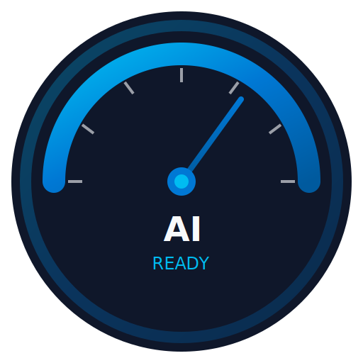
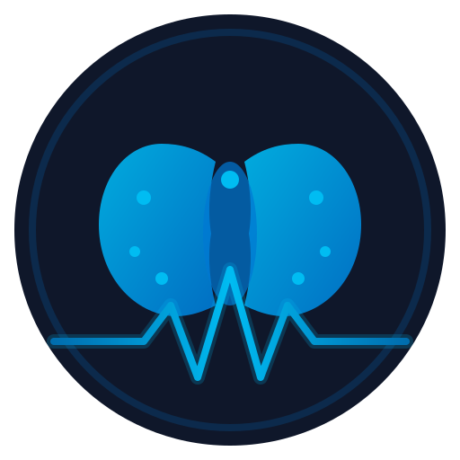
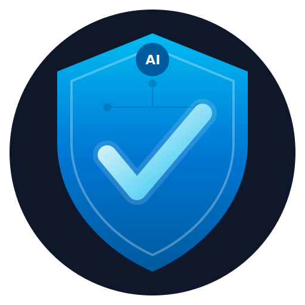
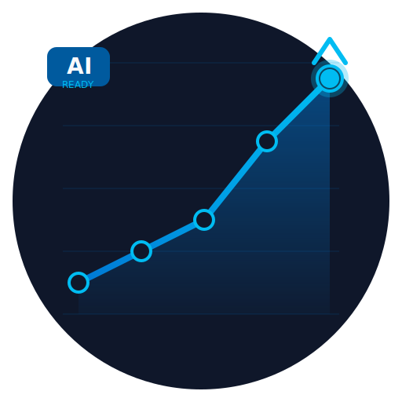
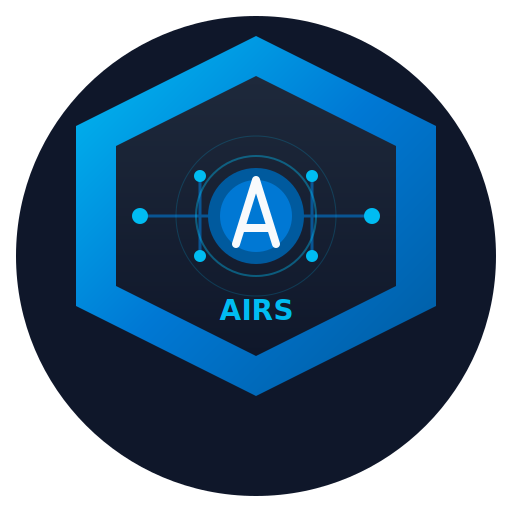

# AIRS App Icon Options

App icon options for **AIRS Enterprise** (distinct from CorreaX company branding).

## ✅ Quick Rules

| Rule | Spec |
| ------ | ------ |
| Background | White `#FFFFFF` + transparency |
| Compatibility | Must work on white layouts |
| Favicon | 64×64 recommended (32×32 min) |
| Colors | Azure Blue `#0078d4`, Dark `#005a9e`, Light `#00bcf2` |
| Process | **Always create 4-6 options** for user approval |

---

## Option 1: Gauge/Meter

**Concept**: Classic gauge/speedometer indicating readiness score

- ✅ Immediately communicates "measurement" and "scoring"
- ✅ Shows progression from low to high readiness
- ✅ "AI READY" text reinforces purpose
- Best for: Apps focused on scoring and benchmarking

---

## Option 2: Brain with Pulse

**Concept**: Neural brain with vital signs pulse line

- ✅ Strongly represents AI/cognitive assessment
- ✅ Pulse line suggests health check/diagnostic
- ✅ Modern, tech-forward aesthetic
- Best for: AI-focused audiences, tech enterprises

---

## Option 3: Shield with Checkmark

**Concept**: Security shield with validation checkmark

- ✅ Communicates readiness, preparedness, validation
- ✅ Inspires trust and confidence
- ✅ "AI" badge at top identifies purpose
- Best for: Enterprise/security-conscious organizations

---

## Option 4: Radar/Assessment Scan

**Concept**: Multi-dimensional radar chart with scanning sweep

- ✅ Shows multi-factor assessment (5 dimensions visible)
- ✅ Animated sweep suggests active scanning
- ✅ Technical, data-driven aesthetic
- Best for: Analytics-focused, multi-criteria assessment

---

## Option 5: Rising Chart

**Concept**: Growth chart trending upward

- ✅ Shows progression and improvement
- ✅ Positive, aspirational feeling
- ✅ Clear data visualization metaphor
- Best for: Growth-minded organizations, training contexts

---

## Option 6: Hexagon with AI Circuit

**Concept**: Modern tech hexagon with circuit patterns

- ✅ Contemporary, cutting-edge aesthetic
- ✅ Circuit pattern suggests AI/technology
- ✅ "AIRS" label integrated
- Best for: Modern tech companies, innovation-focused

---

## Quick Comparison

| Option | Primary Metaphor | Best For | Complexity |
| -------- | ------------------ | ---------- | ------------ |
| 1 - Gauge | Measurement | Scoring/benchmarks | Medium |
| 2 - Brain | AI/Cognition | Tech enterprises | High |
| 3 - Shield | Trust/Validation | Enterprise/security | Medium |
| 4 - Radar | Multi-factor scan | Analytics | High |
| 5 - Chart | Growth/Progress | Training/improvement | Low |
| 6 - Hexagon | Modern tech | Innovation | Medium |

---

## Usage

Once selected, the chosen icon will be:

1. Exported as favicon (16x16, 32x32, 180x180)
2. Used as PWA icons (192x192, 512x512)
3. Applied to the app header/navigation
4. Used in browser tabs and bookmarks
