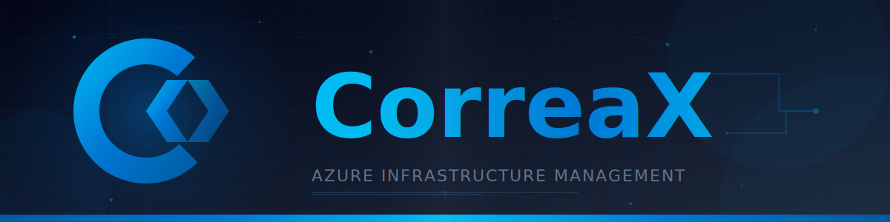
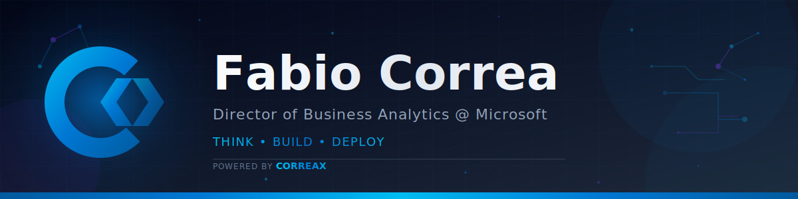

# CorreaX Logo Assets

Official logo and banner assets for CorreaX projects.

---

## ✅ Quick Rules

| Rule | Spec |
| ------ | ------ |
| Background | White `#FFFFFF` + transparency |
| Compatibility | Must work on white layouts |
| Resolution | High-res exports, no pixelation |
| Options | Create 4-6 variations for approval |

---

## Logo

<p align="center">
  
</p>

### Design Elements

| Element | Description |
| ------- | ----------- |
| **C Arc** | Partial circle representing Correa and Cloud |
| **X Chevrons** | Angular marks symbolizing transformation |
| **Gradient** | Azure Blue `#0078d4` → `#005a9e` |
| **Background** | White/transparent — works on white layouts |

### Files

| File | Size | Usage |
| ---- | ---- | ----- |
| `logo.svg` | 32×32 viewBox | Primary logo for all contexts |
| `favicon.svg` | 32×32 viewBox | Browser tabs, bookmarks |

---

## Banners

| File | Dimensions | Theme | Usage |
| ---- | ---------- | ----- | ----- |
| `banner.svg` | 1200×300 | Dark | README headers, dark backgrounds |
| `banner-light.svg` | 1200×300 | Light | Light backgrounds, print |
| `banner-profile.svg` | 1200×300 | Dark | Project/profile pages (template) |
| `banner-catalyst.svg` | 1200×300 | Dark | Example custom banner |

### Banner Preview

**Dark Banner:**



**Profile Banner (Template):**



---

## Implementation

### HTML

```html
<!-- Logo -->


<!-- Banner -->

```

### Favicon

```html
<link rel="icon" type="image/svg+xml" href="/brand/logos/favicon.svg">
```

### Markdown (README)

```html
<p align="center">
  
</p>
```

---

## Creating Custom Banners

Use `banner-profile.svg` as a template. See the [Brand Guidelines](../README.md#templates) for step-by-step instructions.

**Key elements to customize:**

| Element | Line to Find | What to Change |
| ------- | ------------ | -------------- |
| Title | `y="135"` | Project name |
| Subtitle | `y="180"` | Description |
| Keywords | `y="220"` | Tech stack (use • separator) |

---

## Colors

| Color | Hex | Usage |
| ----- | --- | ----- |
| Azure Blue | `#0078d4` | Primary, gradient start |
| Azure Dark | `#005a9e` | Gradient end, hover |
| Azure Light | `#00bcf2` | Accents, highlights |

---

## Related

- [Brand Guidelines](../README.md) — Full brand documentation
- [App Icons](../icons/README.md) — PWA icons

---

<sub>© 2026 CorreaX</sub>
